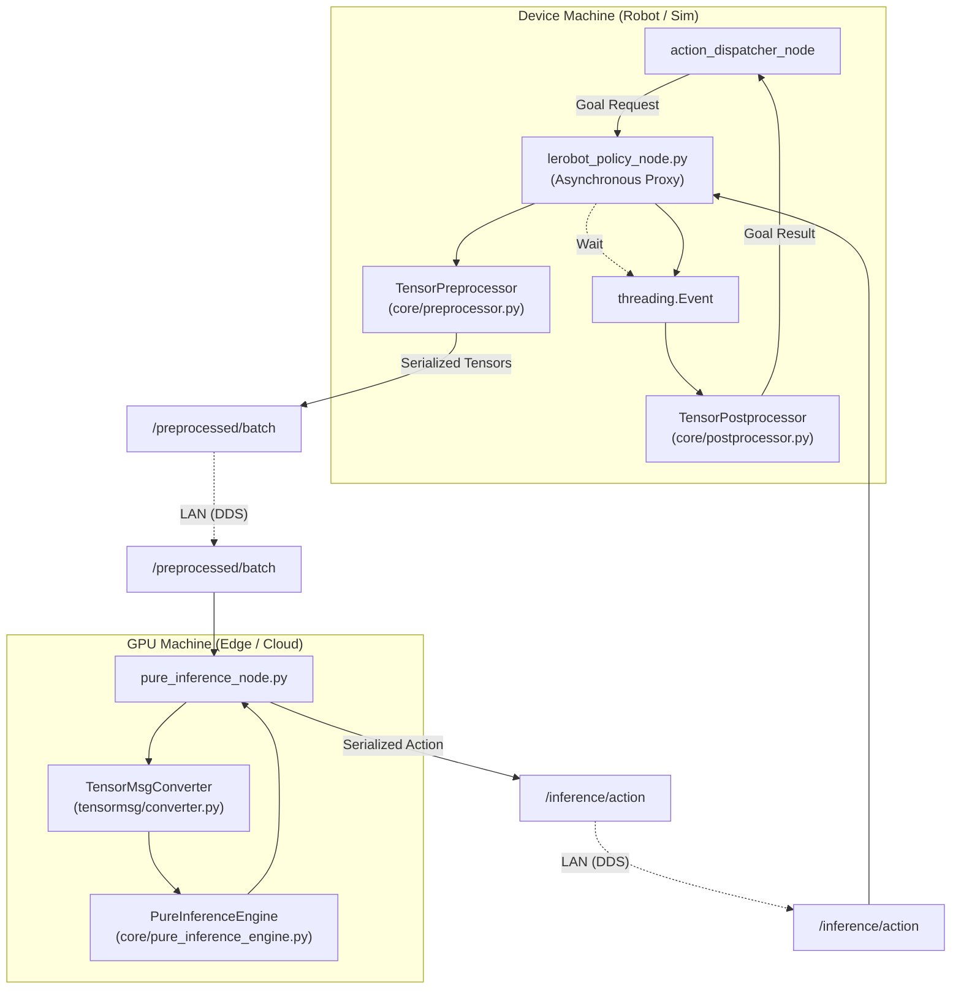

# 分布式执行模式

<details>
<summary>相关源文件</summary>

生成此 wiki 页面时使用了以下文件作为上下文：

- [src/inference_service/README.en.md](https://atomgit.com/openeuler/IB_Robot/blob/master/src/inference_service/README.en.md)
- [src/inference_service/README.md](https://atomgit.com/openeuler/IB_Robot/blob/master/src/inference_service/README.md)
- [src/inference_service/inference_service/core/__init__.py](https://atomgit.com/openeuler/IB_Robot/blob/master/src/inference_service/inference_service/core/__init__.py)
- [src/inference_service/inference_service/core/_policy_config.py](https://atomgit.com/openeuler/IB_Robot/blob/master/src/inference_service/inference_service/core/_policy_config.py)
- [src/inference_service/inference_service/core/ascend_om/__init__.py](https://atomgit.com/openeuler/IB_Robot/blob/master/src/inference_service/inference_service/core/ascend_om/__init__.py)
- [src/inference_service/inference_service/core/ascend_om/policy_wrapper.py](https://atomgit.com/openeuler/IB_Robot/blob/master/src/inference_service/inference_service/core/ascend_om/policy_wrapper.py)
- [src/inference_service/inference_service/core/compiled_policy.py](https://atomgit.com/openeuler/IB_Robot/blob/master/src/inference_service/inference_service/core/compiled_policy.py)
- [src/inference_service/inference_service/core/postprocessor.py](https://atomgit.com/openeuler/IB_Robot/blob/master/src/inference_service/inference_service/core/postprocessor.py)
- [src/inference_service/inference_service/core/preprocessor.py](https://atomgit.com/openeuler/IB_Robot/blob/master/src/inference_service/inference_service/core/preprocessor.py)
- [src/inference_service/inference_service/core/pure_inference_engine.py](https://atomgit.com/openeuler/IB_Robot/blob/master/src/inference_service/inference_service/core/pure_inference_engine.py)
- [src/inference_service/inference_service/core/rknn/policy_wrapper.py](https://atomgit.com/openeuler/IB_Robot/blob/master/src/inference_service/inference_service/core/rknn/policy_wrapper.py)
- [src/inference_service/inference_service/pure_inference_node.py](https://atomgit.com/openeuler/IB_Robot/blob/master/src/inference_service/inference_service/pure_inference_node.py)
- [src/inference_service/launch/cloud_inference.launch.py](https://atomgit.com/openeuler/IB_Robot/blob/master/src/inference_service/launch/cloud_inference.launch.py)
- [src/inference_service/tests/test_ascend_om.py](https://atomgit.com/openeuler/IB_Robot/blob/master/src/inference_service/tests/test_ascend_om.py)
- [src/inference_service/tests/test_policy_config.py](https://atomgit.com/openeuler/IB_Robot/blob/master/src/inference_service/tests/test_policy_config.py)
- [src/inference_service/tests/test_rknn_policy_wrapper.py](https://atomgit.com/openeuler/IB_Robot/blob/master/src/inference_service/tests/test_rknn_policy_wrapper.py)

</details>


## 目的与范围

IB-Robot 中的 **Distributed Execution Mode** 提供基于局域网（LAN）的 device-edge-cloud 架构，用于计算卸载。该模式专为缺少 GPU 资源、无法运行大规模神经网络策略的轻量机器人控制器设计，例如 Raspberry Pi、工业 PC 或 edge boards [src/inference_service/README.md:28-30](https://atomgit.com/openeuler/IB_Robot/blob/master/src/inference_service/README.md#L28-L30)。

通过拆分流水线，机器人控制器（Device）负责感知和轻量 CPU 任务，高性能服务器（Edge/Cloud）负责繁重的矩阵乘法。该架构保持与 pull-based `action_dispatch` 系统兼容，同时避免高带宽视频流占满网络 [src/inference_service/README.md:31-35](https://atomgit.com/openeuler/IB_Robot/blob/master/src/inference_service/README.md#L31-L35)。

**来源**：[src/inference_service/README.md:28-37](https://atomgit.com/openeuler/IB_Robot/blob/master/src/inference_service/README.md#L28-L37)，[src/inference_service/README.en.md:26-35](https://atomgit.com/openeuler/IB_Robot/blob/master/src/inference_service/README.en.md#L26-L35)

---

## 架构概述

分布式流水线拆分为三个无 ROS 依赖的核心组件：`TensorPreprocessor`、`PureInferenceEngine` 和 `TensorPostprocessor` [src/inference_service/README.md:9-12](https://atomgit.com/openeuler/IB_Robot/blob/master/src/inference_service/README.md#L9-L12)。

| 组件 | 代码实体 | 角色 | 位置 |
| :--- | :--- | :--- | :--- |
| **Edge Proxy** | `lerobot_policy_node.py` | 运行 `TensorPreprocessor`（CPU）和 `TensorPostprocessor`（CPU）。 | Robot Controller |
| **Inference Server** | `pure_inference_node.py` | 运行 `PureInferenceEngine`（GPU/NPU）。 | Compute Server |

### 系统数据流与代码实体

下图使用 `VariantsList` 协议进行 tensor 传输，将逻辑数据流映射到具体代码实体和 ROS 2 话题。



**来源**：[src/inference_service/README.md:39-54](https://atomgit.com/openeuler/IB_Robot/blob/master/src/inference_service/README.md#L39-L54)，[src/inference_service/inference_service/pure_inference_node.py:38-46](https://atomgit.com/openeuler/IB_Robot/blob/master/src/inference_service/inference_service/pure_inference_node.py#L38-L46)，[src/inference_service/inference_service/core/preprocessor.py:73-81](https://atomgit.com/openeuler/IB_Robot/blob/master/src/inference_service/inference_service/core/preprocessor.py#L73-L81)，[src/inference_service/inference_service/core/postprocessor.py:70-77](https://atomgit.com/openeuler/IB_Robot/blob/master/src/inference_service/inference_service/core/postprocessor.py#L70-L77)

---

## 实现细节

### 异步代理（Device 侧）
在分布式模式中，`lerobot_policy_node.py` 作为**异步代理**。它不在本地运行模型，而是：
1.  按需采集传感器数据 [src/inference_service/README.md:32](https://atomgit.com/openeuler/IB_Robot/blob/master/src/inference_service/README.md#L32)。
2.  在本地 CPU 上执行 `TensorPreprocessor` [src/inference_service/README.md:32](https://atomgit.com/openeuler/IB_Robot/blob/master/src/inference_service/README.md#L32)。
3.  发布轻量 tensor batch，并使用 `threading.Event` 挂起当前线程 [src/inference_service/README.md:32](https://atomgit.com/openeuler/IB_Robot/blob/master/src/inference_service/README.md#L32)。
4.  收到服务器结果后唤醒，执行 `TensorPostprocessor` [src/inference_service/README.md:33](https://atomgit.com/openeuler/IB_Robot/blob/master/src/inference_service/README.md#L33)。

### Pure Inference Node（Server 侧）
`PureInferenceNode` 是 `PureInferenceEngine` 的无状态封装。它提供：
- **协议转换**：使用 `TensorMsgConverter` 在 ROS `VariantsList` 消息和 PyTorch tensor 之间桥接 [src/inference_service/inference_service/pure_inference_node.py:106-137](https://atomgit.com/openeuler/IB_Robot/blob/master/src/inference_service/inference_service/pure_inference_node.py#L106-L137)。
- **Request ID 跟踪**：从输入 batch 中提取 `task.request_id`，并作为 `action.request_id` 回传，以便 device 匹配异步响应 [src/inference_service/inference_service/pure_inference_node.py:108-133](https://atomgit.com/openeuler/IB_Robot/blob/master/src/inference_service/inference_service/pure_inference_node.py#L108-L133)。
- **后端灵活性**：通过 `PolicyWrapper` 抽象支持 `cuda`、`cpu`、`npu`、`ascend_om` 和 `rknn` 后端 [src/inference_service/inference_service/core/pure_inference_engine.py:29-49](https://atomgit.com/openeuler/IB_Robot/blob/master/src/inference_service/inference_service/core/pure_inference_engine.py#L29-L49)。

**来源**：[src/inference_service/inference_service/pure_inference_node.py:38-98](https://atomgit.com/openeuler/IB_Robot/blob/master/src/inference_service/inference_service/pure_inference_node.py#L38-L98)，[src/inference_service/inference_service/core/pure_inference_engine.py:169-182](https://atomgit.com/openeuler/IB_Robot/blob/master/src/inference_service/inference_service/core/pure_inference_engine.py#L169-L182)，[src/inference_service/README.md:189-200](https://atomgit.com/openeuler/IB_Robot/blob/master/src/inference_service/README.md#L189-L200)

---

## 配置与部署

该模式通过 `robot_config` YAML 切换，无需修改 launch 文件 [src/inference_service/README.md:58-60](https://atomgit.com/openeuler/IB_Robot/blob/master/src/inference_service/README.md#L58-L60)。

### YAML 配置
```yaml
# src/robot_config/config/robots/your_robot.yaml
control_modes:
  model_inference:
    inference:
      enabled: true
      execution_mode: "distributed"  # Set to 'monolithic' for single-machine
      model: so101_act
```
**来源**：[src/inference_service/README.md:62-68](https://atomgit.com/openeuler/IB_Robot/blob/master/src/inference_service/README.md#L62-L68)

### 启动流水线

1.  **Device（Robot）**：
    使用 `execution_mode:=distributed` 启动机器人栈。这会避免把模型加载到本地内存中 [src/inference_service/README.md:128-136](https://atomgit.com/openeuler/IB_Robot/blob/master/src/inference_service/README.md#L128-L136)。
    ```bash
    ros2 launch robot_config robot.launch.py \
        robot_config:=so101_single_arm \
        control_mode:=model_inference \
        execution_mode:=distributed
    ```

2.  **Edge/Cloud（Server）**：
    启动专用推理服务器 [src/inference_service/README.md:142-145](https://atomgit.com/openeuler/IB_Robot/blob/master/src/inference_service/README.md#L142-L145)。
    ```bash
    ros2 launch inference_service cloud_inference.launch.py \
        policy_path:=/path/to/model \
        device:=cuda
    ```

### 硬件后端支持
`PureInferenceEngine` 支持专用硬件的编译后端：
- **Ascend OM**：用于使用 `.om` 文件的 Huawei Ascend NPU [src/inference_service/inference_service/core/ascend_om/policy_wrapper.py:29-34](https://atomgit.com/openeuler/IB_Robot/blob/master/src/inference_service/inference_service/core/ascend_om/policy_wrapper.py#L29-L34)。
- **RKNN**：用于 Rockchip NPU（例如 RK3588）[src/inference_service/inference_service/core/pure_inference_engine.py:41](https://atomgit.com/openeuler/IB_Robot/blob/master/src/inference_service/inference_service/core/pure_inference_engine.py#L41)。

**来源**：[src/inference_service/README.md:156-187](https://atomgit.com/openeuler/IB_Robot/blob/master/src/inference_service/README.md#L156-L187)，[src/inference_service/inference_service/core/pure_inference_engine.py:55-97](https://atomgit.com/openeuler/IB_Robot/blob/master/src/inference_service/inference_service/core/pure_inference_engine.py#L55-L97)

