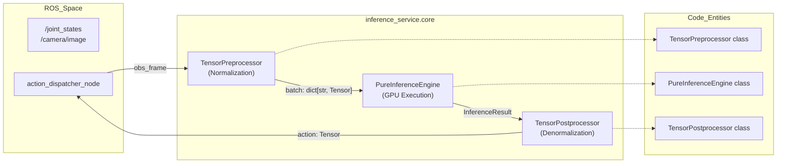
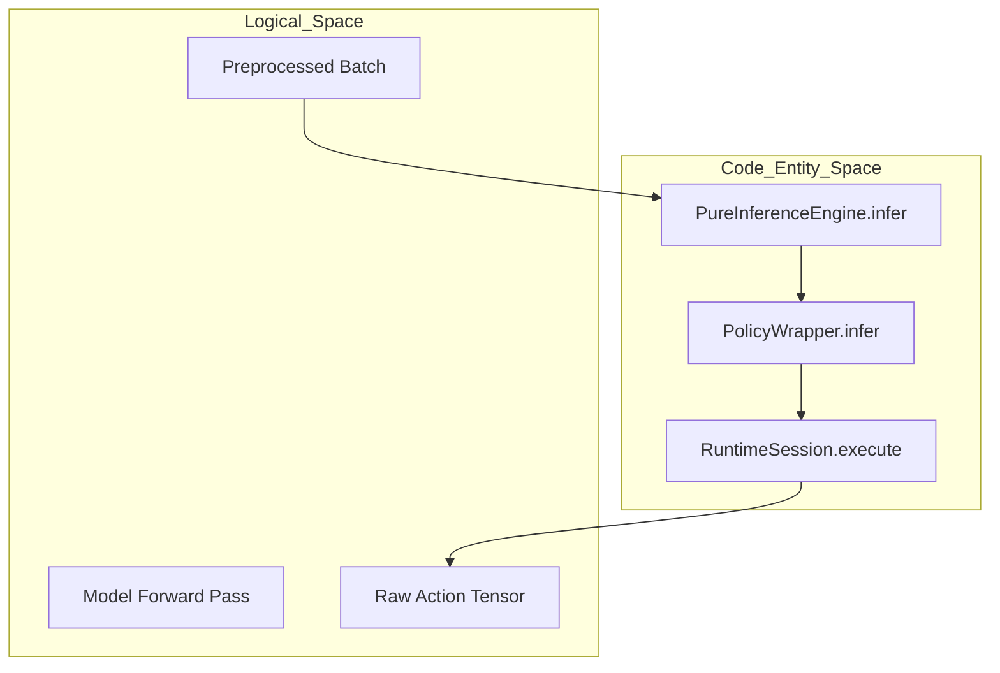

# 推理架构

相关源文件

生成此 wiki 页面时使用了以下文件作为上下文：

- [src/inference_service/README.en.md](https://atomgit.com/openeuler/IB_Robot/blob/master/src/inference_service/README.en.md)
- [src/inference_service/README.md](https://atomgit.com/openeuler/IB_Robot/blob/master/src/inference_service/README.md)
- [src/inference_service/inference_service/core/_policy_config.py](https://atomgit.com/openeuler/IB_Robot/blob/master/src/inference_service/inference_service/core/_policy_config.py)
- [src/inference_service/inference_service/core/compiled_policy.py](https://atomgit.com/openeuler/IB_Robot/blob/master/src/inference_service/inference_service/core/compiled_policy.py)
- [src/inference_service/inference_service/core/coordinator.py](https://atomgit.com/openeuler/IB_Robot/blob/master/src/inference_service/inference_service/core/coordinator.py)
- [src/inference_service/inference_service/core/postprocessor.py](https://atomgit.com/openeuler/IB_Robot/blob/master/src/inference_service/inference_service/core/postprocessor.py)
- [src/inference_service/inference_service/core/preprocessor.py](https://atomgit.com/openeuler/IB_Robot/blob/master/src/inference_service/inference_service/core/preprocessor.py)
- [src/inference_service/inference_service/core/pure_inference_engine.py](https://atomgit.com/openeuler/IB_Robot/blob/master/src/inference_service/inference_service/core/pure_inference_engine.py)
- [src/inference_service/inference_service/pure_inference_node.py](https://atomgit.com/openeuler/IB_Robot/blob/master/src/inference_service/inference_service/pure_inference_node.py)
- [src/inference_service/package.xml](https://atomgit.com/openeuler/IB_Robot/blob/master/src/inference_service/package.xml)
- [src/inference_service/tests/test_ascend_om.py](https://atomgit.com/openeuler/IB_Robot/blob/master/src/inference_service/tests/test_ascend_om.py)
- [src/inference_service/tests/test_inference_coordinator.py](https://atomgit.com/openeuler/IB_Robot/blob/master/src/inference_service/tests/test_inference_coordinator.py)
- [src/inference_service/tests/test_policy_config.py](https://atomgit.com/openeuler/IB_Robot/blob/master/src/inference_service/tests/test_policy_config.py)
- [src/robot_config/robot_config/__init__.py](https://atomgit.com/openeuler/IB_Robot/blob/master/src/robot_config/robot_config/__init__.py)
- [src/robot_config/test/test_launch_readiness.py](https://atomgit.com/openeuler/IB_Robot/blob/master/src/robot_config/test/test_launch_readiness.py)

## 目的与范围

本文记录 `inference_service` 包的三组件架构。该包提供核心 AI 执行框架，用于在实体机器人上运行端到端机器学习策略。该架构将推理流水线拆分为纯 Python、无 ROS 依赖的组件，支持灵活部署策略，包括严格时间对齐的高频控制和 zero-copy 延迟优化。

该架构同时支持 **Monolithic**（单进程、zero-copy）和 **Distributed**（device-edge/cloud 拆分）执行模式。

**来源：** [src/inference_service/README.md:1-14](https://atomgit.com/openeuler/IB_Robot/blob/master/src/inference_service/README.md#L1-L14)，[src/inference_service/inference_service/pure_inference_node.py:1-15](https://atomgit.com/openeuler/IB_Robot/blob/master/src/inference_service/inference_service/pure_inference_node.py#L1-L15)

---

## 设计原则

### Composition over Inheritance

推理流水线采用**组合式架构**。系统拆分为位于 `inference_service.core` 的三个独立、低耦合组件，可根据部署需求以不同方式组合。每个组件职责单一且清晰，可以独立测试、优化和部署。

**来源：** [src/inference_service/README.md:7-14](https://atomgit.com/openeuler/IB_Robot/blob/master/src/inference_service/README.md#L7-L14)，[src/inference_service/inference_service/core/pure_inference_engine.py:5-14](https://atomgit.com/openeuler/IB_Robot/blob/master/src/inference_service/inference_service/core/pure_inference_engine.py#L5-L14)

### 无 ROS 依赖的核心

所有核心推理组件都位于 `inference_service.core` 模块，并且**没有 ROS 依赖**。它们只处理 PyTorch tensor 和标准 Python 数据结构。该隔离带来几个关键优势：

| 优势 | 说明 |
|-----------|-------------|
| **离线测试** | 可在 Jupyter/PyTest 中验证组件，无需 ROS 环境 [src/inference_service/inference_service/core/pure_inference_engine.py:5-6](https://atomgit.com/openeuler/IB_Robot/blob/master/src/inference_service/inference_service/core/pure_inference_engine.py#L5-L6) |
| **部署灵活性** | 同一套代码可运行在 monolithic 或 distributed 配置中 [src/inference_service/README.md:18-38](https://atomgit.com/openeuler/IB_Robot/blob/master/src/inference_service/README.md#L18-L38) |
| **框架独立性** | 核心逻辑可移植到其他机器人框架或独立应用 [src/inference_service/inference_service/core/pure_inference_engine.py:10-14](https://atomgit.com/openeuler/IB_Robot/blob/master/src/inference_service/inference_service/core/pure_inference_engine.py#L10-L14) |
| **性能隔离** | 纯 tensor 运算不受 ROS 通信开销影响 [src/inference_service/README.md:23-25](https://atomgit.com/openeuler/IB_Robot/blob/master/src/inference_service/README.md#L23-L25) |

**来源：** [src/inference_service/inference_service/core/pure_inference_engine.py:1-14](https://atomgit.com/openeuler/IB_Robot/blob/master/src/inference_service/inference_service/core/pure_inference_engine.py#L1-L14)，[src/inference_service/inference_service/core/preprocessor.py:1-13](https://atomgit.com/openeuler/IB_Robot/blob/master/src/inference_service/inference_service/core/preprocessor.py#L1-L13)，[src/inference_service/inference_service/core/postprocessor.py:1-13](https://atomgit.com/openeuler/IB_Robot/blob/master/src/inference_service/inference_service/core/postprocessor.py#L1-L13)

---

## 三组件架构

### 组件概览

**图示：流水线架构与代码映射**

三个组件构成顺序处理流水线：

1. **TensorPreprocessor**：将原始 ROS 传感器数据转换为归一化 PyTorch tensor [src/inference_service/inference_service/core/preprocessor.py:73-81](https://atomgit.com/openeuler/IB_Robot/blob/master/src/inference_service/inference_service/core/preprocessor.py#L73-L81)。
2. **PureInferenceEngine**：执行策略网络并生成动作 [src/inference_service/inference_service/core/pure_inference_engine.py:3-14](https://atomgit.com/openeuler/IB_Robot/blob/master/src/inference_service/inference_service/core/pure_inference_engine.py#L3-L14)。
3. **TensorPostprocessor**：将网络输出反归一化为物理控制命令 [src/inference_service/inference_service/core/postprocessor.py:70-77](https://atomgit.com/openeuler/IB_Robot/blob/master/src/inference_service/inference_service/core/postprocessor.py#L70-L77)。

**来源：** [src/inference_service/README.md:9-12](https://atomgit.com/openeuler/IB_Robot/blob/master/src/inference_service/README.md#L9-L12)，[src/inference_service/inference_service/core/pure_inference_engine.py:1-14](https://atomgit.com/openeuler/IB_Robot/blob/master/src/inference_service/inference_service/core/pure_inference_engine.py#L1-L14)

---

## 组件 1：TensorPreprocessor

### 职责

`TensorPreprocessor` 组件负责将异构 ROS 传感器数据转换为适合策略网络输入的标准 tensor batch。该组件通常受 CPU 限制，并执行：

| 操作 | 说明 |
|-----------|-------------|
| **类型转换** | 将 `numpy` 数组转换为 `torch.Tensor` [src/inference_service/inference_service/core/preprocessor.py:172-174](https://atomgit.com/openeuler/IB_Robot/blob/master/src/inference_service/inference_service/core/preprocessor.py#L172-L174) |
| **格式转换** | 将图像通道从 HWC 重排为 CHW，并添加 batch 维度 [src/inference_service/inference_service/core/preprocessor.py:176-177](https://atomgit.com/openeuler/IB_Robot/blob/master/src/inference_service/inference_service/core/preprocessor.py#L176-L177) |
| **归一化** | 将像素值（0-255 → 0.0-1.0）缩放，并使用 `LeRobotPreprocessor` 应用数据集专用统计信息 [src/inference_service/inference_service/core/preprocessor.py:179-181](https://atomgit.com/openeuler/IB_Robot/blob/master/src/inference_service/inference_service/core/preprocessor.py#L179-L181) |
| **设备放置** | 将 tensor 移动到指定计算设备（CPU/GPU/NPU）[src/inference_service/inference_service/core/preprocessor.py:183-185](https://atomgit.com/openeuler/IB_Robot/blob/master/src/inference_service/inference_service/core/preprocessor.py#L183-L185) |

### 实现细节

Preprocessor 可封装 `LeRobotPreprocessor`，后者使用 LeRobot factory 的 `make_pre_post_processors`，以确保与训练时归一化保持一致 [src/inference_service/inference_service/core/preprocessor.py:47-62](https://atomgit.com/openeuler/IB_Robot/blob/master/src/inference_service/inference_service/core/preprocessor.py#L47-L62)。它还处理复杂逻辑，例如清理 `config.json`，在传入上游 loader 前移除 `is_rknn_enabled` 等 IB-Robot 专用键 [src/inference_service/inference_service/core/_policy_config.py:27-33](https://atomgit.com/openeuler/IB_Robot/blob/master/src/inference_service/inference_service/core/_policy_config.py#L27-L33)。

**来源：** [src/inference_service/inference_service/core/preprocessor.py:34-71](https://atomgit.com/openeuler/IB_Robot/blob/master/src/inference_service/inference_service/core/preprocessor.py#L34-L71)，[src/inference_service/inference_service/core/preprocessor.py:73-111](https://atomgit.com/openeuler/IB_Robot/blob/master/src/inference_service/inference_service/core/preprocessor.py#L73-L111)，[src/inference_service/inference_service/core/_policy_config.py:78-83](https://atomgit.com/openeuler/IB_Robot/blob/master/src/inference_service/inference_service/core/_policy_config.py#L78-L83)

---

## 组件 2：PureInferenceEngine

### 职责

`PureInferenceEngine` 是一个**无状态、无 ROS 依赖的执行引擎**。它通过 `PolicyWrapper` 封装策略网络，并提供纯函数接口。

### Policy Wrappers

引擎使用 `PolicyWrapper` 子类处理不同后端：
- **LeRobotPolicyWrapper**：支持基于 PyTorch 的策略（ACT、Diffusion、PI0、SmolVLA 等）[src/inference_service/inference_service/core/pure_inference_engine.py:169-182](https://atomgit.com/openeuler/IB_Robot/blob/master/src/inference_service/inference_service/core/pure_inference_engine.py#L169-L182)。
- **CompiledPolicyWrapper**：支持 Ascend NPU（`ascend_om`）或 Rockchip NPU（`rknn`）的编译产物 [src/inference_service/README.md:131-143](https://atomgit.com/openeuler/IB_Robot/blob/master/src/inference_service/README.md#L131-L143)。

**图示：推理引擎执行流程**

### 设备管理

`resolve_device` 函数会自动选择合适的计算设备：

| Device 参数 | 行为 |
|------------------|----------|
| `"auto"` | 优先 CUDA，其次 Apple MPS，再次 Ascend NPU，最后回退到 CPU [src/inference_service/inference_service/core/pure_inference_engine.py:55-67](https://atomgit.com/openeuler/IB_Robot/blob/master/src/inference_service/inference_service/core/pure_inference_engine.py#L55-L67) |
| `"cuda"` | 指定 CUDA 设备 [src/inference_service/inference_service/core/pure_inference_engine.py:69-73](https://atomgit.com/openeuler/IB_Robot/blob/master/src/inference_service/inference_service/core/pure_inference_engine.py#L69-L73) |
| `"npu"` | Ascend NPU（使用 `torch_npu`）[src/inference_service/inference_service/core/pure_inference_engine.py:86-95](https://atomgit.com/openeuler/IB_Robot/blob/master/src/inference_service/inference_service/core/pure_inference_engine.py#L86-L95) |
| `"ascend_om"` | Ascend ACL 硬件后端（OM 模型）[src/inference_service/inference_service/core/pure_inference_engine.py:83-84](https://atomgit.com/openeuler/IB_Robot/blob/master/src/inference_service/inference_service/core/pure_inference_engine.py#L83-L84) |

**来源：** [src/inference_service/inference_service/core/pure_inference_engine.py:29-97](https://atomgit.com/openeuler/IB_Robot/blob/master/src/inference_service/inference_service/core/pure_inference_engine.py#L29-L97)，[src/inference_service/inference_service/core/pure_inference_engine.py:129-168](https://atomgit.com/openeuler/IB_Robot/blob/master/src/inference_service/inference_service/core/pure_inference_engine.py#L129-L168)

---

## 组件 3：TensorPostprocessor

### 职责

`TensorPostprocessor` 执行 preprocessor 的逆变换，将策略网络的归一化动作 tensor 转换回物理控制命令：

| 操作 | 说明 |
|-----------|-------------|
| **反归一化** | 通过 `LeRobotPostprocessor` 使用数据集统计信息缩放动作值 [src/inference_service/inference_service/core/postprocessor.py:35-61](https://atomgit.com/openeuler/IB_Robot/blob/master/src/inference_service/inference_service/core/postprocessor.py#L35-L61) |
| **安全 Clamp** | 将数值限制到 `_clamp_limits` 中定义的物理安全范围 [src/inference_service/inference_service/core/postprocessor.py:130-133](https://atomgit.com/openeuler/IB_Robot/blob/master/src/inference_service/inference_service/core/postprocessor.py#L130-L133) |
| **Numpy 转换** | 将最终 tensor 转换为 `numpy`，用于构造 ROS 消息 [src/inference_service/inference_service/core/postprocessor.py:136-148](https://atomgit.com/openeuler/IB_Robot/blob/master/src/inference_service/inference_service/core/postprocessor.py#L136-L148) |

**来源：** [src/inference_service/inference_service/core/postprocessor.py:70-134](https://atomgit.com/openeuler/IB_Robot/blob/master/src/inference_service/inference_service/core/postprocessor.py#L70-L134)

---

## 流水线编排

### 执行模式

架构支持两种主要部署模式，通过 `robot_config` 中的 `execution_mode` 切换 [src/inference_service/README.md:58-70](https://atomgit.com/openeuler/IB_Robot/blob/master/src/inference_service/README.md#L58-L70)：

1. **Monolithic (Single-Machine Zero-Copy)**：三个组件在单个进程（通常是 `lerobot_policy_node`）内串联。Tensor 通过内存/VRAM 引用传递 [src/inference_service/README.md:20-26](https://atomgit.com/openeuler/IB_Robot/blob/master/src/inference_service/README.md#L20-L26)。
2. **Distributed (Device-Edge-Cloud)**：
    - **Device Side**：运行 `TensorPreprocessor` 和 `TensorPostprocessor`，并向 `/preprocessed/batch` 发布预处理 batch [src/inference_service/README.md:28-32](https://atomgit.com/openeuler/IB_Robot/blob/master/src/inference_service/README.md#L28-L32)。
    - **Compute Side**：运行 `PureInferenceNode`，封装 `PureInferenceEngine`。它订阅 batch 并向 `/inference/action` 发布原始动作 [src/inference_service/inference_service/pure_inference_node.py:38-46](https://atomgit.com/openeuler/IB_Robot/blob/master/src/inference_service/inference_service/pure_inference_node.py#L38-L46)。

### Request ID 跟踪

在分布式模式中，系统使用 `_request_id`（在 batch 中作为 `task.request_id` 传递）将计算节点的异步响应匹配回原始 device 请求 [src/inference_service/inference_service/pure_inference_node.py:108-117](https://atomgit.com/openeuler/IB_Robot/blob/master/src/inference_service/inference_service/pure_inference_node.py#L108-L117)。

**来源：** [src/inference_service/README.md:18-54](https://atomgit.com/openeuler/IB_Robot/blob/master/src/inference_service/README.md#L18-L54)，[src/inference_service/inference_service/pure_inference_node.py:101-138](https://atomgit.com/openeuler/IB_Robot/blob/master/src/inference_service/inference_service/pure_inference_node.py#L101-L138)

---

## 总结

三组件架构实现了严格的关注点分离：

| 组件 | 类名 | 职责 |
|-----------|------------|----------------|
| **Pre** | `TensorPreprocessor` | ROS data → normalized tensors |
| **Infer** | `PureInferenceEngine` | Stateless policy execution |
| **Post** | `TensorPostprocessor` | Denormalized tensors → ROS commands |

**来源：** [src/inference_service/README.md:7-12](https://atomgit.com/openeuler/IB_Robot/blob/master/src/inference_service/README.md#L7-L12)，[src/inference_service/inference_service/core/pure_inference_engine.py:100-117](https://atomgit.com/openeuler/IB_Robot/blob/master/src/inference_service/inference_service/core/pure_inference_engine.py#L100-L117)

