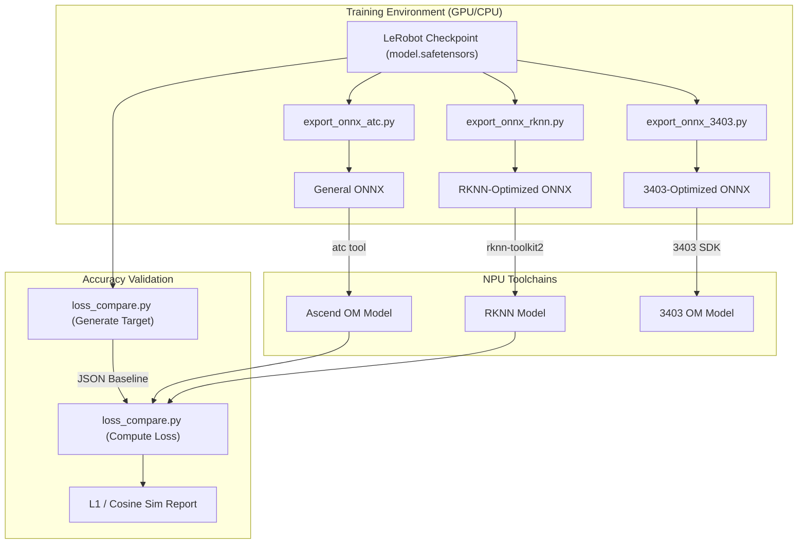
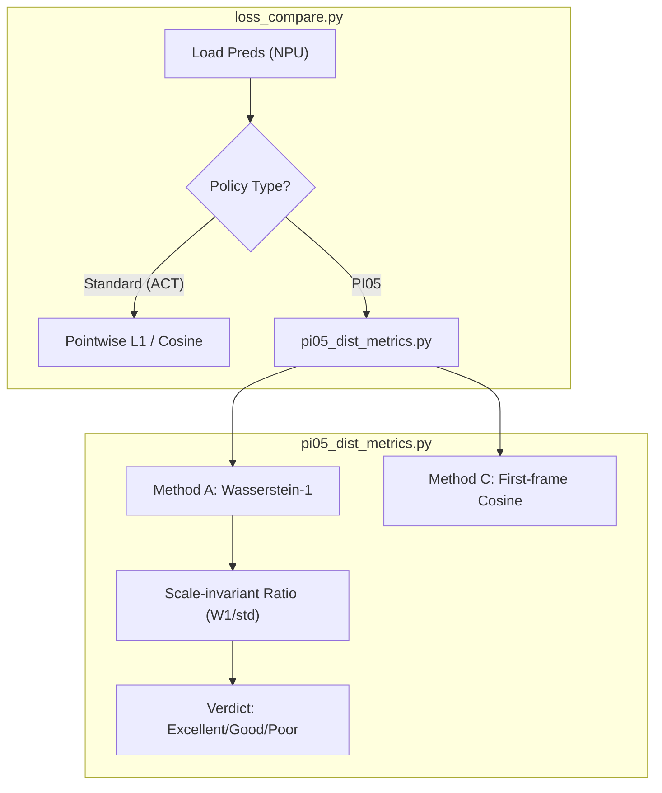

# 模型导出与验证

相关源文件

生成此 wiki 页面时使用了以下文件作为上下文：

- [.agents/skills/rknn-convert/SKILL.md](https://atomgit.com/openeuler/IB_Robot/blob/master/.agents/skills/rknn-convert/SKILL.md)
- [.agents/skills/rknn-convert/convert_to_rknn.py](https://atomgit.com/openeuler/IB_Robot/blob/master/.agents/skills/rknn-convert/convert_to_rknn.py)
- [src/inference_service/inference_service/core/ascend_om/_common.py](https://atomgit.com/openeuler/IB_Robot/blob/master/src/inference_service/inference_service/core/ascend_om/_common.py)
- [src/inference_service/inference_service/core/ascend_om/pi05/PI05OMModel.py](https://atomgit.com/openeuler/IB_Robot/blob/master/src/inference_service/inference_service/core/ascend_om/pi05/PI05OMModel.py)
- [src/inference_service/inference_service/core/ascend_om/pi05/__init__.py](https://atomgit.com/openeuler/IB_Robot/blob/master/src/inference_service/inference_service/core/ascend_om/pi05/__init__.py)
- [src/inference_service/inference_service/core/ascend_om/pi05/policy_wrapper.py](https://atomgit.com/openeuler/IB_Robot/blob/master/src/inference_service/inference_service/core/ascend_om/pi05/policy_wrapper.py)
- [src/inference_service/inference_service/core/ascend_om/pi05/prefix_mask_utils.py](https://atomgit.com/openeuler/IB_Robot/blob/master/src/inference_service/inference_service/core/ascend_om/pi05/prefix_mask_utils.py)
- [src/model_utils/model_utils/README.md](https://atomgit.com/openeuler/IB_Robot/blob/master/src/model_utils/model_utils/README.md)
- [src/model_utils/model_utils/__init__.py](https://atomgit.com/openeuler/IB_Robot/blob/master/src/model_utils/model_utils/__init__.py)
- [src/model_utils/model_utils/export_onnx_3403.py](https://atomgit.com/openeuler/IB_Robot/blob/master/src/model_utils/model_utils/export_onnx_3403.py)
- [src/model_utils/model_utils/export_onnx_atc.py](https://atomgit.com/openeuler/IB_Robot/blob/master/src/model_utils/model_utils/export_onnx_atc.py)
- [src/model_utils/model_utils/export_onnx_rknn.py](https://atomgit.com/openeuler/IB_Robot/blob/master/src/model_utils/model_utils/export_onnx_rknn.py)
- [src/model_utils/model_utils/loss_compare.py](https://atomgit.com/openeuler/IB_Robot/blob/master/src/model_utils/model_utils/loss_compare.py)
- [src/model_utils/model_utils/pi05_dist_metrics.py](https://atomgit.com/openeuler/IB_Robot/blob/master/src/model_utils/model_utils/pi05_dist_metrics.py)
- [src/model_utils/package.xml](https://atomgit.com/openeuler/IB_Robot/blob/master/src/model_utils/package.xml)
- [src/model_utils/resource/model_utils](https://atomgit.com/openeuler/IB_Robot/blob/master/src/model_utils/resource/model_utils)
- [src/model_utils/setup.cfg](https://atomgit.com/openeuler/IB_Robot/blob/master/src/model_utils/setup.cfg)
- [src/model_utils/setup.py](https://atomgit.com/openeuler/IB_Robot/blob/master/src/model_utils/setup.py)
- [src/robot_moveit/README.md](https://atomgit.com/openeuler/IB_Robot/blob/master/src/robot_moveit/README.md)

`model_utils` 包提供一组工具，用于将 LeRobot 策略从 PyTorch 训练环境迁移到面向专用 NPU（Neural Processing Unit）硬件的高性能部署环境。它支持将模型导出为 ONNX 和专用二进制格式（Ascend OM、Rockchip RKNN），并提供严格的跨平台精度验证工具，用于检测量化或转换过程中的数值漂移。

## 架构与数据流

模型部署流水线遵循结构化路径，从高层 PyTorch 模型转换为适合嵌入式执行的优化二进制产物。

### 部署流水线
下图展示从已训练 LeRobot checkpoint 到已验证硬件专用模型的流程。

**模型转换与验证流程**

来源：[src/model_utils/model_utils/export_onnx_atc.py:106-152](https://atomgit.com/openeuler/IB_Robot/blob/master/src/model_utils/model_utils/export_onnx_atc.py#L106-L152)，[src/model_utils/model_utils/export_onnx_rknn.py:117-129](https://atomgit.com/openeuler/IB_Robot/blob/master/src/model_utils/model_utils/export_onnx_rknn.py#L117-L129)，[src/model_utils/model_utils/loss_compare.py:17-26](https://atomgit.com/openeuler/IB_Robot/blob/master/src/model_utils/model_utils/loss_compare.py#L17-L26)

## 模型导出工具

该包为不同硬件后端提供专用导出脚本，处理输入 tensor 重构等模型专属需求。

### export_onnx_atc.py (General Ascend)
该脚本自动执行标准 Ascend 硬件（例如 Ascend 310P3）的端到端转换。
* **输入过滤**：解析 `config.json` 以提取 `input_features`，只保留 `observation.state` 和 `observation.images.*`，并跳过无关元数据 [src/model_utils/model_utils/export_onnx_atc.py:81-90](https://atomgit.com/openeuler/IB_Robot/blob/master/src/model_utils/model_utils/export_onnx_atc.py#L81-L90)。
* **Manifest 生成**：转换后写入 `config.om.json` manifest [src/model_utils/model_utils/export_onnx_atc.py:53-78](https://atomgit.com/openeuler/IB_Robot/blob/master/src/model_utils/model_utils/export_onnx_atc.py#L53-L78)，该 sidecar 文件供 `inference_service` 识别正确后端和产物 [src/model_utils/model_utils/README.md:68-78](https://atomgit.com/openeuler/IB_Robot/blob/master/src/model_utils/model_utils/README.md#L68-L78)。
* **ATC 执行**：调用 `atc`（Ascend Tensor Compiler），并传入 `--soc_version` 和 `--input_shape` 参数 [src/model_utils/model_utils/export_onnx_atc.py:93-103](https://atomgit.com/openeuler/IB_Robot/blob/master/src/model_utils/model_utils/export_onnx_atc.py#L93-L103)。

### export_onnx_rknn.py (Rockchip RK3588)
该脚本面向 Rockchip NPU 定制，实现特定优化以降低开销。
* **输出裁剪**：移除中间 tensor 和辅助输出，仅保留 `action` tensor，以减少 NPU 内存流量 [src/model_utils/model_utils/export_onnx_rknn.py:15-30](https://atomgit.com/openeuler/IB_Robot/blob/master/src/model_utils/model_utils/export_onnx_rknn.py#L15-L30)。
* **环境隔离**：由于 `rknn-toolkit2` 对 `torch` 和 `numpy` 有严格版本要求，且会与 `lerobot` 冲突，脚本为最终转换步骤管理专用 `.venv-rknn` 环境 [src/model_utils/model_utils/export_onnx_rknn.py:132-141](https://atomgit.com/openeuler/IB_Robot/blob/master/src/model_utils/model_utils/export_onnx_rknn.py#L132-L141)。
* **量化模式**：支持 `float16`、`int8`（需要校准数据）和 `hybrid` 量化 [src/model_utils/model_utils/export_onnx_rknn.py:185-207](https://atomgit.com/openeuler/IB_Robot/blob/master/src/model_utils/model_utils/export_onnx_rknn.py#L185-L207)。

### export_onnx_3403.py (Ascend 3403)
该脚本面向 Ascend 3403 平台，重点生成简化 ONNX 图。
* **ACTONNXWrapper**：标准 LeRobot ACT 策略使用基于字典的输入。该 wrapper [src/model_utils/model_utils/export_onnx_3403.py:21-31](https://atomgit.com/openeuler/IB_Robot/blob/master/src/model_utils/model_utils/export_onnx_3403.py#L21-L31) 在导出期间将位置参数 `*args` 转回模型所需的 batch 字典结构 [src/model_utils/model_utils/export_onnx_3403.py:29-31](https://atomgit.com/openeuler/IB_Robot/blob/master/src/model_utils/model_utils/export_onnx_3403.py#L29-L31)。
* **图简化**：使用 `onnxsim` 验证并简化导出的图，确保面向 NPU 消费的常量折叠正确执行 [src/model_utils/model_utils/export_onnx_3403.py:72-78](https://atomgit.com/openeuler/IB_Robot/blob/master/src/model_utils/model_utils/export_onnx_3403.py#L72-L78)。

来源：[src/model_utils/model_utils/export_onnx_atc.py:93-103](https://atomgit.com/openeuler/IB_Robot/blob/master/src/model_utils/model_utils/export_onnx_atc.py#L93-L103)，[src/model_utils/model_utils/export_onnx_rknn.py:15-30](https://atomgit.com/openeuler/IB_Robot/blob/master/src/model_utils/model_utils/export_onnx_rknn.py#L15-L30)，[src/model_utils/model_utils/export_onnx_3403.py:21-31](https://atomgit.com/openeuler/IB_Robot/blob/master/src/model_utils/model_utils/export_onnx_3403.py#L21-L31)

## 跨平台验证 (loss_compare)

模型转换期间数值精度可能下降，例如 FP32 转 FP16 或 INT8。`loss_compare.py` 提供一个框架，用于将 NPU 输出与 PyTorch baseline 比较。

### 精度指标
该工具计算 L1 Loss 和 Cosine Similarity。
* **归一化空间**：比较 postprocessor 之前的输出，将模型漂移与数据集缩放因子隔离 [src/model_utils/model_utils/loss_compare.py:74-81](https://atomgit.com/openeuler/IB_Robot/blob/master/src/model_utils/model_utils/loss_compare.py#L74-L81)。
* **非归一化空间**：比较最终物理动作（例如弧度单位的关节角），评估误差对真实世界的影响 [src/model_utils/model_utils/loss_compare.py:56-64](https://atomgit.com/openeuler/IB_Robot/blob/master/src/model_utils/model_utils/loss_compare.py#L56-L64)。

### PI05 分布式评估
对于 PI05 等 flow-matching 模型，由于 ODE solver 中的混沌放大，逐点 L1 比较通常会产生误导 [src/model_utils/model_utils/pi05_dist_metrics.py:6-11](https://atomgit.com/openeuler/IB_Robot/blob/master/src/model_utils/model_utils/pi05_dist_metrics.py#L6-L11)。该包包含 `pi05_dist_metrics.py`，提供对混沌更稳定的指标：
* **Method A (Marginal Wasserstein-1)**：比较每个动作维度的值分布，对精确时间对齐不敏感 [src/model_utils/model_utils/pi05_dist_metrics.py:95-103](https://atomgit.com/openeuler/IB_Robot/blob/master/src/model_utils/model_utils/pi05_dist_metrics.py#L95-L103)。
* **Method C (First-frame Cosine)**：只比较动作 chunk 的第一帧，因为这是最稳定的帧，也是 receding-horizon 控制中唯一实际执行的帧 [src/model_utils/model_utils/pi05_dist_metrics.py:166-173](https://atomgit.com/openeuler/IB_Robot/blob/master/src/model_utils/model_utils/pi05_dist_metrics.py#L166-L173)。

**PI05 验证逻辑**

来源：[src/model_utils/model_utils/loss_compare.py:65-71](https://atomgit.com/openeuler/IB_Robot/blob/master/src/model_utils/model_utils/loss_compare.py#L65-L71)，[src/model_utils/model_utils/pi05_dist_metrics.py:25-33](https://atomgit.com/openeuler/IB_Robot/blob/master/src/model_utils/model_utils/pi05_dist_metrics.py#L25-L33)，[src/model_utils/model_utils/pi05_dist_metrics.py:116-124](https://atomgit.com/openeuler/IB_Robot/blob/master/src/model_utils/model_utils/pi05_dist_metrics.py#L116-L124)

## 专用 NPU Runtime：PI05OMModel

对于 Ascend 上的 PI05 部署，`PI05OMModel` 实现了高性能 runtime，用于最小化 VLM（Vision Language Model）与 Action Expert 之间的数据移动。

* **Buffer 共享**：VLM 输出 buffer（KV cache、padding masks）会直接映射为 Action Expert 的输入，避免 Device-to-Host-to-Device（D2H + H2D）拷贝 [src/inference_service/inference_service/core/ascend_om/pi05/PI05OMModel.py:71-78](https://atomgit.com/openeuler/IB_Robot/blob/master/src/inference_service/inference_service/core/ascend_om/pi05/PI05OMModel.py#L71-L78)。
* **内存管理**：使用 `acl.rt.malloc` 和 `ACL_MEM_MALLOC_HUGE_FIRST` 进行优化的 NPU 内存分配 [src/inference_service/inference_service/core/ascend_om/pi05/PI05OMModel.py:180](https://atomgit.com/openeuler/IB_Robot/blob/master/src/inference_service/inference_service/core/ascend_om/pi05/PI05OMModel.py#L180)。
* **动态 Shape 检测**：自动从 VLM 模型描述符检测 `prefix_seq_len`，以正确配置 attention masks [src/inference_service/inference_service/core/ascend_om/pi05/PI05OMModel.py:157-168](https://atomgit.com/openeuler/IB_Robot/blob/master/src/inference_service/inference_service/core/ascend_om/pi05/PI05OMModel.py#L157-L168)。

来源：[src/inference_service/inference_service/core/ascend_om/pi05/PI05OMModel.py:71-180](https://atomgit.com/openeuler/IB_Robot/blob/master/src/inference_service/inference_service/core/ascend_om/pi05/PI05OMModel.py#L71-L180)，[src/inference_service/inference_service/core/ascend_om/pi05/policy_wrapper.py:11-15](https://atomgit.com/openeuler/IB_Robot/blob/master/src/inference_service/inference_service/core/ascend_om/pi05/policy_wrapper.py#L11-L15)

