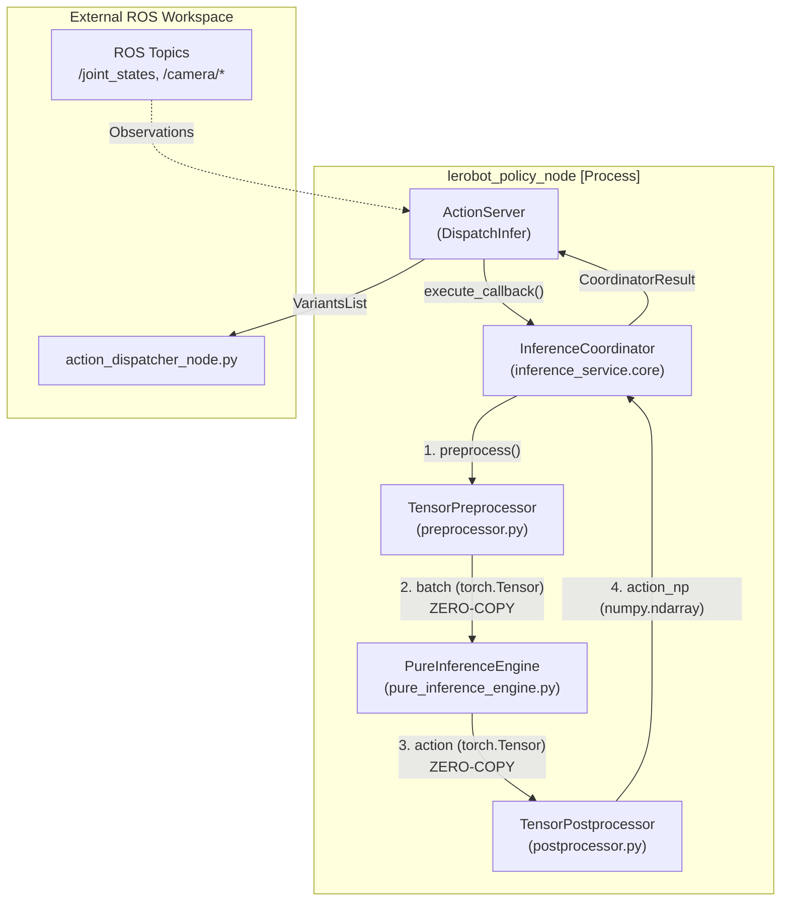
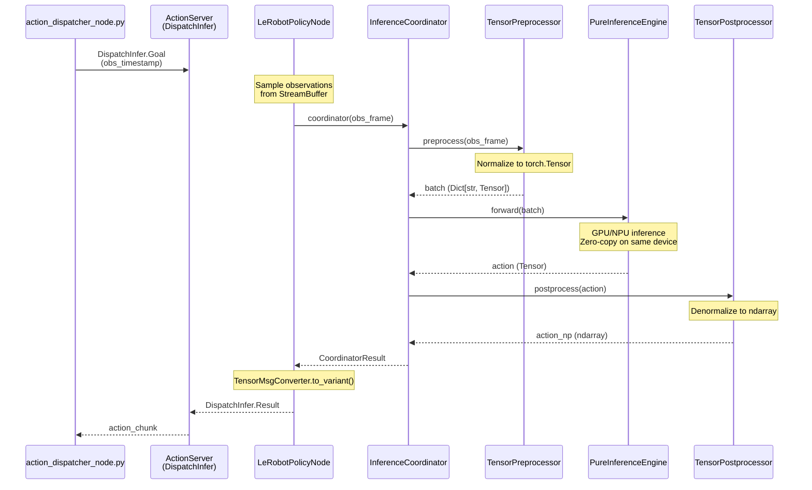
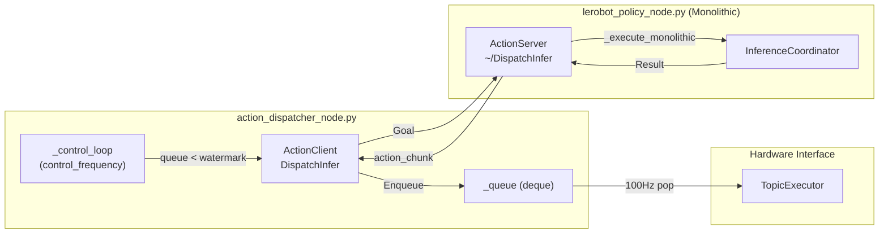

# 单体执行模式

<details>
<summary>相关源文件</summary>

生成此 wiki 页面时使用了以下文件作为上下文：

- [src/action_dispatch/action_dispatch/action_dispatcher_node.py](https://atomgit.com/openeuler/IB_Robot/blob/master/src/action_dispatch/action_dispatch/action_dispatcher_node.py)
- [src/inference_service/README.en.md](https://atomgit.com/openeuler/IB_Robot/blob/master/src/inference_service/README.en.md)
- [src/inference_service/README.md](https://atomgit.com/openeuler/IB_Robot/blob/master/src/inference_service/README.md)
- [src/inference_service/inference_service/core/_policy_config.py](https://atomgit.com/openeuler/IB_Robot/blob/master/src/inference_service/inference_service/core/_policy_config.py)
- [src/inference_service/inference_service/core/compiled_policy.py](https://atomgit.com/openeuler/IB_Robot/blob/master/src/inference_service/inference_service/core/compiled_policy.py)
- [src/inference_service/inference_service/core/postprocessor.py](https://atomgit.com/openeuler/IB_Robot/blob/master/src/inference_service/inference_service/core/postprocessor.py)
- [src/inference_service/inference_service/core/preprocessor.py](https://atomgit.com/openeuler/IB_Robot/blob/master/src/inference_service/inference_service/core/preprocessor.py)
- [src/inference_service/inference_service/core/pure_inference_engine.py](https://atomgit.com/openeuler/IB_Robot/blob/master/src/inference_service/inference_service/core/pure_inference_engine.py)
- [src/inference_service/inference_service/lerobot_policy_node.py](https://atomgit.com/openeuler/IB_Robot/blob/master/src/inference_service/inference_service/lerobot_policy_node.py)
- [src/inference_service/inference_service/pure_inference_node.py](https://atomgit.com/openeuler/IB_Robot/blob/master/src/inference_service/inference_service/pure_inference_node.py)
- [src/inference_service/tests/test_ascend_om.py](https://atomgit.com/openeuler/IB_Robot/blob/master/src/inference_service/tests/test_ascend_om.py)
- [src/inference_service/tests/test_policy_config.py](https://atomgit.com/openeuler/IB_Robot/blob/master/src/inference_service/tests/test_policy_config.py)
- [src/robot_config/config/robots/so101_single_arm.yaml](https://atomgit.com/openeuler/IB_Robot/blob/master/src/robot_config/config/robots/so101_single_arm.yaml)
- [src/robot_config/robot_config/launch_builders/execution.py](https://atomgit.com/openeuler/IB_Robot/blob/master/src/robot_config/robot_config/launch_builders/execution.py)

</details>


本文记录 IB-Robot 推理服务的 **Monolithic Execution Mode**。该模式在单个进程内运行所有推理组件（预处理、推理和后处理），适用于搭载板载高性能 GPU 的机器人。

**范围**：本文覆盖 monolithic 模式专用的架构、数据流、配置和实现细节。整体推理流水线架构和三组件设计请参见 [Inference Architecture](./inference_architecture.md)。将计算卸载到 cloud 节点的分布式模式请参见 [Distributed Execution Mode](./distributed_execution_mode.md)。

---

## 概述

Monolithic 执行模式面向具备足够板载计算资源的机器人（例如 NVIDIA RTX 4060、Ascend NPU 或 RK3588），可在本地运行完整推理流水线。关键特性如下：

| 特性 | 说明 |
|---|---|
| **部署** | 单机、单进程执行 |
| **数据流** | 通过 Python 引用进行 zero-copy tensor 传递 |
| **延迟** | 最低延迟（无序列化开销） |
| **内存** | 所有数据都保留在进程 RAM/VRAM 中 |
| **使用场景** | 搭载板载高性能 GPU 或 NPU 的机器人 |
| **配置** | `robot_config` YAML 中的 `execution_mode: "monolithic"` |

主要优势是**零序列化开销**：tensor 在 preprocessor、inference engine 和 postprocessor 之间通过引用传递，完全消除网络和编解码成本。

**来源**：[src/inference_service/inference_service/lerobot_policy_node.py:7-12](https://atomgit.com/openeuler/IB_Robot/blob/master/src/inference_service/inference_service/lerobot_policy_node.py#L7-L12)，[src/inference_service/inference_service/lerobot_policy_node.py:181-182](https://atomgit.com/openeuler/IB_Robot/blob/master/src/inference_service/inference_service/lerobot_policy_node.py#L181-L182)，[src/inference_service/README.en.md:18-24](https://atomgit.com/openeuler/IB_Robot/blob/master/src/inference_service/README.en.md#L18-L24)

---

## 架构

### 组件组合

在 monolithic 模式中，`lerobot_policy_node.py` 实例化 `InferenceCoordinator`，在单个进程中串联三个核心组件。该架构连接 ROS 2 消息空间与内部 PyTorch tensor 空间。

**系统到代码映射：Monolithic 组件**


**关键类与函数**：
- `InferenceCoordinator` [src/inference_service/inference_service/lerobot_policy_node.py:62](https://atomgit.com/openeuler/IB_Robot/blob/master/src/inference_service/inference_service/lerobot_policy_node.py#L62)：编排三阶段流水线。
- `TensorPreprocessor` [src/inference_service/inference_service/core/preprocessor.py:73](https://atomgit.com/openeuler/IB_Robot/blob/master/src/inference_service/inference_service/core/preprocessor.py#L73)：处理观测 tensor 的转换和归一化。
- `PureInferenceEngine` [src/inference_service/inference_service/core/pure_inference_engine.py:3](https://atomgit.com/openeuler/IB_Robot/blob/master/src/inference_service/inference_service/core/pure_inference_engine.py#L3)：无状态 GPU/NPU 执行引擎。
- `TensorPostprocessor` [src/inference_service/inference_service/core/postprocessor.py:70](https://atomgit.com/openeuler/IB_Robot/blob/master/src/inference_service/inference_service/core/postprocessor.py#L70)：将动作 tensor 反归一化为物理命令。

**来源**：[src/inference_service/inference_service/lerobot_policy_node.py:7-12](https://atomgit.com/openeuler/IB_Robot/blob/master/src/inference_service/inference_service/lerobot_policy_node.py#L7-L12)，[src/inference_service/inference_service/lerobot_policy_node.py:60-67](https://atomgit.com/openeuler/IB_Robot/blob/master/src/inference_service/inference_service/lerobot_policy_node.py#L60-L67)，[src/inference_service/README.en.md:5-12](https://atomgit.com/openeuler/IB_Robot/blob/master/src/inference_service/README.en.md#L5-L12)

---

## Zero-Copy 数据流

Monolithic 模式通过 **zero-copy tensor 传递**获得最低延迟。整个流水线中，所有 tensor 都作为 PyTorch 对象保留在 GPU/NPU 内存中。

**数据流：ROS 消息到 Tensor 流水线**


**关键性能细节**：在 `TensorPreprocessor` 和 `PureInferenceEngine` 之间，tensor 在同一设备上**按引用**传递。除非设备有专用要求，核心循环中不会发生 `.cpu()` 或 `.to()` 调用，从而消除内存拷贝。

**来源**：[src/inference_service/inference_service/lerobot_policy_node.py:9-11](https://atomgit.com/openeuler/IB_Robot/blob/master/src/inference_service/inference_service/lerobot_policy_node.py#L9-L11)，[src/inference_service/inference_service/core/preprocessor.py:127-146](https://atomgit.com/openeuler/IB_Robot/blob/master/src/inference_service/inference_service/core/preprocessor.py#L127-L146)，[src/inference_service/README.en.md:21-24](https://atomgit.com/openeuler/IB_Robot/blob/master/src/inference_service/README.en.md#L21-L24)

---

## 与 Action Dispatch 集成

Monolithic 模式向 `action_dispatcher_node` 暴露与 distributed 模式**相同的 Action Server 接口**，因此对上层透明。



**接口契约**：
- **Action**：`ibrobot_msgs/action/DispatchInfer` [src/action_dispatch/action_dispatch/action_dispatcher_node.py:30](https://atomgit.com/openeuler/IB_Robot/blob/master/src/action_dispatch/action_dispatch/action_dispatcher_node.py#L30)
- **触发**：简单 watermark 检查 [src/action_dispatch/action_dispatch/action_dispatcher_node.py:47](https://atomgit.com/openeuler/IB_Robot/blob/master/src/action_dispatch/action_dispatch/action_dispatcher_node.py#L47)
- **结果字段**：`action_chunk` (VariantsList) [src/inference_service/inference_service/lerobot_policy_node.py:58-59](https://atomgit.com/openeuler/IB_Robot/blob/master/src/inference_service/inference_service/lerobot_policy_node.py#L58-L59)

Dispatcher 不需要知道推理节点运行在 monolithic 还是 distributed 模式中。两种模式都返回相同的 `DispatchInfer.Result` 结构。

**来源**：[src/action_dispatch/action_dispatch/action_dispatcher_node.py:43-80](https://atomgit.com/openeuler/IB_Robot/blob/master/src/action_dispatch/action_dispatch/action_dispatcher_node.py#L43-L80)，[src/inference_service/inference_service/lerobot_policy_node.py:27-34](https://atomgit.com/openeuler/IB_Robot/blob/master/src/inference_service/inference_service/lerobot_policy_node.py#L27-L34)

---

## 配置

### Robot Config YAML

Monolithic 模式通过机器人配置文件中 `control_modes` 段下的 `execution_mode` 参数启用。

```yaml
# Example robot_config logic
control_modes:
  model_inference:
    inference:
      enabled: true
      execution_mode: "monolithic"  # KEY PARAMETER
      model: so101_act_rknn
      request_timeout: 5.0
```
[src/robot_config/config/robots/so101_single_arm.yaml:88-102](https://atomgit.com/openeuler/IB_Robot/blob/master/src/robot_config/config/robots/so101_single_arm.yaml#L88-L102)

### Launch 参数

Launch builder 中的 `generate_monolithic_inference_node()` 函数会提取配置并构建 ROS 2 节点。

| 参数 | 类型 | 说明 | 来源 |
|---|---|---|---|
| `checkpoint` | str | 策略 checkpoint 路径 | [src/robot_config/robot_config/launch_builders/execution.py:202](https://atomgit.com/openeuler/IB_Robot/blob/master/src/robot_config/robot_config/launch_builders/execution.py#L202) |
| `robot_config_path` | str | robot_config YAML 路径 | [src/robot_config/robot_config/launch_builders/execution.py:203](https://atomgit.com/openeuler/IB_Robot/blob/master/src/robot_config/robot_config/launch_builders/execution.py#L203) |
| `execution_mode` | str | 必须为 "monolithic" | [src/robot_config/robot_config/launch_builders/execution.py:176](https://atomgit.com/openeuler/IB_Robot/blob/master/src/robot_config/robot_config/launch_builders/execution.py#L176) |
| `device` | str | 硬件后端（"auto"、"cuda"、"rknn"、"npu"） | [src/robot_config/robot_config/launch_builders/execution.py:206](https://atomgit.com/openeuler/IB_Robot/blob/master/src/robot_config/robot_config/launch_builders/execution.py#L206) |

**来源**：[src/robot_config/robot_config/launch_builders/execution.py:168-220](https://atomgit.com/openeuler/IB_Robot/blob/master/src/robot_config/robot_config/launch_builders/execution.py#L168-L220)

---

## 实现细节

### 节点初始化

Monolithic 模式下的 `LeRobotPolicyNode` 初始化流程会先加载模型 config，以过滤必要观测，然后设置 `InferenceCoordinator`。

**来源**：[src/inference_service/inference_service/lerobot_policy_node.py:171-203](https://atomgit.com/openeuler/IB_Robot/blob/master/src/inference_service/inference_service/lerobot_policy_node.py#L171-L203)

### 观测过滤

一项关键优化：节点**只订阅模型需要的观测**。它读取模型的 `config.json` 来识别 `input_features`。

```python
# logic from lerobot_policy_node.py
def _load_contract(self):
    # Load model config.json to get required input_features
    # ...
    self._required_inputs = set(self._policy_config.get("input_features", {}).keys())
```
[src/inference_service/inference_service/lerobot_policy_node.py:199-204](https://atomgit.com/openeuler/IB_Robot/blob/master/src/inference_service/inference_service/lerobot_policy_node.py#L199-L204)

这让单个 `robot_config.yaml` 可以支持观测需求不同的多个模型，并通过动态调整订阅实现适配。

**来源**：[src/inference_service/inference_service/lerobot_policy_node.py:162-168](https://atomgit.com/openeuler/IB_Robot/blob/master/src/inference_service/inference_service/lerobot_policy_node.py#L162-L168)

### 推理执行

在 monolithic 模式中，节点直接调用 coordinator。`InferenceCoordinator` 返回 `CoordinatorResult`，其中包含动作 tensor 和详细延迟指标。

**来源**：[src/inference_service/inference_service/lerobot_policy_node.py:60-64](https://atomgit.com/openeuler/IB_Robot/blob/master/src/inference_service/inference_service/lerobot_policy_node.py#L60-L64)

---

## 性能特征

### 延迟分解

Monolithic 模式消除了分布式执行相关的网络开销。

| 阶段 | 说明 |
|---|---|
| Preprocessing | 在 CPU 或 GPU/NPU 上进行图像 resize 和归一化 |
| Inference | 纯硬件 forward pass（CUDA/NPU/RKNN） |
| Postprocessing | 反归一化为物理单位 |
| **Total** | 阶段之间通过指针进行 zero-copy 通信 |

### 内存效率

通过 `TensorMsgConverter`，系统确保高效处理 tensor。在 monolithic 模式中，`VariantsList` 到 tensor 的转换只在流水线开始时发生一次，转换后的 tensor 会在 coordinator 各阶段之间传递。

**来源**：[src/inference_service/inference_service/pure_inference_node.py:106-122](https://atomgit.com/openeuler/IB_Robot/blob/master/src/inference_service/inference_service/pure_inference_node.py#L106-L122)，[src/tensormsg/tensormsg/converter.py](https://atomgit.com/openeuler/IB_Robot/blob/master/src/tensormsg/tensormsg/converter.py)，[src/inference_service/README.en.md:21-24](https://atomgit.com/openeuler/IB_Robot/blob/master/src/inference_service/README.en.md#L21-L24)

