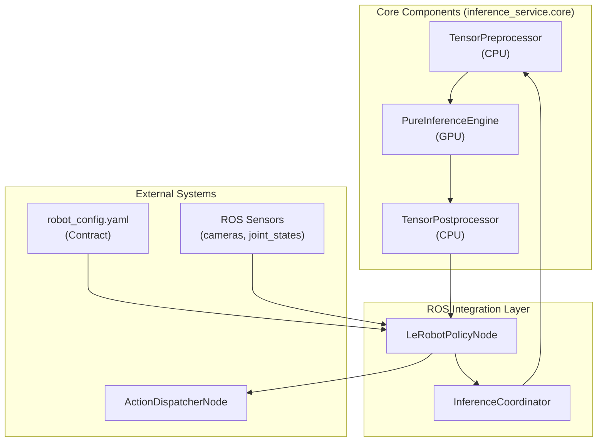
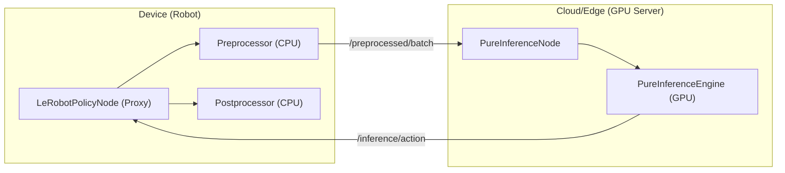

# 推理流水线概述

相关源文件

生成此 wiki 页面时使用了以下文件作为上下文：

- [src/action_dispatch/action_dispatch/action_dispatcher_node.py](https://atomgit.com/openeuler/IB_Robot/blob/master/src/action_dispatch/action_dispatch/action_dispatcher_node.py)
- [src/inference_service/README.en.md](https://atomgit.com/openeuler/IB_Robot/blob/master/src/inference_service/README.en.md)
- [src/inference_service/README.md](https://atomgit.com/openeuler/IB_Robot/blob/master/src/inference_service/README.md)
- [src/inference_service/inference_service/core/_policy_config.py](https://atomgit.com/openeuler/IB_Robot/blob/master/src/inference_service/inference_service/core/_policy_config.py)
- [src/inference_service/inference_service/core/compiled_policy.py](https://atomgit.com/openeuler/IB_Robot/blob/master/src/inference_service/inference_service/core/compiled_policy.py)
- [src/inference_service/inference_service/core/postprocessor.py](https://atomgit.com/openeuler/IB_Robot/blob/master/src/inference_service/inference_service/core/postprocessor.py)
- [src/inference_service/inference_service/core/preprocessor.py](https://atomgit.com/openeuler/IB_Robot/blob/master/src/inference_service/inference_service/core/preprocessor.py)
- [src/inference_service/inference_service/core/pure_inference_engine.py](https://atomgit.com/openeuler/IB_Robot/blob/master/src/inference_service/inference_service/core/pure_inference_engine.py)
- [src/inference_service/inference_service/lerobot_policy_node.py](https://atomgit.com/openeuler/IB_Robot/blob/master/src/inference_service/inference_service/lerobot_policy_node.py)
- [src/inference_service/inference_service/pure_inference_node.py](https://atomgit.com/openeuler/IB_Robot/blob/master/src/inference_service/inference_service/pure_inference_node.py)
- [src/inference_service/tests/test_ascend_om.py](https://atomgit.com/openeuler/IB_Robot/blob/master/src/inference_service/tests/test_ascend_om.py)
- [src/inference_service/tests/test_policy_config.py](https://atomgit.com/openeuler/IB_Robot/blob/master/src/inference_service/tests/test_policy_config.py)
- [src/robot_config/config/robots/so101_single_arm.yaml](https://atomgit.com/openeuler/IB_Robot/blob/master/src/robot_config/config/robots/so101_single_arm.yaml)
- [src/robot_config/robot_config/launch_builders/execution.py](https://atomgit.com/openeuler/IB_Robot/blob/master/src/robot_config/robot_config/launch_builders/execution.py)

推理流水线是 IB-Robot 的 AI 执行子系统，负责加载 LeRobot 策略模型，并将实时传感器观测转换为机器人动作。它采用契约驱动架构，通过复用与数据集转换流水线相同的数据处理逻辑，保证训练与部署对齐。

关于训练数据准备，请参见 [Dataset Conversion (bag_to_lerobot)](../data_pipeline/dataset_conversion_bag_to_lerobot.md)。关于动作执行和时间平滑，请参见 [Action Dispatch](../action_dispatch/overview.md)。

**来源**：[src/inference_service/inference_service/lerobot_policy_node.py:1-33](https://atomgit.com/openeuler/IB_Robot/blob/master/src/inference_service/inference_service/lerobot_policy_node.py#L1-L33)，[src/inference_service/README.md:1-6](https://atomgit.com/openeuler/IB_Robot/blob/master/src/inference_service/README.md#L1-L6)

---

## 系统目的与范围

推理服务包（`inference_service`）连接已训练的 LeRobot 策略与实时机器人控制。其核心职责包括：

1.  **模型加载**：加载 ACT、Diffusion Policy、VLA 和其他 LeRobot 兼容 checkpoint 文件 [src/inference_service/inference_service/core/pure_inference_engine.py:169-176](https://atomgit.com/openeuler/IB_Robot/blob/master/src/inference_service/inference_service/core/pure_inference_engine.py#L169-L176)。
2.  **观测处理**：使用 `TensorPreprocessor` 将 ROS 2 传感器流（相机、关节状态）转换为模型可用的 tensor [src/inference_service/inference_service/core/preprocessor.py:73-86](https://atomgit.com/openeuler/IB_Robot/blob/master/src/inference_service/inference_service/core/preprocessor.py#L73-L86)。
3.  **GPU 推理**：通过 `PureInferenceEngine` 执行策略 forward pass [src/inference_service/inference_service/core/pure_inference_engine.py:1-14](https://atomgit.com/openeuler/IB_Robot/blob/master/src/inference_service/inference_service/core/pure_inference_engine.py#L1-L14)。
4.  **动作生成**：通过 `TensorPostprocessor` 将输出 tensor 转换为可执行命令 [src/inference_service/inference_service/core/postprocessor.py:70-86](https://atomgit.com/openeuler/IB_Robot/blob/master/src/inference_service/inference_service/core/postprocessor.py#L70-L86)。
5.  **部署灵活性**：同时支持单机（zero-copy）和分布式（edge-cloud）执行 [src/inference_service/inference_service/lerobot_policy_node.py:5-26](https://atomgit.com/openeuler/IB_Robot/blob/master/src/inference_service/inference_service/lerobot_policy_node.py#L5-L26)。

该流水线**不**处理动作执行、时间平滑或电机控制，这些由 [Action Dispatch](../action_dispatch/overview.md) 系统负责。

**来源**：[src/inference_service/inference_service/lerobot_policy_node.py:1-33](https://atomgit.com/openeuler/IB_Robot/blob/master/src/inference_service/inference_service/lerobot_policy_node.py#L1-L33)，[src/inference_service/inference_service/core/pure_inference_engine.py:1-14](https://atomgit.com/openeuler/IB_Robot/blob/master/src/inference_service/inference_service/core/pure_inference_engine.py#L1-L14)

---

## 三组件架构

推理流水线遵循 “Composition over Inheritance” 设计，将 AI 执行工作流拆分为三个独立且不依赖 ROS 的核心组件。深入技术细节请参见 [Inference Architecture](./inference_architecture.md)。

### 组件图

**来源**：[src/inference_service/README.md:7-14](https://atomgit.com/openeuler/IB_Robot/blob/master/src/inference_service/README.md#L7-L14)，[src/inference_service/inference_service/lerobot_policy_node.py:57-67](https://atomgit.com/openeuler/IB_Robot/blob/master/src/inference_service/inference_service/lerobot_policy_node.py#L57-L67)，[src/inference_service/inference_service/core/pure_inference_engine.py:3-14](https://atomgit.com/openeuler/IB_Robot/blob/master/src/inference_service/inference_service/core/pure_inference_engine.py#L3-L14)

### TensorPreprocessor
处理观测 tensor 的转换与归一化，例如 `numpy` -> `torch`、`HWC` -> `CHW`。它使用模型数据集统计信息准备输入 [src/inference_service/inference_service/core/preprocessor.py:73-94](https://atomgit.com/openeuler/IB_Robot/blob/master/src/inference_service/inference_service/core/preprocessor.py#L73-L94)。

### PureInferenceEngine
无状态执行引擎，封装 ACT、Pi0 等策略模型。它支持 CUDA、Ascend NPU 和 Rockchip RKNN 等多种后端 [src/inference_service/inference_service/core/pure_inference_engine.py:29-49](https://atomgit.com/openeuler/IB_Robot/blob/master/src/inference_service/inference_service/core/pure_inference_engine.py#L29-L49)。

### TensorPostprocessor
将输出动作 tensor 反归一化为物理控制命令，并可按物理安全限制进行 clamp [src/inference_service/inference_service/core/postprocessor.py:70-86](https://atomgit.com/openeuler/IB_Robot/blob/master/src/inference_service/inference_service/core/postprocessor.py#L70-L86)。

**来源**：[src/inference_service/inference_service/core/preprocessor.py:1-13](https://atomgit.com/openeuler/IB_Robot/blob/master/src/inference_service/inference_service/core/preprocessor.py#L1-L13)，[src/inference_service/inference_service/core/pure_inference_engine.py:1-14](https://atomgit.com/openeuler/IB_Robot/blob/master/src/inference_service/inference_service/core/pure_inference_engine.py#L1-L14)，[src/inference_service/inference_service/core/postprocessor.py:1-14](https://atomgit.com/openeuler/IB_Robot/blob/master/src/inference_service/inference_service/core/postprocessor.py#L1-L14)

---

## 执行模式

推理流水线支持两种部署架构，可通过 `robot_config.yaml` 中的 `execution_mode` 参数选择 [src/robot_config/config/robots/so101_single_arm.yaml:100-101](https://atomgit.com/openeuler/IB_Robot/blob/master/src/robot_config/config/robots/so101_single_arm.yaml#L100-L101)。

### Monolithic Mode (Single-Machine)
在 monolithic 模式中，所有处理（Pre -> Infer -> Post）都在机器人上的单个进程中完成。该模式面向搭载高性能板载 GPU 的机器人，用于获得 zero-copy 延迟 [src/inference_service/README.md:20-26](https://atomgit.com/openeuler/IB_Robot/blob/master/src/inference_service/README.md#L20-L26)。详情请参见 [Monolithic Execution Mode](./monolithic_execution_mode.md)。

### Distributed Mode (Edge-Cloud)
`LeRobotPolicyNode` 在机器人（device）上作为代理运行，执行基于 CPU 的预处理，然后把轻量 tensor batch 发送到局域网中的 GPU 服务器上的 `pure_inference_node` [src/inference_service/README.md:28-35](https://atomgit.com/openeuler/IB_Robot/blob/master/src/inference_service/README.md#L28-L35)。详情请参见 [Distributed Execution Mode](./distributed_execution_mode.md)。

**来源**：[src/inference_service/inference_service/lerobot_policy_node.py:5-26](https://atomgit.com/openeuler/IB_Robot/blob/master/src/inference_service/inference_service/lerobot_policy_node.py#L5-L26)，[src/inference_service/README.md:37-54](https://atomgit.com/openeuler/IB_Robot/blob/master/src/inference_service/README.md#L37-L54)

---

## 策略节点

流水线通过两个主要 ROS 节点实现。实现细节请参见 [Policy Nodes](./policy_nodes.md)。

1.  **LeRobotPolicyNode**：主入口。它管理对传感器数据的 ROS 订阅，提供 `DispatchInfer` action server，并协调推理工作流 [src/inference_service/inference_service/lerobot_policy_node.py:148-169](https://atomgit.com/openeuler/IB_Robot/blob/master/src/inference_service/inference_service/lerobot_policy_node.py#L148-L169)。
2.  **PureInferenceNode**：分布式模式中的轻量节点。它订阅预处理 tensor 并发布原始动作，用于 GPU offloading [src/inference_service/inference_service/pure_inference_node.py:38-46](https://atomgit.com/openeuler/IB_Robot/blob/master/src/inference_service/inference_service/pure_inference_node.py#L38-L46)。

**来源**：[src/inference_service/inference_service/lerobot_policy_node.py:1-34](https://atomgit.com/openeuler/IB_Robot/blob/master/src/inference_service/inference_service/lerobot_policy_node.py#L1-L34)，[src/inference_service/inference_service/pure_inference_node.py:1-15](https://atomgit.com/openeuler/IB_Robot/blob/master/src/inference_service/inference_service/pure_inference_node.py#L1-L15)

---

## 模型导出与验证 (model_utils)

流水线支持标准 PyTorch 之外的专用硬件后端。详情请参见 [Model Export and Validation (model_utils)](./model_export_validation.md)。

*   **Ascend NPU**：通过 `AscendOMPolicyWrapper` 支持 `.om` 模型 [src/inference_service/inference_service/core/pure_inference_engine.py:83-85](https://atomgit.com/openeuler/IB_Robot/blob/master/src/inference_service/inference_service/core/pure_inference_engine.py#L83-L85)。
*   **Rockchip NPU**：支持用于 RK3588 部署的 `.rknn` 模型 [src/inference_service/inference_service/core/pure_inference_engine.py:83-85](https://atomgit.com/openeuler/IB_Robot/blob/master/src/inference_service/inference_service/core/pure_inference_engine.py#L83-L85)。
*   **验证**：测试确保编译后端产生与 PyTorch 一致的结果 [src/inference_service/tests/test_ascend_om.py:103-111](https://atomgit.com/openeuler/IB_Robot/blob/master/src/inference_service/tests/test_ascend_om.py#L103-L111)。

**来源**：[src/inference_service/README.md:156-188](https://atomgit.com/openeuler/IB_Robot/blob/master/src/inference_service/README.md#L156-L188)，[src/inference_service/inference_service/core/pure_inference_engine.py:29-49](https://atomgit.com/openeuler/IB_Robot/blob/master/src/inference_service/inference_service/core/pure_inference_engine.py#L29-L49)

---

## 注意力可视化 (attention_viz)

流水线集成 `attention_viz` 包，用于观察模型决策过程。详情请参见 [Attention Visualization (attention_viz)](./attention_visualization.md)。

*   **Heatmap 生成**：向 ROS topic 发布 cross-attention 权重用于可视化 [src/inference_service/inference_service/lerobot_policy_node.py:102-111](https://atomgit.com/openeuler/IB_Robot/blob/master/src/inference_service/inference_service/lerobot_policy_node.py#L102-L111)。
*   **交互式 Masking**：支持 UI 驱动的 masking，用于调试 ACT transformer attention [src/inference_service/README.md:80-95](https://atomgit.com/openeuler/IB_Robot/blob/master/src/inference_service/README.md#L80-L95)。

**来源**：[src/inference_service/inference_service/lerobot_policy_node.py:102-113](https://atomgit.com/openeuler/IB_Robot/blob/master/src/inference_service/inference_service/lerobot_policy_node.py#L102-L113)，[src/robot_config/robot_config/launch_builders/execution.py:64-70](https://atomgit.com/openeuler/IB_Robot/blob/master/src/robot_config/robot_config/launch_builders/execution.py#L64-L70)

---

## Launch 集成

推理流水线由 `robot_config` 启动系统根据当前 `control_mode` 动态启动。

**关键 launch builder 函数**：`generate_inference_node()`，位于 [src/robot_config/robot_config/launch_builders/execution.py:123-142](https://atomgit.com/openeuler/IB_Robot/blob/master/src/robot_config/robot_config/launch_builders/execution.py#L123-L142)。它解析模型路径，配置执行模式（monolithic vs distributed），并设置可选的注意力可视化 sidecar [src/robot_config/robot_config/launch_builders/execution.py:72-120](https://atomgit.com/openeuler/IB_Robot/blob/master/src/robot_config/robot_config/launch_builders/execution.py#L72-L120)。

**来源**：[src/robot_config/robot_config/launch_builders/execution.py:123-166](https://atomgit.com/openeuler/IB_Robot/blob/master/src/robot_config/robot_config/launch_builders/execution.py#L123-L166)，[src/robot_config/config/robots/so101_single_arm.yaml:88-103](https://atomgit.com/openeuler/IB_Robot/blob/master/src/robot_config/config/robots/so101_single_arm.yaml#L88-L103)

