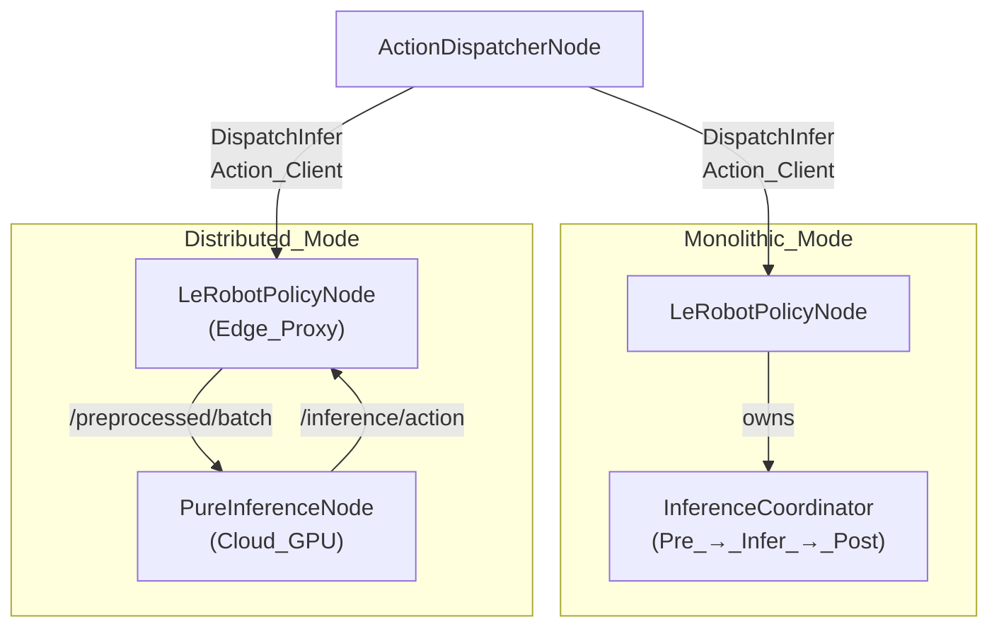
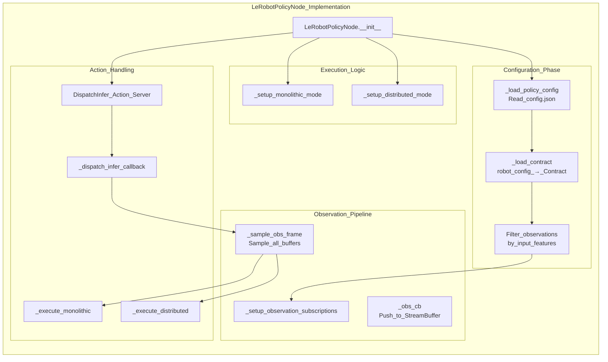
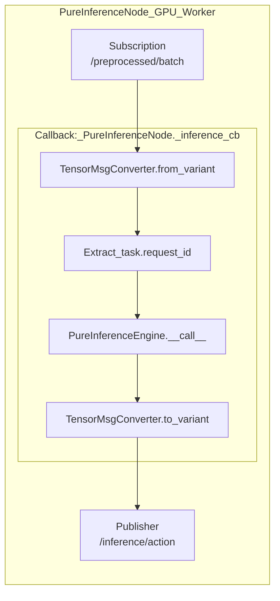

# 策略节点

相关源文件

生成此 wiki 页面时使用了以下文件作为上下文：

- [scripts/openharmony/build_ibrobot_oh_custom.sh](https://atomgit.com/openeuler/IB_Robot/blob/master/scripts/openharmony/build_ibrobot_oh_custom.sh)
- [src/action_dispatch/action_dispatch/action_dispatcher_node.py](https://atomgit.com/openeuler/IB_Robot/blob/master/src/action_dispatch/action_dispatch/action_dispatcher_node.py)
- [src/action_dispatch/action_dispatch/topic_executor.py](https://atomgit.com/openeuler/IB_Robot/blob/master/src/action_dispatch/action_dispatch/topic_executor.py)
- [src/inference_service/inference_service/core/rknn/__init__.py](https://atomgit.com/openeuler/IB_Robot/blob/master/src/inference_service/inference_service/core/rknn/__init__.py)
- [src/inference_service/inference_service/lerobot_policy_node.py](https://atomgit.com/openeuler/IB_Robot/blob/master/src/inference_service/inference_service/lerobot_policy_node.py)
- [src/inference_service/setup.py](https://atomgit.com/openeuler/IB_Robot/blob/master/src/inference_service/setup.py)
- [src/robot_config/config/robots/so101_single_arm.yaml](https://atomgit.com/openeuler/IB_Robot/blob/master/src/robot_config/config/robots/so101_single_arm.yaml)
- [src/robot_config/robot_config/launch_builders/execution.py](https://atomgit.com/openeuler/IB_Robot/blob/master/src/robot_config/robot_config/launch_builders/execution.py)
- [src/robot_config/robot_config/launch_builders/sim_backend/base_adapter.py](https://atomgit.com/openeuler/IB_Robot/blob/master/src/robot_config/robot_config/launch_builders/sim_backend/base_adapter.py)
- [src/robot_config/robot_config/launch_builders/sim_backend/gazebo_adapter.py](https://atomgit.com/openeuler/IB_Robot/blob/master/src/robot_config/robot_config/launch_builders/sim_backend/gazebo_adapter.py)
- [src/robot_config/robot_config/launch_builders/sim_peripheral_bridge.py](https://atomgit.com/openeuler/IB_Robot/blob/master/src/robot_config/robot_config/launch_builders/sim_peripheral_bridge.py)
- [src/robot_config/robot_config/launch_builders/simulation.py](https://atomgit.com/openeuler/IB_Robot/blob/master/src/robot_config/robot_config/launch_builders/simulation.py)
- [src/robot_config/test/test_sim_backend.py](https://atomgit.com/openeuler/IB_Robot/blob/master/src/robot_config/test/test_sim_backend.py)

本文记录负责策略推理的两个 ROS 2 节点：`lerobot_policy_node` 和 `pure_inference_node`。这些节点加载已训练的 LeRobot 策略，并根据观测生成动作预测。整体推理架构和执行模式概念请参见 [Inference Architecture](./inference_architecture.md)。

---

## 概述

IB-Robot 推理系统提供两个策略节点，它们协同支持 **monolithic**（单进程）和 **distributed**（device-edge-cloud）两种执行模式：

| 节点 | 包 | 可执行文件 | 目的 |
|------|---------|-----------|---------|
| **lerobot_policy_node** | `inference_service` | `lerobot_policy_node` | 主策略节点。向 `action_dispatcher_node` 暴露 `DispatchInfer` Action Server。处理观测订阅、契约驱动过滤，并协调推理 [src/inference_service/inference_service/lerobot_policy_node.py:148-158](https://atomgit.com/openeuler/IB_Robot/blob/master/src/inference_service/inference_service/lerobot_policy_node.py#L148-L158)。 |
| **pure_inference_node** | `inference_service` | `pure_inference_node` | 分布式模式中的 GPU 推理 worker。订阅预处理 batch，运行推理，并发布原始动作。不暴露 Action Server [src/inference_service/inference_service/lerobot_policy_node.py:22-26](https://atomgit.com/openeuler/IB_Robot/blob/master/src/inference_service/inference_service/lerobot_policy_node.py#L22-L26)。 |

### 执行模式架构

**关键设计原则：** 两种执行模式都向 `action_dispatcher_node` 暴露**相同**的 `DispatchInfer` Action Server 接口。分布式模式对客户端完全透明，客户端无法区分 monolithic 和 distributed 执行 [src/inference_service/inference_service/lerobot_policy_node.py:155-158](https://atomgit.com/openeuler/IB_Robot/blob/master/src/inference_service/inference_service/lerobot_policy_node.py#L155-L158)。

**来源：** [src/inference_service/inference_service/lerobot_policy_node.py:3-34](https://atomgit.com/openeuler/IB_Robot/blob/master/src/inference_service/inference_service/lerobot_policy_node.py#L3-L34)，[src/robot_config/robot_config/launch_builders/execution.py:9-12](https://atomgit.com/openeuler/IB_Robot/blob/master/src/robot_config/robot_config/launch_builders/execution.py#L9-L12)

---

## lerobot_policy_node

`LeRobotPolicyNode` [src/inference_service/inference_service/lerobot_policy_node.py:148](https://atomgit.com/openeuler/IB_Robot/blob/master/src/inference_service/inference_service/lerobot_policy_node.py#L148) 是与动作分发流水线集成的主推理节点。它加载策略 checkpoint，订阅机器人契约中定义的观测，并生成动作预测。

### 节点逻辑流程

### 初始化与过滤

节点从两个来源加载配置：
1. **Policy Config**（`config.json`）：定义模型架构和所需 `input_features` [src/inference_service/inference_service/lerobot_policy_node.py:204-205](https://atomgit.com/openeuler/IB_Robot/blob/master/src/inference_service/inference_service/lerobot_policy_node.py#L204-L205)。
2. **Robot Config**（YAML）：通过 Contract 定义所有可用观测 [src/inference_service/inference_service/lerobot_policy_node.py:133-134](https://atomgit.com/openeuler/IB_Robot/blob/master/src/inference_service/inference_service/lerobot_policy_node.py#L133-L134)。

**观测过滤：** 节点会根据模型所需输入过滤观测。这让单个 `robot_config.yaml` 可以支持观测需求不同的多个模型 [src/inference_service/inference_service/lerobot_policy_node.py:161-168](https://atomgit.com/openeuler/IB_Robot/blob/master/src/inference_service/inference_service/lerobot_policy_node.py#L161-L168)。

### 观测订阅

节点为所有过滤后的观测创建 ROS subscription，每个 subscription 都带有 `StreamBuffer`，实现契约中的重采样策略 [src/inference_service/inference_service/lerobot_policy_node.py:117-120](https://atomgit.com/openeuler/IB_Robot/blob/master/src/inference_service/inference_service/lerobot_policy_node.py#L117-L120)。

**状态拼接：** 节点会处理来自不同 topic 的多个 `observation.state` spec，在采样期间拼接数值，形成模型使用的单个 tensor [src/inference_service/inference_service/lerobot_policy_node.py:197-198](https://atomgit.com/openeuler/IB_Robot/blob/master/src/inference_service/inference_service/lerobot_policy_node.py#L197-L198)。

**来源：** [src/inference_service/inference_service/lerobot_policy_node.py:148-209](https://atomgit.com/openeuler/IB_Robot/blob/master/src/inference_service/inference_service/lerobot_policy_node.py#L148-L209)

### 执行模式

#### Monolithic 模式
在 monolithic 模式中，节点拥有 `InferenceCoordinator` [src/inference_service/inference_service/lerobot_policy_node.py:9-11](https://atomgit.com/openeuler/IB_Robot/blob/master/src/inference_service/inference_service/lerobot_policy_node.py#L9-L11)。它在单个进程中执行全部三个阶段（预处理、推理、后处理），支持 zero-copy tensor 传递 [src/inference_service/inference_service/lerobot_policy_node.py:154-154](https://atomgit.com/openeuler/IB_Robot/blob/master/src/inference_service/inference_service/lerobot_policy_node.py#L154-L154)。

#### Distributed 模式
在 distributed 模式中，节点作为**异步代理**。它使用 `TensorPreprocessor` 执行本地预处理，将 batch 通过 `cloud_inference_topic` 发布到 cloud 节点，并阻塞 action callback，直到在 `cloud_result_topic` 上收到匹配 `request_id` 的响应 [src/inference_service/inference_service/lerobot_policy_node.py:13-20](https://atomgit.com/openeuler/IB_Robot/blob/master/src/inference_service/inference_service/lerobot_policy_node.py#L13-L20)。

**来源：** [src/inference_service/inference_service/lerobot_policy_node.py:3-34](https://atomgit.com/openeuler/IB_Robot/blob/master/src/inference_service/inference_service/lerobot_policy_node.py#L3-L34)，[src/robot_config/robot_config/launch_builders/execution.py:155-165](https://atomgit.com/openeuler/IB_Robot/blob/master/src/robot_config/robot_config/launch_builders/execution.py#L155-L165)

---

## pure_inference_node

`pure_inference_node` 是轻量 GPU worker。它订阅预处理 batch，通过模型引擎运行推理，并发布原始动作 tensor。

### 节点架构

### 推理逻辑
节点是无状态的，并会从输入到输出保留 `request_id`，以便 edge 节点匹配响应 [src/inference_service/inference_service/lerobot_policy_node.py:18-20](https://atomgit.com/openeuler/IB_Robot/blob/master/src/inference_service/inference_service/lerobot_policy_node.py#L18-L20)。

**来源：** [src/inference_service/inference_service/lerobot_policy_node.py:22-26](https://atomgit.com/openeuler/IB_Robot/blob/master/src/inference_service/inference_service/lerobot_policy_node.py#L22-L26)，[src/inference_service/setup.py:34-34](https://atomgit.com/openeuler/IB_Robot/blob/master/src/inference_service/setup.py#L34-L34)

---

## 与 Action Dispatcher 通信

`ActionDispatcherNode` [src/action_dispatch/action_dispatch/action_dispatcher_node.py:43](https://atomgit.com/openeuler/IB_Robot/blob/master/src/action_dispatch/action_dispatch/action_dispatcher_node.py#L43) 通过 `DispatchInfer` action client 与这些节点交互 [src/action_dispatch/action_dispatch/action_dispatcher_node.py:159-161](https://atomgit.com/openeuler/IB_Robot/blob/master/src/action_dispatch/action_dispatch/action_dispatcher_node.py#L159-L161)。它根据动作队列的 watermark 阈值触发推理 [src/action_dispatch/action_dispatch/action_dispatcher_node.py:80-80](https://atomgit.com/openeuler/IB_Robot/blob/master/src/action_dispatch/action_dispatch/action_dispatcher_node.py#L80-L80)。

| 特性 | Monolithic Mode | Distributed Mode |
|---------|-----------------|------------------|
| **Edge Node** | `lerobot_policy_node` | `lerobot_policy_node` |
| **Cloud Node** | N/A | `pure_inference_node` |
| **接口** | `DispatchInfer` Action Server | `DispatchInfer` Action Server |
| **数据流** | Zero-copy local tensors | 通过 ROS2 topics 传输 `VariantsList` [src/inference_service/inference_service/lerobot_policy_node.py:17-25](https://atomgit.com/openeuler/IB_Robot/blob/master/src/inference_service/inference_service/lerobot_policy_node.py#L17-L25) |

**来源：** [src/action_dispatch/action_dispatch/action_dispatcher_node.py:159-161](https://atomgit.com/openeuler/IB_Robot/blob/master/src/action_dispatch/action_dispatch/action_dispatcher_node.py#L159-L161)，[src/inference_service/inference_service/lerobot_policy_node.py:27-33](https://atomgit.com/openeuler/IB_Robot/blob/master/src/inference_service/inference_service/lerobot_policy_node.py#L27-L33)，[src/robot_config/robot_config/launch_builders/execution.py:155-165](https://atomgit.com/openeuler/IB_Robot/blob/master/src/robot_config/robot_config/launch_builders/execution.py#L155-L165)

