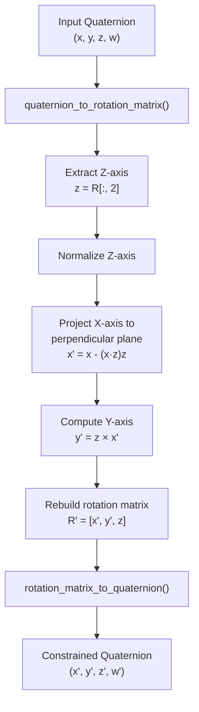
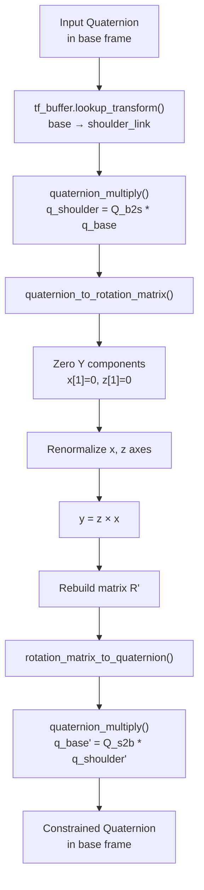
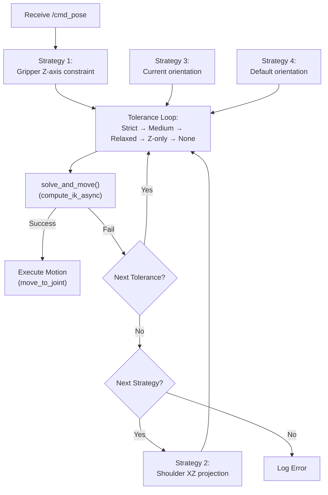

# 5DOF 运动学约束

<details>
<summary>Relevant source files</summary>

The following files were used as context for generating this wiki page:

- [src/model_utils/model_utils/__init__.py](https://atomgit.com/openeuler/IB_Robot/blob/master/src/model_utils/model_utils/__init__.py)
- [src/model_utils/model_utils/export_onnx_3403.py](https://atomgit.com/openeuler/IB_Robot/blob/master/src/model_utils/model_utils/export_onnx_3403.py)
- [src/model_utils/model_utils/export_onnx_atc.py](https://atomgit.com/openeuler/IB_Robot/blob/master/src/model_utils/model_utils/export_onnx_atc.py)
- [src/model_utils/model_utils/loss_compare.py](https://atomgit.com/openeuler/IB_Robot/blob/master/src/model_utils/model_utils/loss_compare.py)
- [src/model_utils/model_utils/pi05_dist_metrics.py](https://atomgit.com/openeuler/IB_Robot/blob/master/src/model_utils/model_utils/pi05_dist_metrics.py)
- [src/model_utils/package.xml](https://atomgit.com/openeuler/IB_Robot/blob/master/src/model_utils/package.xml)
- [src/model_utils/resource/model_utils](https://atomgit.com/openeuler/IB_Robot/blob/master/src/model_utils/resource/model_utils)
- [src/model_utils/setup.cfg](https://atomgit.com/openeuler/IB_Robot/blob/master/src/model_utils/setup.cfg)
- [src/model_utils/setup.py](https://atomgit.com/openeuler/IB_Robot/blob/master/src/model_utils/setup.py)
- [src/robot_moveit/README.md](https://atomgit.com/openeuler/IB_Robot/blob/master/src/robot_moveit/README.md)
- [src/robot_moveit/config/lerobot/so101/so101.srdf](https://atomgit.com/openeuler/IB_Robot/blob/master/src/robot_moveit/config/lerobot/so101/so101.srdf)

</details>


本文说明 IB-Robot 框架中 5 自由度（DOF）机械臂的运动学约束处理系统。SO101 机械臂只有 5 个驱动关节，但末端执行器位姿命令描述的是 6DOF（3 个位置 + 3 个姿态）。本文解释其数学问题、`MoveItGateway` 中实现的约束放宽策略，以及成功完成逆运动学（IK）求解所需的配置。

关于 MoveItGateway 节点整体架构和位姿命令接口，见 **10.1 MoveItGateway 节点**。关于 MoveIt 启动配置和控制器设置，见 **10.3 MoveIt 启动配置**。

---

## 5DOF 问题

### 数学约束

6DOF 位姿规格提供 6 个约束：
- **位置**: 3 个约束（x、y、z）
- **姿态**: 3 个约束（roll、pitch、yaw）

配置中定义的 SO101 这类 5DOF 机械臂在 arm group 中只有 5 个关节变量 [src/robot_moveit/config/lerobot/so101/so101.srdf:25-32](https://atomgit.com/openeuler/IB_Robot/blob/master/src/robot_moveit/config/lerobot/so101/so101.srdf#L25-L32)。标准 IK 求解器若尝试同时满足全部 6 个约束，就会因为系统过约束（6 个方程，5 个未知数）而失败，产生 `NO_IK_SOLUTION` 错误 [src/robot_moveit/README.md:59-62](https://atomgit.com/openeuler/IB_Robot/blob/master/src/robot_moveit/README.md#L59-L62)。

### 运动学限制

SO101 机械臂的 5 个旋转关节可以控制：
- 末端执行器位置的 3 个 DOF。
- 末端执行器姿态的 2 个 DOF，通常是工具轴方向。
- **缺失**: 绕工具轴旋转的 1 个 DOF（roll）[src/robot_moveit/README.md:98-99](https://atomgit.com/openeuler/IB_Robot/blob/master/src/robot_moveit/README.md#L98-L99)。

这意味着末端执行器无法达到任意 6DOF 位姿。对大多数目标姿态来说，不存在精确解。

**来源**: [src/robot_moveit/config/lerobot/so101/so101.srdf:25-32](https://atomgit.com/openeuler/IB_Robot/blob/master/src/robot_moveit/config/lerobot/so101/so101.srdf#L25-L32), [src/robot_moveit/README.md:59-62](https://atomgit.com/openeuler/IB_Robot/blob/master/src/robot_moveit/README.md#L59-L62), [src/robot_moveit/README.md:98-99](https://atomgit.com/openeuler/IB_Robot/blob/master/src/robot_moveit/README.md#L98-L99)

---

## 配置：仅位置 IK

### 运动学配置

主要方案是在 KDL 运动学求解器中启用仅位置 IK 模式。该模式在 `kinematics.yaml` 中配置 [src/robot_moveit/README.md:68-70](https://atomgit.com/openeuler/IB_Robot/blob/master/src/robot_moveit/README.md#L68-L70)：

```yaml
arm:
  kinematics_solver: kdl_kinematics_plugin/KDLKinematicsPlugin
  kinematics_solver_search_resolution: 0.01
  kinematics_solver_timeout: 0.5
  kinematics_solver_attempts: 3
  position_only_ik: True
```

### `position_only_ik: True` 下的求解器行为

| 方面 | 标准模式 | 仅位置模式 |
|--------|--------------|-------------------|
| **目标** | 最小化位置 + 姿态误差 | 仅最小化位置误差 |
| **姿态输入** | 硬约束，不可达时失败 | 作为解选择的提示 |
| **求解器实现** | `ChainIkSolverPos_NR` | `ChainIkSolverPos` [src/robot_moveit/README.md:80](https://atomgit.com/openeuler/IB_Robot/blob/master/src/robot_moveit/README.md#L80) |
| **成功率** | 对 5DOF 机械臂较低 | 较高 [src/robot_moveit/README.md:76](https://atomgit.com/openeuler/IB_Robot/blob/master/src/robot_moveit/README.md#L76) |

传给求解器的姿态四元数仍会影响选择哪一个解作为“起始猜测”，并有助于数值稳定，但不会强制严格匹配姿态 [src/robot_moveit/README.md:87-91](https://atomgit.com/openeuler/IB_Robot/blob/master/src/robot_moveit/README.md#L87-L91)。

**来源**: [src/robot_moveit/README.md:68-91](https://atomgit.com/openeuler/IB_Robot/blob/master/src/robot_moveit/README.md#L68-L91)

---

## 姿态预处理策略

`moveit_gateway` 节点会做姿态预处理，以提高 IK 收敛性，并引导求解器靠近运动学可行的姿态 [src/robot_moveit/README.md:117-128](https://atomgit.com/openeuler/IB_Robot/blob/master/src/robot_moveit/README.md#L117-L128)。

### 策略 1：仅 Z 轴约束

**原则**:
- 保持末端执行器 Z 轴方向（2 DOF：pitch + yaw）。
- 放宽绕 Z 轴的旋转（1 DOF：roll）[src/robot_moveit/README.md:98-99](https://atomgit.com/openeuler/IB_Robot/blob/master/src/robot_moveit/README.md#L98-L99)。
- 使用最小旋转原则，尽量接近原始姿态。



**图：Z 轴约束算法逻辑**

---

### 策略 2：肩部 XZ 平面投影

**原则**:
- 将姿态变换到肩部坐标系 [src/robot_moveit/README.md:131-133](https://atomgit.com/openeuler/IB_Robot/blob/master/src/robot_moveit/README.md#L131-L133)。
- 将旋转轴约束在肩部 XZ 平面中（Y 分量 = 0）。
- 再变换回基坐标系。

这种方法具有几何动机：SO101 的运动链因其串联结构而自然对齐到肩部 XZ 平面 [src/robot_moveit/README.md:101-103](https://atomgit.com/openeuler/IB_Robot/blob/master/src/robot_moveit/README.md#L101-L103)。



**图：肩部 XZ 平面投影算法逻辑**

**来源**: [src/robot_moveit/README.md:101-103](https://atomgit.com/openeuler/IB_Robot/blob/master/src/robot_moveit/README.md#L101-L103), [src/robot_moveit/README.md:131-144](https://atomgit.com/openeuler/IB_Robot/blob/master/src/robot_moveit/README.md#L131-L144)

---

## 分层容差策略

`moveit_gateway` 在尝试求解 IK 时实现渐进放宽策略。若严格约束失败，它会逐步放宽容差 [src/robot_moveit/README.md:105-116](https://atomgit.com/openeuler/IB_Robot/blob/master/src/robot_moveit/README.md#L105-L116)。

### 容差级别

| 策略名称 | X/Y 容差 (rad) | Z 容差 (rad) | 说明 |
|--------------|---------------------|-------------------|-------------|
| **Strict** | 0.1 | 0.05 | X/Y: ±5.7°，Z: ±2.8° |
| **Medium** | 0.3 | 0.1 | X/Y: ±17°，Z: ±5.7° |
| **Relaxed** | 0.5 | 0.15 | X/Y: ±28°，Z: ±8.6° |
| **Z-axis only** | 1.0 | 0.2 | X/Y: ±57°，仅方向 |
| **No constraints**| None | None | 完全放开姿态 |

**来源**: [src/robot_moveit/README.md:105-116](https://atomgit.com/openeuler/IB_Robot/blob/master/src/robot_moveit/README.md#L105-L116)

---

## 多策略回退工作流

`moveit_gateway` 执行循环采用嵌套回退逻辑，把姿态预处理和容差级别组合起来 [src/robot_moveit/README.md:117-128](https://atomgit.com/openeuler/IB_Robot/blob/master/src/robot_moveit/README.md#L117-L128)。



**图：多策略回退决策树**

**来源**: [src/robot_moveit/README.md:117-128](https://atomgit.com/openeuler/IB_Robot/blob/master/src/robot_moveit/README.md#L117-L128), [src/robot_moveit/README.md:184-218](https://atomgit.com/openeuler/IB_Robot/blob/master/src/robot_moveit/README.md#L184-L218)

---

## 故障排查

### 常见失败模式

| 现象 | 可能原因 | 解决方案 |
|---------|-------------|----------|
| IK 持续失败 | `position_only_ik` 为 False | 检查 `kinematics.yaml`，确保它设置为 `True` [src/robot_moveit/README.md:69](https://atomgit.com/openeuler/IB_Robot/blob/master/src/robot_moveit/README.md#L69) |
| 姿态异常跳变 | 缺少姿态约束 | 确保 `moveit_gateway` 使用 Z 轴或 Shoulder 投影策略 [src/robot_moveit/README.md:94-103](https://atomgit.com/openeuler/IB_Robot/blob/master/src/robot_moveit/README.md#L94-L103) |
| 目标不可达 | 超出工作空间 | 检查从 `shoulder_link` 到目标的距离，节点会记录相对距离 [src/robot_moveit/README.md:145-152](https://atomgit.com/openeuler/IB_Robot/blob/master/src/robot_moveit/README.md#L145-L152) |

**来源**: [src/robot_moveit/README.md:68-103](https://atomgit.com/openeuler/IB_Robot/blob/master/src/robot_moveit/README.md#L68-L103), [src/robot_moveit/README.md:145-152](https://atomgit.com/openeuler/IB_Robot/blob/master/src/robot_moveit/README.md#L145-L152)

