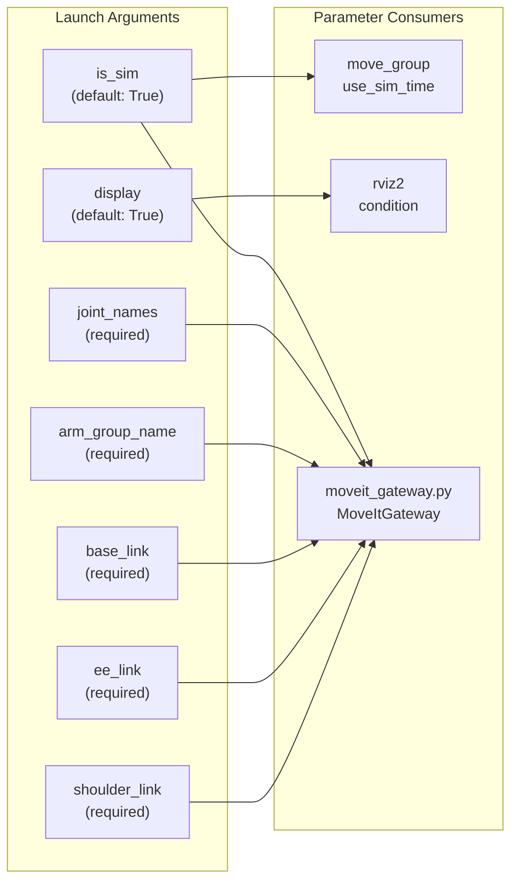
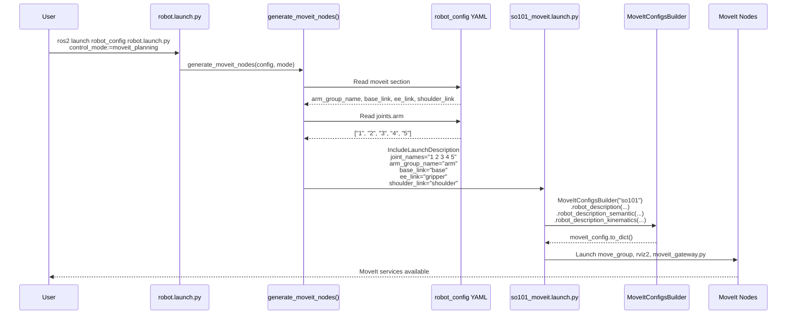
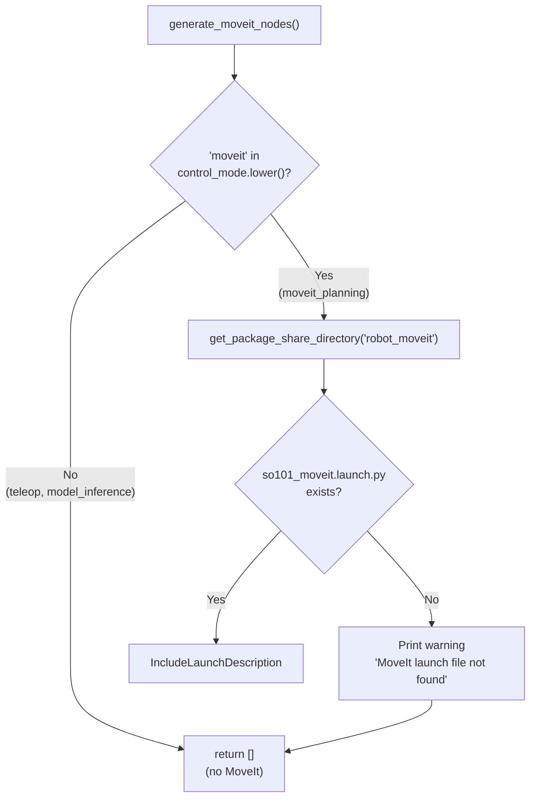

# MoveIt 启动配置

Relevant source files

The following files were used as context for generating this wiki page:

- [src/robot_config/config/robots/test_single_arm_single_cam.yaml](https://atomgit.com/openeuler/IB_Robot/blob/master/src/robot_config/config/robots/test_single_arm_single_cam.yaml)
- [src/robot_config/robot_config/launch_builders/moveit.py](https://atomgit.com/openeuler/IB_Robot/blob/master/src/robot_config/robot_config/launch_builders/moveit.py)
- [src/robot_moveit/CMakeLists.txt](https://atomgit.com/openeuler/IB_Robot/blob/master/src/robot_moveit/CMakeLists.txt)
- [src/robot_moveit/config/lerobot/so101/kinematics.yaml](https://atomgit.com/openeuler/IB_Robot/blob/master/src/robot_moveit/config/lerobot/so101/kinematics.yaml)
- [src/robot_moveit/launch/so101_moveit.launch.py](https://atomgit.com/openeuler/IB_Robot/blob/master/src/robot_moveit/launch/so101_moveit.launch.py)
- [src/robot_moveit/scripts/moveit_gateway.py](https://atomgit.com/openeuler/IB_Robot/blob/master/src/robot_moveit/scripts/moveit_gateway.py)
- [src/robot_teleop/package.xml](https://atomgit.com/openeuler/IB_Robot/blob/master/src/robot_teleop/package.xml)

本文说明 IB-Robot 中的 MoveIt 2 启动配置系统。该系统为 `moveit_planning` 控制模式提供运动规划能力。关于 MoveItGateway 节点的 IK 求解与约束处理，见 [src/robot_moveit/scripts/moveit_gateway.py:43-125](https://atomgit.com/openeuler/IB_Robot/blob/master/src/robot_moveit/scripts/moveit_gateway.py#L43-L125)。关于 5DOF 运动学约束，见 [src/robot_moveit/scripts/moveit_gateway.py:164-214](https://atomgit.com/openeuler/IB_Robot/blob/master/src/robot_moveit/scripts/moveit_gateway.py#L164-L214)。

## 目的与范围

当机器人以 `moveit_planning` 控制模式启动时，MoveIt 启动配置系统会编排 MoveIt 2 组件的启动。它负责：

- 根据控制模式条件引入 MoveIt 节点 [src/robot_config/robot_config/launch_builders/moveit.py:32-37](https://atomgit.com/openeuler/IB_Robot/blob/master/src/robot_config/robot_config/launch_builders/moveit.py#L32-L37)。
- 将参数从 `robot_config` YAML 传递到 MoveIt 启动文件 [src/robot_config/robot_config/launch_builders/moveit.py:48-70](https://atomgit.com/openeuler/IB_Robot/blob/master/src/robot_config/robot_config/launch_builders/moveit.py#L48-L70)。
- 配置 MoveIt 规划组、运动学求解器和控制器 [src/robot_moveit/launch/so101_moveit.launch.py:61-70](https://atomgit.com/openeuler/IB_Robot/blob/master/src/robot_moveit/launch/so101_moveit.launch.py#L61-L70)。
- 为运动规划提供可选 RViz 可视化 [src/robot_moveit/launch/so101_moveit.launch.py:94-105](https://atomgit.com/openeuler/IB_Robot/blob/master/src/robot_moveit/launch/so101_moveit.launch.py#L94-L105)。

该系统把 `robot_config` 的单一事实源模式与 MoveIt 的配置需求连接起来，确保关节定义、link 名称和规划组参数在整个工作空间中保持一致。

## 启动架构概览

MoveIt 启动系统采用两级架构：`robot_config` 中的启动构建器会按条件引入 `robot_moveit` 包中的主 MoveIt 启动文件。

### MoveIt 启动实体关系
下图将系统名称关联到负责 MoveIt 编排的代码实体。

Title: MoveIt Launch Configuration Entity Mapping

```mermaid
graph TB
    subgraph "robot_config Package"
        robot_launch_py["robot.launch.py"]
        launch_builders_moveit_py_br_generate_moveit_nod["launch_builders/moveit.py<br/>generate_moveit_nodes()"]
        config_robots_test_single_arm_single_cam_yaml_br["config/robots/test_single_arm_single_cam.yaml<br/>moveit: {...}"]
    end
    
    subgraph "robot_moveit Package"
        launch_so101_moveit_launch_py_br_generate_launch["launch/so101_moveit.launch.py<br/>generate_launch_description()"]
        MoveItConfigsBuilder["MoveItConfigsBuilder"]
        
        subgraph "MoveIt Configuration Files"
            config_lerobot_so101_so101_srdf_br_planning_grou["config/lerobot/so101/so101.srdf<br/>planning groups"]
            config_lerobot_so101_kinematics_yaml_br_position["config/lerobot/so101/kinematics.yaml<br/>position_only_ik: True"]
            config_lerobot_so101_joint_limits_yaml["config/lerobot/so101/joint_limits.yaml"]
            config_lerobot_so101_moveit_controllers_yaml["config/lerobot/so101/moveit_controllers.yaml"]
        end
        
        subgraph "Launched Nodes"
            move_group_node_br_moveit_ros_move_group["move_group node<br/>moveit_ros_move_group"]
            rviz2_node_br_conditional["rviz2 node<br/>(conditional)"]
            moveit_gateway_py_br_MoveItGateway["moveit_gateway.py<br/>MoveItGateway"]
        end
    end
    
    robot_launch_py["robot.launch.py"] -->|"control_mode:=moveit_planning"| launch_builders_moveit_py_br_generate_moveit_nod["launch_builders/moveit.py<br/>generate_moveit_nodes()"]
    launch_builders_moveit_py_br_generate_moveit_nod["launch_builders/moveit.py<br/>generate_moveit_nodes()"] -->|"read moveit section"| config_robots_test_single_arm_single_cam_yaml_br["config/robots/test_single_arm_single_cam.yaml<br/>moveit: {...}"]
    launch_builders_moveit_py_br_generate_moveit_nod["launch_builders/moveit.py<br/>generate_moveit_nodes()"] -->|"IncludeLaunchDescription"| launch_so101_moveit_launch_py_br_generate_launch["launch/so101_moveit.launch.py<br/>generate_launch_description()"]
    
    launch_so101_moveit_launch_py_br_generate_launch["launch/so101_moveit.launch.py<br/>generate_launch_description()"] -->|"loads configurations"| MoveItConfigsBuilder["MoveItConfigsBuilder"]
    MoveItConfigsBuilder["MoveItConfigsBuilder"] --> config_lerobot_so101_so101_srdf_br_planning_grou["config/lerobot/so101/so101.srdf<br/>planning groups"]
    MoveItConfigsBuilder["MoveItConfigsBuilder"] --> config_lerobot_so101_kinematics_yaml_br_position["config/lerobot/so101/kinematics.yaml<br/>position_only_ik: True"]
    MoveItConfigsBuilder["MoveItConfigsBuilder"] --> config_lerobot_so101_joint_limits_yaml["config/lerobot/so101/joint_limits.yaml"]
    MoveItConfigsBuilder["MoveItConfigsBuilder"] --> config_lerobot_so101_moveit_controllers_yaml["config/lerobot/so101/moveit_controllers.yaml"]
    
    launch_so101_moveit_launch_py_br_generate_launch["launch/so101_moveit.launch.py<br/>generate_launch_description()"] --> move_group_node_br_moveit_ros_move_group["move_group node<br/>moveit_ros_move_group"]
    launch_so101_moveit_launch_py_br_generate_launch["launch/so101_moveit.launch.py<br/>generate_launch_description()"] --> rviz2_node_br_conditional["rviz2 node<br/>(conditional)"]
    launch_so101_moveit_launch_py_br_generate_launch["launch/so101_moveit.launch.py<br/>generate_launch_description()"] --> moveit_gateway_py_br_MoveItGateway["moveit_gateway.py<br/>MoveItGateway"]
```

**来源**: [src/robot_config/robot_config/launch_builders/moveit.py:18-79](https://atomgit.com/openeuler/IB_Robot/blob/master/src/robot_config/robot_config/launch_builders/moveit.py#L18-L79), [src/robot_moveit/launch/so101_moveit.launch.py:13-134](https://atomgit.com/openeuler/IB_Robot/blob/master/src/robot_moveit/launch/so101_moveit.launch.py#L13-L134)

## 配置参数

### robot_config YAML 段

`robot_config` YAML 中的 `moveit:` 段定义传给启动系统的 MoveIt 专用参数：

| 参数 | 类型 | 说明 | 示例 |
|-----------|------|-------------|---------|
| `arm_group_name` | string | MoveIt 规划组名称 | `"arm"` |
| `base_link` | string | 基坐标系 | `"base"` |
| `ee_link` | string | 末端执行器 link 名称 | `"gripper"` |
| `shoulder_link` | string | 用于 5DOF 约束的肩部 link | `"shoulder"` |

**机器人配置示例**:

[src/robot_config/config/robots/test_single_arm_single_cam.yaml:31-35](https://atomgit.com/openeuler/IB_Robot/blob/master/src/robot_config/config/robots/test_single_arm_single_cam.yaml#L31-L35)

这些参数由启动构建器提取，并作为启动参数传递给下游 MoveIt 启动文件 [src/robot_config/robot_config/launch_builders/moveit.py:53-70](https://atomgit.com/openeuler/IB_Robot/blob/master/src/robot_config/robot_config/launch_builders/moveit.py#L53-L70)。

**来源**: [src/robot_config/config/robots/test_single_arm_single_cam.yaml:31-35](https://atomgit.com/openeuler/IB_Robot/blob/master/src/robot_config/config/robots/test_single_arm_single_cam.yaml#L31-L35), [src/robot_config/robot_config/launch_builders/moveit.py:46-68](https://atomgit.com/openeuler/IB_Robot/blob/master/src/robot_config/robot_config/launch_builders/moveit.py#L46-L68)

### 启动参数

`so101_moveit.launch.py` 声明控制 MoveIt 行为以及连接 `MoveItGateway` 节点的参数。

Title: MoveIt Launch Argument Flow

**来源**: [src/robot_moveit/launch/so101_moveit.launch.py:15-55](https://atomgit.com/openeuler/IB_Robot/blob/master/src/robot_moveit/launch/so101_moveit.launch.py#L15-L55)

## 启动文件引入流程

下图展示从用户启动命令到 MoveIt 服务可用的操作序列。

Title: MoveIt Initialization Sequence

**来源**: [src/robot_config/robot_config/launch_builders/moveit.py:40-78](https://atomgit.com/openeuler/IB_Robot/blob/master/src/robot_config/robot_config/launch_builders/moveit.py#L40-L78), [src/robot_moveit/launch/so101_moveit.launch.py:56-133](https://atomgit.com/openeuler/IB_Robot/blob/master/src/robot_moveit/launch/so101_moveit.launch.py#L56-L133)

## MoveItConfigsBuilder 用法

启动文件使用 `moveit_configs_utils` 中的 `MoveItConfigsBuilder` 加载和合并配置文件，确保 MoveIt 2 正确识别机器人的运动学和规划组。

| Builder 方法 | 用途 |
|----------------|---------|
| `.robot_description()` | 加载运动学模型的 URDF/Xacro [src/robot_moveit/launch/so101_moveit.launch.py:63](https://atomgit.com/openeuler/IB_Robot/blob/master/src/robot_moveit/launch/so101_moveit.launch.py#L63) |
| `.robot_description_semantic()` | 加载规划组 SRDF [src/robot_moveit/launch/so101_moveit.launch.py:64](https://atomgit.com/openeuler/IB_Robot/blob/master/src/robot_moveit/launch/so101_moveit.launch.py#L64) |
| `.robot_description_kinematics()` | 加载求解器配置，例如 KDL [src/robot_moveit/launch/so101_moveit.launch.py:65](https://atomgit.com/openeuler/IB_Robot/blob/master/src/robot_moveit/launch/so101_moveit.launch.py#L65) |
| `.joint_limits()` | 加载速度和加速度限制 [src/robot_moveit/launch/so101_moveit.launch.py:66](https://atomgit.com/openeuler/IB_Robot/blob/master/src/robot_moveit/launch/so101_moveit.launch.py#L66) |
| `.trajectory_execution()` | 将 MoveIt 映射到 `ros2_control` 控制器 [src/robot_moveit/launch/so101_moveit.launch.py:67](https://atomgit.com/openeuler/IB_Robot/blob/master/src/robot_moveit/launch/so101_moveit.launch.py#L67) |
| `.planning_pipelines()` | 配置 OMPL 或其他规划器 [src/robot_moveit/launch/so101_moveit.launch.py:68](https://atomgit.com/openeuler/IB_Robot/blob/master/src/robot_moveit/launch/so101_moveit.launch.py#L68) |

**来源**: [src/robot_moveit/launch/so101_moveit.launch.py:61-70](https://atomgit.com/openeuler/IB_Robot/blob/master/src/robot_moveit/launch/so101_moveit.launch.py#L61-L70)

## 节点配置

### move_group 节点
核心 MoveIt 规划服务使用来自 `MoveItConfigsBuilder` 的合并配置参数启动。如果启用 `is_sim`，它通过 `use_sim_time` 参数与仿真时钟同步。它还会手动加载 `pilz_cartesian_limits.yaml` [src/robot_moveit/launch/so101_moveit.launch.py:72-90](https://atomgit.com/openeuler/IB_Robot/blob/master/src/robot_moveit/launch/so101_moveit.launch.py#L72-L90)。

**来源**: [src/robot_moveit/launch/so101_moveit.launch.py:72-90](https://atomgit.com/openeuler/IB_Robot/blob/master/src/robot_moveit/launch/so101_moveit.launch.py#L72-L90)

### RViz2 可视化节点
RViz 会根据 `display` 参数条件启动 [src/robot_moveit/launch/so101_moveit.launch.py:104](https://atomgit.com/openeuler/IB_Robot/blob/master/src/robot_moveit/launch/so101_moveit.launch.py#L104)。它提供 `MotionPlanning` 插件接口，用于交互式目标设置和轨迹可视化，并直接从 `moveit_config` 对象加载描述和运动学配置 [src/robot_moveit/launch/so101_moveit.launch.py:94-105](https://atomgit.com/openeuler/IB_Robot/blob/master/src/robot_moveit/launch/so101_moveit.launch.py#L94-L105)。

**来源**: [src/robot_moveit/launch/so101_moveit.launch.py:92-105](https://atomgit.com/openeuler/IB_Robot/blob/master/src/robot_moveit/launch/so101_moveit.launch.py#L92-L105)

### MoveItGateway 节点
`moveit_gateway.py` 节点作为位姿命令的高层接口 [src/robot_moveit/scripts/moveit_gateway.py:43-45](https://atomgit.com/openeuler/IB_Robot/blob/master/src/robot_moveit/scripts/moveit_gateway.py#L43-L45)。它通过启动参数从 `robot_config` 接收参数，包括关节列表（从空格分隔字符串解析）和 link 名称 [src/robot_moveit/launch/so101_moveit.launch.py:107-120](https://atomgit.com/openeuler/IB_Robot/blob/master/src/robot_moveit/launch/so101_moveit.launch.py#L107-L120)。

**来源**: [src/robot_moveit/launch/so101_moveit.launch.py:107-120](https://atomgit.com/openeuler/IB_Robot/blob/master/src/robot_moveit/launch/so101_moveit.launch.py#L107-L120), [src/robot_moveit/scripts/moveit_gateway.py:51-61](https://atomgit.com/openeuler/IB_Robot/blob/master/src/robot_moveit/scripts/moveit_gateway.py#L51-L61)

## 运动学配置

`kinematics.yaml` 文件是支持 5DOF 机械臂的关键。它指定 KDL 运动学插件，并启用仅位置 IK 求解。

[src/robot_moveit/config/lerobot/so101/kinematics.yaml:1-7](https://atomgit.com/openeuler/IB_Robot/blob/master/src/robot_moveit/config/lerobot/so101/kinematics.yaml#L1-L7)

### position_only_ik: True
该参数对 SO-101 这类 5DOF 机械臂至关重要。由于 5DOF 机械臂无法到达任意 6DOF 位姿（位置 + 姿态），IK 求解器被配置为优先处理位置 [src/robot_moveit/config/lerobot/so101/kinematics.yaml:6](https://atomgit.com/openeuler/IB_Robot/blob/master/src/robot_moveit/config/lerobot/so101/kinematics.yaml#L6)。

**来源**: [src/robot_moveit/config/lerobot/so101/kinematics.yaml:1-7](https://atomgit.com/openeuler/IB_Robot/blob/master/src/robot_moveit/config/lerobot/so101/kinematics.yaml#L1-L7)

## 控制模式集成

MoveIt 启动会根据当前控制模式条件引入。如果模式不包含 "moveit"，则不会启动这些节点，以节省资源 [src/robot_config/robot_config/launch_builders/moveit.py:34-37](https://atomgit.com/openeuler/IB_Robot/blob/master/src/robot_config/robot_config/launch_builders/moveit.py#L34-L37)。

Title: MoveIt Launch Conditional Logic

**来源**: [src/robot_config/robot_config/launch_builders/moveit.py:32-37](https://atomgit.com/openeuler/IB_Robot/blob/master/src/robot_config/robot_config/launch_builders/moveit.py#L32-L37), [src/robot_config/robot_config/launch_builders/moveit.py:42-79](https://atomgit.com/openeuler/IB_Robot/blob/master/src/robot_config/robot_config/launch_builders/moveit.py#L42-L79)

## 故障排查

### 找不到 MoveIt 启动文件
**现象**: 启动时出现警告：`MoveIt launch file not found at .../so101_moveit.launch.py` [src/robot_config/robot_config/launch_builders/moveit.py:74](https://atomgit.com/openeuler/IB_Robot/blob/master/src/robot_config/robot_config/launch_builders/moveit.py#L74)。
**原因**: `robot_moveit` 包未构建，或路径不正确。
**解决方案**: 确保 `robot_moveit` 位于工作空间中，并已使用 `colcon build` 构建。

**来源**: [src/robot_config/robot_config/launch_builders/moveit.py:73-77](https://atomgit.com/openeuler/IB_Robot/blob/master/src/robot_config/robot_config/launch_builders/moveit.py#L73-L77)

### 缺少配置参数
**现象**: `MoveItGateway` 因 "ParameterNotDeclaredException" 或缺少启动参数而启动失败 [src/robot_moveit/scripts/moveit_gateway.py:51-56](https://atomgit.com/openeuler/IB_Robot/blob/master/src/robot_moveit/scripts/moveit_gateway.py#L51-L56)。
**原因**: 机器人 YAML 配置中缺少 `moveit:` 段。
**解决方案**: 在机器人 YAML 中添加 `arm_group_name`、`base_link`、`ee_link` 和 `shoulder_link` [src/robot_config/config/robots/test_single_arm_single_cam.yaml:31-35](https://atomgit.com/openeuler/IB_Robot/blob/master/src/robot_config/config/robots/test_single_arm_single_cam.yaml#L31-L35)。

**来源**: [src/robot_config/config/robots/test_single_arm_single_cam.yaml:31-35](https://atomgit.com/openeuler/IB_Robot/blob/master/src/robot_config/config/robots/test_single_arm_single_cam.yaml#L31-L35), [src/robot_moveit/launch/so101_moveit.launch.py:125-129](https://atomgit.com/openeuler/IB_Robot/blob/master/src/robot_moveit/launch/so101_moveit.launch.py#L125-L129), [src/robot_moveit/scripts/moveit_gateway.py:51-61](https://atomgit.com/openeuler/IB_Robot/blob/master/src/robot_moveit/scripts/moveit_gateway.py#L51-L61)

