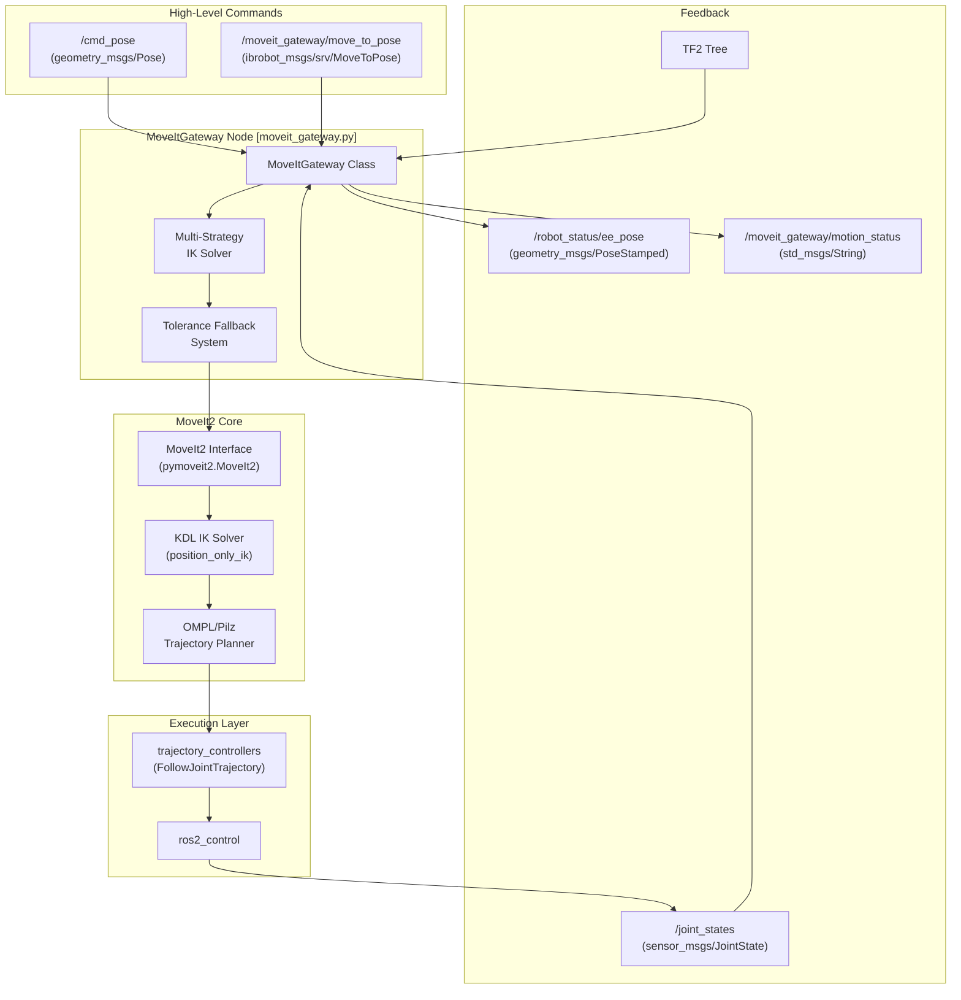
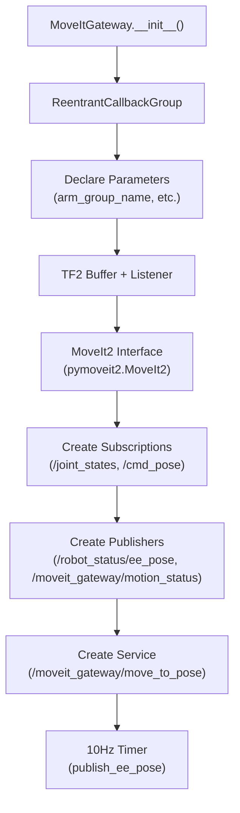
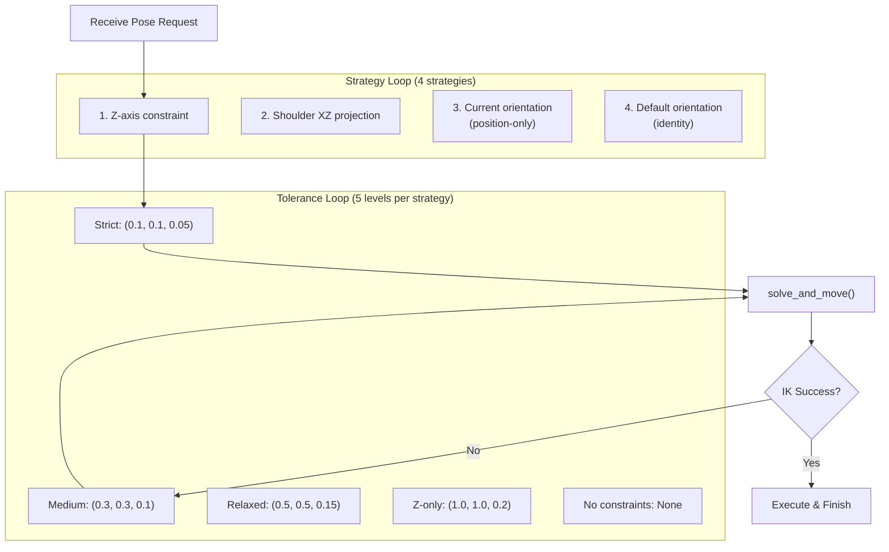

# MoveItGateway 节点

Relevant source files

The following files were used as context for generating this wiki page:

- [src/ibrobot_msgs/action/ExecuteTaskPlan.action](https://atomgit.com/openeuler/IB_Robot/blob/master/src/ibrobot_msgs/action/ExecuteTaskPlan.action)
- [src/ibrobot_msgs/msg/TaskStep.msg](https://atomgit.com/openeuler/IB_Robot/blob/master/src/ibrobot_msgs/msg/TaskStep.msg)
- [src/ibrobot_msgs/package.xml](https://atomgit.com/openeuler/IB_Robot/blob/master/src/ibrobot_msgs/package.xml)
- [src/ibrobot_msgs/srv/MoveToPose.srv](https://atomgit.com/openeuler/IB_Robot/blob/master/src/ibrobot_msgs/srv/MoveToPose.srv)
- [src/robot_config/robot_config/launch_builders/moveit.py](https://atomgit.com/openeuler/IB_Robot/blob/master/src/robot_config/robot_config/launch_builders/moveit.py)
- [src/robot_config/robot_config/launch_builders/task_execution.py](https://atomgit.com/openeuler/IB_Robot/blob/master/src/robot_config/robot_config/launch_builders/task_execution.py)
- [src/robot_moveit/config/lerobot/so101/kinematics.yaml](https://atomgit.com/openeuler/IB_Robot/blob/master/src/robot_moveit/config/lerobot/so101/kinematics.yaml)
- [src/robot_moveit/launch/so101_moveit.launch.py](https://atomgit.com/openeuler/IB_Robot/blob/master/src/robot_moveit/launch/so101_moveit.launch.py)
- [src/robot_moveit/package.xml](https://atomgit.com/openeuler/IB_Robot/blob/master/src/robot_moveit/package.xml)
- [src/robot_moveit/scripts/moveit_gateway.py](https://atomgit.com/openeuler/IB_Robot/blob/master/src/robot_moveit/scripts/moveit_gateway.py)
- [src/robot_teleop/package.xml](https://atomgit.com/openeuler/IB_Robot/blob/master/src/robot_teleop/package.xml)
- [src/task_dispatch/README.en.md](https://atomgit.com/openeuler/IB_Robot/blob/master/src/task_dispatch/README.en.md)
- [src/task_dispatch/README.md](https://atomgit.com/openeuler/IB_Robot/blob/master/src/task_dispatch/README.md)

## 目的与范围

`MoveItGateway` 节点是高层笛卡尔位姿命令与 MoveIt2 运动规划框架之间的接口层。它专门处理 5 自由度（5DOF）机械臂的运动学约束，通过姿态放宽技术实现多策略逆运动学（IK）求解。

该节点运行在 `moveit_planning` 控制模式下。它同时提供基于话题的异步接口，用于即发即忘命令，也提供基于服务的同步接口，用于任务编排。

**来源**: [src/robot_moveit/scripts/moveit_gateway.py:1-14](https://atomgit.com/openeuler/IB_Robot/blob/master/src/robot_moveit/scripts/moveit_gateway.py#L1-L14), [src/robot_moveit/scripts/moveit_gateway.py:43-45](https://atomgit.com/openeuler/IB_Robot/blob/master/src/robot_moveit/scripts/moveit_gateway.py#L43-L45)

---

## 系统集成

`MoveItGateway` 节点通过 MoveIt2 的 IK 求解器和轨迹规划器，把笛卡尔空间控制桥接到关节空间执行。

**架构位置**

**来源**: [src/robot_moveit/scripts/moveit_gateway.py:43-125](https://atomgit.com/openeuler/IB_Robot/blob/master/src/robot_moveit/scripts/moveit_gateway.py#L43-L125), [src/task_dispatch/README.md:26-46](https://atomgit.com/openeuler/IB_Robot/blob/master/src/task_dispatch/README.md#L26-L46)

---

## ROS2 接口

### 订阅话题

| 话题 | 类型 | 用途 | 回调 |
|-------|------|---------|----------|
| `/cmd_pose` | `geometry_msgs/Pose` | 目标末端位姿命令（异步） | `cmd_pose_callback` |
| `/joint_states` | `sensor_msgs/JointState` | 当前关节位置，用于 IK 种子 | `joint_state_callback` |

### 发布话题

| 话题 | 类型 | 频率 | 用途 |
|-------|------|-----------|---------|
| `/robot_status/ee_pose` | `geometry_msgs/PoseStamped` | 10 Hz | 当前末端在基坐标系下的位姿 |
| `/moveit_gateway/motion_status` | `std_msgs/String` | 事件驱动 | "idle", "executing", "succeeded", "failed" |

### 服务

| 服务 | 类型 | 用途 |
|---------|------|---------|
| `/moveit_gateway/move_to_pose` | `ibrobot_msgs/srv/MoveToPose` | `task_dispatch` 使用的同步 move-to-pose |

### 节点参数

| 参数 | 类型 | 必需 | 用途 |
|-----------|------|----------|---------|
| `arm_group_name` | string | 是 | MoveIt 规划组名称，例如 "arm" |
| `base_link` | string | 是 | 位姿命令的基坐标系 |
| `ee_link` | string | 是 | 末端执行器 link 名称 |
| `shoulder_link` | string | 是 | 用于工作空间计算的肩部 link |
| `joint_names` | string[] | 是 | 机械臂规划组的关节名称 |

**来源**: [src/robot_moveit/scripts/moveit_gateway.py:51-61](https://atomgit.com/openeuler/IB_Robot/blob/master/src/robot_moveit/scripts/moveit_gateway.py#L51-L61), [src/robot_moveit/scripts/moveit_gateway.py:87-123](https://atomgit.com/openeuler/IB_Robot/blob/master/src/robot_moveit/scripts/moveit_gateway.py#L87-L123), [src/ibrobot_msgs/srv/MoveToPose.srv:1-12](https://atomgit.com/openeuler/IB_Robot/blob/master/src/ibrobot_msgs/srv/MoveToPose.srv#L1-L12)

---

## 核心组件

### MoveItGateway 类

`MoveItGateway` 类（[src/robot_moveit/scripts/moveit_gateway.py:43-45](https://atomgit.com/openeuler/IB_Robot/blob/master/src/robot_moveit/scripts/moveit_gateway.py#L43-L45)）实现为 ROS2 节点，并通过 `ReentrantCallbackGroup`（[src/robot_moveit/scripts/moveit_gateway.py:48](https://atomgit.com/openeuler/IB_Robot/blob/master/src/robot_moveit/scripts/moveit_gateway.py#L48)）支持多线程回调处理。它封装 `pymoveit2` 接口，提供高层运动原语。

**类初始化序列**

**来源**: [src/robot_moveit/scripts/moveit_gateway.py:44-125](https://atomgit.com/openeuler/IB_Robot/blob/master/src/robot_moveit/scripts/moveit_gateway.py#L44-L125)

### 关键类成员

| 成员 | 类型 | 用途 |
|--------|------|---------|
| `callback_group` | `ReentrantCallbackGroup` | 线程安全的回调执行 |
| `moveit2` | `pymoveit2.MoveIt2` | 连接 MoveIt2 `move_group` action server 的接口 |
| `tf_buffer` | `tf2_ros.Buffer` | 坐标系 TF 变换查询 |
| `latest_joint_state` | `JointState` | 缓存关节状态，用于 IK 种子和验证 |
| `_motion_status` | `string` | 网关当前内部状态 |

**来源**: [src/robot_moveit/scripts/moveit_gateway.py:48-107](https://atomgit.com/openeuler/IB_Robot/blob/master/src/robot_moveit/scripts/moveit_gateway.py#L48-L107)

---

## 5DOF 运动学约束处理

### 问题描述

5DOF 机械臂（如 SO101）有 5 个关节角，但完整 6DOF 位姿需要 3 个位置参数和 3 个姿态参数。这会形成欠约束系统，大多数目标姿态在数学上不可达。`MoveItGateway` 通过放宽姿态约束来解决该问题。机械臂规划组的 `kinematics.yaml` 配置中还设置了 `position_only_ik: True`，使 MoveIt 的 KDL 求解器在求解 IK 时优先位置而非姿态 [src/robot_moveit/config/lerobot/so101/kinematics.yaml:6](https://atomgit.com/openeuler/IB_Robot/blob/master/src/robot_moveit/config/lerobot/so101/kinematics.yaml#L6)。

### 姿态处理策略

该节点实现两种数学策略，将目标姿态适配到 5DOF 约束：

#### 策略 1：Z 轴约束（`constrain_to_z_axis_only`）

保持 Z 轴方向（约束俯仰和偏航），同时释放绕 Z 轴的旋转（滚转）。它使用“最小旋转”原则，让末端执行器尽量接近原始位姿。

**实现**:
1. 从旋转矩阵提取 Z 轴：`z_axis = R[:, 2]` [src/robot_moveit/scripts/moveit_gateway.py:184](https://atomgit.com/openeuler/IB_Robot/blob/master/src/robot_moveit/scripts/moveit_gateway.py#L184)
2. 将原始 X 轴投影到垂直于 Z 的平面：`x_axis = orig_x_axis - np.dot(orig_x_axis, z_axis) * z_axis` [src/robot_moveit/scripts/moveit_gateway.py:194](https://atomgit.com/openeuler/IB_Robot/blob/master/src/robot_moveit/scripts/moveit_gateway.py#L194)
3. 通过叉乘重建 Y 轴：`y_axis = np.cross(z_axis, x_axis)` [src/robot_moveit/scripts/moveit_gateway.py:210](https://atomgit.com/openeuler/IB_Robot/blob/master/src/robot_moveit/scripts/moveit_gateway.py#L210)

**来源**: [src/robot_moveit/scripts/moveit_gateway.py:164-220](https://atomgit.com/openeuler/IB_Robot/blob/master/src/robot_moveit/scripts/moveit_gateway.py#L164-L220)

#### 策略 2：肩部 XZ 平面投影（`project_orientation_to_shoulder_xz_plane`）

将姿态投影到肩部坐标系的 XZ 平面，使其符合机械臂的自然运动约束，即末端执行器保持竖直或位于机械臂平面内。

**来源**: [src/robot_moveit/scripts/moveit_gateway.py:222-271](https://atomgit.com/openeuler/IB_Robot/blob/master/src/robot_moveit/scripts/moveit_gateway.py#L222-L271)

---

## 多策略回退系统

`cmd_pose_callback` [src/robot_moveit/scripts/moveit_gateway.py:97-103](https://atomgit.com/openeuler/IB_Robot/blob/master/src/robot_moveit/scripts/moveit_gateway.py#L97-L103) 和 `_move_to_pose_service_cb` [src/robot_moveit/scripts/moveit_gateway.py:110-116](https://atomgit.com/openeuler/IB_Robot/blob/master/src/robot_moveit/scripts/moveit_gateway.py#L110-L116) 实现级联回退系统。它遍历不同姿态策略和逐级放宽的容差，直到找到有效 IK 解。

### 回退层级

**来源**: [src/robot_moveit/scripts/moveit_gateway.py:316-430](https://atomgit.com/openeuler/IB_Robot/blob/master/src/robot_moveit/scripts/moveit_gateway.py#L316-L430), [src/robot_moveit/scripts/moveit_gateway.py:397-404](https://atomgit.com/openeuler/IB_Robot/blob/master/src/robot_moveit/scripts/moveit_gateway.py#L397-L404)

---

## 任务分发集成

`MoveItGateway` 为 `task_dispatch` 包提供关键的底层运动服务。

**数据流**:
1. 规划器（例如 VoxPoser）向 `task_executor_node` 发送 `ExecuteTaskPlan` action goal [src/task_dispatch/README.md:62](https://atomgit.com/openeuler/IB_Robot/blob/master/src/task_dispatch/README.md#L62)。
2. 对计划中的每个 `MOVE_TO_POSE` 步骤 [src/ibrobot_msgs/msg/TaskStep.msg:9](https://atomgit.com/openeuler/IB_Robot/blob/master/src/ibrobot_msgs/msg/TaskStep.msg#L9)，`task_executor_node` 调用 `/moveit_gateway/move_to_pose` 服务 [src/task_dispatch/README.md:68](https://atomgit.com/openeuler/IB_Robot/blob/master/src/task_dispatch/README.md#L68)。
3. `MoveItGateway` 执行多策略 IK 求解和轨迹执行。
4. `MoveItGateway` 向 `task_executor_node` 返回成功/失败结果，后者再继续下一步，例如 `GRIPPER`。

**来源**: [src/task_dispatch/README.md:26-46](https://atomgit.com/openeuler/IB_Robot/blob/master/src/task_dispatch/README.md#L26-L46), [src/ibrobot_msgs/msg/TaskStep.msg:1-27](https://atomgit.com/openeuler/IB_Robot/blob/master/src/ibrobot_msgs/msg/TaskStep.msg#L1-L27), [src/robot_config/robot_config/launch_builders/task_execution.py:1-9](https://atomgit.com/openeuler/IB_Robot/blob/master/src/robot_config/robot_config/launch_builders/task_execution.py#L1-L9)

---

## 数学工具

该节点使用 `scipy.spatial.transform.Rotation` 提供四元数和旋转矩阵工具。

| 函数 | 签名 | 实现 |
|----------|-----------|----------------|
| `quaternion_multiply` | `(q1, q2) -> q` | `R.from_quat(q1) * R.from_quat(q2)` |
| `quaternion_to_rotation_matrix` | `(q) -> np.ndarray` | `R.from_quat(q).as_matrix()` |
| `rotation_matrix_to_quaternion` | `(R_mat) -> tuple` | `R.from_matrix(R_mat).as_quat()` |

**来源**: [src/robot_moveit/scripts/moveit_gateway.py:127-162](https://atomgit.com/openeuler/IB_Robot/blob/master/src/robot_moveit/scripts/moveit_gateway.py#L127-L162)

