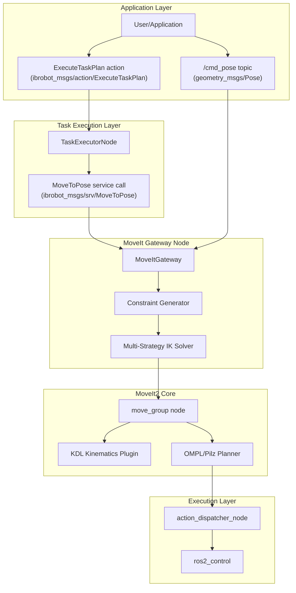
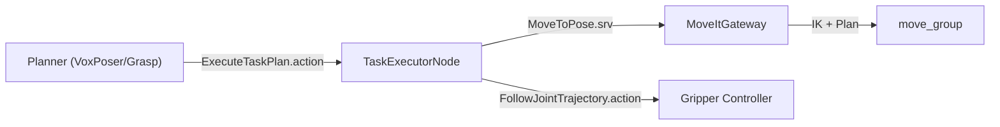

# 运动规划概述

Relevant source files

The following files were used as context for generating this wiki page:

- [src/model_utils/model_utils/__init__.py](https://atomgit.com/openeuler/IB_Robot/blob/master/src/model_utils/model_utils/__init__.py)
- [src/model_utils/model_utils/export_onnx_3403.py](https://atomgit.com/openeuler/IB_Robot/blob/master/src/model_utils/model_utils/export_onnx_3403.py)
- [src/model_utils/model_utils/export_onnx_atc.py](https://atomgit.com/openeuler/IB_Robot/blob/master/src/model_utils/model_utils/export_onnx_atc.py)
- [src/model_utils/model_utils/loss_compare.py](https://atomgit.com/openeuler/IB_Robot/blob/master/src/model_utils/model_utils/loss_compare.py)
- [src/model_utils/model_utils/pi05_dist_metrics.py](https://atomgit.com/openeuler/IB_Robot/blob/master/src/model_utils/model_utils/pi05_dist_metrics.py)
- [src/model_utils/package.xml](https://atomgit.com/openeuler/IB_Robot/blob/master/src/model_utils/package.xml)
- [src/model_utils/resource/model_utils](https://atomgit.com/openeuler/IB_Robot/blob/master/src/model_utils/resource/model_utils)
- [src/model_utils/setup.cfg](https://atomgit.com/openeuler/IB_Robot/blob/master/src/model_utils/setup.cfg)
- [src/model_utils/setup.py](https://atomgit.com/openeuler/IB_Robot/blob/master/src/model_utils/setup.py)
- [src/robot_config/robot_config/launch_builders/moveit.py](https://atomgit.com/openeuler/IB_Robot/blob/master/src/robot_config/robot_config/launch_builders/moveit.py)
- [src/robot_moveit/README.md](https://atomgit.com/openeuler/IB_Robot/blob/master/src/robot_moveit/README.md)
- [src/robot_moveit/config/lerobot/so101/kinematics.yaml](https://atomgit.com/openeuler/IB_Robot/blob/master/src/robot_moveit/config/lerobot/so101/kinematics.yaml)
- [src/robot_moveit/launch/so101_moveit.launch.py](https://atomgit.com/openeuler/IB_Robot/blob/master/src/robot_moveit/launch/so101_moveit.launch.py)
- [src/robot_moveit/scripts/moveit_gateway.py](https://atomgit.com/openeuler/IB_Robot/blob/master/src/robot_moveit/scripts/moveit_gateway.py)
- [src/robot_teleop/package.xml](https://atomgit.com/openeuler/IB_Robot/blob/master/src/robot_teleop/package.xml)

MoveIt2 集成为 IB-Robot 中的机械臂提供基于轨迹的运动规划和逆运动学（IK）求解。该系统支持高层位姿控制、避障以及带约束的运动规划。集成设计特别面向 SO101 机械臂的 5 自由度（5DOF）运动学约束，通过专用 IK 求解策略和高层任务执行框架完成控制。

关于使用模型推理进行端到端 AI 策略控制，见[动作分发](../action_dispatch/overview.md)。关于控制模式切换，见[控制模式架构](../core_concepts/control_mode_architecture.md)。

---

## 系统架构

MoveIt2 是 IB-Robot 的一种控制模式，它通过运动规划和 IK 求解，把高层笛卡尔位姿命令转换为关节轨迹。

### IB-Robot 中的 MoveIt 集成

**来源**: [src/robot_moveit/scripts/moveit_gateway.py:5-14](https://atomgit.com/openeuler/IB_Robot/blob/master/src/robot_moveit/scripts/moveit_gateway.py#L5-L14), [src/robot_moveit/README.md:154-225](https://atomgit.com/openeuler/IB_Robot/blob/master/src/robot_moveit/README.md#L154-L225), [src/robot_config/robot_config/launch_builders/moveit.py:32-37](https://atomgit.com/openeuler/IB_Robot/blob/master/src/robot_config/robot_config/launch_builders/moveit.py#L32-L37)

### 控制模式架构

MoveIt 规划模式通过 `robot_config` 启动系统中的 `control_mode` 参数启用。该模式专门启动 `move_group` 节点和相关控制器来执行轨迹。

**来源**: [src/robot_config/robot_config/launch_builders/moveit.py:32-37](https://atomgit.com/openeuler/IB_Robot/blob/master/src/robot_config/robot_config/launch_builders/moveit.py#L32-L37), [src/robot_moveit/README.md:9-16](https://atomgit.com/openeuler/IB_Robot/blob/master/src/robot_moveit/README.md#L9-L16)

---

## MoveItGateway 节点

`MoveItGateway` 节点为 MoveIt 2 提供简化接口，把复杂的规划组操作抽象成单个位姿命令接口。它使用 `ReentrantCallbackGroup` 处理并发的关节状态更新和运动服务调用 [src/robot_moveit/scripts/moveit_gateway.py:48-49](https://atomgit.com/openeuler/IB_Robot/blob/master/src/robot_moveit/scripts/moveit_gateway.py#L48-L49)。

详情见 [MoveItGateway 节点](./moveitgateway_node.md)。

### 节点接口摘要
| **接口** | **名称** | **类型** | **说明** |
|---------------|----------|----------|-----------------|
| **订阅** | `/cmd_pose` | `geometry_msgs/Pose` | 即发即忘的位姿命令 [src/robot_moveit/scripts/moveit_gateway.py:97-103](https://atomgit.com/openeuler/IB_Robot/blob/master/src/robot_moveit/scripts/moveit_gateway.py#L97-L103) |
| **服务** | `/moveit_gateway/move_to_pose` | `ibrobot_msgs/srv/MoveToPose` | 同步移动（阻塞直到完成）[src/robot_moveit/scripts/moveit_gateway.py:110-116](https://atomgit.com/openeuler/IB_Robot/blob/master/src/robot_moveit/scripts/moveit_gateway.py#L110-L116) |
| **发布** | `/robot_status/ee_pose` | `geometry_msgs/PoseStamped` | 当前末端位姿（10 Hz）[src/robot_moveit/scripts/moveit_gateway.py:95](https://atomgit.com/openeuler/IB_Robot/blob/master/src/robot_moveit/scripts/moveit_gateway.py#L95) |
| **发布** | `/moveit_gateway/motion_status` | `std_msgs/String` | "idle" \| "executing" \| "succeeded" \| "failed" [src/robot_moveit/scripts/moveit_gateway.py:106-107](https://atomgit.com/openeuler/IB_Robot/blob/master/src/robot_moveit/scripts/moveit_gateway.py#L106-L107) |

**来源**: [src/robot_moveit/scripts/moveit_gateway.py:43-125](https://atomgit.com/openeuler/IB_Robot/blob/master/src/robot_moveit/scripts/moveit_gateway.py#L43-L125), [src/robot_moveit/README.md:41-53](https://atomgit.com/openeuler/IB_Robot/blob/master/src/robot_moveit/README.md#L41-L53)

---

## 5DOF 运动学约束

SO101 机械臂有 5 个关节，是 5DOF 系统。这意味着它不能到达任意 6DOF 位姿（3D 位置 + 3D 姿态）。为解决这一点，系统使用 `position_only_ik` 配置和几何投影策略。

详情见 [5DOF 运动学约束](./5dof_kinematic_constraints.md)。

### IK 配置
运动学求解器在 `kinematics.yaml` 中配置为优先处理位置而非姿态，以避免求解失败。
[src/robot_moveit/config/lerobot/so101/kinematics.yaml:1-7](https://atomgit.com/openeuler/IB_Robot/blob/master/src/robot_moveit/config/lerobot/so101/kinematics.yaml#L1-L7)

### 姿态策略
`MoveItGateway` 实现了多种投影策略，为 5DOF 机械臂寻找最接近且可行的姿态：
- **Z 轴约束**: 保持 Z 轴方向，同时放宽滚转 [src/robot_moveit/scripts/moveit_gateway.py:164-213](https://atomgit.com/openeuler/IB_Robot/blob/master/src/robot_moveit/scripts/moveit_gateway.py#L164-L213)。
- **最小旋转原则**: 将原始 X 轴投影到垂直于目标 Z 轴的平面上，以保持位姿接近 [src/robot_moveit/scripts/moveit_gateway.py:191-208](https://atomgit.com/openeuler/IB_Robot/blob/master/src/robot_moveit/scripts/moveit_gateway.py#L191-L208)。
- **多策略回退**: 按分层容差逐步尝试 Z 轴约束、肩部 XZ 平面投影以及当前/默认姿态 [src/robot_moveit/README.md:106-127](https://atomgit.com/openeuler/IB_Robot/blob/master/src/robot_moveit/README.md#L106-L127)。

---

## MoveIt 启动配置

MoveIt 通过 `robot_config` 启动构建器集成到 IB-Robot 启动系统中，并根据 `control_mode` 条件启动。

详情见 [MoveIt 启动配置](./moveit_launch_configuration.md)。

### 启动逻辑
启动构建器中的 `generate_moveit_nodes` 函数会检查 `control_mode` 中是否包含字符串 `moveit` [src/robot_config/robot_config/launch_builders/moveit.py:34-37](https://atomgit.com/openeuler/IB_Robot/blob/master/src/robot_config/robot_config/launch_builders/moveit.py#L34-L37)。如果检测到，它会引入 `so101_moveit.launch.py`，并把参数从中心机器人配置映射过去 [src/robot_config/robot_config/launch_builders/moveit.py:52-71](https://atomgit.com/openeuler/IB_Robot/blob/master/src/robot_config/robot_config/launch_builders/moveit.py#L52-L71)。该启动文件会使用正确的 URDF 和 SRDF 资产初始化 `move_group` 节点和 `moveit_gateway` [src/robot_moveit/launch/so101_moveit.launch.py:58-70](https://atomgit.com/openeuler/IB_Robot/blob/master/src/robot_moveit/launch/so101_moveit.launch.py#L58-L70)。

**来源**: [src/robot_config/robot_config/launch_builders/moveit.py:18-80](https://atomgit.com/openeuler/IB_Robot/blob/master/src/robot_config/robot_config/launch_builders/moveit.py#L18-L80), [src/robot_moveit/launch/so101_moveit.launch.py:13-134](https://atomgit.com/openeuler/IB_Robot/blob/master/src/robot_moveit/launch/so101_moveit.launch.py#L13-L134)

---

## 任务分发 (task_dispatch)

`task_dispatch` 包为顺序操作提供高层执行框架，例如 "pick and place" 流程。它是任务层级的执行组件，对应关节层级的 `action_dispatch`。

详情见 [任务分发 (task_dispatch)](./task_dispatch.md)。

### 执行流程
规划器（如 VoxPoser 或视觉抓取规划器）生成任务步骤序列，由 `TaskExecutorNode` 处理。

**来源**: [src/robot_moveit/README.md:1-14](https://atomgit.com/openeuler/IB_Robot/blob/master/src/robot_moveit/README.md#L1-L14), [src/robot_moveit/scripts/moveit_gateway.py:109-117](https://atomgit.com/openeuler/IB_Robot/blob/master/src/robot_moveit/scripts/moveit_gateway.py#L109-L117), [src/robot_config/robot_config/launch_builders/moveit.py:32-37](https://atomgit.com/openeuler/IB_Robot/blob/master/src/robot_config/robot_config/launch_builders/moveit.py#L32-L37)

