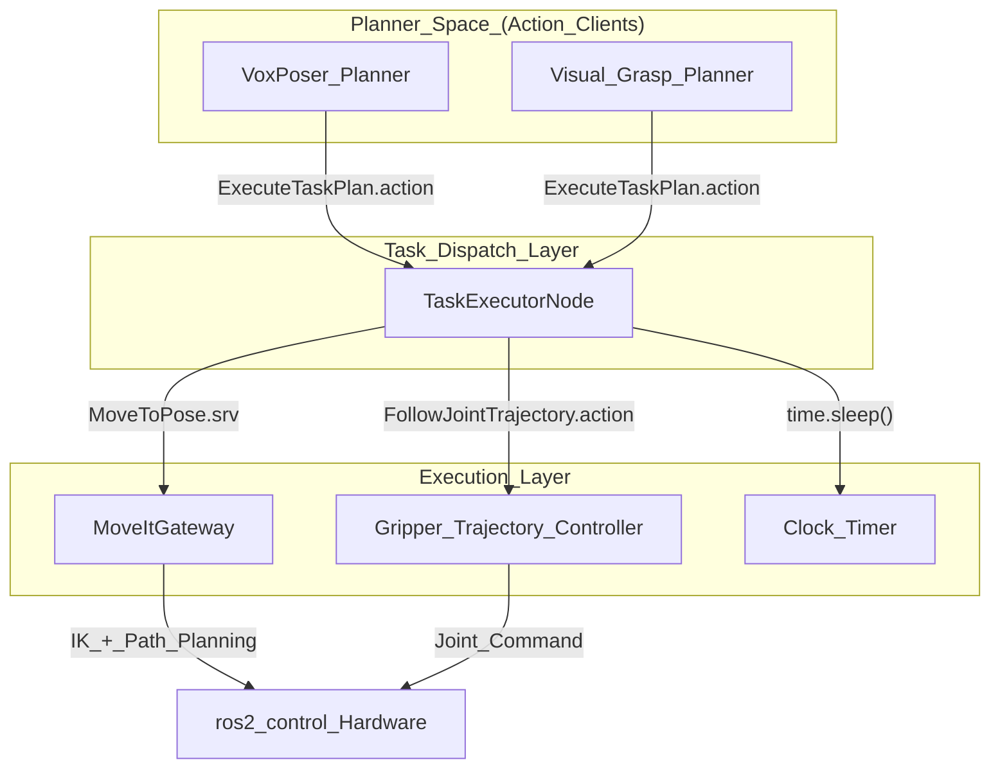
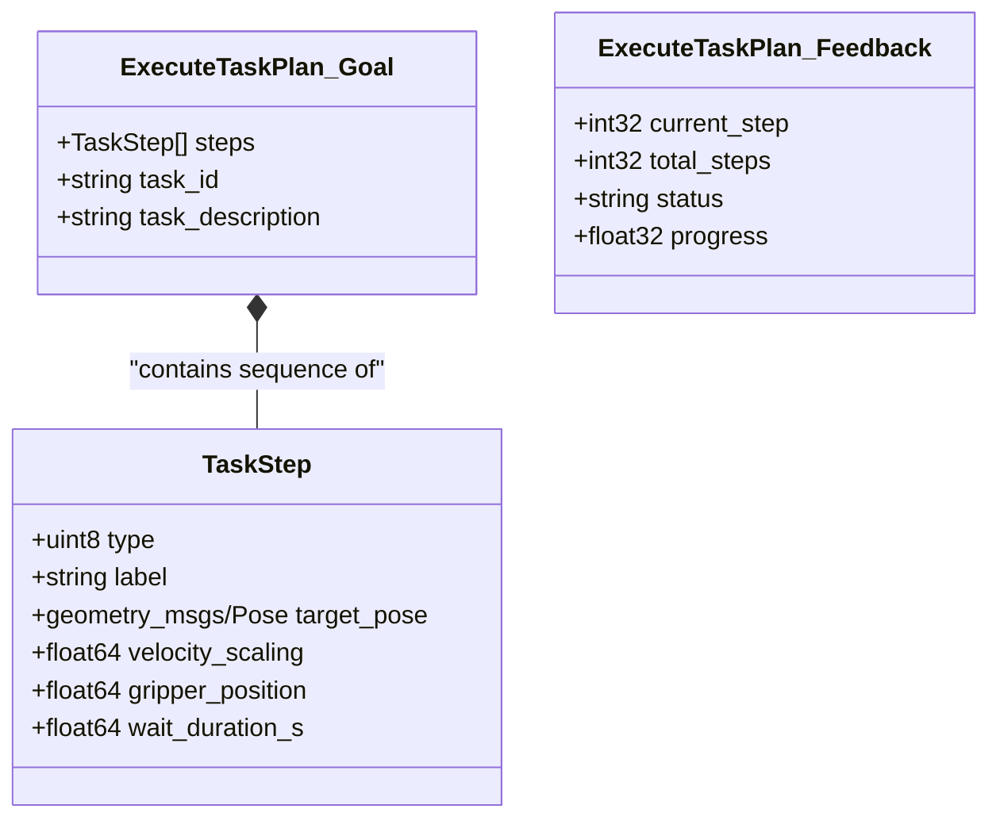
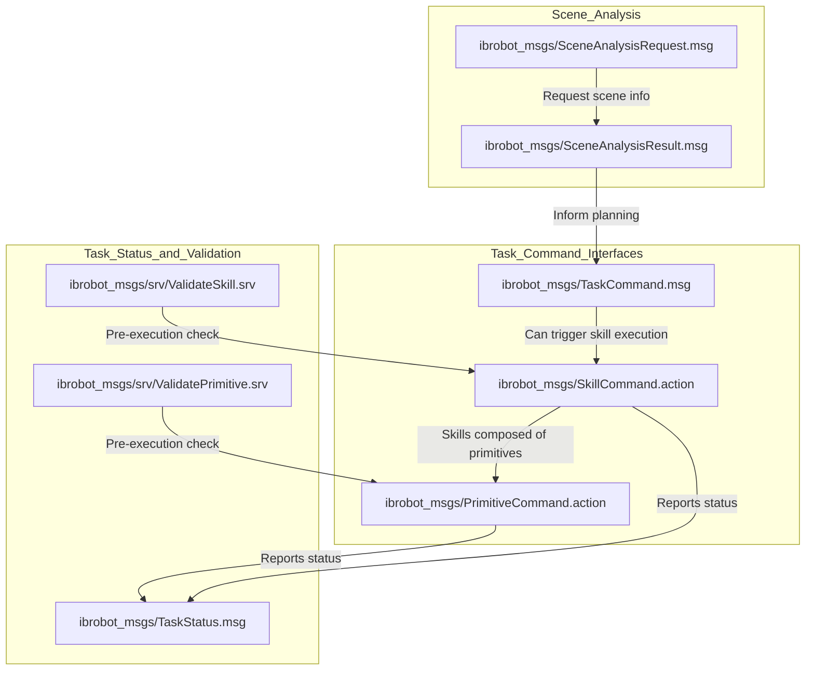

# 任务分发

Relevant source files

The following files were used as context for generating this wiki page:

- [src/ibrobot_msgs/action/ExecuteTaskPlan.action](https://atomgit.com/openeuler/IB_Robot/blob/master/src/ibrobot_msgs/action/ExecuteTaskPlan.action)
- [src/ibrobot_msgs/action/PrimitiveCommand.action](https://atomgit.com/openeuler/IB_Robot/blob/master/src/ibrobot_msgs/action/PrimitiveCommand.action)
- [src/ibrobot_msgs/action/SkillCommand.action](https://atomgit.com/openeuler/IB_Robot/blob/master/src/ibrobot_msgs/action/SkillCommand.action)
- [src/ibrobot_msgs/msg/SceneAnalysisRequest.msg](https://atomgit.com/openeuler/IB_Robot/blob/master/src/ibrobot_msgs/msg/SceneAnalysisRequest.msg)
- [src/ibrobot_msgs/msg/SceneAnalysisResult.msg](https://atomgit.com/openeuler/IB_Robot/blob/master/src/ibrobot_msgs/msg/SceneAnalysisResult.msg)
- [src/ibrobot_msgs/msg/TaskCommand.msg](https://atomgit.com/openeuler/IB_Robot/blob/master/src/ibrobot_msgs/msg/TaskCommand.msg)
- [src/ibrobot_msgs/msg/TaskStatus.msg](https://atomgit.com/openeuler/IB_Robot/blob/master/src/ibrobot_msgs/msg/TaskStatus.msg)
- [src/ibrobot_msgs/msg/TaskStep.msg](https://atomgit.com/openeuler/IB_Robot/blob/master/src/ibrobot_msgs/msg/TaskStep.msg)
- [src/ibrobot_msgs/package.xml](https://atomgit.com/openeuler/IB_Robot/blob/master/src/ibrobot_msgs/package.xml)
- [src/ibrobot_msgs/srv/MoveToPose.srv](https://atomgit.com/openeuler/IB_Robot/blob/master/src/ibrobot_msgs/srv/MoveToPose.srv)
- [src/ibrobot_msgs/srv/ValidatePrimitive.srv](https://atomgit.com/openeuler/IB_Robot/blob/master/src/ibrobot_msgs/srv/ValidatePrimitive.srv)
- [src/ibrobot_msgs/srv/ValidateSkill.srv](https://atomgit.com/openeuler/IB_Robot/blob/master/src/ibrobot_msgs/srv/ValidateSkill.srv)
- [src/robot_config/robot_config/launch_builders/task_execution.py](https://atomgit.com/openeuler/IB_Robot/blob/master/src/robot_config/robot_config/launch_builders/task_execution.py)
- [src/robot_moveit/package.xml](https://atomgit.com/openeuler/IB_Robot/blob/master/src/robot_moveit/package.xml)
- [src/task_dispatch/README.en.md](https://atomgit.com/openeuler/IB_Robot/blob/master/src/task_dispatch/README.en.md)
- [src/task_dispatch/README.md](https://atomgit.com/openeuler/IB_Robot/blob/master/src/task_dispatch/README.md)
- [src/task_dispatch/task_dispatch/task_executor_node.py](https://atomgit.com/openeuler/IB_Robot/blob/master/src/task_dispatch/task_dispatch/task_executor_node.py)

`task_dispatch` 是 IB-Robot 的任务级执行框架。它对应 `action_dispatch` 的高层侧，面向复杂操作任务提供顺序化、事件驱动的架构。`action_dispatch` 负责模仿学习策略（ACT/VLA）的高频（100Hz）关节流，而 `task_dispatch` 编排 “move to pose”、“open gripper”、“wait” 等离散步骤，是 **VoxPoser** 和 **visual_grasp** 等运动规划器的主要接口 [src/task_dispatch/README.md:5-11](https://atomgit.com/openeuler/IB_Robot/blob/master/src/task_dispatch/README.md#L5-L11)。

## 架构概览

该框架位于高层规划器和运动执行层之间。它把一组 `TaskStep` 消息转换为具体硬件命令，并委托 `moveit_gateway` 和 `ros2_control` 控制器执行 [src/task_dispatch/task_dispatch/task_executor_node.py:4-12](https://atomgit.com/openeuler/IB_Robot/blob/master/src/task_dispatch/task_dispatch/task_executor_node.py#L4-L12)。

### 任务执行流程
下图展示任务计划如何从规划器进入 `TaskExecutorNode`，再到达硬件。

**Task Dispatch Execution Pipeline**

来源: [src/task_dispatch/README.md:24-46](https://atomgit.com/openeuler/IB_Robot/blob/master/src/task_dispatch/README.md#L24-L46), [src/task_dispatch/task_dispatch/task_executor_node.py:14-23](https://atomgit.com/openeuler/IB_Robot/blob/master/src/task_dispatch/task_dispatch/task_executor_node.py#L14-L23)

## 关键组件

### TaskExecutorNode
`TaskExecutorNode` 实现 `ExecuteTaskPlan` action server [src/task_dispatch/task_dispatch/task_executor_node.py:110-118](https://atomgit.com/openeuler/IB_Robot/blob/master/src/task_dispatch/task_dispatch/task_executor_node.py#L110-L118)。它解析步骤列表并按顺序执行，同时向调用方提供实时反馈 [src/task_dispatch/task_dispatch/task_executor_node.py:58-62](https://atomgit.com/openeuler/IB_Robot/blob/master/src/task_dispatch/task_dispatch/task_executor_node.py#L58-L62)。

*   **初始化**: 从 `robot_config` 加载机器人配置，解析具体夹爪关节名和控制器 action 话题 [src/task_dispatch/task_dispatch/task_executor_node.py:67-81](https://atomgit.com/openeuler/IB_Robot/blob/master/src/task_dispatch/task_dispatch/task_executor_node.py#L67-L81)。
*   **并发**: 对 service/action client 使用 `ReentrantCallbackGroup`，对主 action server 使用 `MutuallyExclusiveCallbackGroup`，在保持目标串行化的同时避免阻塞执行 [src/task_dispatch/task_dispatch/task_executor_node.py:64-65](https://atomgit.com/openeuler/IB_Robot/blob/master/src/task_dispatch/task_dispatch/task_executor_node.py#L64-L65)。
*   **夹爪解析**: 通过检查 `robot_config` YAML 中包含 "gripper" 和 "trajectory" 的控制器，动态确定夹爪关节和 action 话题 [src/task_dispatch/task_dispatch/task_executor_node.py:132-155](https://atomgit.com/openeuler/IB_Robot/blob/master/src/task_dispatch/task_dispatch/task_executor_node.py#L132-L155)。

### MoveItGateway 集成
对于机械臂运动，执行器依赖 `moveit_gateway` 节点。该集成通过 `/moveit_gateway/move_to_pose` 服务完成 [src/ibrobot_msgs/srv/MoveToPose.srv:1-4](https://atomgit.com/openeuler/IB_Robot/blob/master/src/ibrobot_msgs/srv/MoveToPose.srv#L1-L4)。

*   **同步执行**: 执行器会阻塞等待服务调用，直到机械臂到达目标或失败，从而确保步骤按顺序完成 [src/ibrobot_msgs/srv/MoveToPose.srv:1-4](https://atomgit.com/openeuler/IB_Robot/blob/master/src/ibrobot_msgs/srv/MoveToPose.srv#L1-L4)。
*   **运动学处理**: gateway 管理 5DOF 约束（例如 SO101 机械臂），通过 `constrain_to_z_axis_only` 方法放宽 roll 约束并保持 Z 轴姿态 [src/robot_moveit/package.xml:23-26](https://atomgit.com/openeuler/IB_Robot/blob/master/src/robot_moveit/package.xml#L23-L26)（引用 `robot_moveit` 包，所给文件中未包含具体方法）。

来源: [src/task_dispatch/task_dispatch/task_executor_node.py:84-88](https://atomgit.com/openeuler/IB_Robot/blob/master/src/task_dispatch/task_dispatch/task_executor_node.py#L84-L88), [src/ibrobot_msgs/srv/MoveToPose.srv:1-4](https://atomgit.com/openeuler/IB_Robot/blob/master/src/ibrobot_msgs/srv/MoveToPose.srv#L1-L4)

## 数据接口

### TaskStep 定义
`TaskStep.msg` 是基本工作单元。它与硬件无关，支持三类主要操作 [src/ibrobot_msgs/msg/TaskStep.msg:1-6](https://atomgit.com/openeuler/IB_Robot/blob/master/src/ibrobot_msgs/msg/TaskStep.msg#L1-L6)。

| 步骤类型 | 常量 | 说明 | 实现 |
| :--- | :--- | :--- | :--- |
| `MOVE_TO_POSE` | `0` | 笛卡尔移动 | 调用 `MoveToPose.srv` [src/task_dispatch/README.md:52](https://atomgit.com/openeuler/IB_Robot/blob/master/src/task_dispatch/README.md#L52) |
| `GRIPPER` | `1` | 夹爪开合 | 发送 `FollowJointTrajectory.action` [src/task_dispatch/README.md:53](https://atomgit.com/openeuler/IB_Robot/blob/master/src/task_dispatch/README.md#L53) |
| `WAIT` | `2` | 时间暂停 | 可取消的 `time.sleep()` [src/task_dispatch/README.md:54](https://atomgit.com/openeuler/IB_Robot/blob/master/src/task_dispatch/README.md#L54)

### Action 接口：ExecuteTaskPlan
规划器通过 `ExecuteTaskPlan.action` 与系统交互 [src/ibrobot_msgs/action/ExecuteTaskPlan.action:1-4](https://atomgit.com/openeuler/IB_Robot/blob/master/src/ibrobot_msgs/action/ExecuteTaskPlan.action#L1-L4)。

**Entity Mapping: Natural Language to Code**

来源: [src/ibrobot_msgs/action/ExecuteTaskPlan.action:6-23](https://atomgit.com/openeuler/IB_Robot/blob/master/src/ibrobot_msgs/action/ExecuteTaskPlan.action#L6-L23), [src/ibrobot_msgs/msg/TaskStep.msg:8-26](https://atomgit.com/openeuler/IB_Robot/blob/master/src/ibrobot_msgs/msg/TaskStep.msg#L8-L26)

### 其他相关消息和服务
`ibrobot_msgs` 包还定义了多个与任务级操作相关的消息和服务，常由更高层 AI agent 或规划模块使用，并可能最终进入 `ExecuteTaskPlan`。

**Task-Level Communication Interfaces**

来源:
[src/ibrobot_msgs/msg/TaskCommand.msg:1-12](https://atomgit.com/openeuler/IB_Robot/blob/master/src/ibrobot_msgs/msg/TaskCommand.msg#L1-L12),
[src/ibrobot_msgs/action/SkillCommand.action:1-16](https://atomgit.com/openeuler/IB_Robot/blob/master/src/ibrobot_msgs/action/SkillCommand.action#L1-L16),
[src/ibrobot_msgs/action/PrimitiveCommand.action:1-17](https://atomgit.com/openeuler/IB_Robot/blob/master/src/ibrobot_msgs/action/PrimitiveCommand.action#L1-L17),
[src/ibrobot_msgs/msg/TaskStatus.msg:1-10](https://atomgit.com/openeuler/IB_Robot/blob/master/src/ibrobot_msgs/msg/TaskStatus.msg#L1-L10),
[src/ibrobot_msgs/srv/ValidateSkill.srv:1-7](https://atomgit.com/openeuler/IB_Robot/blob/master/src/ibrobot_msgs/srv/ValidateSkill.srv#L1-L7),
[src/ibrobot_msgs/srv/ValidatePrimitive.srv:1-13](https://atomgit.com/openeuler/IB_Robot/blob/master/src/ibrobot_msgs/srv/ValidatePrimitive.srv#L1-L13),
[src/ibrobot_msgs/msg/SceneAnalysisRequest.msg:1-7](https://atomgit.com/openeuler/IB_Robot/blob/master/src/ibrobot_msgs/msg/SceneAnalysisRequest.msg#L1-L7),
[src/ibrobot_msgs/msg/SceneAnalysisResult.msg:1-14](https://atomgit.com/openeuler/IB_Robot/blob/master/src/ibrobot_msgs/msg/SceneAnalysisResult.msg#L1-L14)

## 配置与启动

`task_executor_node` 会根据 `robot_config` 中指定的 `control_mode` 动态启动 [src/robot_config/robot_config/launch_builders/task_execution.py:3-9](https://atomgit.com/openeuler/IB_Robot/blob/master/src/robot_config/robot_config/launch_builders/task_execution.py#L3-L9)。

### 自动检测
启动构建器中的 `generate_task_executor_node` 函数会检查 `control_mode` 中的特定关键词。如果模式名包含 "moveit"、"visual_grasp" 或 "voxposer"，该节点会自动加入启动图 [src/robot_config/robot_config/launch_builders/task_execution.py:36-42](https://atomgit.com/openeuler/IB_Robot/blob/master/src/robot_config/robot_config/launch_builders/task_execution.py#L36-L42)。

### 参数
节点需要 `robot_config_path` 来解析关节映射和控制器名称 [src/task_dispatch/task_dispatch/task_executor_node.py:68-73](https://atomgit.com/openeuler/IB_Robot/blob/master/src/task_dispatch/task_dispatch/task_executor_node.py#L68-L73)：
*   `robot_config_path`: 指向 YAML 文件的绝对路径，该文件定义机器人的物理结构和控制器 [src/task_dispatch/task_dispatch/task_executor_node.py:25](https://atomgit.com/openeuler/IB_Robot/blob/master/src/task_dispatch/task_dispatch/task_executor_node.py#L25)。
*   `use_sim_time`: 从全局启动配置继承，用于仿真同步 [src/robot_config/robot_config/launch_builders/task_execution.py:62](https://atomgit.com/openeuler/IB_Robot/blob/master/src/robot_config/robot_config/launch_builders/task_execution.py#L62)。

来源: [src/robot_config/robot_config/launch_builders/task_execution.py:55-66](https://atomgit.com/openeuler/IB_Robot/blob/master/src/robot_config/robot_config/launch_builders/task_execution.py#L55-L66), [src/robot_moveit/package.xml:23-26](https://atomgit.com/openeuler/IB_Robot/blob/master/src/robot_moveit/package.xml#L23-L26)

