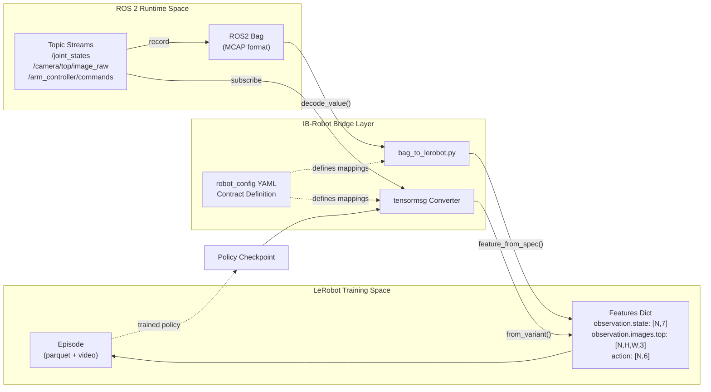
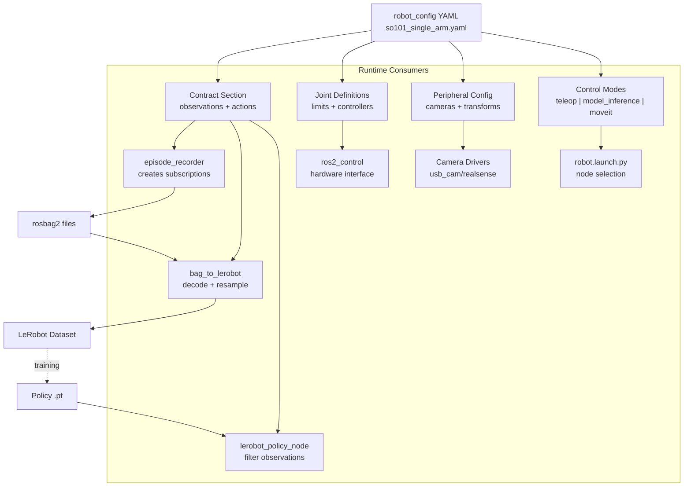
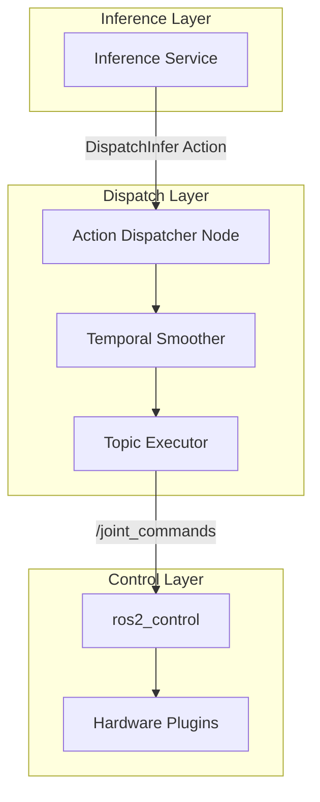

# IB-Robot 概述

<details>
<summary>相关源文件</summary>

以下文件被用作生成本 wiki 页面时的上下文：

- [README.en.md](https://atomgit.com/openeuler/IB_Robot/blob/master/README.en.md)
- [README.md](https://atomgit.com/openeuler/IB_Robot/blob/master/README.md)
- [docs/architecture.md](https://atomgit.com/openeuler/IB_Robot/blob/master/docs/architecture.md)
- [docs/ib_robot_social_skill.md](https://atomgit.com/openeuler/IB_Robot/blob/master/docs/ib_robot_social_skill.md)
- [docs/pictures/architecture.png](https://atomgit.com/openeuler/IB_Robot/blob/master/docs/pictures/architecture.png)
- [docs/pictures/openclaw_real.gif](https://atomgit.com/openeuler/IB_Robot/blob/master/docs/pictures/openclaw_real.gif)
- [docs/pictures/openclaw_sim.gif](https://atomgit.com/openeuler/IB_Robot/blob/master/docs/pictures/openclaw_sim.gif)
- [docs/roadmap.md](https://atomgit.com/openeuler/IB_Robot/blob/master/docs/roadmap.md)
- [docs/videos/openclaw_real.mp4](https://atomgit.com/openeuler/IB_Robot/blob/master/docs/videos/openclaw_real.mp4)
- [docs/videos/openclaw_sim.mp4](https://atomgit.com/openeuler/IB_Robot/blob/master/docs/videos/openclaw_sim.mp4)
- [scripts/start_rosclaw.sh](https://atomgit.com/openeuler/IB_Robot/blob/master/scripts/start_rosclaw.sh)
- [src/README.md](https://atomgit.com/openeuler/IB_Robot/blob/master/src/README.md)
- [src/action_dispatch/README.en.md](https://atomgit.com/openeuler/IB_Robot/blob/master/src/action_dispatch/README.en.md)
- [src/so101_hardware/README.en.md](https://atomgit.com/openeuler/IB_Robot/blob/master/src/so101_hardware/README.en.md)
- [src/so101_hardware/README.md](https://atomgit.com/openeuler/IB_Robot/blob/master/src/so101_hardware/README.md)

</details>


## 目的与范围

本页从高层介绍 IB-Robot 的系统架构、设计原则和核心组件。它说明 IB-Robot 如何连接 Hugging Face LeRobot 机器学习生态与 ROS 2 机器人中间件，从而支持端到端具身智能工作流。

IB-Robot 旨在弥合离散步 ML 模型与连续时间机器人控制之间的差距，为数据采集、训练以及跨 Ubuntu、openEuler Embedded、OpenHarmony 等平台的分布式部署提供统一工具链。[README.md:1-39](https://atomgit.com/openeuler/IB_Robot/blob/master/README.md#L1-L39), [docs/architecture.md:1-45](https://atomgit.com/openeuler/IB_Robot/blob/master/docs/architecture.md#L1-L45), [README.en.md:1-39](https://atomgit.com/openeuler/IB_Robot/blob/master/README.en.md#L1-L39)

---

## 什么是 IB-Robot？

IB-Robot (Intelligence Boom Robot) 是一个集成式开发框架，连接两个不同生态：

- **LeRobot**：Hugging Face 的机器人学习框架，用于训练 AI 策略，包括 ACT、Diffusion Policy，以及 SmolVLA、Pi0.5 等 VLA 模型。[README.md:75-75](https://atomgit.com/openeuler/IB_Robot/blob/master/README.md#L75-L75), [docs/architecture.md:22-22](https://atomgit.com/openeuler/IB_Robot/blob/master/docs/architecture.md#L22-L22)
- **ROS 2 Humble**：工业标准机器人中间件，用于硬件控制、感知和运动规划。[README.md:112-114](https://atomgit.com/openeuler/IB_Robot/blob/master/README.md#L112-L114), [docs/architecture.md:24-24](https://atomgit.com/openeuler/IB_Robot/blob/master/docs/architecture.md#L24-L24)

系统提供从专家示范采集、策略训练到真实世界部署的完整工具链，消除了 ML 实验与机器人生产系统之间常见的断层。[README.md:19-29](https://atomgit.com/openeuler/IB_Robot/blob/master/README.md#L19-L29), [docs/architecture.md:26-30](https://atomgit.com/openeuler/IB_Robot/blob/master/docs/architecture.md#L26-L30)

**关键仓库结构**：

```text
IB_Robot/
├── libs/
│   ├── lerobot/          # [Submodule] LeRobot training framework
│   └── atomgit_sdk/      # AtomGit API SDK for collaboration
├── src/
│   ├── robot_config/      # Configuration center (Single Source of Truth)
│   ├── tensormsg/         # ROS↔Tensor protocol converter
│   ├── inference_service/ # Policy inference nodes (Monolithic/Distributed)
│   ├── action_dispatch/   # Action execution and Temporal Smoothing
│   ├── dataset_tools/     # Episode recording and Bag-to-LeRobot conversion
│   ├── robot_teleop/      # Teleoperation (VR/Xbox/Leader Arm)
│   ├── robot_moveit/      # MoveIt 2 integration
│   ├── so101_hardware/    # SO-101 motor driver interface
│   └── rosclaw/           # OpenClaw social control integration
├── scripts/setup.sh       # Environment initialization and hardware detection
└── scripts/build.sh       # Build system with colcon mixin support
```

**来源**：[README.md:64-102](https://atomgit.com/openeuler/IB_Robot/blob/master/README.md#L64-L102), [README.en.md:66-105](https://atomgit.com/openeuler/IB_Robot/blob/master/README.en.md#L66-L105), [src/README.md:1-103](https://atomgit.com/openeuler/IB_Robot/blob/master/src/README.md#L1-L103)

---

## 集成挑战

IB-Robot 解决机器学习与机器人控制范式之间的基础不兼容问题：

### 概念差异

| 维度 | LeRobot (ML World) | ROS 2 (Control World) | IB-Robot 方案 |
|-----------|--------------------|-----------------------|-------------------|
| **数据单元** | Episode (回合) | Topic stream (话题流) | 契约驱动转换 |
| **时间模型** | 离散步骤 | 连续实时 | 自动对齐与插值 |
| **控制** | 端到端策略 | 分层规划 | 双模式架构 (ACT vs MoveIt) |
| **部署** | Python scripts | Distributed nodes | 端边云协同部署 |

**来源**：[README.md:21-29](https://atomgit.com/openeuler/IB_Robot/blob/master/README.md#L21-L29), [docs/architecture.md:53-77](https://atomgit.com/openeuler/IB_Robot/blob/master/docs/architecture.md#L53-L77), [README.en.md:21-27](https://atomgit.com/openeuler/IB_Robot/blob/master/README.en.md#L21-L27)

### 数据格式桥接

**数据流：自然语言空间到代码实体空间**


`tensormsg` 包通过基于注册表的解码器系统实现双向转换。`robot_config` Contract 是所有映射规格的单一事实源。[src/README.md:68-72](https://atomgit.com/openeuler/IB_Robot/blob/master/src/README.md#L68-L72), [docs/architecture.md:203-208](https://atomgit.com/openeuler/IB_Robot/blob/master/docs/architecture.md#L203-L208)

**来源**：[README.md:51-53](https://atomgit.com/openeuler/IB_Robot/blob/master/README.md#L51-L53), [src/README.md:9-14](https://atomgit.com/openeuler/IB_Robot/blob/master/src/README.md#L9-L14), [docs/architecture.md:203-208](https://atomgit.com/openeuler/IB_Robot/blob/master/docs/architecture.md#L203-L208)

---

## 架构原则

### 1. 单一事实源模式

所有系统配置都来自 `robot_config` YAML 文件。这避免了数据采集、训练和部署之间的配置漂移。它在一处定义关节、控制器模式和传感器参数。[src/README.md:9-14](https://atomgit.com/openeuler/IB_Robot/blob/master/src/README.md#L9-L14)

**系统实体映射：配置到运行时**


**来源**：[src/README.md:9-14](https://atomgit.com/openeuler/IB_Robot/blob/master/src/README.md#L9-L14), [README.md:57-59](https://atomgit.com/openeuler/IB_Robot/blob/master/README.md#L57-L59), [docs/architecture.md:182-182](https://atomgit.com/openeuler/IB_Robot/blob/master/docs/architecture.md#L182-L182)

### 2. 契约驱动设计

`robot_config` 中定义的 `Contract` 严格映射 ROS topics 与 tensor keys。这保证整个流水线中的类型安全和一致性：

- **Observations**：将 topics，例如 `/camera/top`，映射到 tensor keys，例如 `observation.images.top`，并带有 resize 等具体处理。[src/README.md:50-54](https://atomgit.com/openeuler/IB_Robot/blob/master/src/README.md#L50-L54)
- **Actions**：将模型输出 tensors 映射到机器人控制命令。
- **Peripherals**：在 contract 中通过名称引用 cameras 和 sensors。

该 contract 被 `episode_recorder` 用于数据采集，被 `bag_to_lerobot` 用于数据集转换，被 `lerobot_policy_node` 用于实时推理。[src/README.md:52-54](https://atomgit.com/openeuler/IB_Robot/blob/master/src/README.md#L52-L54), [docs/architecture.md:205-208](https://atomgit.com/openeuler/IB_Robot/blob/master/docs/architecture.md#L205-L208)

**来源**：[src/README.md:9-14](https://atomgit.com/openeuler/IB_Robot/blob/master/src/README.md#L9-L14), [docs/architecture.md:203-208](https://atomgit.com/openeuler/IB_Robot/blob/master/docs/architecture.md#L203-L208)

### 3. 双模式控制架构

IB-Robot 支持三种主要控制模式，它们最终汇聚到同一硬件接口：

1.  **`teleop` 模式**：Human-in-the-loop 控制，使用 leader arms 或 Xbox controllers 等设备。具备零延迟透传特性。[README.md:50-50](https://atomgit.com/openeuler/IB_Robot/blob/master/README.md#L50-L50), [docs/architecture.md:238-238](https://atomgit.com/openeuler/IB_Robot/blob/master/docs/architecture.md#L238-L238)
2.  **`model_inference` 模式**：用于 ACT 或 Diffusion Policy 等模型的高频端到端控制。使用 `action_dispatch` 进行 **Action Chunking** 和插值。[src/README.md:62-67](https://atomgit.com/openeuler/IB_Robot/blob/master/src/README.md#L62-L67), [docs/architecture.md:212-212](https://atomgit.com/openeuler/IB_Robot/blob/master/docs/architecture.md#L212-L212)
3.  **`moveit_planning` 模式**：面向重规划任务的轨迹控制。支持避障和 IK 求解。[src/README.md:73-76](https://atomgit.com/openeuler/IB_Robot/blob/master/src/README.md#L73-L76), [docs/architecture.md:213-213](https://atomgit.com/openeuler/IB_Robot/blob/master/docs/architecture.md#L213-L213)

**来源**：[src/README.md:62-76](https://atomgit.com/openeuler/IB_Robot/blob/master/src/README.md#L62-L76), [README.md:55-59](https://atomgit.com/openeuler/IB_Robot/blob/master/README.md#L55-L59), [docs/architecture.md:209-215](https://atomgit.com/openeuler/IB_Robot/blob/master/docs/architecture.md#L209-L215)

---

## 系统架构与数据流

### 核心组件架构

推理流水线遵循 “Composition over Inheritance” 模式，将 ROS 依赖与核心逻辑解耦：

- **`TensorPreprocessor`**：将原始 ROS 数据转换为 PyTorch Tensors。[src/action_dispatch/README.en.md:7-7](https://atomgit.com/openeuler/IB_Robot/blob/master/src/action_dispatch/README.en.md#L7-L7)
- **`PureInferenceEngine`**：无状态 GPU/NPU 执行引擎。
- **`TensorPostprocessor`**：将 action tensors 反归一化为物理命令。

### 动作分发与平滑

`action_dispatch` 包相当于机器人的“小脑”，负责从高层 tensors 到平滑关节运动的转换。[src/README.md:62-67](https://atomgit.com/openeuler/IB_Robot/blob/master/src/README.md#L62-L67)

- **Action Chunking**：管理预测动作长序列，确保推理步骤之间平滑过渡。[src/action_dispatch/README.en.md:7-8](https://atomgit.com/openeuler/IB_Robot/blob/master/src/action_dispatch/README.en.md#L7-L8)
- **Temporal Smoothing**：实现跨帧混合与指数加权算法，以消除抖动。[src/action_dispatch/README.en.md:7-8](https://atomgit.com/openeuler/IB_Robot/blob/master/src/action_dispatch/README.en.md#L7-L8)

**通信架构：Action Dispatch**


**来源**：[src/action_dispatch/README.en.md:1-79](https://atomgit.com/openeuler/IB_Robot/blob/master/src/action_dispatch/README.en.md#L1-L79), [src/README.md:62-67](https://atomgit.com/openeuler/IB_Robot/blob/master/src/README.md#L62-L67)

---

## 协作与 AI Agent 集成

IB-Robot 内置 **AI Agent Skills** 来帮助开发者。这些 skills 可帮助 AI agents 理解项目架构、管理环境设置，并自动化 AtomGit 工作流。[README.md:69-72](https://atomgit.com/openeuler/IB_Robot/blob/master/README.md#L69-L72)

系统还支持 **OpenClaw Social Control**，允许用户通过飞书、QQ、Discord 等平台用自然语言与机器人交互。[README.md:5-11](https://atomgit.com/openeuler/IB_Robot/blob/master/README.md#L5-L11), [scripts/start_rosclaw.sh:1-41](https://atomgit.com/openeuler/IB_Robot/blob/master/scripts/start_rosclaw.sh#L1-L41)

**来源**：[README.md:5-11](https://atomgit.com/openeuler/IB_Robot/blob/master/README.md#L5-L11), [scripts/start_rosclaw.sh:1-41](https://atomgit.com/openeuler/IB_Robot/blob/master/scripts/start_rosclaw.sh#L1-L41)

---

## 下一步

- **环境配置**：运行 `./scripts/setup.sh` 初始化虚拟环境并安装 ML/ROS 依赖。[README.md:123-134](https://atomgit.com/openeuler/IB_Robot/blob/master/README.md#L123-L134)
- **构建**：使用 `./scripts/build.sh` 编译工作空间。[README.md:165-173](https://atomgit.com/openeuler/IB_Robot/blob/master/README.md#L165-L173)
- **运行**：使用 `robot.launch.py` 并指定所需的 `robot_config` 和 `control_mode`。[src/README.md:50-54](https://atomgit.com/openeuler/IB_Robot/blob/master/src/README.md#L50-L54)

**来源**：[README.md:112-173](https://atomgit.com/openeuler/IB_Robot/blob/master/README.md#L112-L173), [docs/architecture.md:290-298](https://atomgit.com/openeuler/IB_Robot/blob/master/docs/architecture.md#L290-L298)

