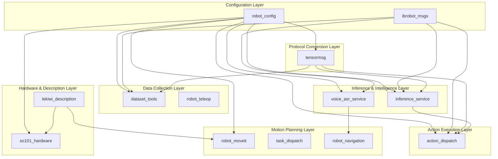
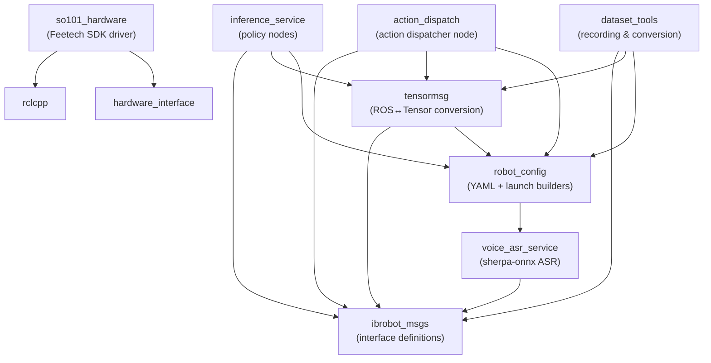
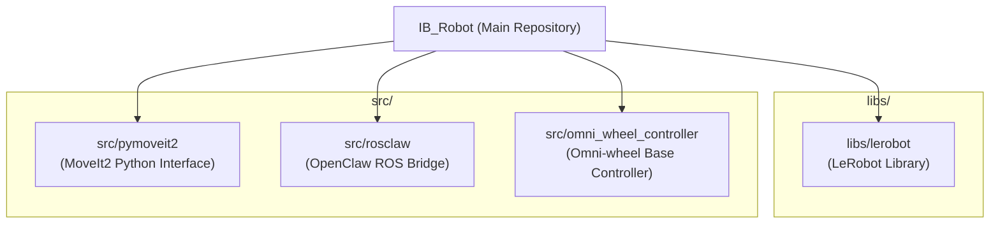

# 包参考

相关源文件

以下文件被用作生成此 wiki 页面时的上下文：

- [.gitmodules](https://atomgit.com/openeuler/IB_Robot/blob/master/.gitmodules)
- [src/ibrobot_msgs/CMakeLists.txt](https://atomgit.com/openeuler/IB_Robot/blob/master/src/ibrobot_msgs/CMakeLists.txt)
- [src/ibrobot_msgs/action/PrimitiveCommand.action](https://atomgit.com/openeuler/IB_Robot/blob/master/src/ibrobot_msgs/action/PrimitiveCommand.action)
- [src/ibrobot_msgs/action/SkillCommand.action](https://atomgit.com/openeuler/IB_Robot/blob/master/src/ibrobot_msgs/action/SkillCommand.action)
- [src/ibrobot_msgs/msg/SceneAnalysisRequest.msg](https://atomgit.com/openeuler/IB_Robot/blob/master/src/ibrobot_msgs/msg/SceneAnalysisRequest.msg)
- [src/ibrobot_msgs/msg/SceneAnalysisResult.msg](https://atomgit.com/openeuler/IB_Robot/blob/master/src/ibrobot_msgs/msg/SceneAnalysisResult.msg)
- [src/ibrobot_msgs/msg/TaskCommand.msg](https://atomgit.com/openeuler/IB_Robot/blob/master/src/ibrobot_msgs/msg/TaskCommand.msg)
- [src/ibrobot_msgs/msg/TaskStatus.msg](https://atomgit.com/openeuler/IB_Robot/blob/master/src/ibrobot_msgs/msg/TaskStatus.msg)
- [src/ibrobot_msgs/srv/ValidatePrimitive.srv](https://atomgit.com/openeuler/IB_Robot/blob/master/src/ibrobot_msgs/srv/ValidatePrimitive.srv)
- [src/ibrobot_msgs/srv/ValidateSkill.srv](https://atomgit.com/openeuler/IB_Robot/blob/master/src/ibrobot_msgs/srv/ValidateSkill.srv)
- [third_party/README.md](https://atomgit.com/openeuler/IB_Robot/blob/master/third_party/README.md)

本文提供 IB-Robot 工作空间中所有 ROS2 包的综合参考，说明每个包的用途、关键组件、依赖关系，以及它们在整体系统架构中的关系。

---

## 包组织概览

IB-Robot 工作空间按功能层组织包，这些层对应系统架构。下图把架构层映射到相应包：

**Package Distribution Across Architectural Layers**

**来源**：[src/robot_config/package.xml:10-28](https://atomgit.com/openeuler/IB_Robot/blob/master/src/robot_config/package.xml#L10-L28)、[src/inference_service/package.xml:24-26](https://atomgit.com/openeuler/IB_Robot/blob/master/src/inference_service/package.xml#L24-L26)、[src/voice_asr_service/package.xml:10-13](https://atomgit.com/openeuler/IB_Robot/blob/master/src/voice_asr_service/package.xml#L10-L13)、[src/dataset_tools/package.xml:10-15](https://atomgit.com/openeuler/IB_Robot/blob/master/src/dataset_tools/package.xml#L10-L15)

---

## 包依赖图

下图展示包之间的具体依赖关系，重点关注核心消息和配置流：

**ROS2 Package Dependencies**

**来源**：[src/robot_config/package.xml:28-28](https://atomgit.com/openeuler/IB_Robot/blob/master/src/robot_config/package.xml#L28-L28)、[src/inference_service/package.xml:24-26](https://atomgit.com/openeuler/IB_Robot/blob/master/src/inference_service/package.xml#L24-L26)、[src/action_dispatch/package.xml:18-20](https://atomgit.com/openeuler/IB_Robot/blob/master/src/action_dispatch/package.xml#L18-L20)、[src/dataset_tools/package.xml:13-15](https://atomgit.com/openeuler/IB_Robot/blob/master/src/dataset_tools/package.xml#L13-L15)、[src/voice_asr_service/package.xml:13-13](https://atomgit.com/openeuler/IB_Robot/blob/master/src/voice_asr_service/package.xml#L13-L13)

---

## 核心包

### ibrobot_msgs

**类型**：接口包  
**语言**：ROS2 IDL（`.msg`、`.srv`、`.action`）  
**位置**：`src/ibrobot_msgs/`

**用途**：定义 IB-Robot 系统中使用的所有自定义 ROS2 message、service 和 action 接口，为节点之间提供通信契约。

**关键接口**：

| 接口类型 | 名称 | 用途 |
|----------------|------|---------|
| Action | `RecordEpisode` | 启动或停止 episodic 数据录制 |
| Action | `DispatchInfer` | 动作分发的推理请求/调用 |
| Action | `RunPolicy` | 高层策略执行控制 |
| Action | `ExecuteTaskPlan` | 执行任务序列的 action [src/ibrobot_msgs/CMakeLists.txt:33](https://atomgit.com/openeuler/IB_Robot/blob/master/src/ibrobot_msgs/CMakeLists.txt#L33) |
| Action | `SkillCommand` | 执行高层 skill 的 action [src/ibrobot_msgs/CMakeLists.txt:34](https://atomgit.com/openeuler/IB_Robot/blob/master/src/ibrobot_msgs/CMakeLists.txt#L34) |
| Action | `PrimitiveCommand` | 执行低层 primitive 的 action [src/ibrobot_msgs/CMakeLists.txt:35](https://atomgit.com/openeuler/IB_Robot/blob/master/src/ibrobot_msgs/CMakeLists.txt#L35) |
| Message | `RobotStatus` | 系统级状态上报 [src/ibrobot_msgs/CMakeLists.txt:23](https://atomgit.com/openeuler/IB_Robot/blob/master/src/ibrobot_msgs/CMakeLists.txt#L23) |
| Message | `VariantsList` | tensor 数据序列化的通用容器 [src/ibrobot_msgs/CMakeLists.txt:22](https://atomgit.com/openeuler/IB_Robot/blob/master/src/ibrobot_msgs/CMakeLists.txt#L22) |
| Message | `Variant` | 单个 tensor/value 包装器 [src/ibrobot_msgs/CMakeLists.txt:21](https://atomgit.com/openeuler/IB_Robot/blob/master/src/ibrobot_msgs/CMakeLists.txt#L21) |
| Message | `TaskCommand` | 任务命令，包含类型、目标和运动参数 [src/ibrobot_msgs/CMakeLists.txt:24](https://atomgit.com/openeuler/IB_Robot/blob/master/src/ibrobot_msgs/CMakeLists.txt#L24) |
| Message | `TaskStatus` | 任务状态，包含状态、成功标志和错误信息 [src/ibrobot_msgs/CMakeLists.txt:25](https://atomgit.com/openeuler/IB_Robot/blob/master/src/ibrobot_msgs/CMakeLists.txt#L25) |
| Message | `SceneAnalysisRequest` | 场景分析请求 [src/ibrobot_msgs/CMakeLists.txt:26](https://atomgit.com/openeuler/IB_Robot/blob/master/src/ibrobot_msgs/CMakeLists.txt#L26) |
| Message | `SceneAnalysisResult` | 场景分析结果 [src/ibrobot_msgs/CMakeLists.txt:27](https://atomgit.com/openeuler/IB_Robot/blob/master/src/ibrobot_msgs/CMakeLists.txt#L27) |
| Message | `AttentionWeights` | 注意力机制的权重 [src/ibrobot_msgs/CMakeLists.txt:28](https://atomgit.com/openeuler/IB_Robot/blob/master/src/ibrobot_msgs/CMakeLists.txt#L28) |
| Service | `RecognizeFile` | 从文件识别语音的 service [src/ibrobot_msgs/CMakeLists.txt:36](https://atomgit.com/openeuler/IB_Robot/blob/master/src/ibrobot_msgs/CMakeLists.txt#L36) |
| Service | `SetHotwords` | 为 ASR 设置热词的 service [src/ibrobot_msgs/CMakeLists.txt:37](https://atomgit.com/openeuler/IB_Robot/blob/master/src/ibrobot_msgs/CMakeLists.txt#L37) |
| Service | `MoveToPose` | 移动到指定位姿的 service [src/ibrobot_msgs/CMakeLists.txt:38](https://atomgit.com/openeuler/IB_Robot/blob/master/src/ibrobot_msgs/CMakeLists.txt#L38) |
| Service | `ValidateSkill` | 验证 skill 的 service [src/ibrobot_msgs/CMakeLists.txt:39](https://atomgit.com/openeuler/IB_Robot/blob/master/src/ibrobot_msgs/CMakeLists.txt#L39) |
| Service | `ValidatePrimitive` | 验证 primitive 的 service [src/ibrobot_msgs/CMakeLists.txt:40](https://atomgit.com/openeuler/IB_Robot/blob/master/src/ibrobot_msgs/CMakeLists.txt#L40) |

**来源**：[src/ibrobot_msgs/action/RecordEpisode.action:1-5](https://atomgit.com/openeuler/IB_Robot/blob/master/src/ibrobot_msgs/action/RecordEpisode.action#L1-L5)、[src/ibrobot_msgs/action/DispatchInfer.action:1-5](https://atomgit.com/openeuler/IB_Robot/blob/master/src/ibrobot_msgs/action/DispatchInfer.action#L1-L5)、[src/ibrobot_msgs/msg/RobotStatus.msg:1-5](https://atomgit.com/openeuler/IB_Robot/blob/master/src/ibrobot_msgs/msg/RobotStatus.msg#L1-L5)、[src/ibrobot_msgs/CMakeLists.txt:21-40](https://atomgit.com/openeuler/IB_Robot/blob/master/src/ibrobot_msgs/CMakeLists.txt#L21-L40)

---

### robot_config

**类型**：配置与 Launch 包  
**语言**：Python  
**位置**：`src/robot_config/`

**用途**：作为机器人规格的 **Single Source of Truth**。它管理 YAML 到 dataclass 的解析，并提供 `launch_builders` 来模块化系统启动。

**关键组件**：
- **Loader**：`loader.py` 包含 `load_robot_config_dict` 和 `load_camera_config` 等函数，用于将 YAML 解析为结构化数据 [src/robot_config/robot_config/loader.py:53-104](https://atomgit.com/openeuler/IB_Robot/blob/master/src/robot_config/robot_config/loader.py#L53-L104)。
- **Voice ASR 集成**：`voice_asr.py` launch builder 为 speech-to-text 服务处理模型路径解析和验证 [src/robot_config/robot_config/launch_builders/voice_asr.py:132-185](https://atomgit.com/openeuler/IB_Robot/blob/master/src/robot_config/robot_config/launch_builders/voice_asr.py#L132-L185)。

**关键配置类**：

| 类 | 用途 |
|-------|---------|
| `RobotConfig` | metadata、ros2_control 和 peripherals 的主容器 |
| `CameraConfig` | USB/Realsense 驱动配置 [src/robot_config/robot_config/loader.py:66-104](https://atomgit.com/openeuler/IB_Robot/blob/master/src/robot_config/robot_config/loader.py#L66-L104) |
| `ContractExtensionConfig` | 定义 ML I/O 映射（observations/actions）[src/robot_config/robot_config/loader.py:135-186](https://atomgit.com/openeuler/IB_Robot/blob/master/src/robot_config/robot_config/loader.py#L135-L186) |
| `VoiceASRConfig` | speech-to-text 服务配置 [src/robot_config/robot_config/loader.py:189-205](https://atomgit.com/openeuler/IB_Robot/blob/master/src/robot_config/robot_config/loader.py#L189-L205) |

**来源**：[src/robot_config/robot_config/loader.py:1-205](https://atomgit.com/openeuler/IB_Robot/blob/master/src/robot_config/robot_config/loader.py#L1-L205)、[src/robot_config/robot_config/launch_builders/voice_asr.py:1-185](https://atomgit.com/openeuler/IB_Robot/blob/master/src/robot_config/robot_config/launch_builders/voice_asr.py#L1-L185)

---

## 硬件与描述层

### so101_hardware

**类型**：硬件驱动插件  
**语言**：C++ / Python  
**位置**：`src/so101_hardware/`  
**插件**：`so101_hardware/SO101SystemHardware`（ros2_control hardware interface）

**用途**：为 SO-101 机器人实现 `hardware_interface`。它把 ROS 2 `ros2_control` 命令桥接到物理 Feetech 舵机。

**关键组件**：
- **C++ 接口**：实现 `hardware_interface` 和 `rclcpp_lifecycle`，用于集成 `controller_manager` [src/so101_hardware/package.xml:14-19](https://atomgit.com/openeuler/IB_Robot/blob/master/src/so101_hardware/package.xml#L14-L19)。
- **串口通信**：使用 `python3-serial` 和 `feetech-servo-sdk` 执行底层总线通信 [src/so101_hardware/package.xml:25-26](https://atomgit.com/openeuler/IB_Robot/blob/master/src/so101_hardware/package.xml#L25-L26)。

**来源**：[src/so101_hardware/package.xml:1-37](https://atomgit.com/openeuler/IB_Robot/blob/master/src/so101_hardware/package.xml#L1-L37)

---

## 智能与规划层

### inference_service

**类型**：智能服务  
**语言**：Python  
**位置**：`src/inference_service/`

**用途**：管理机器学习策略生命周期。它从 `tensormsg` 协议消费 observations，并为 `action_dispatch` 层生成 action tensors。

**关键依赖**：
- `ibrobot_msgs`：用于 `RunPolicy` 和 `DispatchInfer` action [src/inference_service/package.xml:24-24](https://atomgit.com/openeuler/IB_Robot/blob/master/src/inference_service/package.xml#L24-L24)。
- `tensormsg`：用于将 ROS topic 转换为 model tensor [src/inference_service/package.xml:25-25](https://atomgit.com/openeuler/IB_Robot/blob/master/src/inference_service/package.xml#L25-L25)。

**来源**：[src/inference_service/package.xml:1-37](https://atomgit.com/openeuler/IB_Robot/blob/master/src/inference_service/package.xml#L1-L37)

### voice_asr_service

**类型**：语音智能服务  
**语言**：Python  
**位置**：`src/voice_asr_service/`

**用途**：使用 `sherpa-onnx` 提供 Speech-to-Text 能力。它支持流式（实时）和离线识别模式。

**关键模块**：
- `AudioCaptureModule`：处理麦克风输入和环形缓冲 [src/voice_asr_service/voice_asr_service/__init__.py:6-9](https://atomgit.com/openeuler/IB_Robot/blob/master/src/voice_asr_service/voice_asr_service/__init__.py#L6-L9)。
- `ASRInferenceModule`：运行基于 ONNX 的语音识别 [src/voice_asr_service/voice_asr_service/__init__.py:14-16](https://atomgit.com/openeuler/IB_Robot/blob/master/src/voice_asr_service/voice_asr_service/__init__.py#L14-L16)。
- `VADModule`：Voice Activity Detection，用于从静音中切分语音 [src/voice_asr_service/voice_asr_service/__init__.py:17-20](https://atomgit.com/openeuler/IB_Robot/blob/master/src/voice_asr_service/voice_asr_service/__init__.py#L17-L20)。

**来源**：[src/voice_asr_service/voice_asr_service/__init__.py:1-73](https://atomgit.com/openeuler/IB_Robot/blob/master/src/voice_asr_service/voice_asr_service/__init__.py#L1-L73)、[src/voice_asr_service/package.xml:1-25](https://atomgit.com/openeuler/IB_Robot/blob/master/src/voice_asr_service/package.xml#L1-L25)

---

## 数据与导航层

### dataset_tools

**类型**：数据流水线工具集  
**语言**：Python  
**位置**：`src/dataset_tools/`

**用途**：提供工具，用于采集和转换面向 Imitation Learning 的机器人数据集。

**关键组件**：
- **相机对齐**：`camera_alignment.py` 提供 GUI，用 ArUco marker 标定相机变换 [src/dataset_tools/dataset_tools/camera_alignment.py:1-50](https://atomgit.com/openeuler/IB_Robot/blob/master/src/dataset_tools/dataset_tools/camera_alignment.py#L1-L50)。
- **OpenCV Utils**：`opencv_utils.py` 管理 GUI-capable OpenCV build 的加载，即使在虚拟环境中也可使用 [src/dataset_tools/dataset_tools/opencv_utils.py:90-117](https://atomgit.com/openeuler/IB_Robot/blob/master/src/dataset_tools/dataset_tools/opencv_utils.py#L90-L117)。

**来源**：[src/dataset_tools/package.xml:1-26](https://atomgit.com/openeuler/IB_Robot/blob/master/src/dataset_tools/package.xml#L1-L26)、[src/dataset_tools/dataset_tools/opencv_utils.py:1-117](https://atomgit.com/openeuler/IB_Robot/blob/master/src/dataset_tools/dataset_tools/opencv_utils.py#L1-L117)

### robot_navigation

**类型**：导航栈  
**语言**：Python  
**位置**：`src/robot_navigation/`

**用途**：为移动机器人（如 LeKiwi）集成 Nav2 栈。它包含 Nav2 client、语音触发导航和底盘驱动。

**来源**：[src/robot_navigation/package.xml:1-37](https://atomgit.com/openeuler/IB_Robot/blob/master/src/robot_navigation/package.xml#L1-L37)

---

## 外部子模块

IB-Robot 项目使用多个外部仓库作为 Git 子模块，以集成既有功能和库。这些子模块由 `libs/` 和 `src/` 目录管理。

**Submodule Overview**

**来源**：[.gitmodules:1-17](https://atomgit.com/openeuler/IB_Robot/blob/master/.gitmodules#L1-L17)

### LeRobot

**路径**：`libs/lerobot`  
**URL**：`https://gitcode.com/openharmony-robot/lerobot.git`  
**用途**：机器人学习的核心机器学习库，提供策略训练、推理和数据处理能力。`third_party/patches/lerobot/` 目录包含对该子模块应用的受控 patch，用于适配 IB-Robot 的具体需求，包括 Python 兼容性、平台特定优化（如 OpenHarmony、Ascend NPU），以及训练和模型工具扩展。这些 patch 可审计、可选择，并能在不同环境中复现。[third_party/README.md:1-218](https://atomgit.com/openeuler/IB_Robot/blob/master/third_party/README.md#L1-L218)

**关键 Patch 类别**：
- **Python 兼容性**：调整语法和元数据，以支持更广泛的 Python 版本（如 Python 3.10、3.11）[third_party/README.md:66-73](https://atomgit.com/openeuler/IB_Robot/blob/master/third_party/README.md#L66-L73)。
- **平台运行时**：面向 OpenHarmony 的 lazy import 等优化，用于减少运行时依赖 [third_party/README.md:76-79](https://atomgit.com/openeuler/IB_Robot/blob/master/third_party/README.md#L76-L79)。
- **设备能力**：为 Ascend 设备增加 NPU 识别和选择能力 [third_party/README.md:82-85](https://atomgit.com/openeuler/IB_Robot/blob/master/third_party/README.md#L82-L85)。
- **训练栈迁移**：扩展 weighted training、knowledge distillation 和 TensorBoard logging [third_party/README.md:88-94](https://atomgit.com/openeuler/IB_Robot/blob/master/third_party/README.md#L88-L94)。
- **模型与工具扩展**：恢复特定模型族（如 `mt_act`）和研究工具（如 attention visualization）[third_party/README.md:97-100](https://atomgit.com/openeuler/IB_Robot/blob/master/third_party/README.md#L97-L100)。

**来源**：[.gitmodules:1-4](https://atomgit.com/openeuler/IB_Robot/blob/master/.gitmodules#L1-L4)、[third_party/README.md:1-218](https://atomgit.com/openeuler/IB_Robot/blob/master/third_party/README.md#L1-L218)

### PyMoveIt2

**路径**：`src/pymoveit2`  
**URL**：`https://gitcode.com/ib_robot/pymoveit2.git`  
**用途**：提供 MoveIt2 的 Python 接口，让 IB-Robot 系统内的 Python 节点可以执行高层运动规划和控制。

**来源**：[.gitmodules:5-9](https://atomgit.com/openeuler/IB_Robot/blob/master/.gitmodules#L5-L9)

### ROSClaw

**路径**：`src/rosclaw`  
**URL**：`https://gitcode.com/ib_robot/rosclaw.git`  
**用途**：作为 OpenClaw AI agent 框架的 ROS 桥接器，把 AI agent skill 和社交控制能力接入机器人。

**来源**：[.gitmodules:10-12](https://atomgit.com/openeuler/IB_Robot/blob/master/.gitmodules#L10-L12)

### OmniWheelController

**路径**：`src/omni_wheel_controller`  
**URL**：`https://gitcode.com/ib_robot/omni_wheel_controller.git`  
**用途**：为全向移动底盘提供控制能力，使 LeKiwi 等平台可以精确移动和导航。

**来源**：[.gitmodules:13-17](https://atomgit.com/openeuler/IB_Robot/blob/master/.gitmodules#L13-L17)

---

## 汇总表

| 包 | 类别 | 主要职责 |
|---------|----------|------------------------|
| `ibrobot_msgs` | Communication | action 和 message 的 IDL 定义 |
| `robot_config` | Configuration | YAML 到 Dataclass 映射和 launch 编排 |
| `tensormsg` | Protocol | ROS topic ↔ Tensor 双向转换 |
| `inference_service` | Intelligence | 策略加载和推理执行 |
| `voice_asr_service` | Intelligence | 通过 `sherpa-onnx` 执行语音识别 |
| `action_dispatch` | Execution | action 排队和时间平滑 |
| `so101_hardware` | Hardware | 通过 `ros2_control` 驱动 Feetech 舵机 |
| `dataset_tools` | Data | 录制、转换和相机对齐 |
| `robot_navigation` | Navigation | Nav2 集成和语音控制底盘 |
| `robot_teleop` | Data | 遥操作零延迟桥接 |
| `libs/lerobot` | External Library | 机器人学习核心 ML 库（子模块） |
| `src/pymoveit2` | External Library | MoveIt2 的 Python 接口（子模块） |
| `src/rosclaw` | External Library | OpenClaw AI agent 框架的 ROS 桥接器（子模块） |
| `src/omni_wheel_controller` | External Library | 全向移动底盘控制器（子模块） |

**来源**：[src/robot_config/package.xml:4-6](https://atomgit.com/openeuler/IB_Robot/blob/master/src/robot_config/package.xml#L4-L6)、[src/so101_hardware/package.xml:4-6](https://atomgit.com/openeuler/IB_Robot/blob/master/src/so101_hardware/package.xml#L4-L6)、[src/voice_asr_service/package.xml:4-6](https://atomgit.com/openeuler/IB_Robot/blob/master/src/voice_asr_service/package.xml#L4-L6)、[src/dataset_tools/package.xml:4-6](https://atomgit.com/openeuler/IB_Robot/blob/master/src/dataset_tools/package.xml#L4-L6)、[.gitmodules:1-17](https://atomgit.com/openeuler/IB_Robot/blob/master/.gitmodules#L1-L17)

