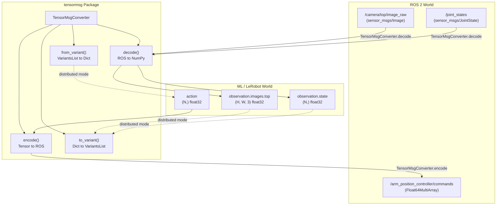
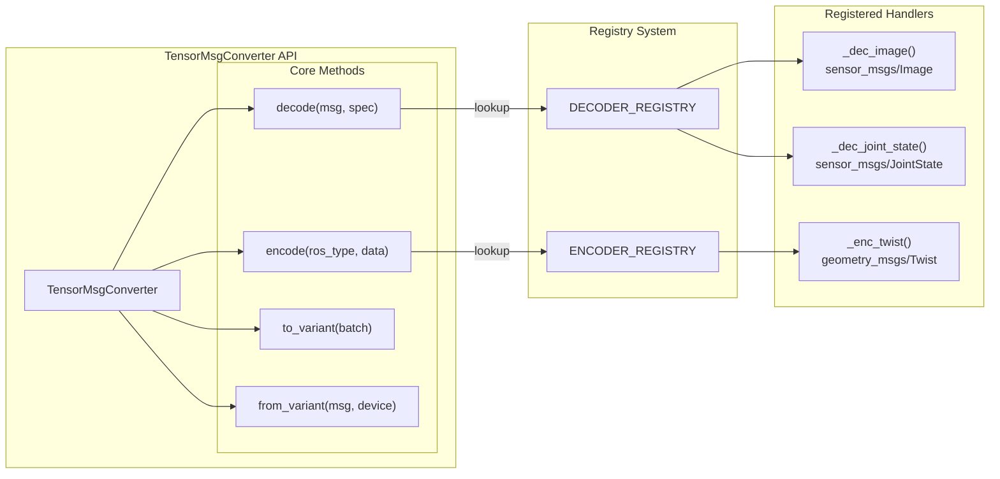

# 协议转换

<details>
<summary>相关源文件</summary>

生成此 wiki 页面时使用了以下文件作为上下文：

- [.shrc_local](https://atomgit.com/openeuler/IB_Robot/blob/master/.shrc_local)
- [src/dataset_tools/dataset_tools/bag_to_lerobot.py](https://atomgit.com/openeuler/IB_Robot/blob/master/src/dataset_tools/dataset_tools/bag_to_lerobot.py)
- [src/dataset_tools/dataset_tools/episode_recorder.py](https://atomgit.com/openeuler/IB_Robot/blob/master/src/dataset_tools/dataset_tools/episode_recorder.py)
- [src/dataset_tools/dataset_tools/frame_detector.py](https://atomgit.com/openeuler/IB_Robot/blob/master/src/dataset_tools/dataset_tools/frame_detector.py)
- [src/dataset_tools/setup.py](https://atomgit.com/openeuler/IB_Robot/blob/master/src/dataset_tools/setup.py)
- [src/robot_config/robot_config/contract_builder.py](https://atomgit.com/openeuler/IB_Robot/blob/master/src/robot_config/robot_config/contract_builder.py)
- [src/robot_config/robot_config/contract_utils.py](https://atomgit.com/openeuler/IB_Robot/blob/master/src/robot_config/robot_config/contract_utils.py)
- [src/robot_config/robot_config/generators/__init__.py](https://atomgit.com/openeuler/IB_Robot/blob/master/src/robot_config/robot_config/generators/__init__.py)
- [src/robot_config/robot_config/generators/contract.py](https://atomgit.com/openeuler/IB_Robot/blob/master/src/robot_config/robot_config/generators/contract.py)
- [src/robot_config/robot_config/launch_builders/recording.py](https://atomgit.com/openeuler/IB_Robot/blob/master/src/robot_config/robot_config/launch_builders/recording.py)
- [src/tensormsg/tensormsg/converter.py](https://atomgit.com/openeuler/IB_Robot/blob/master/src/tensormsg/tensormsg/converter.py)

</details>


`tensormsg` 包是 ROS 2 消息流与机器学习 tensor 表示之间的**双向协议转换器**。它让 LeRobot 策略无需手写序列化代码，即可消费机器人观测并产生动作。该包使用契约驱动的规格系统，确保数据采集、训练和部署之间保持一致。

关于契约如何定义和加载，请参见 [Contract System](./core_concepts/contract_system.md)。关于使用 tensormsg 的推理流水线，请参见 [Inference Pipeline](./inference/overview.md)。

**来源**：[src/tensormsg/tensormsg/converter.py:1-20](https://atomgit.com/openeuler/IB_Robot/blob/master/src/tensormsg/tensormsg/converter.py#L1-L20)，[src/dataset_tools/dataset_tools/bag_to_lerobot.py:115-116](https://atomgit.com/openeuler/IB_Robot/blob/master/src/dataset_tools/dataset_tools/bag_to_lerobot.py#L115-L116)

---

## 系统角色与数据流

`tensormsg` 包在 IB-Robot 架构中充当中心协议枢纽，支持以下数据转换：

### 数据转换架构


**关键转换路径：**

1. **观测路径（ROS → Tensor）**：相机图像和关节状态通过 `TensorMsgConverter.decode` 从 ROS 消息解码为 NumPy 数组 [src/tensormsg/tensormsg/converter.py:36-50](https://atomgit.com/openeuler/IB_Robot/blob/master/src/tensormsg/tensormsg/converter.py#L36-L50)。
2. **动作路径（Tensor → ROS）**：策略输出 tensor 通过 `TensorMsgConverter.encode` 编码回 ROS 消息 [src/tensormsg/tensormsg/converter.py:21-34](https://atomgit.com/openeuler/IB_Robot/blob/master/src/tensormsg/tensormsg/converter.py#L21-L34)。
3. **分布式推理路径**：观测和动作被序列化为 `ibrobot_msgs/msg/VariantsList`，用于 edge 节点和 cloud 节点之间的网络传输，使用 `to_variant` 和 `from_variant` [src/tensormsg/tensormsg/converter.py:53-82](https://atomgit.com/openeuler/IB_Robot/blob/master/src/tensormsg/tensormsg/converter.py#L53-L82)。
4. **数据集转换路径**：执行 `bag_to_lerobot` 时，转换器用于将 bag 消息解码为训练原生格式 [src/dataset_tools/dataset_tools/bag_to_lerobot.py:115-117](https://atomgit.com/openeuler/IB_Robot/blob/master/src/dataset_tools/dataset_tools/bag_to_lerobot.py#L115-L117)。

**来源**：[src/tensormsg/tensormsg/converter.py:17-82](https://atomgit.com/openeuler/IB_Robot/blob/master/src/tensormsg/tensormsg/converter.py#L17-L82)，[src/dataset_tools/dataset_tools/bag_to_lerobot.py:9-19](https://atomgit.com/openeuler/IB_Robot/blob/master/src/dataset_tools/dataset_tools/bag_to_lerobot.py#L9-L19)

---

## TensorMsgConverter 类

`TensorMsgConverter` 类为所有协议转换提供核心 API。它是无状态工具，通过静态方法委托给已注册的 encoder/decoder 函数。

### 核心实体映射


**来源**：[src/tensormsg/tensormsg/converter.py:17-82](https://atomgit.com/openeuler/IB_Robot/blob/master/src/tensormsg/tensormsg/converter.py#L17-L82)，[src/tensormsg/tensormsg/converter.py:183-199](https://atomgit.com/openeuler/IB_Robot/blob/master/src/tensormsg/tensormsg/converter.py#L183-L199)

---

## 注册系统

该包使用基于装饰器的注册模式，将 ROS 消息类型关联到转换函数。这便于扩展自定义消息类型，而无需修改核心逻辑。

### Encoder 注册
Encoders 将 Python 数据（tensors、arrays、sequences）转换为 ROS 消息。例如，`geometry_msgs/Twist` encoder 处理线速度和角速度 [src/tensormsg/tensormsg/converter.py:183-196](https://atomgit.com/openeuler/IB_Robot/blob/master/src/tensormsg/tensormsg/converter.py#L183-L196)。

```python
@register_encoder("geometry_msgs/msg/Twist")
def _enc_twist(names, data, clamp):
    if names:
        return _encode_via_dotted_paths("geometry_msgs/msg/Twist", names, data, clamp)
    # ... logic to fill linear.x and angular.z
```

### Decoder 注册
Decoders 从 ROS 消息中提取 NumPy 数组。如果没有注册特定 decoder，且规格中包含 names，系统会尝试通过 names 解码 [src/tensormsg/tensormsg/converter.py:47-48](https://atomgit.com/openeuler/IB_Robot/blob/master/src/tensormsg/tensormsg/converter.py#L47-L48)。

**converter.py 中的关键注册：**

| ROS Type | Decoder | Encoder | 行范围 |
|----------|---------|---------|------------|
| `sensor_msgs/msg/Image` | ✅ | ❌ | [src/tensormsg/tensormsg/converter.py:198-204](https://atomgit.com/openeuler/IB_Robot/blob/master/src/tensormsg/tensormsg/converter.py#L198-L204) |
| `geometry_msgs/msg/Twist` | ❌ | ✅ | [src/tensormsg/tensormsg/converter.py:183-196](https://atomgit.com/openeuler/IB_Robot/blob/master/src/tensormsg/tensormsg/converter.py#L183-L196) |

**来源**：[src/tensormsg/tensormsg/converter.py:11-16](https://atomgit.com/openeuler/IB_Robot/blob/master/src/tensormsg/tensormsg/converter.py#L11-L16)，[src/tensormsg/tensormsg/converter.py:183-204](https://atomgit.com/openeuler/IB_Robot/blob/master/src/tensormsg/tensormsg/converter.py#L183-L204)

---

## 分布式推理的 Variant 序列化

在分布式推理模式中，`tensormsg` 为 `ibrobot_msgs/msg/VariantsList` 提供序列化能力。它用于连接 “Natural Language Space”（如 `observation.state` 这样的键名）与 “Code Entity Space”（具体 ROS 消息字段）。

### 序列化逻辑
1. **`to_variant(batch)`**：将 Tensor 字典编码为 `VariantsList`。它会过滤键，只保留以 `task`、`observation` 或 `action` 开头的项 [src/tensormsg/tensormsg/converter.py:53-74](https://atomgit.com/openeuler/IB_Robot/blob/master/src/tensormsg/tensormsg/converter.py#L53-L74)。
2. **`from_variant(msg, device)`**：将 `VariantsList` 解码回 Tensor 字典，可选择移动到特定硬件设备（例如 CUDA 或 NPU）[src/tensormsg/tensormsg/converter.py:77-82](https://atomgit.com/openeuler/IB_Robot/blob/master/src/tensormsg/tensormsg/converter.py#L77-L82)。

### 支持的 Tensor 类型
系统将 Torch dtypes 映射到 `Variant` 消息中的特定数组类型 [src/tensormsg/tensormsg/converter.py:112-129](https://atomgit.com/openeuler/IB_Robot/blob/master/src/tensormsg/tensormsg/converter.py#L112-L129)：
- `torch.bool` → `bool_array`
- `torch.int32` → `int_32_array`
- `torch.int64` → `int_64_array`
- `torch.float32` → `float_32_array`
- `torch.float64` → `float_64_array`

**来源**：[src/tensormsg/tensormsg/converter.py:53-82](https://atomgit.com/openeuler/IB_Robot/blob/master/src/tensormsg/tensormsg/converter.py#L53-L82)，[src/tensormsg/tensormsg/converter.py:112-129](https://atomgit.com/openeuler/IB_Robot/blob/master/src/tensormsg/tensormsg/converter.py#L112-L129)

---

## 实现细节

### Dotted Path 访问
转换器使用 `dot_get` 和 `dot_set` helper 访问 ROS 消息中的嵌套字段。这允许契约规格引用数组中的特定索引，例如 `JointState` 消息中的 `position.0` 表示第一个关节 [src/tensormsg/tensormsg/converter.py:96-98](https://atomgit.com/openeuler/IB_Robot/blob/master/src/tensormsg/tensormsg/converter.py#L96-L98)，[src/tensormsg/tensormsg/converter.py:102-109](https://atomgit.com/openeuler/IB_Robot/blob/master/src/tensormsg/tensormsg/converter.py#L102-L109)。

### 图像解码
图像 decoder 处理常见 ROS encoding。在 `rerun_viewer` 中，如果快速路径原始解码失败，它会作为 fallback 使用 [src/dataset_tools/dataset_tools/bag_to_lerobot.py:115-117](https://atomgit.com/openeuler/IB_Robot/blob/master/src/dataset_tools/dataset_tools/bag_to_lerobot.py#L115-L117)。它还处理浮点图像归一化和 resize [src/tensormsg/tensormsg/converter.py:198-204](https://atomgit.com/openeuler/IB_Robot/blob/master/src/tensormsg/tensormsg/converter.py#L198-L204)。

### MultiArray 创建
将 tensor 编码为 `MultiArray` 消息时，系统会使用 `_create_multiarray_msg` 自动填充 `layout.dim` 字段，以保留原始 tensor shape [src/tensormsg/tensormsg/converter.py:132-147](https://atomgit.com/openeuler/IB_Robot/blob/master/src/tensormsg/tensormsg/converter.py#L132-L147)。

**来源**：[src/tensormsg/tensormsg/converter.py:88-109](https://atomgit.com/openeuler/IB_Robot/blob/master/src/tensormsg/tensormsg/converter.py#L88-L109)，[src/tensormsg/tensormsg/converter.py:132-147](https://atomgit.com/openeuler/IB_Robot/blob/master/src/tensormsg/tensormsg/converter.py#L132-L147)，[src/dataset_tools/dataset_tools/bag_to_lerobot.py:100-117](https://atomgit.com/openeuler/IB_Robot/blob/master/src/dataset_tools/dataset_tools/bag_to_lerobot.py#L100-L117)

