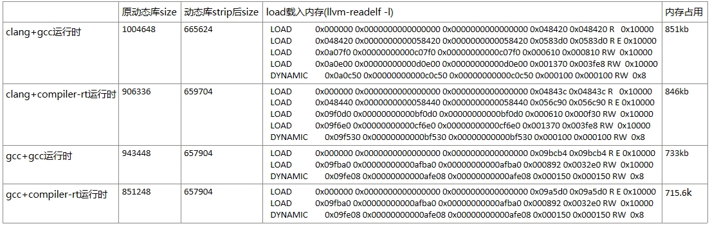

.. _miniaturization:

小型化特性
============

小型化分为二进制小型化和内存小型化，有些应用场景对镜像二进制大小有严格的限制，而有些应用场景则对系统OS的运行内存有着严格的限制。openEuler Embedded在小型化方面专门针对内存受限环境做了很多研究，这其中包括编译链的优化对比、内核的精简化裁剪、文件系统的精简、系统文件挂载的优化。

我们在OEE已支持的hipico单板上进行的研究，采用clang+musl编译链，小型化内存数据如下：

.. list-table:: OEE小型化内存数据
    :widths: auto
    :header-rows: 1

    * - 
      - OS裁剪
    * - 物理可用内存
      - 48M
    * - 总使用内存
      - 10.97M
    * - 内核自身内存
      - 4.98M
    * - 内核态内存
      - 2.96M
    * - 用户态内存
      - 0.722M

.. image:: images/ram.png
   :alt: 内存使用情况

内核态内存定义：SUnreclaim(不可回收)+KernelStack(内核栈)+PageTables(页表)+VmallocUsed(已分配内存)+Percpu(CPU缓存)

用户态内存定义：Active(活动内存)+Inactive(不活动内存)

二进制小型化数据：

.. list-table:: 系统组件大小
   :widths: 20 20
   :header-rows: 1

   * - 组件
     - 大小
   * - 内核二进制
     - 1.4M
   * - 根文件二进制
     - 3.79M

编译链的优化对比
------------------

编译链对比
:::::::::::::

gcc与clang的对比
++++++++++++++++++++
    
GCC原名是GNU C Compiler，是GNU项目的C语言编译器，其功能强大。

1. 支持语言

  - C、C++、Fortran、Pascal、Objective-C、Java、Ada、Go等。

2. 跨平台与兼容性

  - 操作系统：Linux、Windows、macOS等。
  - 硬件架构：X86、ARM等多种CPU指令集。
  - Linux内核等开源项目的准编译器。

3. 核心优点

  - 多语言支持： 支持多种编程语言,如C、C++、Fortran、Pascal、Objective-C、Java、Ada、Go等。
  - 跨平台性： GCC编译器能够在不同的操作系统和硬件平台上编译和运行代码，确保了代码的高度可移植性。
  - 性能优化： GCC编译器内置了多种优化策略，可以根据不同的编译选项进行代码优化，从而提升程序的运行效率。
  - 功能丰富： 编译时可生成调试信息，便于开发者进行调试。并提供了广泛的编译选项和扩展功能，以满足不同开发者的需求。
  - 社区支持： GCC编译器是一个开源项目，有一个活跃的社区支持，开发者可以从社区获取帮助、分享经验和贡献代码。
    
Clang是一个由 LLVM 项目开发的 C、C++、Objective-C 等编程语言的编译器前端。它旨在提供更快的编译速度、更好的错误报告及与GCC兼容的编译器驱动程序。Clang 是 LLVM 编译器基础设施的一部分，通常与 LLVM 后端一起使用来生成机器代码。Clang的主要特点包括：  

1. 核心特点

  - 高效性：编译速度更快，内存占用低于GCC。
  - 友好诊断：提供清晰详尽的错误/警告信息。
  - GCC兼容性：支持多数GCC选项，便于迁移。
  - 模块化架构：易于扩展和集成到其他工具链。
  - 现代语言支持：适配最新C++标准等特性。

2. 工具生态

  - 静态分析工具（clang-tidy）
  - 代码格式化工具（clang-format）
  - 重构工具等，提升代码质量与开发效率。

glibc与musl的对比
+++++++++++++++++++++

glibc是GNU C Library（glibc），GNU项目的C/C++标准库实现。

1. 核心特性

  - 功能全面：支持国际化、本地化、调试及性能优化等扩展功能
  - 高兼容性：广泛遵循各类标准，适配多架构（如x86/ARM）和操作系统
  - Linux默认：主流Linux系统的标准C库

2. 设计权衡

  - 优势：功能丰富，兼容性强
  - 代价：代码量大导致编译速度慢，依赖项较多

musl是一个轻量级C/C++标准库，注重代码质量和安全性。

1. 核心特性

  - 高效：代码精简，编译速度快，无额外依赖。
  - 嵌入式友好：适合资源受限场景（如嵌入式系统）。
  - 关键优势：静态链接、实时性、内存高效、源码级兼容性。

2. 发展现状

  - 活跃开源项目，拥有积极开发者社区。
  - 已被多个Linux发行版采用，如Alpine Linux、Arch Linux等。

3. 优势

  - 代码量小：相比glibc，musl的代码量更少，编译速度更快。
  - 内存占用低：musl的静态链接特性使得生成的可执行文件占用的内存更少。
  - 安全性高：musl的设计注重安全性，避免了一些glibc中的安全问题。
  - 兼容性好：musl支持大多数的C标准库函数，并且与glibc兼容。

各编译链的编译数据对比
::::::::::::::::::::::::::

gcc与clang的编译数据对比(musl库)
+++++++++++++++++++++++++++++++++++

clang+musl对busybox的编译数据对比
+++++++++++++++++++++++++++++++++++++

编译链的制作
:::::::::::::

1. 准备32位gcc+musl编译链

  可以直接从openEuler Embedded的源码仓发布件下载，发布件名称为openeuler_gcc_arm32le-musl

2. 准备编译链源码

  llvm-project源码为：https://gitee.com/openeuler/llvm-project这里我们选用dev_19.1.7版本,执行以下命令下载llvm-project源码：
        
  .. code::

    git clone https://gitee.com/openeuler/llvm-project.git -b dev_19.1.7 --depth=1
        
  musl源码为：https://gitee.com/src-openeuler/musl.git，这里我们参考manifest.yaml中的musl版本，执行以下命令下载musl源码：
        
  .. code::

      git init openeuler-musl
      cd openeuler-musl
      git remote add origin https://gitee.com/src-openeuler/musl.git
      git fetch origin <version> --depth=1
      git checkout <version>
        
3. 单步编译llvm

  我们编译链的安装目录设定为：/home/lixinyu/toolchain/llvm-musl-arm，这里开发者可以自行设置，但是前提要有写入权限
        
  编译llvm二进制：

  .. code::

      cd llvm-project
      mkdir build-llvm
      cd build-llvm
      cmake \
      -G "Unix Makefiles" \
      -DCMAKE_BUILD_TYPE=Release \
      -DLLVM_ENABLE_PROJECTS="clang;lld" \
      -DLLVM_TARGETS_TO_BUILD="ARM" \
      -DLLVM_DEFAULT_TARGET_TRIPLE=arm-openeuler-linux-musleabi \
      -DCMAKE_INSTALL_PREFIX=/home/lixinyu/toolchain/llvm-musl-arm \
      -DCMAKE_C_COMPILER=gcc \
      -DCMAKE_CXX_COMPILER=g++ \
      -DCMAKE_CROSSCOMPILING=ON \
      -DCLANG_DEFAULT_CXX_STDLIB=none \
      -DCLANG_DEFAULT_LINKER=lld \
      -DCLANG_DEFAULT_RTLIB=compiler-rt \
      -DLLVM_ENABLE_LIBCXX=OFF \
      ../llvm
      make -j$(nproc)
      make install
    
  将clang编译器加入到PATH路径中，例如：

  .. code::

      export PATH=/home/lixinyu/toolchain/llvm-musl-arm/bin:$PATH
        
  编译compiler-rt：
  
  编译compiler-rt需要用到gcc的运行时库，前面编译好的32位gcc+musl这里就派上了用场，执行以下命令来拷贝gcc运行时库：

  .. code::

      cp -rf <gcc-musl-arm>/lib/gcc /home/lixinyu/toolchain/llvm-musl-arm/lib/
      cp -rf <gcc-musl-arm>/arm-openeuler-linux-musleabi/include /home/lixinyu/toolchain/llvm-musl-arm/arm-openeuler-linux-musleabi
      cp -rf <gcc-musl-arm>/arm-openeuler-linux-musleabi/sysroot/* /home/lixinyu/toolchain/llvm-musl-arm/arm-openeuler-linux-musleabi/sysroot/
        
  修改compiler-rt源码，将智能检查中所有stat64的定义改为stat，这是因为musl libc不提供单独的stat64结构体，在设定_FILE_OFFSET_BITS=64时，musl的<sys/stat.h>中的stat就是64位版本。执行以下命令进行修改：
        
  .. code::
  
      cd llvm-project
      vim compiler-rt/lib/sanitizer_common/sanitizer_linux.cpp
      # 将所有state64的定义改为stat，注意是要将所有stat64的调用改为stat，直接进行替换即可,例如：
      bool FileExists(const char *filename) {
          if (ShouldMockFailureToOpen(filename))
              return false;
          # struct stat64 st;
          struct stat st;
          if (internal_stat(filename, &st))
              return false;
          // Sanity check: filename is a regular file.
          return S_ISREG(st.st_mode);
      }

  继续执行以下命令：

  .. code::
  
      cd llvm-project
      mkdir build-compiler-rt
      cd build-compiler-rt
      cmake -G "Unix Makefiles" \
      -DCOMPILER_RT_BUILD_BUILTINS=ON \
      -DCOMPILER_RT_INCLUDE_TESTS=OFF \
      -DCOMPILER_RT_BUILD_SANITIZERS=OFF \
      -DCOMPILER_RT_BUILD_XRAY=OFF \
      -DCOMPILER_RT_BUILD_LIBFUZZER=OFF \
      -DCOMPILER_RT_BUILD_PROFILE=OFF \
      -DCOMPILER_RT_DEFAULT_TARGET_ONLY=ON \
      -DLLVM_TARGETS_TO_BUILD="ARM" \
      -DCMAKE_C_COMPILER=clang \
      -DCMAKE_CXX_COMPILER=clang++ \
      -DCMAKE_ASM_COMPILER=clang \
      -DCMAKE_C_FLAGS="-march=armv7-a" \
      -DCMAKE_CXX_FLAGS="-march=armv7-a" \
      -DCMAKE_EXE_LINKER_FLAGS="-march=armv7-a" \
      -DCMAKE_ASM_FLAGS="-march=armv7-a" \
      -DCMAKE_ASM_COMPILER_TARGET="arm-openeuler-linux-musleabi" \
      -DCMAKE_C_COMPILER_TARGET="arm-openeuler-linux-musleabi" \
      -DCMAKE_CXX_COMPILER_TARGET="arm-openeuler-linux-musleabi" \
      -DCMAKE_SYSROOT=/home/lixinyu/toolchain/llvm-musl-arm/arm-openeuler-linux-musleabi/sysroot \
      -DCMAKE_INSTALL_PREFIX=/home/lixinyu/toolchain/llvm-musl-arm/arm-openeuler-linux-musleabi/sysroot \
      -DCMAKE_C_COMPILER_WORKS=1 \
      -DCMAKE_CXX_COMPILER_WORKS=1 \
      -DCMAKE_SIZEOF_VOID_P=8 \
      ../compiler-rt
      make -j$(nproc)
      make install
        
  编译musl：

  执行以下命令来编译musl：

  .. code::

      cd openeuler-musl
      cd musl-1.2.4
      ARCH=arm \
      CROSS_COMPILER=llvm- \
      CC="clang" \
      LIBCC="/home/lixinyu/toolchain/llvm-musl-arm/arm-openeuler-linux-musleabi/sysroot/lib/linux/libclang_rt.builtins-arm.a" \
      ./configure --prefix=/home/lixinyu/toolchain/llvm-musl-arm/arm-openeuler-linux-musleabi/sysroot
      make -j$(nproc)
      make install

  编译libunwind：

  编译libunwind需要修改的地方较多，这里我直接打了一个补丁，就可直接将补丁内容打在linunwind中：

  .. code::

      diff --git a/libunwind/CMakeLists.txt b/libunwind/CMakeLists.txt
      index 28d67b0fe..c3e2bc02e 100644
      --- a/libunwind/CMakeLists.txt
      +++ b/libunwind/CMakeLists.txt
      @@ -55,6 +55,8 @@ option(LIBUNWIND_USE_FRAME_HEADER_CACHE "Cache frame headers for unwinding. Requ
      option(LIBUNWIND_REMEMBER_HEAP_ALLOC "Use heap instead of the stack for .cfi_remember_state." OFF)
      option(LIBUNWIND_INSTALL_HEADERS "Install the libunwind headers." ON)
      option(LIBUNWIND_ENABLE_FRAME_APIS "Include libgcc-compatible frame apis." OFF)
      +option(LIBUNWIND_ENABLE_ASSEMBLY "Enable assembly support" ON)
      +

      set(LIBUNWIND_LIBDIR_SUFFIX "${LLVM_LIBDIR_SUFFIX}" CACHE STRING
          "Define suffix of library directory name (32/64)")
      @@ -292,6 +294,7 @@ if (LIBUNWIND_ENABLE_ARM_WMMX)
      # provide the option to explicitly enable support for WMMX registers in the
      # unwinder.
      add_compile_flags(-D__ARM_WMMX)
      +  add_compile_flags(-D_LIBUNWIND_ARM_WMMX)
      endif()

      if(LIBUNWIND_IS_BAREMETAL)
      diff --git a/libunwind/src/CMakeLists.txt b/libunwind/src/CMakeLists.txt
      index 780430ba7..b26f79467 100644
      --- a/libunwind/src/CMakeLists.txt
      +++ b/libunwind/src/CMakeLists.txt
      @@ -1,5 +1,9 @@
      # Get sources

      +enable_language(ASM)
      +set(CMAKE_C_FLAGS "-march=armv7-a -mfpu=vfpv3-d16 -mfloat-abi=hard")
      +set(CMAKE_CXX_FLAGS "-march=armv7-a -mfpu=vfpv3-d16 -mfloat-abi=hard")
      +
      set(LIBUNWIND_CXX_SOURCES
          libunwind.cpp
          Unwind-EHABI.cpp
      ~

  执行libunwind编译命令：
        
  .. code::

      cmake -G "Unix Makefiles" \
      -DCMAKE_C_COMPILER=clang \
      -DCMAKE_CXX_COMPILER=clang++ \
      -DCMAKE_ASM_COMPILER=clang \
      -DCMAKE_VERBOSE_MAKEFILE=True \
      -DLIBUNWIND_USE_COMPILER_RT=ON \
      -DLIBUNWIND_ENABLE_CROSS_UNWINDING=ON \
      -DLIBUNWIND_ENABLE_ARM_WMMX=ON \
      -DLIBUNWIND_ENABLE_ASSEMBLY=ON \
      -DCMAKE_C_COMPILER_TARGET="arm-openeuler-linux-musleabi" \
      -DCMAKE_CXX_COMPILER_TARGET="arm-openeuler-linux-musleabi" \
      -DCMAKE_C_FLAGS="-march=armv7-a -mfpu=vfpv3-d16 -mfloat-abi=hard" \
      -DCMAKE_CXX_FLAGS="-march=armv7-a -mfpu=vfpv3-d16 -mfloat-abi=hard" \
      -DCMAKE_ASM_FLAGS="-march=armv7-a" \
      -DCMAKE_EXE_LINKER_FLAGS="-march=armv7-a" \
      -DCMAKE_SYSROOT=/home/lixinyu/toolchain/llvm-musl-arm/arm-openeuler-linux-musleabi/sysroot \
      -DCMAKE_INSTALL_PREFIX=/home/lixinyu/toolchain/llvm-musl-arm/arm-openeuler-linux-musleabi/sysroot \
      -DCMAKE_CXX_COMPILER_WORKS=1 \
      ../libunwind
      make -j$(nproc)
      make install

  至此，llvm-musl-arm编译链制作完毕

编译链总结
:::::::::::::::::

专为小而美场景设计，牺牲兼容性与性能换取极致精简，选型前需严格评估生态依赖。

1. 核心优势

  - 极简轻量：静态链接仅10KB，动态约50KB，远超Glibc效率，适合嵌入式/IoT设备。

  - 全LLVM生态：Clang+Musl+LLD无缝协作，避免GNU依赖，支持交叉编译（ARM/RISC-V等）。

  - 高安全性：静态二进制减少动态库注入风险，适配安全固件和容器（如Alpine Linux）。 

2. 主要局限

  - 性能短板：未优化NEON指令，计算密集型场景性能落后Glibc达1.5倍。

  - 兼容性差：GNU软件（如MariaDB）需大量补丁，动态链接生态薄弱。

  - 调试困难：缺乏ftrace/kprobes，IDE支持不完善。

3. 适用场景

  - 推荐：资源受限设备、静态容器镜像、隔离环境。

  - 避免：高性能计算、复杂网络服务、多用户系统。

内核精简
-----------
    
内核优化后的数据
:::::::::::::::::

.. list-table:: 第一组内核数据对比
    :widths: 25 25 25 25
    :header-rows: 1

    * - 数据类型
      - 自身二进制大小
      - 自身占用内存大小
      - 内核态内存大小
    * - 数据值
      - 1.4M
      - 4.98M
      - 2.96M

.. list-table:: meminfo数据
    :widths: 25 25 25 25
    :header-rows: 1

    * - 项目
      - 值
      - 项目
      - 值
    * - MemTotal
      - 44052 kB
      - MemFree
      - 37884 kB
    * - MemAvailable
      - 37904 kB
      - Buffers
      - 288 kB
    * - Cached
      - 1480 kB
      - SwapCached
      - 0 kB
    * - Active
      - 1472 kB
      - Inactive
      - 428 kB
    * - Active(anon)
      - 0 kB
      - Inactive(anon)
      - 136 kB
    * - Active(file)
      - 1472 kB
      - Inactive(file)
      - 292 kB
    * - Unevictable
      - 4 kB
      - Mlocked
      - 0 kB
    * - SwapTotal
      - 0 kB
      - SwapFree
      - 0 kB
    * - Dirty
      - 0 kB
      - Writeback
      - 0 kB
    * - AnonPages
      - 164 kB
      - Mapped
      - 1124 kB
    * - Shmem
      - 0 kB
      - KReclaimable
      - 740 kB
    * - Slab
      - 3076 kB
      - SReclaimable
      - 740 kB
    * - SUnreclaim
      - 2336 kB
      - KernelStack
      - 320 kB
    * - PageTables
      - 84 kB
      - NFS_Unstable
      - 0 kB
    * - Bounce
      - 0 kB
      - WritebackTmp
      - 0 kB
    * - CommitLimit
      - 22024 kB
      - Committed_AS
      - 1012 kB
    * - VmallocTotal
      - 1245184 kB
      - VmallocUsed
      - 180 kB
    * - VmallocChunk
      - 0 kB
      - Percpu
      - 112 kB

内核各个特性对内存的影响
:::::::::::::::::::::::::

以下表格列举了内核各个特性对内存的影响，计算方式每次配置的变动计算（memtotal-memavailable）的差值：
    
.. list-table:: 内核特性内存收益对比
  :widths: 20 15 30
  :header-rows: 1

  * - 特性
    - 内存收益(kb)
    - 说明
  * - DRM
    - 2592
    - 图形硬件渲染
  * - NVMEM
    - 124
    - 管理非易失性存储器
  * - VFAT_FS
    - 492
    - 支持VFAT文件系统
  * - MTD
    - 2464
    - 闪存设备存储管理框架
  * - INET&NETDEVICE
    - 640
    - 网络设备驱动框架
  * - ATA&SCSI
    - 112
    - 硬盘存储设备的接口支持
  * - USB
    - 16
    - 支持USB相关设备
  * - I2C
    - 132
    - 支持I2C相关设备
  * - NETWORK
    - 96
    - 控制基础网络栈和网络设备通信
  * - HID基本配置
    - 40
    - 人机交互
  * - DEBUG_INFO
    - 124
    - 调试开关
  * - SLUB_DEBUG
    - 140
    - SLUB分配器调试开关
  * - Export Users优化
    - 232
    - 管理用户环境
  * - KCMP&RSEQ
    - 4
    - 进程间交互与线程同步
  * - SLAB&SLUB优化
    - 1200
    - 内存分配器
  * - KABI_RESERVE&PROFILING
    - 108
    - 内存分配器
  * - Power manager优化
    - 216
    - 电源管理优化
  * - Mem manager优化
    - 196
    - 内存管理优化
  * - Driver device优化
    - 124
    - 外部设备优化
  * - MOUSE_PS2相关配置
    - 8
    - PS2接口的鼠标驱动

内核精简总结
::::::::::::::::::

这是一个为海思ARM芯片深度优化的极简内核，具备强悍的闪存支持和实时性，但牺牲了网络、多用户等通用功能，适合单一功能的低资源嵌入式设备。

.. list-table:: 关键特性矩阵
   :widths: 20 40 40
   :header-rows: 1

   * - 类别
     - 已启用特性
     - 缺失特性
   * - 硬件支持
     - ARMv7多核（SMP）、NEON/VFPv3、SPI/I2C/GPIO外设、MTD/NAND闪存
     - USB、网络设备、PCIe
   * - 存储
     - UBI/UBIFS闪存文件系统、XZ压缩内核
     - 交换分区（SWAP）、EXT4/Btrfs
   * - 安全
     - 内核代码段只读、Spectre分支预测硬化
     - Seccomp沙箱、审计子系统
   * - 调试
     - Magic SysRq、OOPS触发Panic
     - ftrace、kprobes、KGDB
   * - 用户空间
     - 基础SysV IPC、静态二进制支持
     - 多用户、动态链接库、POSIX定时器

典型应用场景

- 推荐场景

  1. 离线视频采集（海思芯片核心用途）
  2. GPIO控制的工业设备（如PLC控制器）
  3. 只读嵌入式系统（UBIFS+MTD闪存方案）

- 禁忌场景

  1. 需要网络连接的网关设备
  2. 多用户服务器或容器平台
  3. 高性能计算（无NEON优化/io_uring）

文件系统精简
-------------

文件系统的数据
::::::::::::::::::

.. list-table:: 文件系统数据示例
    :widths: 33 33 33
    :header-rows: 1

    * - 
      - 用户态内存
      - 进程数
    * - 数据
      - 700kB
      - 36

以下是进程列表，其中ps为获取进程数进程，不计算在内：

.. list-table:: 进程列表
    :widths: 10 10 10 10 10
    :header-rows: 1

    * - PID
      - USER
      - VSZ
      - STAT
      - COMMAND
    * - 1
      - 0
      - 1784
      - S
      - init
    * - 2
      - 0
      - 0
      - SW
      - [kthreadd]
    * - 3
      - 0
      - 0
      - IW<
      - [rcu_gp]
    * - 4
      - 0
      - 0
      - IW<
      - [rcu_par_gp]
    * - 5
      - 0
      - 0
      - IW
      - [kworker/0:0-eve]
    * - 6
      - 0
      - 0
      - IW<
      - [kworker/0:0H-kb]
    * - 8
      - 0
      - 0
      - IW<
      - [mm_percpu_wq]
    * - 9
      - 0
      - 0
      - SW
      - [ksoftirqd/0]
    * - 10
      - 0
      - 0
      - IW
      - [rcu_sched]
    * - 11
      - 0
      - 0
      - SW
      - [migration/0]
    * - 12
      - 0
      - 0
      - SW
      - [cpuhp/0]
    * - 13
      - 0
      - 0
      - SW
      - [cpuhp/1]
    * - 14
      - 0
      - 0
      - SW
      - [migration/1]
    * - 15
      - 0
      - 0
      - SW
      - [ksoftirqd/1]
    * - 17
      - 0
      - 0
      - IW<
      - [kworker/1:0H-kb]
    * - 18
      - 0
      - 0
      - SW
      - [kdevtmpfs]
    * - 19
      - 0
      - 0
      - IW
      - [kworker/u4:1-ev]
    * - 56
      - 0
      - 0
      - IW
      - [kworker/u4:2-ev]
    * - 96
      - 0
      - 0
      - SW
      - [oom_reaper]
    * - 97
      - 0
      - 0
      - IW<
      - [writeback]
    * - 98
      - 0
      - 0
      - SW
      - [kcompactd0]
    * - 100
      - 0
      - 0
      - SWN
      - [ksmd]
    * - 106
      - 0
      - 0
      - IW
      - [kworker/0:1-eve]
    * - 122
      - 0
      - 0
      - IW<
      - [kblockd]
    * - 126
      - 0
      - 0
      - SW
      - [spi0]
    * - 132
      - 0
      - 0
      - SW
      - [spi1]
    * - 133
      - 0
      - 0
      - IW
      - [kworker/1:2-rcu]
    * - 140
      - 0
      - 0
      - IW<
      - [devfreq_wq]
    * - 143
      - 0
      - 0
      - IW
      - [kworker/1:3-mm_]
    * - 231
      - 0
      - 0
      - SW
      - [kswapd0]
    * - 376
      - 0
      - 0
      - IW<
      - [kworker/1:1H-kb]
    * - 377
      - 0
      - 0
      - SW
      - [jbd2/mtdblock3-]
    * - 378
      - 0
      - 0
      - IW<
      - [ext4-rsv-conver]
    * - 385
      - 0
      - 1788
      - S
      - -/bin/sh
    * - 386
      - 0
      - 1784
      - S
      - init
    * - 387
      - 0
      - 1784
      - S
      - init
    * - 388
      - 0
      - 1784
      - S
      - init
    * - 398
      - 0
      - 0
      - IW<
      - [kworker/0:1H-kb]

文件系统的组成
::::::::::::::::::

.. list-table:: 新添加的三行三列表格
    :widths: 33 33 33
    :header-rows: 1

    * - 
      - busybox
      - musl
    * - 二进制大小
      - 946k
      - 658k
    * - 静态内存大小
      - 982.6k
      - 661.6k

根文件系统精简总结
::::::::::::::::::

以牺牲功能和生态为代价，实现最小化部署，适合对体积和启动速度敏感的场景。

适用场景

  - 推荐：嵌入式设备、救援系统、极简容器镜像（如Alpine基础层）。

  - 避免：需要复杂服务管理或多用户管理的系统。

镜像构建与烧录
::::::::::::::::::

构建镜像

.. code::

    // 在platform选hipico，在feature选minimal
    bitbake generate
    // 进入build/hipico目录，
    oebuild bitbake
    // 进入bitbake构建交互环境
    bitbake openeuler-image-minimal
    // 构建完成后在output目录下有内核镜像和根文件系统，拷贝uImage，以及ext4文件到win系统下

烧录镜像

镜像烧录参考 :ref:`hipico-burn`

启动注意事项

在烧录完成后按rst，重新上电，然后迅速按ctrl+c进入uboot系统，修改bootargs参数如下：

.. code::

    setenv mem=48M console=ttyAMA0,115200 clk_ignore_unused root=/dev/mtdblock3 rootfstype=ext4 rw mtdparts=nand:512K(boot),512K(env),7M(kernel),120M(rootfs)
    saveenv  // 可选，如果不保存，每次上电都需要重新设置

然后执行boot命令

系统小型化优化策略
======================

系统小型化的核心目标是 减少存储占用（Flash）和运行时内存（RAM），同时保证功能完整性和性能稳定性，以下是一些实现小型化的思路：

工具链优化
-------------

编译器选择

- 优先使用 Clang + LLD（替代GCC + GNU ld）
  - LLVM工具链生成的代码更紧凑
  - 支持更好的优化选项
- 若必须用GCC：
  - 开启 -Os（优化体积）
  - 或 -Oz（Clang特有，更激进优化）

标准库选择

- 使用 Musl libc（替代Glibc）
  - 体积更小（静态链接可<100KB）
  - 无冗余功能
- 避免动态链接（除非必须）
  - 静态链接能减少依赖
  - 需注意代码膨胀问题

内核裁剪
--------------

Linux内核配置

- 使用 make tinyconfig 生成最小配置
  - 按需添加驱动和功能
- 禁用无用模块：
  - USB、网络等非必要模块
  - 调试符号 CONFIG_DEBUG_INFO=n
- 启用特殊选项：
  - CONFIG_EMBEDDED
  - CONFIG_EXPERT

内核压缩

- 选择 XZ（高压缩比）
- 或 LZ4（低解压开销）

根文件系统优化
----------------

BusyBox配置

- 替代完整Shell工具集（bash/coreutils）
  - 静态编译后仅1~2MB
- 裁剪无用命令：
  - make menuconfig 选择必需功能

Init系统选择

- 使用 BusyBox init
- 或 s6-overlay（替代systemd）

文件系统选择

- SquashFS（只读压缩文件系统）
- UBIFS（NAND闪存优化）
- 移除 /etc、/var 冗余文件
- 使用 tmpfs 存放临时数据
