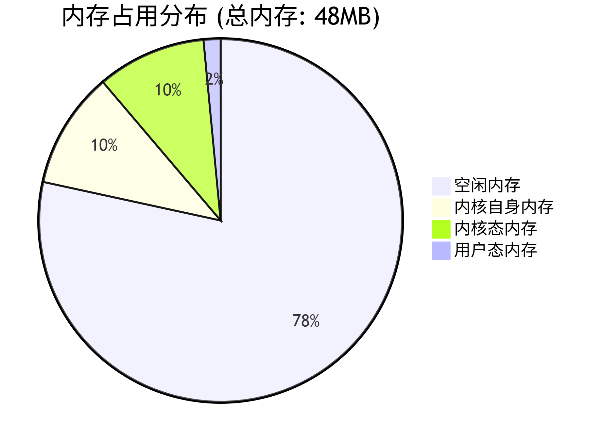
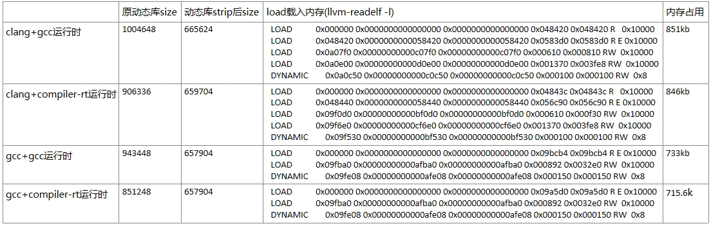
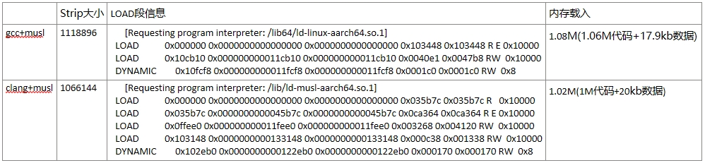

.. _miniaturization_features:

小型化特性
============

小型化分为二进制小型化和内存小型化，有些应用场景对镜像二进制大小有严格的限制，而有些应用场景则对系统OS的运行内存有着严格的限制。openEuler Embedded在小型化方面专门针对内存受限环境做了很多研究，这其中包括编译链的优化对比、内核的精简化裁剪、文件系统的精简、系统文件挂载的优化。

我们在OEE已支持的hipico单板上进行的研究，采用clang+musl编译链，小型化内存数据如下：

.. list-table:: OEE小型化内存数据
    :widths: auto
    :header-rows: 1

    * - 
      - OS裁剪
    * - 物理可用内存
      - 48M
    * - 总使用内存
      - 10.97M
    * - 内核自身内存
      - 4.98M
    * - 内核态内存
      - 2.96M
    * - 用户态内存
      - 0.722M

内核态内存定义：SUnreclaim(不可回收)+KernelStack(内核栈)+PageTables(页表)+VmallocUsed(已分配内存)+Percpu(CPU缓存)

用户态内存定义：Active(活动内存)+Inactive(不活动内存)

二进制小型化数据：

.. list-table:: 系统组件大小
   :widths: 20 20
   :header-rows: 1

   * - 组件
     - 大小
   * - 内核二进制
     - 1.4M
   * - 根文件二进制
     - 3.79M

编译链的优化对比
------------------

编译链对比
:::::::::::::

gcc与clang的对比
++++++++++++++++++++
    
GCC原名是GNU C Compiler，是GNU项目的C语言编译器，其功能强大。

1. 支持语言

  - C、C++、Fortran、Pascal、Objective-C、Java、Ada、Go等。

2. 跨平台与兼容性

  - 操作系统：Linux、Windows、macOS等。
  - 硬件架构：X86、ARM等多种CPU指令集。
  - Linux内核等开源项目的准编译器。

3. 核心优点

  - 多语言支持： 支持多种编程语言,如C、C++、Fortran、Pascal、Objective-C、Java、Ada、Go等。
  - 跨平台性： GCC编译器能够在不同的操作系统和硬件平台上编译和运行代码，确保了代码的高度可移植性。
  - 性能优化： GCC编译器内置了多种优化策略，可以根据不同的编译选项进行代码优化，从而提升程序的运行效率。
  - 功能丰富： 编译时可生成调试信息，便于开发者进行调试。并提供了广泛的编译选项和扩展功能，以满足不同开发者的需求。
  - 社区支持： GCC编译器是一个开源项目，有一个活跃的社区支持，开发者可以从社区获取帮助、分享经验和贡献代码。
    
Clang是一个由 LLVM 项目开发的 C、C++、Objective-C 等编程语言的编译器前端。它旨在提供更快的编译速度、更好的错误报告及与GCC兼容的编译器驱动程序。Clang 是 LLVM 编译器基础设施的一部分，通常与 LLVM 后端一起使用来生成机器代码。Clang的主要特点包括：  

1. 核心特点

  - 高效性：编译速度更快，内存占用低于GCC。
  - 友好诊断：提供清晰详尽的错误/警告信息。
  - GCC兼容性：支持多数GCC选项，便于迁移。
  - 模块化架构：易于扩展和集成到其他工具链。
  - 现代语言支持：适配最新C++标准等特性。

2. 工具生态

  - 静态分析工具（clang-tidy）
  - 代码格式化工具（clang-format）
  - 重构工具等，提升代码质量与开发效率。

glibc与musl的对比
+++++++++++++++++++++

glibc是GNU C Library（glibc），GNU项目的C/C++标准库实现。

1. 核心特性

  - 功能全面：支持国际化、本地化、调试及性能优化等扩展功能
  - 高兼容性：广泛遵循各类标准，适配多架构（如x86/ARM）和操作系统
  - Linux默认：主流Linux系统的标准C库

2. 设计权衡

  - 优势：功能丰富，兼容性强
  - 代价：代码量大导致编译速度慢，依赖项较多

musl是一个轻量级C/C++标准库，注重代码质量和安全性。

1. 核心特性

  - 高效：代码精简，编译速度快，无额外依赖。
  - 嵌入式友好：适合资源受限场景（如嵌入式系统）。
  - 关键优势：静态链接、实时性、内存高效、源码级兼容性。

2. 发展现状

  - 活跃开源项目，拥有积极开发者社区。
  - 已被多个Linux发行版采用，如Alpine Linux、Arch Linux等。

3. 优势

  - 代码量小：相比glibc，musl的代码量更少，编译速度更快。
  - 内存占用低：musl的静态链接特性使得生成的可执行文件占用的内存更少。
  - 安全性高：musl的设计注重安全性，避免了一些glibc中的安全问题。
  - 兼容性好：musl支持大多数的C标准库函数，并且与glibc兼容。

各编译链的编译数据对比
::::::::::::::::::::::::::

gcc与clang的编译数据对比(musl库)
+++++++++++++++++++++++++++++++++++

clang+musl对busybox的编译数据对比
+++++++++++++++++++++++++++++++++++++

编译链的制作
:::::::::::::

前置条件准备（可选手动或自动下载）
+++++++++++++++++++++++++++++++++++++

制作clang+musl ARM32交叉编译链前，需要准备以下前置条件：

1. 准备32位gcc+musl编译链

  可以直接从openEuler Embedded的源码仓发布件下载，发布件名称为openeuler_gcc_arm32le-musl，该编译链在后续步骤中作为compiler-rt和libunwind的交叉编译基础运行时库使用。

2. 准备编译链源码

  llvm-project源码为：https://atomgit.com/openeuler/llvm-project 这里我们选用dev_19.1.7版本,执行以下命令下载llvm-project源码：
        
  .. code::

    git clone https://atomgit.com/openeuler/llvm-project.git -b dev_19.1.7 --depth=1
        
  musl源码为：https://atomgit.com/src-openeuler/musl.git，这里我们参考manifest.yaml中的musl版本，执行以下命令下载musl源码：
        
  .. code::

      git init openeuler-musl
      cd openeuler-musl
      git remote add origin https://atomgit.com/src-openeuler/musl.git
      git fetch origin <version> --depth=1
      git checkout <version>

方式一：使用脚本一键下载并制作（推荐）
+++++++++++++++++++++++++++++++++++++++

openEuler Embedded提供了完整的编译链制作工具链，位于 ``yocto-meta-openeuler`` 代码仓的 ``.oebuild/arm32-clang-musl-toolchain/`` 目录下，可自动完成前置依赖下载和编译链构建，无需手动操作。

1. 下载前置依赖

  运行 ``prepare.sh`` 可自动下载32位gcc+musl编译链（分块文件自动合并解压）、llvm-project源码、musl源码：

  .. code::

      sh arm32-clang-musl-toolchain/prepare.sh <work_dir>

  其中 ``<work_dir>`` 为工作目录，所有依赖将下载到该目录下的 ``open_source/`` 子目录中。若不指定，默认使用脚本所在目录。

  所有版本参数（gcc-musl分块数量、llvm分支、musl commit hash等）集中在 ``configs/config.xml`` 中管理，便于后续版本更新。

2. 构建编译链

  前置依赖下载完成后，运行 ``build-llvm-musl-arm32.sh`` 一键构建：

  .. code::

      cd <work_dir>
      ./arm32-clang-musl-toolchain/build-llvm-musl-arm32.sh all \
          --gcc-dir ./open_source/openeuler_gcc_arm32le-musl \
          --llvm-src ./open_source/llvm-project \
          --musl-src ./open_source/openeuler-musl/ \
          --output-dir ./toolchain

构建完成后，编译链安装在 ``<work_dir>/toolchain/llvm-musl-arm/`` 目录下。

  ``build-llvm-musl-arm32.sh`` 会自动完成以下7个步骤：

  1. 检查前置条件（cmake、ninja等）
  2. 拷贝源码到输出目录并应用compiler-rt和libunwind补丁
  3. 构建LLVM/Clang/LLD
  4. 构建compiler-rt（ARM运行时库）
  5. 构建libunwind（ARM异常处理库）
  6. 构建musl C库
  7. 设置sysroot、创建符号链接、验证编译链

  更详细的使用说明请参考 ``.oebuild/arm32-clang-musl-toolchain/README.md``。

方式二：手动逐步制作
+++++++++++++++++++++

  后续步骤中，设定安装目录为 ``<toolchain-dir>`` （如 ``/home/user/toolchain/llvm-musl-arm``），设定gcc-musl编译链目录为 ``<gcc-musl-dir>`` （如 ``./openeuler_gcc_arm32le-musl``），请根据实际路径替换。

3. 单步编译LLVM/Clang/LLD

  .. code::

      cd llvm-project
      mkdir build-llvm
      cd build-llvm
      cmake -G Ninja ../llvm \
      -DCMAKE_BUILD_TYPE=Release \
      -DLLVM_ENABLE_PROJECTS="clang;lld" \
      -DLLVM_TARGETS_TO_BUILD="ARM" \
      -DLLVM_DEFAULT_TARGET_TRIPLE=arm-openeuler-linux-musleabi \
      -DCMAKE_INSTALL_PREFIX=<toolchain-dir> \
      -DLLVM_ENABLE_RTTI=ON \
      -DLLVM_ENABLE_TERMINFO=OFF \
      -DLLVM_ENABLE_LIBXML2=OFF \
      -DLLVM_ENABLE_ZLIB=OFF \
      -DLLVM_ENABLE_ZSTD=OFF \
      -DLLVM_BUILD_UTILS=OFF \
      -DLLVM_BUILD_TESTS=OFF \
      -DLLVM_INCLUDE_TESTS=OFF \
      -DLLVM_INCLUDE_BENCHMARKS=OFF \
      -DLLVM_INCLUDE_DOCS=OFF \
      -DLLVM_INCLUDE_EXAMPLES=OFF \
      -DCLANG_ENABLE_ARCMT=OFF \
      -DCLANG_ENABLE_STATIC_ANALYZER=OFF \
      -DCLANG_INCLUDE_TESTS=OFF \
      -DLLVM_ENABLE_PIC=ON
      cmake --build . -j$(nproc)
      cmake --install .
    
  将clang编译器加入到PATH路径中，例如：

  .. code::

      export PATH=<toolchain-dir>/bin:$PATH

4. 修改compiler-rt源码并编译

  musl libc不提供单独的stat64结构体，在设定_FILE_OFFSET_BITS=64时，musl的<sys/stat.h>中的stat就是64位版本，因此需要将compiler-rt中sanitizer相关的stat64调用改为stat。

  修改 ``sanitizer_platform_limits_posix.h`` ，在 ``SANITIZER_HAS_STAT64`` 和 ``SANITIZER_HAS_STATFS64`` 的条件判断中，为非glibc/Android平台添加置0的分支：

  .. code::

      // 原代码：
      #elif SANITIZER_GLIBC || SANITIZER_ANDROID
      #define SANITIZER_HAS_STAT64 1
      #define SANITIZER_HAS_STATFS64 1
      #endif

      // 修改为：
      #elif SANITIZER_GLIBC || SANITIZER_ANDROID
      #define SANITIZER_HAS_STAT64 1
      #define SANITIZER_HAS_STATFS64 1
      #else
      #define SANITIZER_HAS_STAT64 0
      #define SANITIZER_HAS_STATFS64 0
      #endif

  修改 ``sanitizer_linux.cpp`` ，将所有 ``stat64`` 相关调用替换为 ``stat``：

  - 删除 ``stat64_to_stat`` 函数定义
  - 将 ``internal_stat`` 中的 ``fstatat64`` 系统调用替换为 ``stat`` 系统调用
  - 将 ``internal_lstat`` 中的 ``fstatat64`` 系统调用替换为 ``lstat`` 系统调用
  - 将 ``internal_fstat`` 中的 ``fstat64`` 系统调用替换为 ``fstat`` 系统调用

  编译compiler-rt需要用到gcc的运行时库，前面准备好的32位gcc+musl编译链在此使用。注意编译ARM32目标时 ``CMAKE_SIZEOF_VOID_P`` 应设为4（而非8），且编译参数需包含 ``--target``、``--sysroot``、``--gcc-toolchain`` 以正确指定交叉编译目标：

  .. code::

      cd llvm-project
      mkdir build-compiler-rt
      cd build-compiler-rt
      cmake -G Ninja ../compiler-rt \
      -DCOMPILER_RT_BUILD_BUILTINS=ON \
      -DCOMPILER_RT_INCLUDE_TESTS=OFF \
      -DCOMPILER_RT_BUILD_SANITIZERS=OFF \
      -DCOMPILER_RT_BUILD_XRAY=OFF \
      -DCOMPILER_RT_BUILD_LIBFUZZER=OFF \
      -DCOMPILER_RT_BUILD_PROFILE=OFF \
      -DCOMPILER_RT_BUILD_MEMPROF=OFF \
      -DCOMPILER_RT_DEFAULT_TARGET_ONLY=ON \
      -DCMAKE_C_COMPILER=<toolchain-dir>/bin/clang \
      -DCMAKE_CXX_COMPILER=<toolchain-dir>/bin/clang++ \
      -DCMAKE_AR=<toolchain-dir>/bin/llvm-ar \
      -DCMAKE_NM=<toolchain-dir>/bin/llvm-nm \
      -DCMAKE_RANLIB=<toolchain-dir>/bin/llvm-ranlib \
      -DCMAKE_LINKER=<toolchain-dir>/bin/ld.lld \
      -DCMAKE_C_COMPILER_TARGET="arm-openeuler-linux-musleabi" \
      -DCMAKE_C_FLAGS="--target=arm-openeuler-linux-musleabi --sysroot=<gcc-musl-dir>/arm-openeuler-linux-musleabi/sysroot --gcc-toolchain=<gcc-musl-dir> -march=armv7-a -mfpu=vfpv3-d16 -mfloat-abi=hard -fuse-ld=lld" \
      -DCMAKE_CXX_FLAGS="--target=arm-openeuler-linux-musleabi --sysroot=<gcc-musl-dir>/arm-openeuler-linux-musleabi/sysroot --gcc-toolchain=<gcc-musl-dir> -march=armv7-a -mfpu=vfpv3-d16 -mfloat-abi=hard -fuse-ld=lld" \
      -DCMAKE_ASM_FLAGS="--target=arm-openeuler-linux-musleabi -march=armv7-a -mfpu=vfpv3-d16 -mfloat-abi=hard" \
      -DCMAKE_EXE_LINKER_FLAGS="-fuse-ld=lld" \
      -DCMAKE_INSTALL_PREFIX=<toolchain-dir> \
      -DCMAKE_BUILD_TYPE=Release \
      -DLLVM_CONFIG_PATH=<toolchain-dir>/bin/llvm-config
      cmake --build . -j$(nproc)
      cmake --install .

  将compiler-rt builtins库复制到clang资源目录：

  .. code::

      mkdir -p <toolchain-dir>/lib/clang/19/lib/arm-openeuler-linux-musleabi
      cp <toolchain-dir>/lib/linux/libclang_rt.builtins-arm.a \
         <toolchain-dir>/lib/clang/19/lib/arm-openeuler-linux-musleabi/libclang_rt.builtins.a

5. 编译musl

  首先解压musl源码tar包：

  .. code::

      cd openeuler-musl
      tar xzf musl-1.2.4.tar.gz

  创建交叉编译器符号链接，并将工具链bin目录加入PATH：

  .. code::

      cd <toolchain-dir>/bin
      ln -sf clang arm-openeuler-linux-musleabi-clang
      ln -sf clang++ arm-openeuler-linux-musleabi-clang++
      ln -sf clang-cpp arm-openeuler-linux-musleabi-clang-cpp
      ln -sf lld arm-openeuler-linux-musleabi-ld
      ln -sf lld arm-openeuler-linux-musleabi-ld.lld
      ln -sf llvm-ar arm-openeuler-linux-musleabi-ar
      ln -sf llvm-nm arm-openeuler-linux-musleabi-nm
      ln -sf llvm-objcopy arm-openeuler-linux-musleabi-objcopy
      ln -sf llvm-objdump arm-openeuler-linux-musleabi-objdump
      ln -sf llvm-ranlib arm-openeuler-linux-musleabi-ranlib
      ln -sf llvm-readelf arm-openeuler-linux-musleabi-readelf
      ln -sf llvm-strip arm-openeuler-linux-musleabi-strip
      ln -sf llvm-strings arm-openeuler-linux-musleabi-strings
      export PATH=<toolchain-dir>/bin:$PATH

  编译musl时CC参数需包含 ``--target``、``-march``、``-mfpu``、``-mfloat-abi``、``-rtlib=compiler-rt`` 和 ``-fuse-ld=lld``，以正确指定交叉编译目标和运行时库：

  .. code::

      mkdir build-musl
      cd build-musl
      CC="<toolchain-dir>/bin/clang --target=arm-openeuler-linux-musleabi -march=armv7-a -mfpu=vfpv3-d16 -mfloat-abi=hard -rtlib=compiler-rt -fuse-ld=lld" \
      ../musl-1.2.4/configure \
          --target=arm-openeuler-linux-musleabi \
          --prefix=/usr \
          --disable-wrapper \
          --enable-static \
          --enable-shared
      make -j$(nproc)
      make DESTDIR=<toolchain-dir>/arm-openeuler-linux-musleabi/sysroot install

6. 编译libunwind

  编译libunwind需要应用两个补丁：

  补丁1：在 ``libunwind/CMakeLists.txt`` 中添加 ``LIBUNWIND_ENABLE_ASSEMBLY`` 选项，在 ``LIBUNWIND_ENABLE_FRAME_APIS`` 选项行后添加：

  .. code::

      option(LIBUNWIND_ENABLE_ASSEMBLY "Enable assembly support" ON)

  补丁2：在 ``libunwind/src/CMakeLists.txt`` 文件首行添加 ``enable_language(ASM)`` 以启用ASM语言支持。

  .. warning::

      **重要**：切勿在 ``libunwind/src/CMakeLists.txt`` 中使用 ``set(CMAKE_C_FLAGS "...")`` 或 ``set(CMAKE_CXX_FLAGS "...")`` 来设置ARM编译选项。这些 ``set()`` 调用会覆盖通过 ``-DCMAKE_C_FLAGS`` / ``-DCMAKE_CXX_FLAGS`` 命令行传入的交叉编译参数（``--target``、``--sysroot``、``--gcc-toolchain``），导致编译器回退使用宿主机的系统头文件，产生架构不兼容错误。ARM相关编译选项应通过cmake命令行的 ``-DCMAKE_C_FLAGS`` / ``-DCMAKE_CXX_FLAGS`` 参数传入。

  同时注意：libunwind的 ``CMAKE_CXX_FLAGS`` 中应使用 ``-nostdinc++`` （仅排除C++标准库头文件），而**不要**使用 ``-nostdinc`` （会排除所有标准C头文件包括 ``stdint.h``、``assert.h`` 等）。因为 ``--target`` + ``--sysroot`` + ``--gcc-toolchain`` 已能正确将C头文件搜索重定向到目标sysroot，无需 ``-nostdinc``。

  执行libunwind编译命令：

  .. code::

      mkdir build-libunwind
      cd build-libunwind
      cmake -G Ninja ../libunwind \
      -DCMAKE_C_COMPILER=<toolchain-dir>/bin/clang \
      -DCMAKE_CXX_COMPILER=<toolchain-dir>/bin/clang++ \
      -DCMAKE_AR=<toolchain-dir>/bin/llvm-ar \
      -DCMAKE_NM=<toolchain-dir>/bin/llvm-nm \
      -DCMAKE_RANLIB=<toolchain-dir>/bin/llvm-ranlib \
      -DCMAKE_LINKER=<toolchain-dir>/bin/ld.lld \
      -DCMAKE_C_FLAGS="--target=arm-openeuler-linux-musleabi --sysroot=<gcc-musl-dir>/arm-openeuler-linux-musleabi/sysroot --gcc-toolchain=<gcc-musl-dir> -march=armv7-a -mfpu=vfpv3-d16 -mfloat-abi=hard -D_LIBUNWIND_IS_BAREMETAL=1 -fuse-ld=lld" \
      -DCMAKE_CXX_FLAGS="--target=arm-openeuler-linux-musleabi --sysroot=<gcc-musl-dir>/arm-openeuler-linux-musleabi/sysroot --gcc-toolchain=<gcc-musl-dir> -march=armv7-a -mfpu=vfpv3-d16 -mfloat-abi=hard -D_LIBUNWIND_IS_BAREMETAL=1 -nostdinc++ -fuse-ld=lld" \
      -DCMAKE_EXE_LINKER_FLAGS="-fuse-ld=lld" \
      -DCMAKE_INSTALL_PREFIX=<toolchain-dir> \
      -DCMAKE_BUILD_TYPE=Release \
      -DLIBUNWIND_ENABLE_SHARED=ON \
      -DLIBUNWIND_ENABLE_STATIC=ON \
      -DLIBUNWIND_ENABLE_CROSS_UNWINDING=ON \
      -DLIBUNWIND_ENABLE_ARM_WMMX=OFF \
      -DLIBUNWIND_ENABLE_ASSEMBLY=ON \
      -DLIBUNWIND_USE_COMPILER_RT=ON \
      -DLIBUNWIND_INSTALL_HEADERS=ON \
      -DLLVM_PATH=<llvm-project-src-dir> \
      -DLLVM_ENABLE_RTTI=ON
      cmake --build . -j$(nproc)
      cmake --install .

7. 设置sysroot

  将gcc运行时库、头文件复制到工具链sysroot中：

  .. code::

      GCC_VERSION=$(ls <gcc-musl-dir>/lib/gcc/arm-openeuler-linux-musleabi/ | head -1)
      mkdir -p <toolchain-dir>/arm-openeuler-linux-musleabi/sysroot/lib
      cp -a <gcc-musl-dir>/arm-openeuler-linux-musleabi/sysroot/lib/* <toolchain-dir>/arm-openeuler-linux-musleabi/sysroot/lib/
      mkdir -p <toolchain-dir>/lib/gcc/arm-openeuler-linux-musleabi/$GCC_VERSION
      cp -a <gcc-musl-dir>/lib/gcc/arm-openeuler-linux-musleabi/$GCC_VERSION/* <toolchain-dir>/lib/gcc/arm-openeuler-linux-musleabi/$GCC_VERSION/
      mkdir -p <toolchain-dir>/arm-openeuler-linux-musleabi/sysroot/usr/include
      cp -a <gcc-musl-dir>/arm-openeuler-linux-musleabi/include/* <toolchain-dir>/arm-openeuler-linux-musleabi/sysroot/usr/include/

  至此，llvm-musl-arm编译链制作完毕

编译链总结
:::::::::::::::::

专为小而美场景设计，牺牲兼容性与性能换取极致精简，选型前需严格评估生态依赖。

1. 核心优势

  - 极简轻量：静态链接仅10KB，动态约50KB，远超Glibc效率，适合嵌入式/IoT设备。

  - 全LLVM生态：Clang+Musl+LLD无缝协作，避免GNU依赖，支持交叉编译（ARM/RISC-V等）。

  - 高安全性：静态二进制减少动态库注入风险，适配安全固件和容器（如Alpine Linux）。 

2. 主要局限

  - 性能短板：未优化NEON指令，计算密集型场景性能落后Glibc达1.5倍。

  - 兼容性差：GNU软件（如MariaDB）需大量补丁，动态链接生态薄弱。

  - 调试困难：缺乏ftrace/kprobes，IDE支持不完善。

3. 适用场景

  - 推荐：资源受限设备、静态容器镜像、隔离环境。

  - 避免：高性能计算、复杂网络服务、多用户系统。

内核精简
-----------
    
内核优化后的数据
:::::::::::::::::

.. list-table:: 第一组内核数据对比
    :widths: 25 25 25 25
    :header-rows: 1

    * - 数据类型
      - 自身二进制大小
      - 自身占用内存大小
      - 内核态内存大小
    * - 数据值
      - 1.4M
      - 4.98M
      - 2.96M

.. list-table:: meminfo数据
    :widths: 25 25 25 25
    :header-rows: 1

    * - 项目
      - 值
      - 项目
      - 值
    * - MemTotal
      - 44052 kB
      - MemFree
      - 37884 kB
    * - MemAvailable
      - 37904 kB
      - Buffers
      - 288 kB
    * - Cached
      - 1480 kB
      - SwapCached
      - 0 kB
    * - Active
      - 1472 kB
      - Inactive
      - 428 kB
    * - Active(anon)
      - 0 kB
      - Inactive(anon)
      - 136 kB
    * - Active(file)
      - 1472 kB
      - Inactive(file)
      - 292 kB
    * - Unevictable
      - 4 kB
      - Mlocked
      - 0 kB
    * - SwapTotal
      - 0 kB
      - SwapFree
      - 0 kB
    * - Dirty
      - 0 kB
      - Writeback
      - 0 kB
    * - AnonPages
      - 164 kB
      - Mapped
      - 1124 kB
    * - Shmem
      - 0 kB
      - KReclaimable
      - 740 kB
    * - Slab
      - 3076 kB
      - SReclaimable
      - 740 kB
    * - SUnreclaim
      - 2336 kB
      - KernelStack
      - 320 kB
    * - PageTables
      - 84 kB
      - NFS_Unstable
      - 0 kB
    * - Bounce
      - 0 kB
      - WritebackTmp
      - 0 kB
    * - CommitLimit
      - 22024 kB
      - Committed_AS
      - 1012 kB
    * - VmallocTotal
      - 1245184 kB
      - VmallocUsed
      - 180 kB
    * - VmallocChunk
      - 0 kB
      - Percpu
      - 112 kB

内核各个特性对内存的影响
:::::::::::::::::::::::::

以下表格列举了内核各个特性对内存的影响，计算方式每次配置的变动计算（memtotal-memavailable）的差值：
    
.. list-table:: 内核特性内存收益对比
  :widths: 20 15 30
  :header-rows: 1

  * - 特性
    - 内存收益(kb)
    - 说明
  * - DRM
    - 2592
    - 图形硬件渲染
  * - NVMEM
    - 124
    - 管理非易失性存储器
  * - VFAT_FS
    - 492
    - 支持VFAT文件系统
  * - MTD
    - 2464
    - 闪存设备存储管理框架
  * - INET&NETDEVICE
    - 640
    - 网络设备驱动框架
  * - ATA&SCSI
    - 112
    - 硬盘存储设备的接口支持
  * - USB
    - 16
    - 支持USB相关设备
  * - I2C
    - 132
    - 支持I2C相关设备
  * - NETWORK
    - 96
    - 控制基础网络栈和网络设备通信
  * - HID基本配置
    - 40
    - 人机交互
  * - DEBUG_INFO
    - 124
    - 调试开关
  * - SLUB_DEBUG
    - 140
    - SLUB分配器调试开关
  * - Export Users优化
    - 232
    - 管理用户环境
  * - KCMP&RSEQ
    - 4
    - 进程间交互与线程同步
  * - SLAB&SLUB优化
    - 1200
    - 内存分配器
  * - KABI_RESERVE&PROFILING
    - 108
    - 内存分配器
  * - Power manager优化
    - 216
    - 电源管理优化
  * - Mem manager优化
    - 196
    - 内存管理优化
  * - Driver device优化
    - 124
    - 外部设备优化
  * - MOUSE_PS2相关配置
    - 8
    - PS2接口的鼠标驱动

内核精简总结
::::::::::::::::::

这是一个为海思ARM芯片深度优化的极简内核，具备强悍的闪存支持和实时性，但牺牲了网络、多用户等通用功能，适合单一功能的低资源嵌入式设备。

.. list-table:: 关键特性矩阵
   :widths: 20 40 40
   :header-rows: 1

   * - 类别
     - 已启用特性
     - 缺失特性
   * - 硬件支持
     - ARMv7多核（SMP）、NEON/VFPv3、SPI/I2C/GPIO外设、MTD/NAND闪存
     - USB、网络设备、PCIe
   * - 存储
     - UBI/UBIFS闪存文件系统、XZ压缩内核
     - 交换分区（SWAP）、EXT4/Btrfs
   * - 安全
     - 内核代码段只读、Spectre分支预测硬化
     - Seccomp沙箱、审计子系统
   * - 调试
     - Magic SysRq、OOPS触发Panic
     - ftrace、kprobes、KGDB
   * - 用户空间
     - 基础SysV IPC、静态二进制支持
     - 多用户、动态链接库、POSIX定时器

典型应用场景

- 推荐场景

  1. 离线视频采集（海思芯片核心用途）
  2. GPIO控制的工业设备（如PLC控制器）
  3. 只读嵌入式系统（UBIFS+MTD闪存方案）

- 禁忌场景

  1. 需要网络连接的网关设备
  2. 多用户服务器或容器平台
  3. 高性能计算（无NEON优化/io_uring）

文件系统精简
-------------

文件系统的数据
::::::::::::::::::

.. list-table:: 文件系统数据示例
    :widths: 33 33 33
    :header-rows: 1

    * - 
      - 用户态内存
      - 进程数
    * - 数据
      - 700kB
      - 36

以下是进程列表，其中ps为获取进程数进程，不计算在内：

.. list-table:: 进程列表
    :widths: 10 10 10 10 10
    :header-rows: 1

    * - PID
      - USER
      - VSZ
      - STAT
      - COMMAND
    * - 1
      - 0
      - 1784
      - S
      - init
    * - 2
      - 0
      - 0
      - SW
      - [kthreadd]
    * - 3
      - 0
      - 0
      - IW<
      - [rcu_gp]
    * - 4
      - 0
      - 0
      - IW<
      - [rcu_par_gp]
    * - 5
      - 0
      - 0
      - IW
      - [kworker/0:0-eve]
    * - 6
      - 0
      - 0
      - IW<
      - [kworker/0:0H-kb]
    * - 8
      - 0
      - 0
      - IW<
      - [mm_percpu_wq]
    * - 9
      - 0
      - 0
      - SW
      - [ksoftirqd/0]
    * - 10
      - 0
      - 0
      - IW
      - [rcu_sched]
    * - 11
      - 0
      - 0
      - SW
      - [migration/0]
    * - 12
      - 0
      - 0
      - SW
      - [cpuhp/0]
    * - 13
      - 0
      - 0
      - SW
      - [cpuhp/1]
    * - 14
      - 0
      - 0
      - SW
      - [migration/1]
    * - 15
      - 0
      - 0
      - SW
      - [ksoftirqd/1]
    * - 17
      - 0
      - 0
      - IW<
      - [kworker/1:0H-kb]
    * - 18
      - 0
      - 0
      - SW
      - [kdevtmpfs]
    * - 19
      - 0
      - 0
      - IW
      - [kworker/u4:1-ev]
    * - 56
      - 0
      - 0
      - IW
      - [kworker/u4:2-ev]
    * - 96
      - 0
      - 0
      - SW
      - [oom_reaper]
    * - 97
      - 0
      - 0
      - IW<
      - [writeback]
    * - 98
      - 0
      - 0
      - SW
      - [kcompactd0]
    * - 100
      - 0
      - 0
      - SWN
      - [ksmd]
    * - 106
      - 0
      - 0
      - IW
      - [kworker/0:1-eve]
    * - 122
      - 0
      - 0
      - IW<
      - [kblockd]
    * - 126
      - 0
      - 0
      - SW
      - [spi0]
    * - 132
      - 0
      - 0
      - SW
      - [spi1]
    * - 133
      - 0
      - 0
      - IW
      - [kworker/1:2-rcu]
    * - 140
      - 0
      - 0
      - IW<
      - [devfreq_wq]
    * - 143
      - 0
      - 0
      - IW
      - ``[kworker/1:3-mm_]``
    * - 231
      - 0
      - 0
      - SW
      - [kswapd0]
    * - 376
      - 0
      - 0
      - IW<
      - [kworker/1:1H-kb]
    * - 377
      - 0
      - 0
      - SW
      - [jbd2/mtdblock3-]
    * - 378
      - 0
      - 0
      - IW<
      - [ext4-rsv-conver]
    * - 385
      - 0
      - 1788
      - S
      - -/bin/sh
    * - 386
      - 0
      - 1784
      - S
      - init
    * - 387
      - 0
      - 1784
      - S
      - init
    * - 388
      - 0
      - 1784
      - S
      - init
    * - 398
      - 0
      - 0
      - IW<
      - [kworker/0:1H-kb]

文件系统的组成
::::::::::::::::::

.. list-table:: 新添加的三行三列表格
    :widths: 33 33 33
    :header-rows: 1

    * - 
      - busybox
      - musl
    * - 二进制大小
      - 946k
      - 658k
    * - 静态内存大小
      - 982.6k
      - 661.6k

根文件系统精简总结
::::::::::::::::::

以牺牲功能和生态为代价，实现最小化部署，适合对体积和启动速度敏感的场景。

适用场景

  - 推荐：嵌入式设备、救援系统、极简容器镜像（如Alpine基础层）。

  - 避免：需要复杂服务管理或多用户管理的系统。

镜像构建与烧录
::::::::::::::::::

构建镜像

.. code::

    // 在platform选hipico，在feature选minimal
    bitbake generate
    // 进入build/hipico目录，
    oebuild bitbake
    // 进入bitbake构建交互环境
    bitbake openeuler-image-minimal
    // 构建完成后在output目录下有内核镜像和根文件系统，拷贝uImage，以及ext4文件到win系统下

烧录镜像

镜像烧录参考 :ref:`hipico-burn`

启动注意事项

在烧录完成后按rst，重新上电，然后迅速按ctrl+c进入uboot系统，修改bootargs参数如下：

.. code::

    setenv mem=48M console=ttyAMA0,115200 clk_ignore_unused root=/dev/mtdblock3 rootfstype=ext4 rw mtdparts=nand:512K(boot),512K(env),7M(kernel),120M(rootfs)
    saveenv  // 可选，如果不保存，每次上电都需要重新设置

然后执行boot命令

系统小型化优化策略
======================

系统小型化的核心目标是 减少存储占用（Flash）和运行时内存（RAM），同时保证功能完整性和性能稳定性，以下是一些实现小型化的思路：

工具链优化
-------------

编译器选择

- 优先使用 Clang + LLD（替代GCC + GNU ld）
  - LLVM工具链生成的代码更紧凑
  - 支持更好的优化选项
- 若必须用GCC：
  - 开启 -Os（优化体积）
  - 或 -Oz（Clang特有，更激进优化）

标准库选择

- 使用 Musl libc（替代Glibc）
  - 体积更小（静态链接可<100KB）
  - 无冗余功能
- 避免动态链接（除非必须）
  - 静态链接能减少依赖
  - 需注意代码膨胀问题

内核裁剪
--------------

Linux内核配置

- 使用 make tinyconfig 生成最小配置
  - 按需添加驱动和功能
- 禁用无用模块：
  - USB、网络等非必要模块
  - 调试符号 CONFIG_DEBUG_INFO=n
- 启用特殊选项：
  - CONFIG_EMBEDDED
  - CONFIG_EXPERT

内核压缩

- 选择 XZ（高压缩比）
- 或 LZ4（低解压开销）

根文件系统优化
----------------

BusyBox配置

- 替代完整Shell工具集（bash/coreutils）
  - 静态编译后仅1~2MB
- 裁剪无用命令：
  - make menuconfig 选择必需功能

Init系统选择

- 使用 BusyBox init
- 或 s6-overlay（替代systemd）

文件系统选择

- SquashFS（只读压缩文件系统）
- UBIFS（NAND闪存优化）
- 移除 /etc、/var 冗余文件
- 使用 tmpfs 存放临时数据
