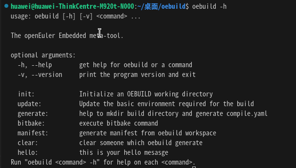

.. _develop_index:

开发者指南
##########

该章节用于介绍开发者如何在oebuild上进行开发命令插件。整个oebuild的设计模式采用了对象创建型模式，主体框架已经开发完毕，因此开发者仅需要实现命令插件即可。

oebuild是用python3开发的，因此在做开发工作前请先安装好python3相关的语言环境，并安装好pip3命令。在这里对python3与pip3的安装不再做详细说明，请自行实现。

新命令插件的开发仅需要实现以下几步即可（以下以hello命令为范例进行讲解）：

1. 将oebuild源码clone到本地，使用如下命令：

.. code-block:: console

    git clone https://gitee.com/openeuler/oebuild.git

2. 将oebuild以开发模式安装到本地，使用如下命令：

.. code-block:: console

    # 进入oebuild目录
    cd oebuild
    # 以开发模式将oebuild安装到本地
    pip3 install -e .

3. 在plugins创建hello目录，使用如下命令：

.. code-block:: console

    mkdir -p src/oebuild/app/plugins/hello

4. 复制plugins同目录下demo/demo.py到hello/hello.py，使用如下命令：

.. code-block:: console

    cd src/oebuild/app/plugins/hello
    cp ../demo/demo.py hello.py

5. 适配hello.py代码，demo.py代码如下：

:: 

    import argparse
    import textwrap
    import logging

    from oebuild.command import OebuildCommand
    from oebuild.util import *
    from oebuild.configure import Configure

    logger = logging.getLogger()

    class Demo(OebuildCommand):

        def __init__(self):
            self.configure = Configure()
            super().__init__(
                name='{}',
                help='this is your help mesasge',
                description=textwrap.dedent('''\
                this is your description message
    '''
            ))

        def do_add_parser(self, parser_adder) -> argparse.ArgumentParser:
            parser = self._parser(
                parser_adder,
                usage='''

    %(prog)s [-x xxx]

    ''')

            return parser

        def do_run(self, args: argparse.Namespace, unknown = None):
            args = args.parse_args(unknown)
            pass

将上述代码改为下述代码：

::

    import argparse
    import textwrap
    import logging

    from oebuild.command import OebuildCommand
    from oebuild.util import *
    from oebuild.configure import Configure

    logger = logging.getLogger()

    class Hello(OebuildCommand):

        def __init__(self):
            self.configure = Configure()
            super().__init__(
                'hello',
                'this is your hello mesasge',
                textwrap.dedent('''\
                this is hello description
    '''
            ))

        def do_add_parser(self, parser_adder) -> argparse.ArgumentParser:
            parser = self._parser(
                parser_adder,
                usage='''

    %(prog)s [-x xxx]

    ''')

            return parser

        def do_run(self, args: argparse.Namespace, unknown = None):
            args = args.parse_args(unknown)

            # this is your function code
            print("hello world")

.. note:: oebuild中对于二级参数使用了argparse命令解析类，对于二级命令参数的添加请详细了解 `https://docs.python.org/zh-cn/3.10/howto/argparse.html` 。

6. 将hello命令加入命令插件文件，将如下hello插件参数添加到 `src/oebuild/app/conf/plugins.yaml` ：

::

    - name: hello
      class: Hello
      path: plugins/hello/hello.py

7. 运行hello命令，使用如下命令：

.. code-block:: console

    oebuild hello

查看oebuild帮助命令：

.. code-block:: console

    oebuild -h

如下图所示：

可以看到，oebuild已经出现了hello命令。

在执行 `oebuild hello` 命令后如下图所示：

.. image:: ../../_static/images/develop/hello.png

在这里真实要实现的功能代码在do_run函数中。
