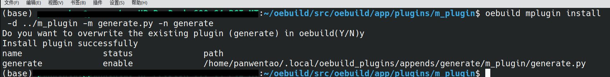
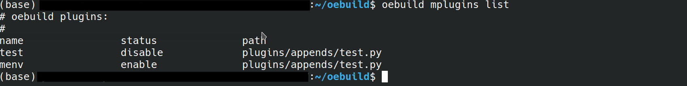
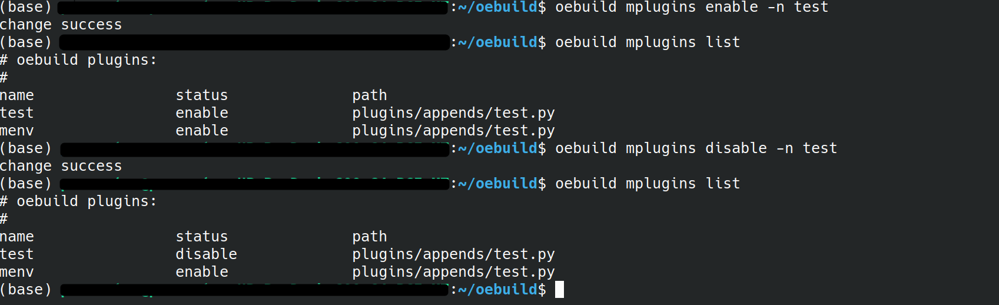

.. _command_index_mplugin:

插件管理命令--mplugin
##################################

该命令用于用户在编写了一些自定义插件，希望加入到本地oebuild进行使用时，可以通过此命令加入到oebuild中，并且在通过检测之后就可以直接
按照插件逻辑进行使用。

install: 安装插件
-----------------------
此命令会在~/.local文件夹下创建一个oebuild_plugins文件夹，里面会存放对应的yaml环境配置文件及对应插件文件夹。

.. code-block:: console

    oebuild mplugin install [-d directory -m file_name] [-f file_name]  -n plugin_name

此命令允许您指定一个文件或文件夹作为目标。使用 -d 参数时，请提供文件夹的具体路径。鉴于插件解析过程中必须指定一个主导文件，
因此 -m 参数用来指明文件夹内的主文件。而 -n 参数则用于指定插件的名称。

.. note::
    指定参数为-d时，必须要指定-m参数，否则会安装失败。

如下图所示：

.. image:: ../../../_static/images/mplugin/oebuild-mplugins-install.png

执行完上述命令后会有对应的创建成功提示，并显示出当前创建的插件名，插件状态和对应文件路径。

list: 查看插件
---------------
此命令可以查看当前有哪些插件配置。

.. code-block:: console

    oebuild mplugin list

如下图所示：

enable/disable: 使能/屏蔽插件
------------------
此命令可以使能/屏蔽对应名称的插件。

.. code-block:: console

    oebuild mplugin enable/disable -n plugin_name

其中plugin_name为用户自定义的插件名称，可以使用list命令查看当前自定义安装的插件列表，并在必要时对特定插件进行对应插件使能/屏蔽。

如下图所示：

remove: 删除插件
------------------
此命令可以删除对应名称的插件配置。

.. code-block:: console

    oebuild mplugin remove -n plugin_name

其中plugin_name为用户自定义的插件名称，您可以使用list命令来查看所有插件的列表，并在确认后选择删除特定的插件。每次成功删除插件后，都会显示一条提示信息，告知操作已成功完成。

如下图所示：

.. image:: ../../../_static/images/mplugin/oebuild-mplugins-remove.png

oebuild插件编写规范
------------------
为了增强oebuild的可扩展性，我们引入了用户自定义插件的功能。为了让用户能够迅速编写出符合oebuild规范的代码，我们制定了一系列插件编写规范。

1. 在开始编写插件时，您可以从oebuild源文件中复制 oebuild/src/oebuild/app/plugins/demo/demo.py 作为您的第一个插件文件。示例文件中的
super.__init__ 方法有三个参数：name（命令名称）、help_msg（帮助说明）、description（功能说明）。在填写完这些基本参数后，您需要实现
do_add_parser 和 do_run 两个功能。do_add_parser 的主要作用是添加命令行参数，例如 -h、-d、-f、-n 等。
您可以参考 oebuild/src/oebuild/app/plugins/init/init.py 中的对应方法来添加参数。如果您对 do_add_parser 方法的使用有疑问，可以搜索
Python 中 parser_adder.add_argument 的使用教程。do_run 方法则是插件功能的具体实现部分，它通过判断输入的命令和对应的参数来执行不同的功能。

2. 如何实现接收命令行参数？
要在Python程序中接收命令行参数，你可以使用argparse模块。首先，在do_add_parser函数中，你可以添加所需的命令行参数。然后，在do_run方法中，
你可以通过args这个不定项参数来接收这些命令行参数。在do_add_parser中，通过add_argument方法的dest参数定义了每个参数的名称。
这样，你就可以在do_run方法中使用这些参数的名称来访问它们了。

3. 合规的插件是怎样的？
python文件中需要有一个类继承OebuildCommand。
对应的继承类需要实现do_add_parser和do_run方法。
代码需要符合python本身的编码规范，不能有编写错误导致代码本身报错。
这样您就可以完成一份合乎规范的插件编写。

oebuild-demo.py代码如下：

::

    import argparse
    import textwrap
    import logging

    from oebuild.command import OebuildCommand
    from oebuild.util import *
    from oebuild.configure import Configure

    logger = logging.getLogger()

    class Demo(OebuildCommand):

        def __init__(self):
            self.configure = Configure()
            super().__init__(
                '{}',
                'this is your help mesasge',
                description=textwrap.dedent('''\
                this is your description message
    '''
            ))

        def do_add_parser(self, parser_adder) -> argparse.ArgumentParser:
            parser = self._parser(
                parser_adder,
                usage='''

      %(prog)s [-m URL] [--mr REVISION] [--mf FILE] [directory]
      %(prog)s -l [--mf FILE] directory
    ''')

            return parser

        def do_run(self, args: argparse.Namespace, unknown = None):
            args = args.parse_args(unknown)
            pass

oebuild-init.py的代码如下:

::

    def do_add_parser(self, parser_adder):
        self._parser(
            parser_adder,
            usage='''

          %(prog)s [directory] [-u yocto_remote_url] [-b branch]
        ''')

        parser_adder.add_argument('-u','--yocto_remote_url', dest = 'yocto_remote_url',
            help='''Specifies the remote of yocto-meta-openeuler''')

        parser_adder.add_argument('-b', '--branch', dest = 'branch',
            help='''Specifies the branch of yocto-meta-openeuler''')

        parser_adder.add_argument(
            'directory', nargs='?', default=None,
            help='''The name of the directory that will be initialized''')

        return parser_adder

    def do_run(self, args: argparse.ArgumentParser, unknown = None):
        '''
        detach target dicrectory if finished init, if inited, just put out err msg and exit
        '''

        # perpare parse help command
        if self.pre_parse_help(args, unknown):
            return

        args = args.parse_args(unknown)

        if self.configure.is_oebuild_dir():
            log = f'The "{os.path.dirname(self.configure.oebuild_dir())}" \
                    has already been initialized, please change other directory'
            logger.error(log)
            sys.exit(-1)

        if args.directory is None:
            logger.error("'oebuild init' need param directory")
            logger.info("\noebuild init help:")
            self.print_help_msg()
            return

        if not self.init_workspace(args.directory):
            logger.error("mkdir %s faild", args.directory)
            return

        os.chdir(args.directory)
        oebuild_config:Config = self.configure.parse_oebuild_config()

        yocto_config:ConfigBasicRepo = oebuild_config.basic_repo[YOCTO_META_OPENEULER]
        if args.yocto_remote_url is not None:
            yocto_config.remote_url = args.yocto_remote_url
        if args.branch is not None:
            yocto_config.branch = args.branch
        oebuild_config.basic_repo[YOCTO_META_OPENEULER] = yocto_config

        self.configure.update_oebuild_config(oebuild_config)

        logger.info("init %s successful",args.directory)
        format_msg = f'''
        There is a build configuration example file under {args.directory}/.oebuild/compile.yaml.sample,
        if you want to block complex generate instructions, you can directly copy a configuration file,
        and then modify it according to your own needs, and then execute `oebuild generate -c <compile_dir>`.
        please execute the follow commands next

            cd {os.path.abspath(os.getcwd())}
            oebuild update
        '''
        print(format_msg)

