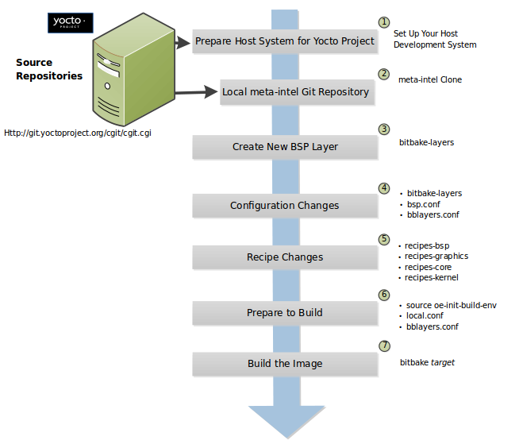

.. _yocto_development:

Yocto开发指导
=============

如何定制添加layer
*******************************

即使你只有一两个配方文件，还是建议你创建自己的层，而不是把配方添加到OE-Core或者Yocto项目层，随着你的配方越来越多，这种好处更能体现出来，且容易迁移到你的其它项目中去。你可以修改配置文件，使你的层添加到项目中。还可以用yocto-layer脚本来创建层。

通常一个layer的结构包含3个文件夹：``conf``、``classes``、``recipes-xxx``。开发人员可以自行创建 ``recipes-*`` 文件夹，存放其他软件包的 ``bb`` 文件。``recipes-xxx`` 目录仅用于区分不同类型的软件包/特性，实际可以作为一个 ``recipes`` 目录存放的。``classes`` 目录和poky原生的目录类似，主要存放自研的``bbclass``。 ``conf`` 目录是必须存在的，用于配置此layer的信息。

 - ``classes``: 类文件(``.bbclass``)中提供了一些可以和其他配方（和类文件在同一层中）共享的功能，多个配方可以从同一个类文件继承一些配置和功能。
 - ``conf``: 这个区域包含了针对这个层和发行相关的配置信息（比如说 ``conf/layer.conf`` ）。 ``local.conf`` 和 ``bblayers.conf`` 的定制模板也可以放在此目录，构建时通过
   ``TEMPLATECONF`` 变量指定。
 - ``recipes-xx``: 包含了一些会影响全局的配方文件和配方追加文件。其中一些配方和追加文件被用来增加初始化脚本，特定发行版的配置和自定义的配方等文件。``recipes-xx`` 目录的例子就是 ``recipes-core`` 和 ``recipes-kernel`` 。不同 ``recipes-*`` 目录下的内容和结构也会有所不同。通常来说，这些目录下含了配方文件( ``*.bb`` )和配方追加文件 ( ``*.bbappend`` )，还有一些针对发行版的配置文件和其他文件。

添加新层可以通过以下步骤完成：

1. 创建新层目录 ``meta-xxx``
#. 创建新层配置文件 ``conf/layer.conf``。
#. 告诉 Bitbake 关于新层 ``bblayers.conf``
#. 根据层类型，添加内容。如果层添加了对机器的支持，则在层内的 ``conf/machine/`` 文件中添加机器配置。如果层添加了发行版策略，则在层内的 ``conf/distro/`` 文件中添加发行版配置。如果层引入了新的配方，则将需要的配方放在该层内的 ``recipes-*`` 子目录中。

以下是一个层的主要目录结构:

::

  ./
 ├── build/ 编译目录
 │   ├── bitbake.lock
 │   └── conf/
 │       ├── local.conf
 │       └── bblayers.conf
 ├── meta-openeuler/  新层
 │   ├── classes/  如果需要提供公共类，则添加
 │   ├── recipe-core/
 │       ├── glibc/
 │            ├── files/
 │            ├── glibc_2.31.bb
 │            └── glibc.inc
 │   └── conf/
 │       ├── machine/ **按需添加** ，新硬件平台则需要
 │            ├── qemu_arm.conf
 │            └── qemu_aarch64.conf
 │       ├── distro/ **按需添加** ，新的发行版
 │            └── openeuler.conf
 │       ├── local.conf.sample
 │       ├── layer.conf
 │       └── bblayers.conf.sample
 └── meta/   原始yocto社区poky下
     ├── classes/
     │   └── base.bbclass
     └── conf/
         ├── bitbake.conf
         └── layer.conf

通过``TEMPLATECONF``变量指向新层的``conf``目录，yocto会自动将``.sample``赋值到``build``目录
当前也可以通过yocto提供的工具添加新的基础layer：

 | ``bitbake-layers create-layer ../layers/meta-hello`` 创建层
 | ``bitbake-layers add-layer meta-hello`` 将层添加到``conf/bblayers.conf``

添加image
*******************************

1）通过自定义bb文件添加image
^^^^^^^^^^^^^^^^^^^^^^^^^^^^^^

 | 添加bb文件如下：

::

  IMAGE_INSTALL = "packagegroup-core-x11-base package1 package2"
  inherit core-image

也可参考yocto提供的已有的image做定制修改

其中``IMAGE_INSTALL``中配置的名称必须使用 ``OpenEmbedded`` 表示法而不是 ``Debian`` 表示法作为名称（例如 ``glibc-dev`` 而不是 ``libc6-dev``）

Yocto提供了一些默认的images的配方，可参考 `https://docs.yoctoproject.org/ref-manual/images.html <https://docs.yoctoproject.org/ref-manual/images.html>`_

2）通过自定义包组添加image
^^^^^^^^^^^^^^^^^^^^^^^^^^^^^^

 | 对于复杂的自定义image，自定义image的最佳方法是创建用于构建一个或多个image的自定义包组配方。

 | 包组配方的一个很好的例子是 ``meta/recipes-core/packagegroups/packagegroup-base.bb``。

 | 通过``PACKAGES`` 变量列出要生成的包组包。 ``inherit packagegroup`` 语句设置适当的默认值，并为 ``PACKAGES`` 语句中指定的每个包自动添加 ``-dev``、``-dbg`` 和 ``-ptest`` 补充包。

 | ``inherit packagegroup`` 语句应该位于配方顶部附近，当然在 ``PACKAGES`` 语句之前。

 | 对于 ``PACKAGES`` 中指定的每个包，可以使用 ``RDEPENDS`` 和 ``RRECOMMENDS`` 来提供父任务包应包含的包列表。您可以在 ``packagegroup-base.bb`` 配方中进一步查看这些示例。

 | 以下一个简短的虚构示例：

::

 DESCRIPTION = "My Custom Package Groups"

 inherit packagegroup

 PACKAGES = "\
     ${PN}-apps \
     ${PN}-tools \
     "

 RDEPENDS:${PN}-apps = "\
     dropbear \
     portmap \
     psplash"

 RDEPENDS:${PN}-tools = "\
     oprofile \
     oprofileui-server \
     lttng-tools"

 RRECOMMENDS:${PN}-tools = "\
     kernel-module-oprofile"

在前面的示例中，创建了两个包组包，并列出了它们的依赖项和推荐的包依赖项：``packagegroup-custom-apps`` 和 ``packagegroup-custom-tools``。要使用这些包组包构建映像，您需要将 ``packagegroup-custom-apps``、 ``packagegroup-custom-tools`` 添加到 ``IMAGE_INSTALL``。

添加一个新的配方bb
*******************************

使用recipetool自动添加bb文件
^^^^^^^^^^^^^^^^^^^^^^^^^^^^^^^^^^

使用devtool自动添加bb文件
^^^^^^^^^^^^^^^^^^^^^^^^^^^^^^^^^^

从零添加bb
^^^^^^^^^^^^^^^^^^

添加bbclass
***************************

添加新架构
***************************

支持多config
**************************

使用外部工具链
**************************

recipes版本选择
**************************

SRC_URI中文件和目录查找
*********************************

配方打包时如何分包
****************************

配方中添加日志打印
***************************

对指定架构或任务等进行定制配置（选项、补丁等）
******************************************************

编译选项配置
*****************************

依赖关系配置（包、任务）
************************************

配方中的虚拟provides
***************************

@bb.utils有哪些实用方法？
***************************

在配方中， ``@bb.utils.contains`` 等方法常被使用到，我们在此罗列了当前 oebuild bitbake 版本(2.0) 中的 utils 方法集，供快速查阅。

.. list-table:: bb.utils 实用方法
   :header-rows: 1

   * - Function Signature
     - 描述
     - Usage Example
     - 补充说明
   * - ``contains(variable, checkvalues, truevalue, falsevalue, d)``
     - 检查变量是否包含所有checkvalues
     - ``bb.utils.contains("FOO", "bar", "yes", "no", d)``
     -
   * - ``contains_any(variable, checkvalues, truevalue, falsevalue, d)``
     - 检查变量是否包含任意checkvalues
     - ``bb.utils.contains_any("FOO", "bar baz", "yes", "no", d)``
     -
   * - ``filter(variable, checkvalues, d)``
     - 返回变量中与checkvalues相同的词
     - ``bb.utils.filter("FOO", "bar baz", d)``
     -
   * - ``to_boolean(string, default=None)``
     - 将字符串转换为布尔值
     - ``bb.utils.to_boolean("yes")``
     -
   * - ``which(path, item, direction=0, history=False, executable=False)``
     - 在冒号分隔的路径内查找item
     - ``bb.utils.which(os.environ["PATH"], "python3")``
     - 推荐用于查找系统可执行文件
   * - ``mkdirhier(directory)``
     - 创建目录，类似mkdir -p，不报错
     - ``bb.utils.mkdirhier("foo/bar")``
     -
   * - ``copyfile(src, dest, newmtime=None, sstat=None)``
     - 复制文件，保留属性
     - ``bb.utils.copyfile("foo", "bar")``
     -
   * - ``movefile(src, dest, newmtime=None, sstat=None)``
     - 移动文件，保留属性
     - ``bb.utils.movefile("foo", "bar")``
     - 支持跨文件系统移动
   * - ``remove(path, recurse=False, ionice=False)``
     - 删除文件或目录（类似rm -f/-rf）
     - ``bb.utils.remove("foo.txt")``
     - 递归删除时需谨慎
   * - ``md5_file(filename)``
     - 返回文件的MD5校验和十六进制字符串
     - ``bb.utils.md5_file("foo.txt")``
     - 推荐用于文件校验
   * - ``sha256_file(filename)``
     - 返回文件的SHA256校验和十六进制字符串
     - ``sha = bb.utils.sha256_file("foo.txt")``
     -
   * - ``cpu_count()``
     - 返回CPU数量
     - ``count = bb.utils.cpu_count()``
     -
   * - ``clean_environment()``
     - 清理多余的环境变量
     - ``bb.utils.clean_environment()``
     - 推荐在BitBake启动时调用
   * - ``build_environment(d)``
     - 用数据仓库中导出的变量设置os.environ
     - ``bb.utils.build_environment(d)``
     -
   * - ``check_system_locale()``
     - 保证系统区域设置为UTF-8
     - ``bb.utils.check_system_locale()``
     - 初始化环境前建议调用
   * - ``preserved_envvars()``
     - 返回需要保留的环境变量列表
     - ``vars = bb.utils.preserved_envvars()``
     -
   * - ``better_eval(source, locals, extraglobals=None)``
     - 在上下文中评估Python表达式
     - ``val = bb.utils.better_eval("1+2", {})``
     -
   * - ``better_exec(code, context, text, realfile, pythonexception=False)``
     - 执行代码，错误时打印出错的代码行
     - ``bb.utils.better_exec(code, ctx)``
     - 推荐用于BitBake动态代码执行
   * - ``simple_exec(code, context)``
     - 在给定上下文中执行Python代码
     - ``bb.utils.simple_exec("a=1", {})``
     - 快速执行简单代码
   * - ``vercmp_string_op(a, b, op)``
     - 用比较运算符比较两个版本字符串
     - ``result = bb.utils.vercmp_string_op("1.2", "1.3", ">")``
     - 支持多种运算符
   * - ``vercmp_string(a, b)``
     - 比较两个版本字符串
     - ``cmp = bb.utils.vercmp_string("1.2", "1.3")``
     -
   * - ``explode_version(s)``
     - 将版本字符串拆分为元组以进行比较
     - ``parts = bb.utils.explode_version("1.2.3")``
     - 版本比较相关
   * - ``split_version(s)``
     - 将版本字符串拆分为(PE, PV, PR)
     - ``pe, pv, pr = bb.utils.split_version("1:2.3-4")``
     - 适合处理复杂版本字符串
   * - ``explode_deps(s)``
     - 解析RDEPENDS风格依赖字符串，返回依赖列表
     - ``deps = bb.utils.explode_deps("foo (>=1.2) bar")``
     - 只返回依赖名称，不含版本
   * - ``explode_dep_versions2(s, sort=True)``
     - 解析依赖关系并返回依赖:版本的有序字典
     - ``deps = bb.utils.explode_dep_versions2("foo (>=1.2)")``
     - 推荐用于依赖分析
   * - ``explode_dep_versions(s)``
     - 解析依赖关系，返回依赖:版本的字典
     - ``deps = bb.utils.explode_dep_versions("foo (>=1.2)")``
     -
   * - ``join_deps(deps, commasep=True)``
     - 将依赖字典拼接成字符串
     - ``depstr = bb.utils.join_deps(deps)``
     -
   * - ``lockfile(name, shared=False, retry=True, block=False)``
     - 获取锁文件，返回锁对象
     - ``lock = bb.utils.lockfile("foo.lock")``
     - 推荐用于多进程/多线程场景
   * - ``unlockfile(lf)``
     - 解锁通过lockfile()获得的锁文件
     - ``bb.utils.unlockfile(lock)``
     -
   * - ``fileslocked(files, *args, **kwargs)``
     - 文件锁的上下文管理器
     - ``with bb.utils.fileslocked(['file.lock']): ...``
     - 适合批量文件锁定
   * - ``nonblockingfd(fd)``
     - 设置文件描述符为非阻塞模式
     - ``bb.utils.nonblockingfd(fd)``
     -
   * - ``set_process_name(name)``
     - 设置进程名，方便调试
     - ``bb.utils.set_process_name("myproc")``
     -
   * - ``umask(new_mask)``
     - 设置并恢复umask的上下文管理器
     - ``with bb.utils.umask(0o022): ...``
     -
   * - ``get_referenced_vars(start_expr, d)``
     - 返回表达式中引用的变量名
     - ``refs = bb.utils.get_referenced_vars("expr", d)``
     -
   * - ``prunedir(topdir, ionice=False)``
     - 递归删除目录内容
     - ``bb.utils.prunedir("foo_dir")``
     - 操作危险，务必确认路径
   * - ``prune_suffix(var, suffixes, d)``
     - 如果变量结尾有后缀则移除
     - ``val = bb.utils.prune_suffix("foo.txt", [".txt"], d)``
     -
   * - ``break_hardlinks(src, sstat=None)``
     - 确保src不是与其他文件共享的硬链接
     - ``bb.utils.break_hardlinks("foo")``
     -
   * - ``rename(src, dst)``
     - os.rename的封装，处理跨设备问题
     - ``bb.utils.rename("foo", "bar")``
     -
   * - ``mkstemp(suffix=None, prefix=None, dir=None, text=False)``
     - 生成与时间无关的唯一临时文件名
     - ``fd, name = bb.utils.mkstemp(suffix=".tmp")``
     - 推荐用于高并发临时文件操作
   * - ``is_semver(version)``
     - 检查版本字符串是否符合语义化版本规范
     - ``bb.utils.is_semver("1.2.3")``
     -
   * - ``environment(**envvars)``
     - 更新os.environ指定变量的上下文管理器
     - ``with bb.utils.environment(FOO="bar"): ...``
     - 推荐用于临时环境变量设置
   * - ``is_local_uid(uid='')``
     - 检查UID是否为本地用户
     - ``bb.utils.is_local_uid()``
     -
   * - ``better_compile(text, file, realfile, mode, lineno)``
     - 编译Python代码，错误时打印出错的代码行
     - ``code = bb.utils.better_compile("print(1)", "f", "f")``
     - 推荐用于BitBake自定义代码
   * - ``exec_flat_python_func(func, *args, **kwargs)``
     - 按名称执行普通Python函数
     - ``result = bb.utils.exec_flat_python_func("func", arg1)``
     -
   * - ``get_context()``
     - 返回当前用于exec/eval的Python上下文
     - ``ctx = bb.utils.get_context()``
     -
   * - ``set_context(ctx)``
     - 设置全局Python上下文
     - ``bb.utils.set_context({'os': os, 'bb': bb})``
     -
   * - ``clean_context()``
     - 返回用于exec/eval操作的干净Python上下文
     - ``ctx = bb.utils.clean_context()``
     - 推荐在安全执行Python代码时使用
   * - ``vercmp_part(a, b)``
     - 比较两个版本部分
     - ``cmp = bb.utils.vercmp_part("1.2", "1.3")``
     - 通常内部使用
   * - ``vercmp(ta, tb)``
     - 比较两个拆分后的版本元组
     - ``cmp = bb.utils.vercmp((1, "2.3", "4"), (1, "2.4", ""))``
     -
   * - ``process_profilelog(fn, pout=None)``
     - 处理Python分析日志并写入统计信息
     - ``bb.utils.process_profilelog("profile.log")``
     -
   * - ``multiprocessingpool(*args, **kwargs)``
     - 返回带bug修复的multiprocessing.Pool对象
     - ``pool = bb.utils.multiprocessingpool()``
     - 兼容旧版Python
   * - ``sha1_file(filename)``
     - 返回文件的SHA1校验和十六进制字符串
     - ``sha = bb.utils.sha1_file("foo.txt")``
     -
   * - ``sha384_file(filename)``
     - 返回文件的SHA384校验和十六进制字符串
     - ``sha = bb.utils.sha384_file("foo.txt")``
     -
   * - ``sha512_file(filename)``
     - 返回文件的SHA512校验和十六进制字符串
     - ``sha = bb.utils.sha512_file("foo.txt")``
     -
   * - ``preserved_envvars_exported()``
     - 返回需要导出到环境的变量列表
     - ``vars = bb.utils.preserved_envvars_exported()``
     -
   * - ``filter_environment(good_vars)``
     - 移除不在good_vars中的环境变量
     - ``removed = bb.utils.filter_environment(vars)``
     - 用于BitBake环境清理
   * - ``approved_variables()``
     - 返回允许保留的环境变量列表
     - ``vars = bb.utils.approved_variables()``
     -
   * - ``empty_environment()``
     - 移除所有环境变量
     - ``bb.utils.empty_environment()``
     -
   * - ``signal_on_parent_exit(signame)``
     - 设置父进程死亡时发送的信号
     - ``bb.utils.signal_on_parent_exit("SIGTERM")``
     -
   * - ``ioprio_set(who, cls, value)``
     - 用syscall设置Linux IO优先级
     - ``bb.utils.ioprio_set(os.getpid(), 2, 7)``
     - 通常用于性能调优
   * - ``disable_network(uid=None, gid=None)``
     - 禁用当前进程的网络（如支持）
     - ``bb.utils.disable_network()``
     - 隔离构建环境
   * - ``export_proxies(d)``
     - 从数据仓库导出代理变量到环境
     - ``bb.utils.export_proxies(d)``
     -
   * - ``load_plugins(logger, plugins, pluginpath)``
     - 从目录加载插件模块
     - ``bb.utils.load_plugins(logger, plugins, "./plugins")``
     - 推荐用于BitBake插件开发
   * - ``edit_metadata(meta_lines, variables, varfunc, match_overrides=False)``
     - 用回调编辑元数据行
     - ``updated, newlines = bb.utils.edit_metadata(lines, ["FOO"], callback)``
     -
   * - ``edit_metadata_file(meta_file, variables, varfunc)``
     - 用回调编辑元数据文件
     - ``bb.utils.edit_metadata_file("foo.conf", ["FOO"], callback)``
     -
   * - ``edit_bblayers_conf(bblayers_conf, add, remove, edit_cb=None)``
     - 编辑bblayers.conf以添加/移除层
     - ``bb.utils.edit_bblayers_conf("bblayers.conf", "layer", None)``
     - 推荐用于添加/移除Yocto层
   * - ``get_collection_res(d)``
     - 返回层集合及其正则表达式
     - ``colres = bb.utils.get_collection_res(d)``
     -
   * - ``get_file_layer(filename, d, collection_res={})``
     - 返回包含指定文件的层
     - ``layer = bb.utils.get_file_layer("file.bb", d)``
     -
