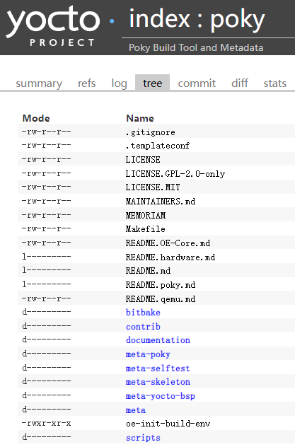
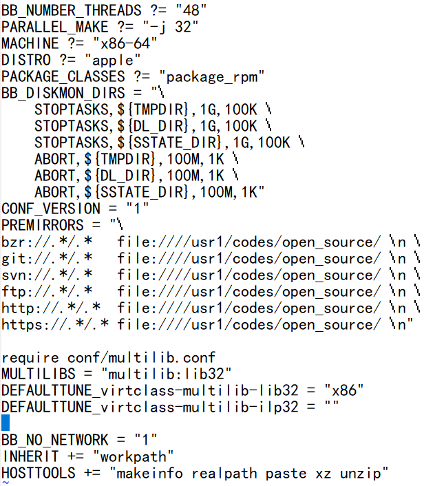

.. _yocto:

openEuler Embedded中的Yocto
#####################################

Yocto介绍
====================

Yocto是什么
**************

Yocto项目是Linux Foundation旗下的一个开源协作项目，该项目起源于OpenEmbedded Project，并与之协作，可帮助开发人员
在各种硬件架构上创建基于 Linux 的定制系统，这些系统专为嵌入式产品而设计，不区分硬件体系架构。Yocto Project提供了灵活
的工具集和开发环境，允许全世界的嵌入式设备开发人员通过共享技术、软件堆栈、配置和最佳实践，用于协作创建定制Linux镜像。

该项目为构建定制化的嵌入式Linux发行版提供一系列模板、工具和方法来简化定制linux开发，允许更换软件配置和构建，避免重复工作
以及不必要的维护。Yocto项目鼓励跨各种应用程序和设备类型的创新，支持多种硬件架构，包括x86(32 位和 64 位)、arm、PPC和
MIPS。随着硬件BSP支持的增加和BSP格式的标准化，这个项目创造了巨大的价值。

Yocto项目和OpenEmbedded共享一个核心元数据集合，称为openembedded-core。OpenEmbedded为各种体系结构、功能和应用程序
提供了一套全面的元数据。Yocto项目专注于为一组核心架构和特定单板提供功能强大、易于使用、可互操作、经过良好测试的工具、元数
据和BSPs。

**<Yocto Project特点>**
  - 广泛应用于整个行业
  - 架构无关
  - 镜像和代码移植容易
  - 灵活
  - 适用于资源受限的嵌入式和物联网设备
  - 全面的工具链支持
  - 执行机制大于策略
  - 支持层模型
  - 支持部分组件构建
  - 按照严格的时间表发布
  - 丰富的个人和组织生态
  - 二进制可再现性
  - 许可证清单

Yocto构建流程
********************
开发者指定一些用户配置文件(比如说local.conf)，针对不同软件的配方文件和层，目标开发板的配置文件，打包策略配置文件。Bitbake（淡蓝色部分）
会去读取这些配方和配置文件，然后

1.	去配方和配置文件指定的地方(下图深黄色部分）下载源代码(source fetching)。
#.	下载后，将源码提取到本地工作区（下图绿色部分）中，在工作区中打补丁(patch application)、执行配置和编译等步骤
#.	使用一些自动工具(比如说使用autoconf生成configure脚本,config.h等文件)
#.	分析各个包之间的依赖关系(analysis for package relationship)
#.	根据打包策略生成deb, rpm或者ipk包
#.	对软件包进行测试(QA tests)，做一些通用的质量检查和健全性检查
#.	使用这些软件包生成linux镜像和软件开发套件(SDK)

在使用Yocto项目的过程中，这个工作流将会随着实际使用的组件和工具而改变。

.. image:: ../../image/yocto/open_embedded_architecture_workflow.png

通常，Yocto构建的工作流由几个功能区域组成：

 - User Configuration：可用于控制生成过程的元数据(bblayer.conf/local.conf)。
 - Metadata Layers：提供软件、板子和发行版元数据的各种层。
 - Source Files：构建使用的源码，上游发布、本地项目和SCMs。
 - Build System：在Bitbake控制下的进程。这个模块扩展了Bitbake如何获取源代码、应用补丁、完成编译、分析生成包的输出、创建和测试包、生成镜像
   以及生成交叉开发工具。
 - Package Feeds：包含输出包（RPM、DEB或IPK）的目录，这些输出包随后用于构建由构建系统生成的镜像或软件开发工具包（SDK）。如果启用了运行时包
   管理，还可以使用web服务器或其他方式复制和共享这些提要，以便于在运行时扩展或更新设备上的现有镜像。
 - Images：生成的镜像。
 - Application Development SDK：生成的交叉编译工具。

主要组件和工具
********************

Yocto项目在整个Yocto项目源存储库参考系统（Poky）中集成了OE-Core Metadata。Yocto Project Version 1.0之后，Yocto Project和
OpenEmbedded同意共同工作并共享一个共同的核心元数据集（OE-Core），其中包含以前在Poky中发现的大部分功能。这种合作实现了长期的
OpenEmbedded目标，拥有更严格控制和质量保证的核心。共享一组核心元数据使Poky成为OE-Core之上的集成层。Yocto项目结合了各种组件，如
Bitbake，OE-Core，脚本“集合”，以及其构建系统的文档。要使用Yocto Project工具和组件，还要下载（clone）Poky并使用它来引导构建自己的
发行版。

.. image:: ../../image/yocto/yocto_main_components.png

Metadata
^^^^^^^^^^^^^^^^
Metadata元数据是Yocto项目的关键元素，用于构建Linux发行版。元数据包含在一些文件中，当构建镜像时构建系统会去解析它们。通常，元数据包括
配方、配置文件和其他引用构建指令本身的信息，以及用于控制要构建的事物和影响构建方式的数据。

元数据还包括：
 | 1). 用于指示被使用软件的版本和来源信息的命令和数据;
 | 2). 对软件本身（补丁或辅助文件）进行的更改或添加，用于修复错误或自定义特定情况下使用的软件。

OpenEmbedded Core就是一组重要的经过验证的元数据集合。

 - Configuration Files（配置文件）：包含变量的全局定义、用户定义的变量和硬件配置信息的文件，主要是.conf文件。它们告知构建系统需要构
   建什么，并放入镜像image中以支持特定平台。比如conf/local.conf可以配置机器配置选项，分发配置选项，编译器调整选项，常规通用配置选项
   和用户配置选项。conf/bblayers.conf中可以添加用到的layer层路径，从而在编译时将他们添加进去。
 - recipe（配方）：元数据（metadata）的最常见形式，主要是.bb、.bbappend、.inc、.bbclass和patches文件。一个recipe包含一个用于构
   建程序包的设置和任务（说明）列表，食谱描述将从哪里获取源码，以及应用哪些补丁，描述了库和其他食谱的依赖关系，以及配置和编译选项。它们存
   储在层（layer）中。bbappend和bb的区别主要在于bbappend是基于bb的，功能是对相应的bb文件作补充和覆盖，类似于'重写'的概念。
   .bbclass文件，包含在配方文件之间共享的有用信息。.inc文件包含一个开源软件多版本之间共享的信息。
 - Layer（层）：即各种meta-xxx目录，将Metadata按层进行分类，是一些列相关配方的集合(同一个目标文件的相关配方，配置等文件）。层允许你合
   并相关的元数据以自定义构建，并隔离多个体系结构构建的信息。例如要定制一套支持特定硬件的系统，可以把与底层相关的单元放在一个layer中，这叫
   做 Board Support Package(BSP) Layer。层在覆盖先前规范方面具有层次结构。隔离特定于硬件的配置允许通过使用不同的层来共享其他元数据，
   其中元数据可能在多个硬件中是通用的。你可以从Yocto Project中包含任意数量的可用层，并通过在它们之后添加你自己的层来自定义构建。尽管你可
   能会发现在单个项目中将所有内容都保留在一层中很诱人，但是元数据的模块化程度越高，应对将来的更改就越容易。

Bitbake
^^^^^^^^^^^^^^^
Bitbake一种软件构建自动化工具，是解析指令（食谱）和配置数据的调度程序和执行引擎，像所有的build工具一样(比如make，ant，jam)控制如何去构建
系统并且解决构建依赖。但是又区别于功能单一的工程管理工具(比如make)，Bitbake不是基于把依赖写死了的makefile，而是收集和管理大量之间没有依赖
关系的描述文件(这里我们称为包的配方)，在解析阶段之后，Bitbake 创建一个依赖树来对编译进行排序，调度包含代码的编译，最后构建指定的自定义Image。

Bitbake是一个Python程序，它由用户创建的配置驱动，可以为用户指定的目标执行用户创建的任务，即所谓的配方。配置、任务和配方是用一种Bitbake DSL
（领域特定语言）编写的，其中包含变量和可执行的 shell 或 python 代码。它允许shell和Python任务在复杂的任务间依赖性约束下工作时高效并行地运行。
简而言之，Bitbake是一个构建引擎，它通过以特定格式编写的配方来执行，以执行任务集。

Bitbake是作为构建软件的工具而制作的，因此具有一些特殊功能，例如定义依赖项的可能性。Bitbake能够解决依赖关系并将它必须做的工作按正确的顺序排
列，然后执行这些任务。此外，构建软件包通常包含相同或非常相似的任务。常见任务例如：下载并提取源代码、运行配置、运行make或简单地编写日志消息。
Bitbake提供了一种以可配置方式抽象、封装和重用此功能的机制。

通常，Bitbake项目组织在包含配置和元数据的文件夹（称为层）中，以及一个构建文件夹（文件夹包含Bitbake功能的配置、任务和目标描述）。通常的做法是将
层文件夹命名为meta-xxx。

Bitbake 手册:https://docs.yoctoproject.org/bitbake/

oe-core
^^^^^^^^^^^^^^^^
oe-core（OpenEmbedded-Core）是由基础配方，类和关联文件组成的元数据，是一些脚本（shell和Python脚本）和数据构成的自动构建系统。在许多不同的
OpenEmbedded派生系统（包括Yocto Project）中，它们都是共有的。Yocto项目和OpenEmbedded项目都维护OpenEmbedded-Core。它是OpenEmbedded
社区开发的原始仓库的精选子集，该原始仓库已被精简为一组较小的，经过持续验证的核心配方，从而形成了受到严格控制且质量保证的核心配方集。

poky
^^^^^^^^^^^^^^^^
poky–参考嵌入式发行版OS，实际上是一个有效的构建实例，它包含构建系统（Bitbake、OpenEmbedded Core、meta-poky、meta-yocto-bsp）以及一组
元数据，可帮助你开始构建自己的发行版。

要使用Yocto项目的工具，你可以下载poky，并且用它来引导你自己的发行版。值得注意的是，poky不包含二进制文件–它是一个工作实例，用来告诉你如何从源
代码构建自己的定制Linux发行版。你可以以任何你需要的方式去更改、拷贝或使用poky构建细节，来创建你的定制嵌入式Linux。

poky最强大的特性之一是构建的每个方面都由元数据控制。通过添加扩展功能的元数据层，可以使用元数据来扩充这些基本镜像类型。例如，这些层可以为图像类
型提供额外的软件堆栈，为其他硬件添加板级支持包（BSP），甚至可以创建新的镜像类型。

pseudo
^^^^^^^^^^^^^^^^
Pseudo是fakeroot的实现， 用于在看似具有root权限的环境中执行命令。在构建软件时，可能需要像系统管理员一样执行操作。例如，你可能需要定义文件的所有权或权限信息。

Pseudo是一个程序，可以直接使用，也可以作为LD_PRELOAD使用，这两种方法都实现这些操作，就像用户确实具有系统管理员权限一样，即使他们是普通用户。

Pseudo与fakeroot有很多相似之处，但它是一种新的实现，它改进了使用fakeroot所遇到的问题。 Poky现在广泛使用Pseudo作为fakeroot的替代品，但也可以在许多其他用
例中独立使用。为了跟踪需要root权限的操作产生的“假”文件所有权和权限，Pseudo使用了SQLite3数据库。该数据库存储在 ${WORKDIR}/pseudo/files.db 中，用于单个配
方。将数据库存储在文件中而不是内存中可以在任务和构建之间提供持久性，这是使用fakeroot无法实现的。

当允许执行通常为root用户保留的某些操作（例如do_install、do_package_write*、do_rootfs和do_image*）时，某些任务更容易实现。例如，do_install任务受益于能
够将已安装文件的UID和GID设置为任意值。

允许任务仅执行root操作的一种方法是要求 Bitbake 以root身份运行。但是这种方法比较麻烦，而且存在安全问题。实际使用的方法是在“假”root环境中运行受益于root权限的
任务。在此环境中，任务及其子进程认为它们以root用户身份运行，并查看文件系统的内部一致视图。只要生成最终输出（例如包或image）不需要root权限，一些早期步骤在假root
环境中运行的事实不会导致问题。

如果你添加自己的任务来操作与fakeroot任务相同的文件或目录，那么该任务也需要在fakeroot下运行。否则，该任务无法运行仅限root的操作，也无法看到其他任务设置的虚假文
件所有权和权限。你还需要添加对virtual/fakeroot-native:do_populate_sysroot的依赖，给出以下内容：

::

    fakeroot do_mytask () {
        echo do something like root
    }
    do_mytask[depends] += "virtual/fakeroot-native:do_populate_sysroot"

| **FAKEROOT** ：包含在 fakeroot 环境中运行 shell 脚本时使用的命令。 FAKEROOT 变量已过时，已被其他 FAKEROOT* 变量替换。
| **FAKEROOTBASEENV** ：列出在执行 FAKEROOTCMD 定义的命令时要设置的环境变量，该命令在 fakeroot 环境中启动 bitbake-worker 进程。
| **FAKEROOTCMD** ：包含在 fakeroot 环境中启动 bitbake-worker 进程的命令。
| **FAKEROOTDIRS** ：列出在 fakeroot 环境中运行任务之前要创建的目录。
| **FAKEROOTENV** ：列出在 fakeroot 环境中运行任务时要设置的环境变量。
| **FAKEROOTNOENV** ：列出运行不在 fakeroot 环境中的任务时要设置的环境变量。

为什么使用pseudo，而不是fakeroot：https://github.com/wrpseudo/pseudo/wiki/WhyNotFakeroot
fakeroot使用：http://man.he.net/man1/fakeroot

package feeds
^^^^^^^^^^^^^^^^^^^^^^
当 OpenEmbedded构建系统生成image或SDK时，它会从位于构建目录中的包源区域获取包。如下图所示：

.. image:: ../../image/yocto/package_feeds.png

包源是构建过程中的一个中间步骤，用来临时存储包的目录，由变量和正在使用的特定包管理器的组合确定。 OpenEmbedded
构建系统提供了生成不同包类型的类，可以通过 PACKAGE_CLASSES 变量指定要启用的类。在将包放入包源中之前，构建过程
会通过生成的输出的质量保证检查来验证它们。

| **DEPLOY_DIR**\ ：在构建目录中定义为 tmp/deploy。
| **DEPLOY_DIR_xxx**\ ：根据使用的包管理器，包类型子文件夹。给定 RPM、IPK 或 DEB 打包和 tarball 创建，分别使用
  DEPLOY_DIR_RPM、DEPLOY_DIR_IPK、DEPLOY_DIR_DEB 或 DEPLOY_DIR_TAR 变量。
| **PACKAGE_ARCH**\ ：定义特定于体系结构的子文件夹。例如，可能存在i586或qemux86架构的包。

Bitbake使用do_package_write_*任务生成包并将它们放入包保存区（例如，对于 IPK 包，do_package_write_ipk）。例如，
考虑使用IPK打包管理器并且同时存在对i586和emux86的包架构支持的场景。i586架构的包放在 build/tmp/deploy/ipk/i586，
而qemux86架构的包放在 build/tmp/deploy/ipk/qemux86。

层模型
^^^^^^^^^^^^^^^^^^^^^^

层是包含相关元数据（即指令集）的存储库，这些元数据告诉OpenEmbedded构建系统如何构建目标。Yocto项目层模型促进了Yocto项目
开发环境中的协作、共享、定制和重用。层在逻辑上分离你项目的信息。例如，你可以使用一个层来保存特定硬件的所有配置。隔离特定于
硬件的配置允许你通过使用不同的层共享其他元数据，其中元数据可能在多个硬件中是通用的。

按照惯例，Yocto 项目中的层遵循特定的形式。符合已知结构允许Bitbake在构建期间对在哪里可以找到元数据类型做出假设。

层支持包含技术、硬件组件和软件组件。 Yocto Project Compatible 名称提供了最低水平的标准化，这有助于建立强大的生态系统。
“Yocto Project Compatible”适用于适当的产品和软件组件，例如 BSP、其他 OE 兼容层和相关的开源项目，允许生产者使用
Yocto Project徽章和品牌资产。有关层和OpenEmbedded层索引的介绍性信息可以在软件概述层部分中找到，或者可以在文档中找到一般
信息。如果你在此处找不到所需的图层，请查看 OpenEmbedded 图层索引，该索引包含更多层，但内容没有得到普遍验证。

OpenEmbedded构建系统支持将元数据组织成多个层。层允许你将不同类型的自定义相互隔离。一个典型的Bitbake项目由不止一层组成。
通常图层包含特定主题的食谱。像基本系统，图形系统，...等等。

在某些项目中，也可能有多个构建目标，每个目标都由不同的层组成。一个典型的例子是构建一个带有和不带有 GUI 组件的 Linux 发行版。
可以使用、扩展、配置层，也可以部分覆盖现有层的部分。这很有用，因为它允许根据实际需要重用和定制。

**Yocto项目的层** ：https://www.yoctoproject.org/software-overview/layers/
**OpenEmbedded的层** ：http://layers.openembedded.org/layerindex/branch/master/layers/

快速构建
=================

Yocto使用主机工具方式及依赖的基础命令
*********************************************

.. image:: ../../image/yocto/hosttools.png

因此如果新增依赖主机上的某个命令，需显示在yocto的HOSTTOOLS变量中增加，否则即使主机上存在，Yocto构建时也会报错找不到。

当涵盖使用 Yocto 项目的所有构建场景时，主机开发系统上所需的包列表可能很大。以下是最基础的包：
 - git 1.8.3.1 或更高版本
 - tar 1.28 或更高版本
 - python 3.5.0 或更高版本
 - gcc 5.0 或更高版本

openeuler yocto编译容器：

  https://repo.openeuler.org/openEuler-20.03-LTS-SP2/docker_img/x86_64/openEuler-docker.x86_64.tar.xz

需额外安装的工具：

系统工具：

 * yum -y install tar cmake gperf sqlite-devel
 * yum -y install chrpath gcc-c++ patch rpm-build flex autoconf automake m4 bison bc libtool gettext-devel
   createrepo_c rpcgen texinfo hostname python

其它工具：

 * https://gitee.com/openeuler/yocto-embedded-tools/attach_files/911963/download/openeuler_gcc_arm32le.tar.xz
 * https://gitee.com/openeuler/yocto-embedded-tools/attach_files/911964/download/openeuler_gcc_arm64le.tar.xz
 * https://distfiles.macports.org/ninja/ninja-1.10.1.tar.gz

poky及openEuler代码下载
***************************

下载poky仓库，按需切换分支:

``git clone git://git.yoctoproject.org/poky``
Yocto版本信息见：https://wiki.yoctoproject.org/wiki/Releases

openeuler版本代码：
http://121.36.84.172/dailybuild/openEuler-21.09/openEuler-21.09/embedded_img/source-list/manifest.xml
下载manifest.xml中记录的仓库代码

版本构建及qemu部署
***********************

一键式构建脚本：https://gitee.com/ilisimin/yocto-pseudo/blob/openEuler-21.09/scripts/build.sh
qemu部署：https://gitee.com/openeuler/docs/blob/master/docs/zh/docs/Embedded/embedded.md

主要构建流程：

1. 设置PATH增加额外工具路径
#. TEMPLATECONF指定配置文件路径
#. 调用poky仓的oe-init-build-env进行初始化配置
#. 在conf/local.conf中配置MACHINE，按需增加额外新增的层
#. 执行bitbake openeuler-image编译openeuler的image和sdk

::

 export PATH="/opt/buildtools/ninja-1.10.1/bin/:$PATH"
 TEMPLATECONF="${SRC_DIR}/yocto-meta-openeuler/meta-openeuler/conf"
 rm -rf "${BUILD_DIR}"
 mkdir -p "${BUILD_DIR}"
 source "${SRC_DIR}"/yocto-poky/oe-init-build-env ${BUILD_DIR}

 sed -i "s|^MACHINE.*|MACHINE = \"${MACHINE}\"|g" conf/local.conf
 echo "$MACHINE" | grep "^raspberrypi"
 if [ $? -eq 0 ];then
 \    grep "meta-raspberrypi" conf/bblayers.conf |grep -v "^[[:space:]]*#" || sed -i "/\/meta-openeuler /a \  ${SRC_DIR}/yocto-meta-openeuler/bsp/meta-raspberrypi \\\\" conf/bblayers.conf
 fi

 AUTOMAKE_V=$(ls /usr/bin/automake-1.* |awk -F "/" '{print $4}')
 grep "HOSTTOOLS .*$AUTOMAKE_V" conf/local.conf || echo "HOSTTOOLS += \"$AUTOMAKE_V\"" >> conf/local.conf
 bitbake openeuler-image

Yocto编译流程
========================

Yocto源码目录结构说明
*******************************************

bitbake
^^^^^^^^^^^^^^^^^^^^^^
该目录包含一份 Bitbake 的副本，以方便使用。该副本通常与来自 Bitbake 项目的当前稳定的 Bitbake 版本相匹配。 Bitbake 是一个元数据解释器，它读取Yocto 项目元数据并运行由该数据定义的任务。失败通常是由元数据中的错误引起的，而不是由 Bitbake 本身引起的；因此，大多数用户无需担心 Bitbake。

当你运行 bitbake 命令时，主要的 Bitbake 可执行文件（位于 bitbake/bin/ 目录中）启动。环境设置脚本（即 oe-init-build-env）将 scripts/ 和 bitbake/bin/ 目录（按此顺序）放入 shell 的 PATH 环境变量中。

更多信息见bitbake用户手册：https://docs.yoctoproject.org/bitbake/index.html

documentation
^^^^^^^^^^^^^^^^^^^^^^
该目录包含 Yocto 项目文档的源代码以及允许你生成 PDF 和 HTML 版本手册的模板和工具。每本手册都包含在其自己的子文件夹中；例如，本参考手册的文件位于 ref-manual/ 目录中。

meta
^^^^^^^^^^^^^^^^^^^^^^
此目录包含最小的底层 OpenEmbedded-Core 元数据。该目录包含严格模拟目标（qemux86、qemuarm 等）的配方、通用类和机器配置。

::

 meta/
 ├── classes/ *该目录包含 *.bbclass 文件。类文件用于抽象公共代码，以便它可以被多个包重用。*
 │   ├── allarch.bbclass
 │   ├── base.bbclass
 │   └── …
 ├── conf/ *yocto的核心配置文件*
 │   ├── abi_version.conf
 │   ├── bitbake.conf
 │   ├── ccache.conf
 │   ├── conf-notes.txt
 │   ├── distro/ *发行版相关配置文件*
 │   │   ├── defaultsetup.conf
 │   │   └── include/
 │   ├── documentation.conf
 │   ├── layer.conf
 │   ├── licenses.conf
 │   ├── machine/ *机器相关配置文件*
 │   │   ├── include/
 │   │   ├── qemuarm64.conf
 │   │   ├── qemuarm.conf
 │   │   ├── …
 │   │   └── qemux86.conf
 │   ├── machine-sdk/ *OpenEmbedded 构建系统在此目录中搜索与 SDKMACHINE 值对应的配置文件。默认情况下，支持某些 SDK 主机的 Yocto 项目附带 32 位和 64 位 x86 文件。但是，可以通过在另一层的此子目录中添加其他配置文件来将该支持扩展到其他 SDK 主机。*
 │   │   ├── aarch64.conf
 │   │   ├── i586.conf
 │   │   └── x86_64.conf
 │   ├── multiconfig/
 │   │   └── default.conf
 │   ├── multilib.conf
 │   └── sanity.conf
 ├── COPYING.MIT
 ├── files/ *包含常见的许可文件和构建系统使用的几个文本文件。文本文件包含最少的设备信息以及具有已知权限的文件和目录列表。*
 │   ├── common-licenses/
 │   │   ├── Apache-2.0
 │   │   ├── GPL-2.0
 │   │   └── …
 │   ├── device_table-minimal.txt
 │   ├── ext-sdk-prepare.py
 │   ├── fs-perms-persistent-log.txt
 │   ├── fs-perms.txt
 │   ├── ptest-perl/
 │   │   └── run-ptest
 │   ├── toolchain-shar-extract.sh
 │   └── toolchain-shar-relocate.sh
 ├── lib/  此目录包含在构建过程中使用的 OpenEmbedded Python 库代码。
 │   ├── bblayers/
 │   │   ├── create.py
 │   │   └── templates
 │   ├── buildstats.py
 │   ├── oe/
 │   │   ├── __init__.py
 │   │   ├── utils.py
 │   │   ├── package.py
 │   │   ├── patch.py
 │   │   ├── rootfs.py
 │   │   ├── sdk.py
 │   │   └── …
 │   ├── oeqa/
 │   │   ├── buildperf
 │   │   ├── controllers
 │   │   ├── core
 │   │   ├── files
 │   │   ├── manual
 │   │   ├── oetest.py
 │   │   ├── runexported.py
 │   │   ├── runtime
 │   │   ├── sdk
 │   │   ├── sdkext
 │   │   ├── selftest
 │   │   ├── targetcontrol.py
 │   │   └── utils
 │   └── rootfspostcommands.py
 ├── recipes-bsp/  包含任何链接到特定硬件或硬件配置信息的内容，例如“u-boot”和“grub”。
 │   ├── openssh
 │   │   ├── openssh/
 │   │   └── openssh_8.3p1.bb
 │   └── …
 │       └── …
 ├── recipes-core/  此层包含构建基本工作 Linux 镜像所需的内容，包括常用的依赖项。
 │   ├── base-files/
 │   │   ├── base-files/
 │   │   └── base-files_3.0.14.bb
 │   ├── images/
 │   │   ├── build-appliance-image_15.0.0.bb
 │   │   ├── core-image-base.bb
 │   │   ├── core-image-minimal.bb
 │   │   └── core-image-tiny-initramfs.bb
 │   ├── …
 │   │   └── …
 │   └── zlib/
 │       ├── site_config
 │       ├── zlib/
 │       └── zlib_1.2.11.bb
 ├── recipes-devtools/ 包含主要由构建系统使用的工具的层。也可以用于目标。
 │   ├── pseudo/
 │   │   ├── files/
 │   │   ├── pseudo_git.bb
 │   │   └── pseudo.inc
 │   └── …
 │       └── …
 ├── recipes-extended/包含与核心中的替代品相比添加功能的非必要应用程序的层。
 │   ├── bash/
 │   │   ├── bash/
 │   │   ├── bash_5.0.bb
 │   │   └── bash.inc
 │   └── …
 │       └── …
 ├── recipes-kernel/内核和具有强内核依赖性的通用应用程序和库相关的层。
 │   ├── linux/
 │   │   ├── kernel-devsrc.bb
 │   │   ├── linux-dummy/
 │   │   ├── linux-dummy.bb
 │   │   ├── linux-yocto_5.8.bb
 │   │   ├── linux-yocto.inc
 │   │   ├── linux-yocto-tiny_5.4.bb
 │   │   └── …
 │   ├── linux-libc-headers/
 │   │   ├── linux-libc-headers/
 │   │   ├── linux-libc-headers_5.8.bb
 │   │   └── linux-libc-headers.inc
 │   └── …
 │       └── …
 ├── recipes-multimedia/  用于音频、图像和视频的编解码器和支持程序相关的层。
 │   ├── …
 │   └── libtiff/
 │        └── tiff_4.1.0.bb
 ├── recipes-…
 ├── recipes.txt对所有recipes-*内容的描述。
 └── site/此目录包含各种体系结构的缓存结果列表。由于测试无法在实时系统上运行，因此在交叉编译时无法确定某些“autoconf”测试结果，因此该目录中的信息被传递给各种体系结构的“autoconf”。
     ├── arm-32
     ├── arm-64
     ├── arm-common
     ├── armeb-linux
     ├── arm-linux
     ├── common
     ├── common-musl
     ├── endian-big
     ├── endian-little
     ├── mips-common
     ├── native
     ├── powerpc32-linux
     ├── powerpc64-linux
     ├── powerpc-common
     ├── powerpc-darwin
     ├── powerpc-linux
     ├── …
     └── x86_64-linux

meta-poky
^^^^^^^^^^^^^^^^^^^^^^
设计在 meta/ 内容之上，这个目录添加了足够的元数据来定义 Poky 参考发行版。

meta-selftest
^^^^^^^^^^^^^^^^^^^^^^
此目录添加了 OpenEmbedded 自测试使用的其他配方和附加文件，以验证构建系统的行为。除非你想运行自测，否则你不必将此层添加到你的 bblayers.conf文件中。

meta-skeleton
^^^^^^^^^^^^^^^^^^^^^^
该目录包含用于 BSP 和内核开发的模板配方。

meta-yocto-bsp
^^^^^^^^^^^^^^^^^^^^^^
此目录包含 Yocto 项目参考硬件板支持包 (BSP)。

scripts
^^^^^^^^^^^^^^^^^^^^^^
该目录包含在 Yocto 项目环境中实现额外功能的各种集成脚本（例如 QEMU 脚本）。 oe-init-build-env 脚本将此目录添加到 shell 的 PATH 环境变量中。脚本目录包含有助于回馈 Yocto 项目的有用脚本，例如 create-pull-request 和 send-pull-request。

oe-init-build-env
^^^^^^^^^^^^^^^^^^^^^^^^^
此脚本设置 OpenEmbedded 构建环境。在 shell 中使用 source 命令运行此脚本会更改 PATH 并根据当前工作目录设置其他核心 Bitbake 变量。在运行 Bitbake 命令之前，你需要运行环境设置脚本。该脚本使用脚本目录中的其他脚本来完成大部分工作。

当你运行这个脚本时，你的 Yocto 项目环境被设置，一个构建目录被创建，你的工作目录成为构建目录，你会看到一些关于下一步做什么的简单建议，包括一些可能目标的列表建立。下面是一个例子：

::

 $ source oe-init-build-env

     ### Shell environment set up for builds. ###

     你现在可以执行'bitbake <target>'

     Common targets are:
         core-image-minimal
         core-image-sato
         meta-toolchain
         meta-ide-support

     你还可以使用“runqemu qemux86-64”之类的命令运行生成的 qemu 镜像

oe-init-build-env 脚本的默认输出来自 conf-notes.txt 文件，该文件位于源码的 meta-poky 目录中。如果你设计自定义发行版，你可以包含你自己的此配置文件版本，以提及你的发行版定义的目标。

默认情况下，在没有 Build Directory 参数的情况下运行此脚本会在当前工作目录中创建 build/ 目录。如果你在获取脚本时提供构建目录参数，则你可以指示 OpenEmbedded 构建系统创建你选择的构建目录。例如，以下命令创建一个名为 mybuilds/ 的构建目录，该目录位于源目录之外： ``$ source oe-init-build-env ~/mybuilds``
OpenEmbedded 构建系统使用模板配置文件，这些文件默认位于源目录的 meta-poky/conf/ 目录中。
OpenEmbedded 构建系统不支持包含空格的文件或目录名称。如果你尝试从文件名或目录名中包含空格的源目录运行 oe-init-build-env 脚本，该脚本将返回一个错误，指示没有此类文件或目录。确保使用没有包含空格的名称的源目录。

meta-openeuler
^^^^^^^^^^^^^^^^^^^^^^

Yocto的基本任务流程及定制
*******************************************

Yocto支持的主要任务如下：

.. image:: ../../image/yocto/yocto_tasks.png

每个包实际运行的任务可以在编译目录查看到：tmp\*/work/\*/\*/\*/temp/log.task_order

do_build
^^^^^^^^^^^^^^^^^^^^^^
do_build是配方的默认任务，依赖于构建一个配方的所有其他正常构建任务。因为yocto默认在meta/classes/base.bbclass中设置了do_build[noexec] = "1"，因此do_build任务并不会真的执行，只是一个虚拟任务，用于串连起各个模块的任务流。构建时，temp目录下不会存在其执行执行脚本及执行日志文件。

do_fetch/do_unpack
^^^^^^^^^^^^^^^^^^^^^^^^^^
  配方必须做的第一件事是指定如何获取源文件。获取主要通过 SRC_URI 变量进行控制。你的配方必须有一个指向源所在位置的 SRC_URI 变量。

  do_fetch 和 do_unpack 任务获取源文件并将它们解压到构建目录中。默认情况下，一切都在构建目录中完成，该目录具有已定义的结构。在下图中，存在两个示例层次结构：一个基于包架构（即 PACKAGE_ARCH）和一个基于机器（即 MACHINE）。底层结构是相同的。区别在于 OpenEmbedded 构建系统使用什么作为构建目标（例如通用架构、构建主机、SDK 或特定机器）。

.. image:: ../../image/yocto/tasks_do_fetch.png

do_fetch 任务使用SRC_URI 变量定位源码文件，基于SRC_URI 变量值中每个条目的前缀来确定使用哪个提取器来获取源文件。触发提取器的是 SRC_URI 变量。 do_patch 任务在获取源后使用该变量来应用补丁。 OpenEmbedded 构建系统使用 FILESOVERRIDES 来扫描 SRC_URI 中本地文件的目录位置。

配方中的 SRC_URI 变量必须为源文件定义每个唯一的位置。最好不要在 SRC_URI 中使用的 URL 中硬编码版本号。不是对这些值进行硬编码，而是使用 ${PV}，这会导致获取过程使用配方文件名中指定的版本。以这种方式指定版本意味着将配方升级到未来版本就像重命名配方以匹配新版本一样简单。

当使用 Bitbake 构建某些东西时，操作的很大一部分是定位和下载所有源码文件。对于image，下载各种包的所有源代码可能需要大量时间。

对于作为配方 SRC_URI 语句一部分的每个本地文件（例如 file://），OpenEmbedded 构建系统获取配方文件的校验和，并将校验和插入到 do_fetch 任务的签名中。如果有任何本地文件被修改，则重新执行 do_fetch 任务和所有依赖它的任务。

Yocto中有两种镜像：前镜像和常规镜像，PREMIRRORS和MIRRORS变量分别指向这两种镜像。Bitbake在查询上游源文件之前会先检查前镜像，当你有一个共享目录，而且这个目录不是被DL_DIR定义的话，把它作为前镜像的存放地址是比较合适的。PREMIRRORS变量通常指向你们公司或者组这本地的共享目录。Bitbake的镜像查询顺序是 : 本地目录, 前镜像目录，上游源文件和常规镜像目录。常规镜像可以是Internet上的任何站点，如果主站点由于某种原因无法正常运行或用作其他站点，则该站点可以用作源代码的替代位置。

我们可以把所有源文件都提前下载好，构建时并不做下载动作，do_fetch实际类似校验动作，仅确认文件是否存在。此方案利用yocto提供的./meta/classes/own-mirrors.bbclass；设置SOURCE_MIRROR_URL配置本地下载好的路径，或者直接重新设置PREMIRRORS变量。

在 local.conf 文件中设置SOURCE_MIRROR_URL示例：

::

 SOURCE_MIRROR_URL ?= "file:///home/you/your-download-dir/"
 INHERIT += "own-mirrors"
 BB_GENERATE_MIRROR_TARBALLS = "1"
 # BB_NO_NETWORK = "1"   #不注释则表示关闭网络，不支持网络下载

SRC_URI中URL 前缀决定了 Bitbake 使用哪个 fetcher 子模块。每个子模块可以支持不同的 URL 参数。以下介绍3种常用的URL：

	**以 file:// 开头的 URL**
 | 可以指定文件的绝对路径或相对路径。如果文件名是相对的，则 FILESPATH 变量的内容的使用方式与 PATH 用于查找可执行文件的方式相同。如果找不到该文件，则假定在调用 download() 方法时该文件在 DL_DIR 中可用。找不到则报错。
 | SRC_URI = file://relativefile.patch  #相对路径 ==拷贝不带路径
 | SRC_URI = file:///home/mycode/xxx.patch  #绝对路径==拷贝带路径
 | 该路径相对于 FILESPATH 变量并按特定顺序搜索特定目录：${BP}、${BPN} 和文件。假定目录是配方或附加文件所在目录的子目录。

	**以http://, ftp://, https://开头的URL**
 | 使用wget从 Web 和 FTP 服务器获取文件。使用的可执行文件和参数由 FETCHCMD_wget 变量指定，该变量默认为合理值。 fetcher 支持参数“downloadfilename”，允许指定下载文件的名称（部分URL需要指定）。在处理多个同名文件时，指定下载文件的名称对于避免 DL_DIR 中的冲突很有用。
 | SRC_URI = "https://pyyaml.org/download/libyaml/yaml-${PV}.tar.gz"
 | SRC_URI = "https://raw.githubusercontent.com/SCons/scons/${PV}/LICENSE;downloadfilename=LICENSE-python3-scons-${PV};name=license"

	**以git://开头的URL**
 | 从git仓下载指定commit id的代码。
 | SRC_URI = "git://github.com/vim/vim.git"  指定仓库地址、下载协议、分支等
 | SRCREV = "98056533b96b6b5d8849641de93185dd7bcadc44"   指定下载节点
 | SRC_URI = "git://gitlab.freedesktop.org/mesa/kmscube;branch=master;protocol=https"
 | SRCREV = "4660a7dca6512b6e658759d00cff7d4ad2a2059d"

	**其它类型参考**
 https://www.yoctoproject.org/docs/3.1/bitbake-user-manual/bitbake-user-manual.html#bb-fetchers

如果指定文件或目录，则直接拷贝到工作目录；如果指定压缩包，则压缩包解压到工作目录。

由于 URL 参数由分号分隔，因此在解析也包含分号的 URL 时，会导致歧义，应将分号替换为“&”字符来修改此类 URL（大多数情况下，都是有效的，参考万维网联盟W3C建议）。

**标准参数** ：
 - ``apply`` - 是否应用补丁。默认的操作是应用补丁。
 - ``striplevel`` - 应用时使用哪个条带级别修补。默认级别为 1。
 - ``patchdir`` - 指定补丁所在的目录被应用。默认是${S}。

**额外参数** ：
 - ``unpack`` - 控制是否解压文件。默认操作是解压缩文件。
 - ``destsuffix`` -当使用Git fetcher时，将文件（或解压其内容）放入WORKDIR下的指定目录。
 - ``subdir`` -当 ``file://`` 使用本地fetcher时，将文件（或解压其内容）放入WORKDIR下的指定目录。
 - ``localdir`` -当使用CVS fetcher时，将文件（或解压其内容）放入WORKDIR下的指定目录。
 - ``subpath`` - 使用Git fetcher时，将checkout目录限制为特定的子路径
 - ``downloadfilename`` - 指定存储时使用的文件名下载的文件。
 - ``name`` - 指定用于关联的名称。
   当 ``SRC_URI`` 中指定了多个文件或 git 存储库时，用于指定 ``SRC_URI`` 校验和或 ``SRCREV`` 。例如：

::

            src_URI = "git://example.com/foo.git;name=first \
                     git://example.com/bar.git;name=second \
                     http://example.com/file.tar.gz;name=third"
            SRCREV_first = "f1d2d2f924e986ac86fdf7b36c94bcdf32beec15"
            SRCREV_second = "e242ed3bffccdf271b7fbaf34ed72d089537b42f"
            SRC_URI[third.sha256sum] = "13550350a8681c84c861aac2e5b440161c2b33a3e4f302ac680ca5b686de48de"

**版本控制系统中特定于配方构建代码的选项** ：
      - ``mindate`` - 仅在以下情况下应用补丁:`SRCDATE` 等于或大于`mindate`
      - ``maxdate`` - 仅当 `SRCDATE` 不晚于`maxdate`时才应用补丁
      - ``minrev`` - 仅当 `SRCREV` 等于或大于`minrev`时才应用补丁
      - ``maxrev`` - 仅当 `SRCREV` 不晚于`maxdate`时才应用补丁
      - ``rev`` - 仅当 ``SRCREV`` 等于`rev`时才应用补丁
      - ``notrev`` - 仅当 `SRCREV` 不等于`rev`时才应用补丁

在构建过程中，do_unpack 任务使用 ${S} 指向解压位置来解压源代码。

如果你从上游源存档 tarball 获取源文件，并且 tarball 的内部结构与名为 ${BPN}-${PV} 的顶级子目录的通用约定相匹配，那么你不需要设置 S。但是，如果 SRC_URI 指定从不使用此约定的存档中获取源代码，或者从像 Git 或 Subversion 这样的 SCM 中获取源代码，则你的配方需要定义 S。

如果使用 Bitbake 处理你的配方成功解压源文件，你需要确保 ${S} 指向的目录与源的结构匹配。

do_prepare_recipe_sysroot
^^^^^^^^^^^^^^^^^^^^^^^^^^^^^^^^^
此任务在 ${WORKDIR} 中设置两个 sysroots（即 recipe-sysroot 和 recipe-sysroot-native），以便 sysroots 包含任务的配方所依赖的配方的 do_populate_sysroot 任务的内容。目标和本机二进制文件都存在一个 sysroot， 它们在主机系统上运行。

将依赖包do_populate_sysroot任务放到sysroot的文件安装到当前配方特定的 sysroot 中（即 ${WORKDIR} 下的 recipe-sysroot 和 recipe-sysroot-native，基于 DEPENDS 指定的依赖项）。更多信息见staging.bbclass。

do_patch
^^^^^^^^^^^^^^^^^^^^^^
有时需要在获取代码后修补代码。do_patch 任务使用配方的 SRC_URI（源码和补丁列表） 和 FILESPATH（搜索补丁的目录集） 变量来定位适用的补丁文件，Bitbake 在源码目录${S}下按补丁顺序依次打上补丁。

SRC_URI 中提到的任何名称以 .patch 或 .diff 结尾的文件或这些后缀的压缩版本（例如 diff.gz 被视为补丁），另外增加了“;apply=yes”的任何文件也会当做补丁。

与 SRC_URI 中使用 file:// 引用的所有本地文件一样，你应该将补丁文件放在配方旁边的目录中，该目录的名称与配方的基本名称（BP 和 BPN）或“文件”相同。

.. image:: ../../image/yocto/tasks_do_patch.png

::

 例如 SRC_URI = " \
          file://path_to_repo/some_package \
          file://file;apply=yes;striplevel=0;name=patch001;patchdir=.. \
          file://path_to_patch_files/a.patch \
          file://path_to_patch_files/b.patch; apply=no \
     "

以上配置中，非.patch和.diff的文件增加了apply=yes则也会作为补丁打上；本身是补丁，如果设置了apply=no也不会打上此补丁。默认是用-p1（即路径中的一个目录级别将被剥离）打补丁。如果补丁需要剥离更多目录级别，则使用striplevel配置。如果补丁需要应用于补丁文件中未指定的特定子目录，使用 “patchdir”而配置。

打完补丁后，从工作目录日志文件中可以查看到打补丁的日志。日志中会 输出当前补丁是第几个，补丁路径，打补丁的level，补丁md5。

.. image:: ../../image/yocto/tasks_do_patch_log.png

do_configure/do_compile/do_install
^^^^^^^^^^^^^^^^^^^^^^^^^^^^^^^^^^^^^^^^^^
**do_configure** ：

此任务通过启用和禁用正在构建的软件的任何构建时间和配置选项来配置源码。如果找到 makefile（Makefile、makefile 或 GNUmakefile）并且 CLEANBROKEN 未设置为“1”，则此任务的默认行为是运行 oe_runmake clean。如果未找到此类文件或 CLEANBROKEN 变量设置为“1”，则 do_configure 任务不执行任何操作。

配置可以来自配方本身，也可以来自继承的类。此外，软件本身可能会根据为其构建的目标进行自我配置。如果使用的是 autotools 类，则可以使用 EXTRA_OECONF 或 PACKAGECONFIG_CONFARGS 变量添加其他配置选项。详见 meta/classes/autotools.bbclass 文件。

**do_compile** ：

此任务在当前工作目录设置为 ${B} 的情况下运行。如果找到生成文件（Makefile、makefile 或 GNUmakefile），则此任务的默认行为是运行 oe_runmake 函数。如果没有找到这样的文件，do_compile 任务什么也不做。

如果找到生成文件（Makefile、makefile 或 GNUmakefile），则此任务的默认行为是运行 oe_runmake 函数。如果没有找到这样的文件，do_compile 任务什么也不做。

**do_install** ：

make install将编译生成的文件安装到保存区${D}。此任务运行时将当前工作目录设置为 ${B}，即编译目录。 do_install 任务以及其他直接或间接依赖于已安装文件的任务（例如 do_package、do_package_write_* 和 do_rootfs），都在 fakeroot 下运行。

安装文件时，请注意不要将已安装文件的所有者和组 ID 设置为计划外的值。某些复制文件的方法，特别是在使用递归 cp 命令时，可以保留原始文件的 UID 和/或 GID，这通常不是你想要的。受主机用户污染的 QA 检查检查可能具有错误所有权的文件。

安装文件的安全方法包括：
 - install程序。此实用程序是首选方法。
 - 带有“--no-preserve=ownership”选项的cp 命令。
 - 带有“--no-same-owner”选项的 tar 命令。示例请参见源目录的 meta/classes 目录中的 bin_package.bbclass 文件。

.. image:: ../../image/yocto/tasks_do_compile.png

do_package
^^^^^^^^^^^^^^^^^^^^^^
do_package 和 do_packagedata 任务结合起来，根据PACKAGES 和 FILES 变量，分析在${D}目录中找到的文件，并根据可用的包和文件将它们拆分为子集。分析涉及以下以及其他项目：拆分调试符号、查看包之间的共享库依赖项以及查看包关系。

do_packagedata 任务基于分析创建包元数据，包元数据保存在 PKGDATA_DIR 中，使其全局可用，以便构建系统可以生成最终包。 do_populate_sysroot 任务将 do_install 任务安装的文件的子集（复制）到适当的 sysroot 中。分析和包拆分过程的工作、阶段和中间结果使用以下几个方面：

.. image:: ../../image/yocto/tasks_do_package.png

**PACKAGES** ：
  其默认值为${PN}-dbg  ${PN}-staticdev  ${PN}-dev  ${PN}-doc  ${PN}-locale ${PACKAGE_BEFORE_PN} ${PN}。表示配方创建的包列表。
  在打包时，do_package 任务会通过 PACKAGES 并使用每个包对应的 FILES 变量将文件分配给包。如果一个文件与 PACKAGES 中多个包的 FILES 变量匹配，它将被分配到最早（最左边）的包。除非通过 ALLOW_EMPTY 变量强制生成，否则不会生成变量列表中为空的包（即 FILES_pkg 中的任何模式都不匹配 do_install 任务安装的任何文件）。

**FILES** ：
  放置在包中的文件和目录列表。配置FILES 变量，需用生成的包的包名称覆盖。其值是以空格分隔的文件或路径列表，用于标识要作为结果包的一部分包含的文件。FILES中配置的路径是相对${D}的相对路径。

**FILES_xx** :
 变量的默认值也在bitbake.conf中。也可以自定义，例如： FILES_${PN} += "${bindir}/mydir1 ${bindir}/mydir2/myfile"。FILES中指定文件或路径时，可以使用 Python 的 glob 语法进行模式匹配。将路径指定为 FILES 变量的一部分时，最好使用适当的路径变量（meta/conf/bitbake.conf中查找）。例如，使用 ${sysconfdir} 而不是 /etc，或 ${bindir} 而不是 /usr/bin。

**PKGD** ：
  ${WORKDIR}/包。指向要打包的文件的目标目录，然后再将它们拆分为单个包。
**PKGDATA_DIR** ：
  ${STAGING_DIR_HOST}/pkgdata。指向一个共享的、全局状态的目录，该目录保存在打包过程中生成的数据。在打包过程中，do_packagedata 任务为每个配方打包数据，并将其安装到这个临时的共享区域中。
**PKGDEST** ：
  ${WORKDIR}/packages-split。将文件拆分为单独的包后，指向要打包的文件的父目录。此目录是 PACKAGES 中指定的每个包的目录。
**PKGDESTWORK** ：
  ${WORKDIR}/pkgdata。指向 do_package 任务保存包元数据的临时工作区。 do_packagedata 任务将包元数据从 PKGDESTWORK 复制到 PKGDATA_DIR 以使其全局可用。
**STAGING_DIR_HOST** ：
  构建组件运行的系统的 sysroot 路径（即 recipe-sysroot）。
**STAGING_DIR_NATIVE** ：
  为构建主机构建组件时使用的 sysroot 路径（即 recipe-sysroot-native）。
**STAGING_DIR_TARGET** ：
  当构建在系统上执行的组件并为另一台机器生成代码（例如跨加拿大配方）时使用的 sysroot 路径。

do_package_write_*
^^^^^^^^^^^^^^^^^^^^^^^^^^
do_package_write_rpm：
  创建 RPM 包（即*.rpm文件）并将它们放在包源（package feeds）区域${DEPLOY_DIR_RPM} 目录中。
do_package_write_deb：
  创建 Debian 包（即*.deb文件）并将它们放在包源区域的 ${DEPLOY_DIR_DEB} 目录中。
do_package_write_ipk：
  创建 IPK 包（即*.ipk文件）并将它们放在包源区域的 ${DEPLOY_DIR_IPK} 目录中。
do_package_write_tar：
  创建 tar.gz 包并将它们放在包源区域的 ${DEPLOY_DIR_TAR} 目录中。

do_package_qa
^^^^^^^^^^^^^^^^^^^^^^
|  对打包文件运行 QA 检查。具体检查见meta/classes/insane.bbclass
|  在构建配方时，OpenEmbedded 构建系统会对输出执行各种 QA 检查，以确保检测和报告常见问题。有时，当你创建一个新配方来构建新软件时，它会顺利构建。如果情况并非如此，或者当你在构建任何软件时遇到 QA 问题，则可能需要一些时间来解决这些问题。
|  虽然忽略 QA 消息甚至禁用 QA 检查很诱人，但最好尝试解决任何报告的 QA 问题。QA 消息列表和可能遇到的问题说明可参考https://docs.yoctoproject.org/ref-manual/qa-checks.html。

do_populate_sysroot
^^^^^^^^^^^^^^^^^^^^^^^^^^^
配方通常需要使用构建主机上其他配方提供的文件。例如，链接到公共库的应用程序需要访问库本身及其关联的标头。完成这种访问的方式是用文件填充 sysroot。每个配方在其工作目录中有两个 sysroot，一个用于目标文件 (recipe-sysroot)，另一个用于构建主机的本地文件 (recipe-sysroot-native)。

食谱永远不应该直接填充 sysroot（即将文件写入 sysroot）。相反，文件应该在 ${D} 目录中的 do_install 任务期间安装到标准位置。这种限制的原因是几乎所有填充 sysroot 的文件都在清单中编目，以确保在修改或删除配方时可以删除这些文件。因此，sysroot 能够保持不受陈旧文件的影响。

do_install 任务安装的文件子集由 SYSROOT_DIRS 变量定义的 do_populate_sysroot 任务使用，以自动填充 sysroot。可以修改填充 sysroot 的目录列表。

此任务用于将 do_install 任务安装的文件子集（$D目录的文件）复制到SYSROOT_DESTDIR 中，默认会对里面的文件进行strip，之后将SYSROOT_DESTDIR下的文件拷贝到"${COMPONENTS_DIR}/${PACKAGE_ARCH}/${PN}"。

有关如何从其他配方访问这些文件的信息，见以下STAGING_DIR* 变量。默认情况下不会复制其他配方在构建时通常不需要的目录（例如 /etc）。

有关默认复制哪些目录的信息，见以下 SYSROOT_DIRS* 变量。如果你需要在构建时为其他配方提供额外（或更少）的目录，可以在配方中更改这些变量。

**SYSROOT_DESTDIR** ：
  指向工作目录下的临时目录（默认为“${WORKDIR}/sysroot-destdir”），其中填充到 sysroot 的文件在 do_populate_sysroot 任务期间组装。
**SYSROOT_DIRS** :
  由 do_populate_sysroot 任务暂存到 sysroot 中的目录。默认情况下，会暂存以下目录：

::

     SYSROOT_DIRS = " \
         ${includedir} \
         ${libdir} \
         ${base_libdir} \
         ${nonarch_base_libdir} \
         ${datadir} \
     "

**SYSROOT_DIRS_BLACKLIST** ：
  不通过 do_populate_sysroot 任务暂存到 sysroot 中的目录。可以使用此变量从暂存中排除 SYSROOT_DIRS 中列出的目录的某些子目录。默认情况下，以下目录不会暂存：

::

     SYSROOT_DIRS_BLACKLIST = " \
         ${mandir} \
         ${docdir} \
         ${infodir} \
         ${datadir}/locale \
         ${datadir}/applications \
         ${datadir}/fonts \
         ${datadir}/pixmaps \
     "

**SYSROOT_DIRS_NATIVE** ：
  除了在 SYSROOT_DIRS 中指定的目录之外，由 do_populate_sysroot 任务为 -native 配方暂存到 sysroot 中的额外目录。默认情况下，会暂存以下额外目录：

::

     SYSROOT_DIRS_NATIVE = " \
         ${bindir} \
         ${sbindir} \
         ${base_bindir} \
         ${base_sbindir} \
         ${libexecdir} \
         ${sysconfdir} \
         ${localstatedir} \
     "

由 -native recipes 构建的程序直接从 sysroot (STAGING_DIR_NATIVE) 运行，这就是需要暂存包含程序可执行文件和支持文件的其他目录的原因。

**SYSROOT_PREPROCESS_FUNCS** ：
  在文件暂存到 sysroot 后要执行的函数列表。这些函数通常用于对暂存文件进行附加处理，或暂存其他文件。样例如下：

::

  SYSROOT_PREPROCESS_FUNCS += "my_populate_sysroot"
  my_populate_sysroot() {
      sysroot_stage_dir ${D}/lib ${SYSROOT_DESTDIR}/lib
  }

**COMPONENTS_DIR** ：
  即"${STAGING_DIR}-components"= "${TMPDIR}/sysroots-components"。存储每个配方的 sysroot 组件。 OpenEmbedded 构建系统在为其他配方构建特定于配方的系统根时使用 COMPONENTS_DIR。
**STAGING_DIR** ：
  即"${TMPDIR}/sysroots"。
  Recipes 不应直接在 STAGING_DIR 目录下写入文件，因为 OpenEmbedded 构建系统会自动管理该目录。相反，文件应该安装到你配方的 do_install 任务中的 ${D} 中，然后 OpenEmbedded 构建系统会将这些文件的子集暂存到 sysroot 中。
**STAGING_DIR_HOST** ：
  指定运行组件的系统（承载组件的系统）的 sysroot 目录路径。对于大多数配方，此 sysroot 是该配方的 do_populate_sysroot 任务复制文件的那个。例外包括 -native recipes，其中 do_populate_sysroot 任务使用 STAGING_DIR_NATIVE。根据配方的类型和构建目标，STAGING_DIR_HOST 可以具有以下值：
  对于为目标机器构建的配方，该值为“${STAGING_DIR}/${MACHINE}”。
  对于为构建主机构建的本机配方，假设为构建主机构建时，应使用构建主机自己的目录，该值为空。
**STAGING_DIR_NATIVE** ：
  指定构建在构建主机本身上运行的组件时使用的 sysroot 目录的路径。
  -native recipes 没有安装到主机路径中，比如 /usr。相反，这些配方被安装到 STAGING_DIR_NATIVE 中。编译 -native recipes 时，会设置标准构建环境变量，例如 CPPFLAGS 和 CFLAGS，以便使用例如 GCC 的 -isystem 选项搜索主机路径和 STAGING_DIR_NATIVE 以查找库和标头。
  因此，重点是 STAGING_DIR* 变量应被 do_configure、do_compile 和 do_install 等任务视为输入变量。让真正的系统根对应于 STAGING_DIR_HOST 对于 -native recipes 具有概念意义，因为它们使用主机头文件和库。
**STAGING_DIR_TARGET** ：
  指定用于组件为其生成代码的系统的 sysroot 的路径。对于大多数不生成代码的组件，STAGING_DIR_TARGET 设置为匹配 STAGING_DIR_HOST。
  一些配方构建可以在目标系统上运行的二进制文件，但这些二进制文件又为另一个不同的系统生成代码（例如跨加拿大配方）。使用 GNU 的术语，主要系统被称为“HOST”，次要或不同的系统被称为“TARGET”。因此，二进制文件在“HOST”系统上运行并为“TARGET”系统生成二进制文件。 STAGING_DIR_HOST 变量指向用于“HOST”系统的 sysroot，而 STAGING_DIR_TARGET 指向用于“TARGET”系统的 sysroot。
**STAGING_BASE_LIBDIR_NATIVE** ：
  指定构建主机的 sysroot 目录的 /lib 子目录的路径。
**STAGING_BASELIBDIR** ：
  指定正在为其构建当前配方的目标的 sysroot 目录的 /lib 子目录的路径 (STAGING_DIR_HOST)。
**STAGING_BINDIR** ：
  为正在为其构建当前配方的目标 (STAGING_DIR_HOST) 指定 sysroot 目录的 /usr/bin 子目录的路径。
**STAGING_BINDIR_NATIVE** ：
  指定构建主机的 sysroot 目录的 /usr/bin 子目录的路径。
**STAGING_DATADIR** ：
  为正在为其构建当前配方的目标 (STAGING_DIR_HOST) 指定 sysroot 目录的 /usr/share 子目录的路径。
**STAGING_DATADIR_NATIVE** ：
  指定构建主机的 sysroot 目录的 /usr/share 子目录的路径。
**STAGING_BINDIR** ：
  帮助构建在打包期间使用的 recipe-sysroots 目录。
**STAGING_ETCDIR_NATIVE** ：
  指定构建主机的 sysroot 目录的 /etc 子目录的路径。
**STAGING_EXECPREFIXDIR** ：
  指定正在为其构建当前配方的目标的 sysroot 目录的 /usr 子目录的路径 (STAGING_DIR_HOST)。
**STAGING_INCDIR** ：
  指定要为其构建当前配方 (STAGING_DIR_HOST) 的目标的 sysroot 目录的 /usr/include 子目录的路径。
**STAGING_INCDIR_NATIVE** ：
  指定构建主机的 sysroot 目录的 /usr/include 子目录的路径。
**STAGING_KERNEL_BUILDDIR** ：
  指向包含内核构建工件的目录。需要访问内核构建工件的配方构建软件可以在内核构建后在 STAGING_KERNEL_BUILDDIR 变量指定的目录中查找这些工件。
**STAGING_KERNEL_DIR** ：
  包含构建树外模块所需的内核头文件的目录。
**STAGING_LIBDIR** ：
  为正在为其构建当前配方的目标 (STAGING_DIR_HOST) 指定 sysroot 目录的 /usr/lib 子目录的路径。
**STAGING_LIBDIR_NATIVE** ：
  指定构建主机的 sysroot 目录的 /usr/lib 子目录的路径。

do_clean/do_cleansstate
^^^^^^^^^^^^^^^^^^^^^^^^^^^^^^^
do_clean删除一个目标的所有输出文件
do_cleansstate相比do_clean多清理共享状态 (sstate) 缓存。

do_cleanall
^^^^^^^^^^^^^^^^^^^^^^
删除一个目标的所有输出文件、共享状态缓存和下载的源码文件

do_listtasks
^^^^^^^^^^^^^^^^^^^^^^
列出目标的所有已定义任务。

do_rm_work
^^^^^^^^^^^^^^^^^^^^^^
构建完成后删除工作目录的一些工作文件。更多信息见rm_work.bbclass。

do_checkuri
^^^^^^^^^^^^^^^^^^^^^^
校验SRC_URI的值

do_rootfs
^^^^^^^^^^^^^^^^^^^^^^

do_image
^^^^^^^^^^^^^^^^^^^^^^
.. image:: ../../image/yocto/tasks_do_image.png

do_image 任务在 OpenEmbedded 构建系统运行 do_rootfs 任务之后运行，在此期间确定要安装到镜像中的包并创建根文件系统，完成后处理。

do_image 任务通过 IMAGE_PREPROCESS_COMMAND 对image进行预处理，并根据需要动态生成支持的 do_image_* 任务。

image生成过程由几个阶段组成，取决于几个任务和变量。 do_rootfs 任务为image创建根文件系统（文件和目录结构）。此任务使用几个关键变量来帮助创建要实际安装的软件包列表：
 | **IMAGE_INSTALL** ：从Package Feeds 区域列出要从中安装的基本软件包集。
 | **PACKAGE_EXCLUDE** ：指定不应安装到image中的包。
 | **IMAGE_FEATURES** ：指定要包含在image中的特征。这些功能大多数都映射到其他安装包。
 | **PACKAGE_CLASSES** ：指定要使用的包后端（例如 RPM、DEB 或 IPK），从而帮助确定在包源区域内的包的位置。这个变量在构建目录的conf文件夹下local.conf文件中定义，这个变量的值可以是package_rpm，package_deb, packageipk, packagetar中的一个或者多个值。 yocto也不建议使用packagetar这个值，因为tar包不能管理包的依赖关系。当你把多个值赋给PACKAGECLASSES时，构建系统只会取第一个值.。下面是使用PACKAGE_CLASSES变量的一个例子，比如PACKAGE_CLASS ?= "PACKAGE_IPK"， 构建系统就会只用ipk包管理工具来创建你的镜像或者SDK。
 | **IMAGE_LINGUAS** ：确定安装附加语言支持包的语言。
 | **PACKAGE_INSTALL** ：传递给包管理器以安装到image中的包的最终列表。

 使用 IMAGE_ROOTFS 指向正在构建的文件系统的位置和 PACKAGE_INSTALL 变量提供要安装的包的最终列表，创建根文件系统。

 无论是否为目标启用了包管理，包安装都在包管理器（例如 dnf/rpm、opkg 或 apt/dpkg）的控制之下。在进程结束时，如果没有为目标启用包管理，则包管理器的数据文件将从根文件系统中删除。作为软件包安装最后阶段的一部分，将运行作为软件包一部分的安装后脚本。首次启动目标系统时，任何无法在构建主机上运行的脚本都会在目标上运行。如果你使用只读根文件系统，则所有安装后脚本必须在包安装阶段在构建主机上成功，因为目标上的根文件系统是只读的。

do_rootfs 任务的最后阶段是一些后置处理，包括创建清单文件和优化。
Image的清单文件 (IMAGE_MANIFEST = "${DEPLOY_DIR_IMAGE}/${IMAGE_NAME}.rootfs.manifest") 与根文件系统映像位于同一目录中，此文件逐行列出了构成image的所有已安装软件包（包名 packagearch 版本）。清单文件对于 testimage 类很有用，例如，确定是否运行特定测试。

跨image运行的优化进程包括 mklibs、prelink 和任何其他由 ROOTFS_POSTPROCESS_COMMAND 变量定义的后处理命令。 mklibs 进程优化了库的大小，而 prelink 进程优化了共享库的动态链接以减少可执行文件的启动时间。

构建根文件系统后，通过 do_image 任务开始对image进行处理。构建系统运行由 IMAGE_PREPROCESS_COMMAND 变量定义的任何预处理命令。此变量指定在构建系统创建最终图像输出文件之前要调用的函数列表。

构建系统根据 IMAGE_FSTYPES 变量中指定的image类型，根据需要动态创建 do_image_* 任务。该过程将所有内容转换为一个映像文件或一组映像文件，并且可以压缩根文件系统映像以减小映像的整体大小。用于根文件系统的格式取决于 IMAGE_FSTYPES 变量。压缩取决于格式是否支持压缩。

| 例如，在创建特定图像类型时动态创建的任务将采用以下形式：``do_image_type``
| 因此，如果 IMAGE_FSTYPES 指定的类型为 ext4，则动态生成的任务则为：``do_image_ext4``

image创建涉及的最后一个任务是 do_image_complete 任务。此任务通过应用通过 IMAGE_POSTPROCESS_COMMAND 变量定义的任何图像后处理来完成图像。该变量指定构建系统创建最终图像输出文件后要调用的函数列表。

整个image生成过程在 Pseudo 下运行。在 Pseudo 下运行可确保根文件系统中的文件具有正确的所有权。

do_populate_sdk/do_populate_sdk_ext
^^^^^^^^^^^^^^^^^^^^^^^^^^^^^^^^^^^^^^^^^^^^

do_deploy
^^^^^^^^^^^^^^^^^^^^^^

do_pkg_postinst_${PN}
^^^^^^^^^^^^^^^^^^^^^^^^^^^^^
pkg_postinst脚本在构建只读rootfs时已经执行.但是,必须确保在脚本中调用的命令在构建主机中可用,否则脚本的执行将失败,并且将推迟到设备上的首次启动.

pkg_postinst脚本在目标上安装软件包后立即运行，或者在image中包含软件包时在image创建期间运行。要将pkg_postinst脚本添加到包中，请将 pkg_postinst_${PN}() 函数添加到配方文件 (.bb) 并将 ${PN}替换为要附加到 postinst 脚本的包的名称。

在创建根文件系统时调用在pkg_postinst函数中定义的脚本。如果脚本成功，则包被标记为已安装。在目标上运行的任何 RPM 安装后脚本都应返回 0 退出代码。

有时需要将pkg_postinst脚本的执行延迟到第一次启动。例如，脚本可能需要在设备本身上执行。要将脚本执行延迟到启动时，你必须明确标记后安装以遵循目标。你可以使用 pkg_postinst_ontarget() 或从 pkg_postinst() 调用 postinst_intercept delay_to_first_boot。 pkg_postinst() 脚本的任何失败（包括退出 1）都会在 do_rootfs 任务期间触发错误。

如果有使用 pkg_postinst 函数的配方，并且它们需要使用在 rootfs 构建期间具有依赖性的非标准本机工具，则需要在配方中使用 PACKAGE_WRITE_DEPS 变量来列出这些工具。如果不使用此变量，则工具可能会丢失，并且安装后脚本的执行会推迟到第一次启动。将脚本推迟到第一次启动是不可取的，对于只读 rootfs 是不可能的。

分别通过 pkg_preinst、pkg_prerm 和 pkg_postrm 来支持安装前、卸载前和卸载后脚本。这些脚本的工作方式与 pkg_postinst 完全相同，只是它们运行的时间不同。此外，由于它们运行的时间，它们不适用于像 pkg_postinst 那样在image创建时运行。

定制或添加自定义任务或函数
^^^^^^^^^^^^^^^^^^^^^^^^^^^^^^^^^^^^^^^
Yocto的任务实际就是一个shell或者python函数。
只有 Bitbake 风格的 Python 函数可以是任务。这些函数是用 Python 编写的，并由 Bitbake 或其他 Python 函数使用 bb.build.exec_func() 执行。
一个示例 Bitbake 函数是：

::

     python some_python_function () {
         d.setVar("TEXT", "Hello World")
         打印 d.getVar("TEXT")
     }

因为 Python 的“bb”和“os”模块已经导入，所以不需要导入这些模块。同样在这些类型的函数中，数据存储（“d”）是一个全局变量，并且始终自动可用。变量表达式（例如 ${X}）不再在 Python 函数中扩展。此行为是有意的，以便你可以自由地将变量值设置为可扩展表达式，而不会过早地扩展它们。如果你确实希望在 Python 函数中扩展变量，请使用 d.getVar("X")。或者，对于更复杂的表达式，使用 d.expand()。

定义一个do_xxx函数作为任务，例如添加do_test任务到do_install之后，do_package和do_populate_sysroot之前执行。

::

  do_test(){
      echo  "testing"
  }
  addtask do_test after do_install before do_package do_populate_sysroot
  不使用addtask添加任务，则此函数仅仅作为一个函数，可以被其它函数或任务调用。

重写do_install任务，yocto默认的do_install函数失效:

::

  do_install () {
  }

修改do_install任务, 在do_install任务的开始增加操作:

::

 do_install_prepend() {
 }

修改do_install任务, 在do_install任务最后增加操作:

::

 do_install_append() {
 }

修改do_install任务,在arm架构的do_install任务最后增加操作:

::

 do_install_append_arm() {
 }

删除编译任务，编译任务不存在，也不会执行:

::

 deltask do_compile

不执行打包任务，但是任务还在:

::

 do_package[noexec] = "1"

在do_unpack后追加一个任务（独立任务，还是追加到原任务）:

::

 do_unpack[postfuncs] += "do_qa_unpack"

在do_install之前增加一个任务/函数:

::

 do_install[prefuncs] += "autotools_aclocals"

等号左侧的任务依赖等号右侧指定模块的指定任务:

::

 do_image_cpio[depends] += "cpio-native:do_populate_sysroot"
 do_install[depends] += "virtual/kernel:do_install"
 do_configure[depends] += "virtual/kernel:do_shared_workdir"

当前模块等号左侧的任务依赖等号右侧的任务：

::

 do_prepare_recipe_sysroot[deptask] = "do_populate_sysroot"
 do_build[recrdeptask] += "do_deploy"
 do_package_qa[rdeptask] = "do_packagedata"
 do_sdk_depends[rdepends] = "${@get_sdk_ext_rdepends(d)}"
 do_populate_sdk[rdepends] = "${@' '.join([x + ':do_package_write_${IMAGE_PKGTYPE} ' + x + ':do_packagedata' for x in d.getVar('SDK_RDEPENDS').split()])}"

配置好之后可以使用bitbake -e recipename查看最终的函数内容

oe内置的一些常用任务/函数
^^^^^^^^^^^^^^^^^^^^^^^^^^^^^^^^^^^^^^^
基本类里面已经定义了一些很有用的函数，这些函数默认都被所有“配方”所包含。有很多函数既在“配方”里使用也在其他类里被使用。

最常用最基本的一些函数包括：

oe_runmake:
    这个函数是用来运行make命令的（它实际调用make）。当然这并不像你直接运行make那样，这个函数还给make传递了EXTRA_OEMAKE参数，而且还会在终端中给出一个NOTE注意信息，显示关于make命令以及所有调用make所产生的错误等。

oe_runconf(仅对autotools 有用):
    这个函数运行一个使用autotools类的软件包的configure脚本（也就是说这个软件包的编译管理是基于autotools的）。这个函数会传递所有正确的参数以便交叉编译和把软件安装到适当的目标目录。
    同时此函数还会给configure脚本传递变量EXTRA_OECONF的值。对于大多数情况，设置变量EXTAR_OECONF变量就足够了，而不用你自己定义一个configure任务手动运行oe_runconf。
    如果你需要自己为一个autotools管理的包编写configure任务，你可以在需要的时候手动运行oe_runconf函数。

oe_libinstall:
    这个函数是用来安装.so，.a已经相关的libtool库.la的。这个函数会选择安装合适的库，以及照料.la文件需要的编辑动作。

    这个函数支持下列选项：
       - -C <目录> : 安装一个库之前把当前目录换为指定的目录。当库在一个包的子目录里的时候使用这个选项。
       - -s : 在安装一个库之前必须确保一个.so库已经存在。
       - -a : 在安装一个库之前必须确保一个.a库已经存在。

    下面的gdbm包的例子展示了安装.so,.a（以及相关的.la）库到中间缓冲库目录的情况。

::

    do_stage () {
        oe_libinstall -so -a libgdbm ${STAGING_LIBDIR}
        install -m 0644 ${S}/gdbm.h ${STAGING_INCDIR}/
    }

base_conditional(python):
    python基本条件函数用来设置一个或者两个依赖于第三个变量的定义的变量的值。通常的用法是：

    ${@base_conditional('<variable-name>', '<value>', '<true-result>', <false-result>', d)}"

    其中：
        *   variable-name 是要检查的变量的名字。
        *   value         是要跟变量相比较的值。
        *   true-result   如果变量和相比较的值相等就返回这个值。
        *   false-result  如果变量和相比较的值不相等就返回这个值。

     注意：
           ${@...}符号用来在“配方”和类里调用python函数。

匿名函数：
  有时在解析期间以编程方式设置变量或执行其他操作很有用。为此，你可以定义在解析结束时运行的特殊 Python 函数，称为匿名 Python 函数。例如，以下根据另一个变量的值有条件地设置一个变量：

::

     python () {
         if d.getVar('SOMEVAR') == 'value':
             d.setVar('ANOTHERVAR', 'value2')
     }

将函数标记为匿名函数的等效方法是将其命名为“__anonymous”，而不是没有名称。

匿名 Python 函数总是在解析结束时运行，无论它们是在哪里定义的。如果一个配方包含许多匿名函数，它们的运行顺序与它们在配方中定义的顺序相同。例如，考虑以下代码段：

::

     python () {
         d.setVar('FOO', 'foo 2')
     }

     FOO = "foo 1"

     python () {
         d.appendVar('BAR', ' bar 2')
     }

     BAR = "bar 1"

前面的示例在概念上等同于以下代码段：

::

     FOO = "foo 1"
     BAR = "bar 1"
     FOO = "foo 2"
     BAR += "bar 2"

FOO 以值“foo 2”结束，BAR 以值“bar 1 bar 2”结束。就像在第二个片段中一样，为匿名函数中的变量设置的值对任务可用，这些任务总是在解析后运行。

在匿名函数运行之前应用覆盖和覆盖样式的运算符，例如“_append”。在以下示例中，FOO 以“来自匿名的 foo”的值结束：

::

     FOO = "foo"
     FOO_append = " from outside"

     python () {
         d.setVar("FOO", "foo from anonymous")
     }

python函数访问数据存储变量
^^^^^^^^^^^^^^^^^^^^^^^^^^^^^^^^^^^^^^^
``d.getVar("X", expand)`` :
  返回变量“X”的值。使用“expand=True”扩展值。如果变量“X”不存在，则返回“None”。
``d.setVar("X", "value")``
  将变量“X”设置为“value”。
``d.appendVar("X", "value")``
  将 "value" 添加到变量 "X" 的末尾。如果变量“X”不存在，则行为类似于 d.setVar("X", "value")。
``d.prependVar("X", "value")``
  将 "value" 添加到变量 "X" 的开头。如果变量“X”不存在，则行为类似于 d.setVar("X", "value")。
``d.delVar("X")``
  从数据存储中删除变量“X”。如果变量“X”不存在，则不执行任何操作。
``d.renameVar("X", "Y")``
  将变量“X”重命名为“Y”。如果变量“X”不存在，则不执行任何操作。
``d.getVarFlag("X", flag, expand)``
  返回变量“X”的值。使用“expand=True”扩展值。如果变量“X”或命名标志不存在，则返回“None”。
``d.setVarFlag("X", flag, "value")``
  将变量“X”的命名标志设置为“value”。
``d.appendVarFlag("X", flag, "value")``
  将“value”附加到变量“X”上的命名标志。如果命名标志不存在，则行为类似于 d.setVarFlag("X", flag, "value")。
``d.prependVarFlag("X", flag, "value")``
  将“value”添加到变量“X”上的命名标志。如果命名标志不存在，则行为类似于 d.setVarFlag("X", flag, "value")。
``d.delVarFlag("X", flag)``
  从数据存储中删除变量“X”上的命名标志。
``d.setVarFlags("X", flagsdict)``
  设置 flagsdict() 参数中指定的标志。 setVarFlags 不会清除以前的标志。将此操作视为 addVarFlags。
``d.getVarFlags("X")``
  返回变量“X”的标志的 flagsdict。如果变量“X”不存在，则返回“None”。
``d.delVarFlags("X")``
  删除变量“X”的所有标志。如果变量“X”不存在，则不执行任何操作。
``d.expand(expression)``
  扩展指定字符串表达式中的变量引用。对不存在的变量的引用保持原样。例如，如果变量 "X" 不存在，d.expand("foo ${X}") 将扩展为文字字符串 "foo ${X}"。

你可以使用内联 Python 变量扩展来设置变量。这是一个例子：

::

     DATE = "${@time.strftime('%Y%m%d',time.gmtime())}"

此示例导致将 DATE 变量设置为当前日期。

此功能最常见的用途可能是从 Bitbake 的内部数据字典 d 中提取变量的值。以下几行分别选择包名称及其版本号的值：

::

     PN = "${@bb.parse.BBHandler.vars_from_file(d.getVar('FILE', False),d)[0] 或 'defaultpkgname'}"
     PV = "${@bb.parse.BBHandler.vars_from_file(d.getVar('FILE', False),d)[1] 或 '1.0'}"

就 "=" 和 ":=" 运算符而言，内联 Python 表达式的工作方式与变量扩展类似。给定以下分配，每次扩展 FOO 时都会调用 foo()：

::

     FOO = "${@foo()}"

将此与以下立即分配进行对比，其中 foo() 仅调用一次，而分配被解析：

::

     FOO := "${@foo()}"

常用变量
***************
.. csv-table:: 常用预定义变量
   :header: "变量名", "描述"
   :widths: 15, 20

   "COREBASE", "Poky顶层目录路径"
   "TOPDIR", "编译目录根目录"
   "TMPDIR", "工程下的tmp目录${TOPDIR}/tmp*/"

.. csv-table:: 配方常用变量
   :header: "变量名", "描述", "是否必选"
   :widths: 15, 30, 5

   "DESCRIPTION", "描述", "Y"
   "LICENSE", "软件的许可证信息", "Y"
   "PROVIDES", "该软件包提供的开发组件，和DEPENDS对应。用来显式的指定这个包在编译时提供了什么.这个通常在两个或者更多包提供相同功能的时候使用.比如在OE里我们有几个不同的libc,然后每个都声明提供'virtual/libc'功能.因此,一个依赖于libc的包可以简单的在DEPENDS里声明'virtual/libc'.这个在发行版级别指定了那个'virtual/libc'的实现会被使用.", "N"

共享功能
********************

.bbappend
^^^^^^^^^^^^^^^^^^^^^^

.bbclass
^^^^^^^^^^^^^^^^^^^^^^
.inc
^^^^^^^^^^^^^^^^^^^^^^

常用配置
***********************
conf/bitbake.conf
^^^^^^^^^^^^^^^^^^^^^^^^^^^
Yocto的核心配置文件集，所有其他配置文件都包含在其中。查看 bitbake.conf 文件末尾的 include 语句，你会注意到甚至 local.conf 也是从那里加载的。虽然 bitbake.conf 设置了默认值，但你通常可以使用 (local.conf) 文件、机器文件或分发配置文件来覆盖这些设置。

conf/layer.conf
^^^^^^^^^^^^^^^^^^^^^^^^^^^^^^^^^^
.. image:: ../../image/yocto/conf_layer_conf.png

定义了特定layer层信息，如bb文件的位置，layer的优先级等。其中所有layer.conf中的以上配置”apple-rtos”部分是此layer的唯一标志，不同layer.conf中要配置成不一样的值。最简单的方法是将现有的层配置文件复制到层的 conf 目录，然后根据需要修改文件。
 - BBPATH：将 layer 的根目录添加到 Bitbake 的搜索路径中。通过使用 BBPATH 变量，Bitbake可以定位类文件（.bbclass）、配置文件以及包含在 include 和 require 语句中的文件。在这些情况下，Bitbake 会使用第一个与 BBPATH 中找到的文件名相匹配的文件。因此，建议在自定义层中使用唯一的类和配置文件名。
 - BBFILES: 定义 layer 中所有 recipes 的位置。
 - BBFILE_COLLECTIONS：定义了当前层中所有配方的位置。通过独特的标识符建立当前层，该标识符在整个OpenEmbedded构建系统中用于引用该层。在本例中，标识符 “apple-rtos” 是名为 “meta-apple-rtos” 的容器层的表示。
 - BBFILE_PATTERN: 在解析过程中立即展开，提供层的目录。
 - BBFILE_PRIORITY: 建立了一个优先级，当 OpenEmbedded 构建发现不同层中的同名配方时，按优先级使用配方。
 - LAYERSERIES_COMPAT: 列出当前版本兼容的 Yocto 项目版本。这个变量是表明你的层是否是当前版本的好方法。每个层都分配了一个优先级值。如果多个层中存在同名的配方文件，则优先级值控制哪个层优先。对于这些情况，来自具有更高优先级编号的层的配方文件优先。优先级值还会影响应用同一配方的多个 .bbappend 文件的顺序。可以手动指定优先级，也可以让构建系统根据层的依赖关系计算它。层优先级当前不影响 .conf 和.bbclass 文件的优先顺序。
 - LAYERVERSION：为层建立一个版本号，可以在使用 LAYERDEPENDS 变量时使用这个版本号来指定这个层的确切版本作为依赖关系。当使用 LAYERDEPENDS 变量时，可以使用这个版本号来指定这个层的确切版本作为依赖关系。
 - LAYERDEPENDS: 列出这个层所依赖的所有层（如果有的话）。
 - BBFILES_DYNAMIC：动态层目录承载扩展和特定于层的修改。如果冒号前配置的层集合可用，则包含指定的.bbappend 和 .bb 文件，不可用则指定的bb不包含，默认不生效。允许仅在存在其他一些层时激活层内容 - 即允许扩展其他层提供的内容而不创建硬依赖关系。其配置格式是<collection name>:<filename pattern>

::

  BBFILES += "${@' '.join('${LAYERDIR}/dynamic-layers/%s/recipes*/*/*.bbappend' % layer \
               for layer in BBFILE_COLLECTIONS.split())}"
  BBFILES += "${@' '.join('${LAYERDIR}/dynamic-layers/%s/recipes*/*/*.bb' % layer \
               for layer in BBFILE_COLLECTIONS.split())}"

当存在已识别的图层时激活内容。你可以通过层定义的集合来识别层。
例如在meta-A层的layer.conf中配置一下内容：

::

  BBFILES_DYNAMIC += " \
    openembedded-layer:${LAYERDIR}/dynamic-layers/openembedded-layer/*/*/*.bb \
    openembedded-layer:${LAYERDIR}/dynamic-layers/openembedded-layer/*/*/*.bbappend \
    networking-layer:${LAYERDIR}/dynamic-layers/networking-layer/*/*/*.bb \
    networking-layer:${LAYERDIR}/dynamic-layers/networking-layer/*/*/*.bbappend \

"当”:”前的层openembedded-layer可用时，则meta-A层的dynamic-layers/openembedded-layer/下的 bb或者bbappend生效，否则默认不生效。这类bb的目录结构必须不在BBFILES指定的目录结构下，否则默认就会被引入，无法达到效果。

LAYERDEPENDS_security += "${@bb.utils.contains("DISTRO_FEATURES", "x11", "gnome-layer xfce-layer", "", d)}"

conf/distro/${DISTRO}.conf
^^^^^^^^^^^^^^^^^^^^^^^^^^^^^^^^^^
每个层的顶级的通用策略配置，包含了特定于发行版相关的配置文件；定义了特定发布物的信息（比如：网络如何配置，是否支持usb，使用那种打包方式，使用什么样的libc）、发布者、发布版本、软件版本等。

例如openeuler.conf包含许多openeuler发行版的策略配置: meta-openeuler/conf/distro/openeuler.conf

.. image:: ../../image/yocto/conf_distro_conf.png

conf/machine/\*.conf
^^^^^^^^^^^^^^^^^^^^^^^^^^^^^^^^^^
conf/machine/目录包含了目标机器的配置信息。每个平台设备都有一个专属的配置文件用来描述诸如：设备的架构体系，硬件特性（该设备有usb吗，有键盘吗等等）,以及该机器需要什么类型的flash和磁盘镜像，串口设置啊等等信息。如果你要添加一个新的目标板，你应该为这个目标板创建一个单独的配置文件。例如设置 MACHINE = "qemux86"，则 OpenEmbedded 构建系统会在此目录中查找 qemux86.conf 文件。machine/include/目录则包含多台机器通用的各种数据。

machine配置文件将 BSP 中其他地方包含的所有信息绑定到构建系统可以理解的格式中。每个 BSP 层至少需要一个机器文件。如果 BSP 支持多台机器，则可以存在多个机器配置文件。这些文件名对应于用户设置 MACHINE 变量的值。

这些文件定义了诸如要使用的内核包（virtual/kernel的 PREFERRED_PROVIDER）、包含在不同类型image中的硬件驱动程序、所需的任何特殊软件组件、任何引导加载程序信息以及任何特殊image格式要求等内容。

该配置文件还可以包括一个硬件“tuning”文件，该文件通常用于定义包架构和指定优化标志，这些标志经过精心选择以在给定处理器上提供最佳性能。

Tuning 文件位于源码目录中的 meta/conf/machine/include 目录中。例如，许多 tune-* 文件（例如 tune-arm1136jf-s.inc、tune-1586-nlp.inc 等）位于 poky/meta/conf/machine/include 目录中。

要使用tuning文件，你只需将它们包含在machine配置文件中。例如，Raspberry Pi BSP raspberrypi3.conf 包含以下语句：include conf/machine/include/rpi-base.inc

conf/local.conf
^^^^^^^^^^^^^^^^^^^^^^^^^^^^^^^^^^

此配置文件包含构建环境的所有本地用户配置, 用户需要复制和编辑这个文件，配置各种工作目录，将要使用的机器，还有发行版等等。

此处设置的任何变量都会覆盖环境中其他地方设置的任何变量，除非该变量在文件中进行了硬编码（例如，使用“=”代替“？=”）。出于各种原因，某些变量被硬编码，但此类变量相对较少。至少，通常会编辑此文件以选择目标 MACHINE、使用的包类型 (PACKAGE_CLASSES) 以及下载文件的位置 (DL_DIR)。

如果在开始构建时 local.conf 不存在，OpenEmbedded 构建系统会在你获取顶级构建环境设置脚本 oe-init-build-env 时从 local.conf.sample 创建它。使用的源 local.conf.sample 文件取决于 $TEMPLATECONF变量，Yocto 项目开发环境构建时默认为 meta-poky/conf/。TEMPLATECONF指向 local.conf.sample 文件的源，可以通过在顶级构建环境设置脚本中设置变量来从任何层配置构建环境，如下所示： TEMPLATECONF=your_layer/conf

构建过程获取示例文件后，它会使用 sed 将最终的 ${OEROOT} 值替换为所有 ##OEROOT## 值。你可以通过查看源目录中的 scripts/oe-setup-builddir 脚本了解如何使用 TEMPLATECONF 变量。

- Target Machine Selection（目标机器）: 由 MACHINE（目标板的架构、型号） 控制.
- Download Directory（下载的压缩包存放目录，增量构建则不重新下）: 由 DL_DIR 控制.
- Shared State Directory（共享状态目录）:由 SSTATE_DIR 控制.
- Build Output（构建结果的输出目录）: 由 TMPDIR 控制.
- Distribution Policy（发行版策略）: 由 DISTRO 控制 . 指的是一个全局的配置文件，如果DISTRO = "poky"的话，那就是指这个全局的配置文件就是meta-poky/conf/distro/下的poky.conf, 如果DISTRO="poky-tiny"的话，就是指poky-tiny.conf。
- Packaging Format（打包格式，同时控制了包管理器）: 由 PACKAGE_CLASSES 控制.
- SDK Target Architecture（SDK目标架构）: 由 SDKMACHINE 控制.
- Extra Image Packages（额外的image包）: 由 EXTRA_IMAGE_FEATURES 控制. 增加一些额外的工具或者特点，比如说你可以指明这个变量等于 tools-debug, 意思是在最后构建的根文件系统中增加调试工具，比如说gdb或者strace。 也可以通过指明"tools-sdk"来添加比如gcc, make, pkgconfig等功能。你可以一次性指明很多额外的特点或者工具，用空格隔开，比如说 EXTRA_IMAGE_FEATURES ?= "debug-tweaks" "tool-debug"

build/conf/local.conf中的配置参数也可以在build/conf/site.conf 和 build/conf/auto.conf中被定义和修改。因为一个变量会在不同文件中被定义和修改，这里就牵扯到那个文件中的值会被另一个文件覆盖的问题。

conf/bblayer.conf
^^^^^^^^^^^^^^^^^^^^^^^^^^^^^^^^^^
bblayers.conf文件告诉bitbake在构建过程中，哪些层会被构建。默认情况下，这个文件中列举的层都是构建系统需要的最小集合（也就是一些必须的层）。

在 OpenEmbedded 构建系统可以使用你的新层之前，你需要启用它。要启用层，只需将层的路径添加到 conf/bblayers.conf 文件中的 BBLAYERS 变量，该文件位于 Build 目录中。以下示例显示了如何启用新的 meta-mylayer 层（注意你的新层如何存在于你之前已检出的官方 poky 存储库之外）：

Bitbake 按照 conf/bblayers.conf 文件中的 BBLAYERS 变量指定的方式从上到下解析每个 conf/layer.conf 文件。在处理每个 conf/layer.conf 文件期间，Bitbake 将包含在特定层中的配方、类和配置添加到源目录中。

这个配置文件定义了层，它们是由 Bitbake 遍历（或遍历）的目录树。 bblayers.conf 文件使用 BBLAYERS 变量列出 Bitbake在构建期间要启用的层，即指定了bb文件和layer的位置

如果开始构建时 bblayers.conf 不存在，OpenEmbedded 构建系统会在你获取顶级构建环境设置脚本（即 oe-init-build-env）时从 bblayers.conf.sample 创建它。

与 local.conf 文件一样，使用的源 bblayers.conf.sample 文件取决于 $TEMPLATECONF 脚本变量，当你从 Yocto 项目开发环境构建时，默认为 meta-poky/conf/，以及 meta/conf / 当你从 OpenEmbedded-Core 环境构建时。因为脚本变量指向 bblayers.conf.sample 文件的源，这意味着你可以通过在顶级构建环境设置脚本中设置变量来从任何层构建构建，如下所示： ``TEMPLATECONF=your_layer/conf``

构建过程获取示例文件后，它会使用 sed 将最终的 ${OEROOT} 值替换为所有 ##OEROOT## 值。
你可以在源目录中查看 TEMPLATECONF 变量 scripts/oe-setup-builddir 脚本。你可以在 meta-poky/conf/ 目录中找到 bblayers.conf.sample 文件的 Yocto 项目版本。

.. image:: ../../image/yocto/conf_bblayer_conf.png

conf配置目录及目录指定
^^^^^^^^^^^^^^^^^^^^^^^^^^^^^^^^^^
conf/目录中包含了针对这个层和发行相关的配置信息（比如说conf/layer.conf)。

如果你正在制作自己的定制版本的构建系统供其他用户使用，你可能想要定制安装脚本显示的消息，或者你可能想要更改模板配置文件（即 local.conf 和 bblayers.conf）在新的构建目录中创建。

OpenEmbedded 构建系统使用环境变量 TEMPLATECONF 来定位它从中收集配置信息的目录，这些信息最终会出现在 Build Directory 的 conf 目录中。默认情
况下，TEMPLATECONF 在 poky 存储库中设置如下：
\  ``TEMPLATECONF=${TEMPLATECONF:-meta-yocto/conf}``

这是构建系统用来查找用于构建一些关键配置文件的模板的目录。如果查看此目录，你将看到 bblayers.conf.sample、local.conf.sample 和 conf-notes.txt 文件。构建系统使用这些文件形成各自的 bblayers.conf 文件、local.conf 文件，并在运行设置脚本时显示 Bitbake 目标列表。

要使用你希望在每个新构建目录中使用的配置覆盖这些默认配置文件，只需将 TEMPLATECONF 变量设置为你的目录。 TEMPLATECONF 变量在 .templateconf 文件中设置，该文件位于顶级源目录文件夹（例如 poky）中。编辑 .templateconf 以便它可以找到你的目录。

最佳实践要求你应该将模板配置目录保留在自定义分发层中。例如，假设你的主目录中有一个名为 meta-mylayer 的层，并且你希望模板配置目录名为 myconf。如下更改 .templateconf 会导致 OpenEmbedded 构建系统在你的目录中查找并将其配置文件基于它找到的*.sample 配置文件。最终的配置文件（即 local.conf 和 bblayers.conf 最终仍然在你的构建目录中，但它们基于你的*.sample 文件。
   ``TEMPLATECONF=${TEMPLATECONF:-meta-yocto/conf}``

这是构建系统用来查找用于构建一些关键配置文件的模板的目录。如果查看此目录，你将看到 bblayers.conf.sample、local.conf.sample 和 conf-notes.txt 文件。构建系统使用这些文件形成各自的 bblayers.conf 文件、local.conf 文件，并在运行设置脚本时显示 Bitbake 目标列表。

要使用你希望在每个新构建目录中使用的配置覆盖这些默认配置文件，只需将 TEMPLATECONF 变量设置为你的目录。 TEMPLATECONF 变量在 .templateconf 文件中设置，该文件位于顶级源目录文件夹（例如 poky）中。编辑 .templateconf 以便它可以找到你的目录。

最佳实践要求你应该将模板配置目录保留在自定义分发层中。例如，假设你的主目录中有一个名为 meta-mylayer 的层，并且你希望模板配置目录名为 myconf。如下更改 .templateconf 会导致 OpenEmbedded 构建系统在你的目录中查找并将其配置文件基于它找到的*.sample 配置文件。最终的配置文件（即 local.conf 和 bblayers.conf 最终仍然在你的构建目录中，但它们基于你的*.sample 文件。
``TEMPLATECONF=${TEMPLATECONF:-meta-mylayer/myconf}``

除了*.sample 配置文件，conf-notes.txt 也位于默认的 meta-yocto/conf 目录中。设置构建环境的脚本（即 oe-init-build-env 和 oe-init-build-env-memres）使用此文件将 Bitbake 目标显示为脚本输出的一部分。自定义此 conf-notes.txt 文件是确保自定义目标列表显示为脚本输出的一部分的好方法。
~更改列出的常见目标就像在自定义模板配置目录中编辑 conf-notes.txt 版本并确保将 TEMPLATECONF 设置为目录一样简单。

常用class
**********************************
类文件（.bbclass）用于抽象通用功能并在多个配方 (.bb) 文件之间共享信息。要使用类文件，只需确保配方继承了类。在大多数情况下，当一个配方继承一个类时，它就可以启用它的功能。但是，在某些情况下，可能需要在配方中设置变量或覆盖某些默认行为。

通常在配方中找到的任何元数据也可以放在类文件中。类文件由扩展名 .bbclass 标识，通常放置在源目录中的 meta*/classes/目录中。类文件也可以通过 BUILDDIR（例如 build/）以与 conf 目录中的 .conf 文件相同的方式指向，在 BBPATH 中搜索类文件。

默认情况下，所有配方都继承base.bbclass类和package.bbclass类，它们启用生成可执行输出的配方所需的功能。

base.bbclass
^^^^^^^^^^^^^^^^^^^^^^^^^^^^^^^^^^
base类的特殊之处在于每个 .bb 文件都隐式继承了该类。此类包含标准基本任务的定义，例如获取、解包、配置（默认为空）、编译（运行任何存在的 Makefile）、安装（默认为空）和打包（默认为空）。这些类经常被其他类覆盖或扩展，例如 autotools 类或package类。

该类还包含一些常用函数，例如 oe_runmake，它使用 EXTRA_OEMAKE 变量中指定的参数以及直接传递给 oe_runmake 的参数运行 make。

autotools\*.bbclass
^^^^^^^^^^^^^^^^^^^^^^^^^^^^^^^^^^

Yocto编译和调试
**********************************
target编译
^^^^^^^^^^^^^^^^^^^^^^^^^
若要编译单个包，则bitbake  包名（bb文件名称下划线前面的字符串）；例如内核bb文件是linux-hydrogen_4.4.bb，则 ``bitbake linux-hydrogen``

bitbake接的包或者特性名可以通过bb文件名称获取，例如hello_1.0.bb第一个下滑线前面的hello则是包名，则 ``bitbake hello`` 可以编译这个bb文件控制的包或特性

若要一次编译多个指定的包，bitbake可以接多个包名，例如 ``bitbake rsm busybox`` 会编译rsm特性和busybox这个包以及他们依赖的包

如果同时存在32bit和64bit，则：
 - 编译64位包，bitbake  包名 （例如bitbake busybox）
 - 编译32位包，bitbake lib32-包名（例如bitbake lib32-busybox，若此包只存在64位，则失败，例如内核ko）
 - 编译ilp32的包，bitbake ilp32-包名（例如bitbake ilp32-busybox，arm64存在）

单任务编译
^^^^^^^^^^^^^^^^^^^^^^^^^
 | 可以单独编译某个或某些target的某个任务，如
 | ``bitbake  包名 -c fetch`` 只抓包，看是否可以找到依赖的包和文件
 | ``bitbake  包名 -c patch`` 只执行到打patch，依赖的任务也会执行
 | ``bitbake  包名 -c compile`` 只编译，并完成编译依赖的前几个任务，但是不会执行之后的do_install等任务
 | ``bitbake  包名 -c cleanall``  清理<包名>的编译中间目录
 | ``bitbake  包名:do_fetch`` 只抓包; 此方式可支持不同包编译不同任务，例如bitbake rsm:do_unpack audit:do_patch
 | ``bitbake target --runall=fetch`` 只fetch所有源码不编译

配方和任务的依赖关系查询
^^^^^^^^^^^^^^^^^^^^^^^^^^^^^^^^^^
有时可能很难理解为什么 Bitbake 想要在你指定的配方之前构建其他配方。依赖信息可以帮助你了解为什么要构建配方。

查询编译依赖关系树使用 ``bitbake  包名  -g`` 例如:
  bitbake apple-image -g打印当前编译平台的所有待编译的包及其依赖关系

  bitbake busybox -g打印编译busybox需要编译的所有包及包的依赖关系，每个包的任务的依赖关系，也能看到用了那个bb文件

.. image:: ../../image/yocto/bitbake_g.png

输出文件内容说明：
 - **recipe-depends.dot** ：显示配方之间的依赖关系（即task-depends.dot的折叠版本）。
 - **task-depends.dot** ：显示任务之间的依赖关系。 这些依赖与Bitbake的内部任务执行列表相匹配。
 - **pn-buildlist** ：显示要构建的目标的简单列表。

使用“-I”于选项省略指定部分的依赖关系。删除这些信息可以产生更多可读的图表。例如bitbake -g -I virtual/kernel -I eglibc apple-image

编译脚本及日志查看
^^^^^^^^^^^^^^^^^^^^^^^^^^^^^^^^^^
任务的日志在文件 ${WORKDIR}/temp/log.do_taskname 中，例如， core-image-minimal的 do_compile 任务的日志可能位于 tmp*/work/\*/core-image-minimal/1.0-r0/temp/log.do_compile。要查看 Bitbake 运行生成日志的命令，可查看同一目录中对应的 run.do_taskname 文件。

log.do_taskname 和 run.do_taskname 实际上是 log.do_taskname.pid 和 log.run_taskname.pid 的符号链接，其中 pid 是任务运行时的 PID。符号链接始终指向与最近运行相对应的文件。

查看编译时的变量-e
^^^^^^^^^^^^^^^^^^^^^^^^^^^^^^^^^^
有时，由于 Bitbake 的解析步骤，你需要知道变量的值。这可能是因为你的项目中发生了一些意外行为。也许尝试修改变量没有按预期进行。

Bitbake的 -e 选项用于在解析后显示变量值。Bitbake -e命令显示配置文件（即 local.conf、bblayers.conf、bitbake.conf 等）解析后的变量值；bitbake -e recipe显示在解析特定配方后的变量值。当然也包括来自配置文件的变量

在 bitbake -e 的输出中，每个变量前面都有关于变量如何获得其值的描述，包括后来被覆盖的临时值。此描述还包括在变量上设置的变量标志 (varflags)。输出在调试过程中非常有用。

导出到环境的变量在bitbake -e 的输出中以export 开头。请参阅以下示例：
``export CC="i586-poky-linux-gcc -m32 -march=i586 --sysroot=/home/ build/tmp/sysroots/qemux86"``

除了变量值，bitbake -e 和 bitbake -e recipe 命令的输出还包括以下信息：
 - 输出以一棵树开始，列出全局包含的所有配置文件和类，依次递归列出它们包含或继承的文件。 OpenEmbedded 构建系统的大部分行为（包括普通配方构建任务的行为）在基类及其继承的类中实现，而不是构建到 Bitbake 本身中。
 - 在变量值之后，所有函数都出现在输出中。对于 shell 函数，函数体内引用的变量被扩展。如果使用覆盖或使用覆盖样式的运算符（如 :append 和 :prepend）修改了函数，则最终组装的函数体将出现在输出中。

查询打包信息
^^^^^^^^^^^^^^^^^^^^^^^^^^^^^^^^^^

详细的调试信息输出-vDDD
^^^^^^^^^^^^^^^^^^^^^^^^^^^^^^^^^^

显示使用的层和配方
^^^^^^^^^^^^^^^^^^^^^^^^^^^^^^^^^^

Bitbake失败尝试继续执行-k
^^^^^^^^^^^^^^^^^^^^^^^^^^^^^^^^^^

Bitbake指定特定版本或包
^^^^^^^^^^^^^^^^^^^^^^^^^^^^^^^^^^

常见报错说明
^^^^^^^^^^^^^^^^^^^^^^^^^^^^^^^^^^

编译目录结构说明
*****************************

Yocto使用
=============

如何定制添加layer
*******************************
.. image:: ../../image/yocto/create_layer.png

即使你只有一两个配方文件，还是建议你创建自己的层，而不是把配方添加到OE-Core或者Yocto项目层，随着你的配方越来越多，这种好处更能体现出来，且容易迁移到你的其它项目中去。你可以修改配置文件，使你的层添加到项目中。还可以用yocto-layer脚本来创建层。

通常一个layer的结构包含3个文件夹：conf、classes、recipes-xxx。开发人员可以自行创建recipes-\*文件夹，存放其他软件包的bb文件。recipes-xxx目录仅用于区分不同类型的软件包/特性，实际可以作为一个recipes目录存放的；classes目录和poky原生的目录类似，主要存放自研的bbclass；conf目录是必须存在的，用于配置此layer的信息。
 - classes: 类文件(.bbclass)中提供了一些可以和其他配方（和类文件在同一层中）共享的功能，多个配方可以从同一个类文件继承一些配置和功能。
 - conf: 这个区域包含了针对这个层和发行相关的配置信息（比如说conf/layer.conf)。local.conf和bblayer.conf的定制模板也可以放在此目录，构建时通过TEMPLATECONF变量指定。
 - recipes-xx: 包含了一些会影响全局的配方文件和配方追加文件。其中一些配方和追加文件被用来增加初始化脚本，特定发行版的配置和自定义的配方等文件。recepies-xx目录的例子就是recipes-core和recipes-kernel。不同recepies-\*目录下的内容和结构也会有所不同。通常来说，这些目录下含了配方文件(\*.bb)和配方追加文件(\*.bbappend)，还有一些针对发行版的配置文件和其他文件。

添加新层可以通过以下步骤完成：

1. 创建新层文件夹meta-xxx
#. 创建新层配置文件conf/layer.conf。
#. 告诉 Bitbake 关于新层bblayers.conf
#. 根据层类型，添加内容。如果层添加了对机器的支持，则在层内的 conf/machine/ 文件中添加机器配置。如果层添加了发行版策略，则在层内的 conf/distro/ 文件中添加发行版配置。如果层引入了新的配方，则将需要的配方放在该层内的 recipes-* 子目录中。

以下是一个层的主要目录结构:

::

  ./
 ├── build/ 编译目录
 │   ├── bitbake.lock
 │   └── conf/
 │       ├── local.conf
 │       └── bblayers.conf
 ├── meta-openeuler/  新层
 │   ├── classes/  如果需要提供公共类，则添加
 │   ├── recipe-core/
 │       ├── glibc/
 │            ├── files/
 │            ├── glibc_2.31.bb
 │            └── glibc.inc
 │   └── conf/
 │       ├── machine/ **按需添加** ，新硬件平台则需要
 │            ├── qemu_arm.conf
 │            └── qemu_aarch64.conf
 │       ├── distro/ **按需添加** ，新的发行版
 │            └── openeuler.conf
 │       ├── local.conf.sample
 │       ├── layer.conf
 │       └── bblayers.conf.sample
 └── meta/   原始yocto社区poky下
     ├── classes/
     │   └── base.bbclass
     └── conf/
         ├── bitbake.conf
         └── layer.conf

通过TEMPLATECONF变量指向新层的conf目录，yocto会自动将.sample赋值到build目录
当前也可以通过yocto提供的工具添加新的基础layer：

 | ``bitbake-layers create-layer ../layers/meta-hello`` 创建层
 | ``bitbake-layers add-layer meta-hello`` 将层添加到conf/bblayers.conf

添加image
*******************************

添加一个新的配方bb
*******************************

使用recipetool自动添加bb文件
^^^^^^^^^^^^^^^^^^^^^^^^^^^^^^^^^^

使用devtool自动添加bb文件
^^^^^^^^^^^^^^^^^^^^^^^^^^^^^^^^^^

从零添加bb
^^^^^^^^^^^^^^^^^^

添加bbclass
***************************

添加新架构
***************************

支持多config
**************************

使用外部工具链
**************************

recipes版本选择
**************************

SRC_URI中文件和目录查找
*********************************

配方打包时如何分包
****************************

配方中添加日志打印
***************************

对指定架构或任务等进行定制配置（选项、补丁等）
******************************************************

编译选项配置
*****************************

依赖关系配置（包、任务）
************************************

配方中的虚拟provides
***************************
